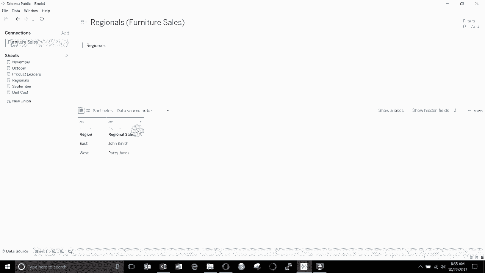
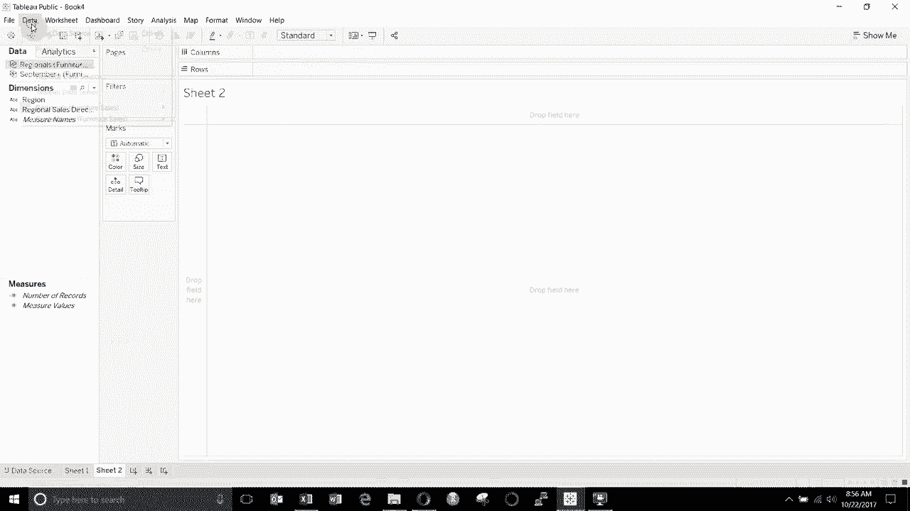
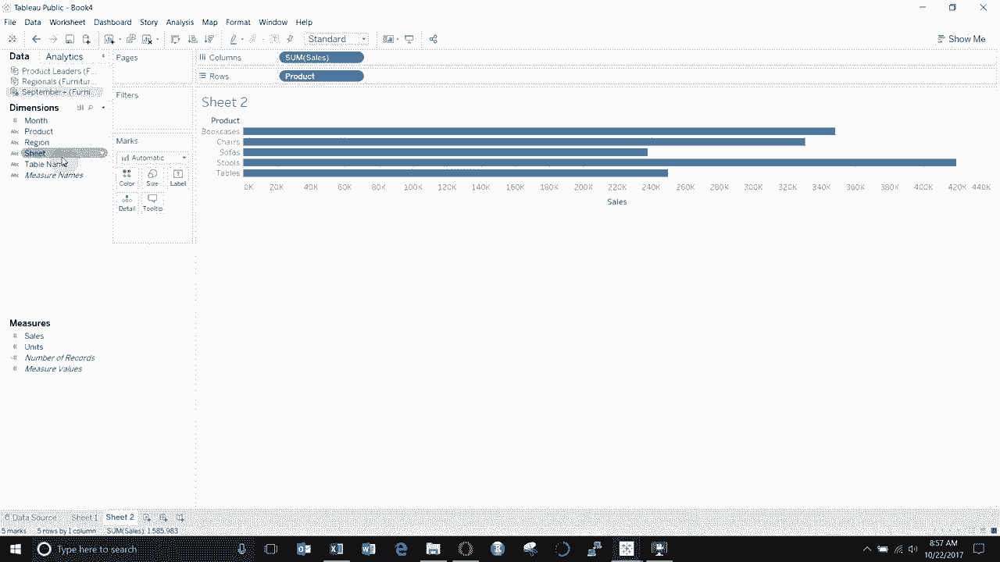

# Tebleau操作详解，照着实例学做图！数据科学家的必备可视化工具，简单快速做出精美图表！＜实战教程系列＞ - P4：4）混合数据源 

嗨，各位，欢迎来到《Tableau两分钟》新一期，今天我们将讨论如何在Tableau中混合数据。我已经连接了我为这些数据演示准备的虚构家具销售数据，并且我已经将所有销售表连接在一起，所以九月、十月、十一月、十二月，你可以看到我们在数据源中拥有的销售数据。这个数据库中的其他部分，严格来说不算是数据库，实际上是一个Excel表格，但也差不多，是一个包含区域领导者的表格。

我们的产品领导者和每个单位成本都是一个独立的表格，现在你会记得如果你看过我们在数据源视频中展示的数据连接，我们实际上将所有这些表连接在一起，在这个特定的数据源中，我们有一个类似树状结构的表格。

😊，这次我们不会那样做。我们将使用数据混合来实现类似的效果。所以我们将跳到工作表一，你可以看到在这个数据源中我们只有销售表和销售字段。我们需要做的第一件事是添加一个新数据源，我们将重新连接到这个Excel文件，它叫做家具销售，然后我们将拖出我们的区域领导者，第一个我们要连接的是区域，你可以看到我们有区域和区域销售主管，然后东部和西部是我们的两个区域，我们将跳回到我们的主工作表。

😊。

你可以看到，现在我们有两个数据源，而不是仅仅一个，所以我们为什么不把区域拖出来呢？你可以看到我们有西部区域，我们就将销售拖到这里的列上，我们想要做的是将区域领导者添加到工作表中。首先，我们想要做的是点击这里并编辑关系，现在你会看到我们的主要数据源，即销售表，自动在两个区域字段之间建立了关系。所以你会记得我们在销售表中有一个区域字段，而在区域领导者表中有一个区域字段，它们因为同名而自动建立了关系，所以当我们点击区域领导者时，你会看到这个小橙色链接被高亮显示。

😊，如果我们取消勾选，那么数据源之间将没有关系，你可以看到因为小链接变成灰色并且有一条线穿过它。如果它是橙色并且连接，那么就有链接。这意味着我们可以在可视化中使用此数据源的字段。所以让我们将区域销售总监拖到这里，靠近区域，你会看到我们在同一张表中得到了区域和区域销售总监。现在如果我们想添加一些关于我们产品的信息，让我们跳到新的表格，这里我们将添加我们的产品负责人。因此，我们将重新连接到这个Excel文件的家具销售，打开它，拖出我们的产品负责人，你可以看到我们有一个叫做产品名称的字段，这是产品，然后我们有产品负责人。

😊。

这是我们的一位明星产品负责人，我喜欢称他们为明星。让我们回到sheet2。😊。

然后我们会再上去。我们只想拖出来，所以让我们从销售表开始。我们将拖出产品。然后再次继续拖出销售，这样你就可以看到我们的产品和总销售额。如果我们想拖出产品负责人会发生什么呢？如果我们去看产品负责人，你会发现这里没有建立的关系，这是因为产品名称与这里的字段不匹配，它只是叫做产品。所以要解决这个问题，我们将去编辑关系。

😊。

在数据菜单下，除了将其保留为自动外，你会看到这里没有列出任何内容。我们将点击自定义，点击添加关系，然后选择主数据源的产品和次要数据源的产品名称，然后创建该关系，点击确定。现在当我们去点击我们的产品负责人数据时，你会看到产品名称又有了小链接，我们可以根据是否希望包括或断开链接来勾选或取消勾选，然后可以将产品名称拖到我们的旁边。

😊。

哦，产品负责人真是太有帮助了。产品负责人。好了。现在它将所有产品负责人与我们主要数据源中的产品连接起来。还有一件事需要记住。这是当你使用连续字段时。让我们继续创建，我们将创建一个新的数据源。这次。

我们要连接。😊。

单位成本表。我们将单位拖到这里，我们有一个产品名称和每单位成本。

所以我们再回到第3张表，因为我们在一个数据源中有产品名称，在另一个中有产品。我们需要提升到，我们想使用的，这是我们的销售数据源。我们想把它作为主数据源。然后我们想去单位成本。你会看到没有关系。因此你需要定义一个自定义的关系。

所以产品和产品名称。好吧，那我们来做这个。我们将从这里拖出产品。我们将拖出。单位。从这里。然后我们将拖出单位成本。从这里的每单位成本。好的，现在我们已经设置好了表格。我们有每单位成本。我们有销售的单位数量。现在，如果我们想知道总共是多少。

我们只想把这两个相乘，436乘以60。所以我们可以通过创建一个计算字段来做到这一点。现在。你会注意到我在我的单位成本数据集中创建这个计算字段。所以这意味着。😊。所以这将是总成本，这意味着当我创建这个字段时。

它会在单位成本数据下显示来自这个单位成本数据的任何单位成本的字段。我们在这里使用的任何特定于每单位成本的字段可以使用那些未聚合的字段，因此我不需要将这些作为总和、最小值、最大值等等，但是你会看到当我尝试从销售数据中添加某些内容时，在这种情况下我们将添加单位。

😊，所以当我添加这个时，你会看到它会自动为我聚合。并且我不能混合聚合和非聚合函数。😊，我也不能去掉这个总和。你看它们必须是行级计算，因为在使用表计算函数或多个数据源的字段时，所有字段必须聚合为常量。😊，这意味着因为这些在不同的细节级别。😊。

它们在数据源中没有一对一的关系，当进行混合时，我们必须总结两个数据源，并且只能在汇总级别进行计算，因此我们不能有，例如。一个单位成本，在那里我们刚刚查看了每个项目的单位数量，然后我们。

在我们的数据源中逐行减去它们。我们必须先聚合它们，然后在计算聚合级别。这样是可行的，因此我们得到了总成本。现在我们可以将其拖出。你会看到。我们有总成本。在这里，这只是单位乘以每单位计算，我们通过将它们都求和来做到这一点，你会看到这是Ag。

所以这是一个聚合计算。你会看到我们从次级数据源得到的两个计算，单位成本数据源旁边有这个小勾选标记。😊。这表明它们来自一个次级数据源。因此，这是判断你设置是否正确的一种好方法。根据你如何进行这个，你可能想要组织所有的计算在一个特定的数据源下，有时我喜欢确保所有计算都在主数据源下完成，但有时这并不总是可行，所以这是解决这个问题的一个好方法。这就是本期“在两分钟内了解Tableau”的数据混合内容的总结。如果你有任何问题，请在评论中留下。你可以从视频描述中下载数据和Tableau工作簿。如果你喜欢你所听到的并想要更多Tableau技巧和窍门，请订阅我们的频道，我们下次再见。

😊。
