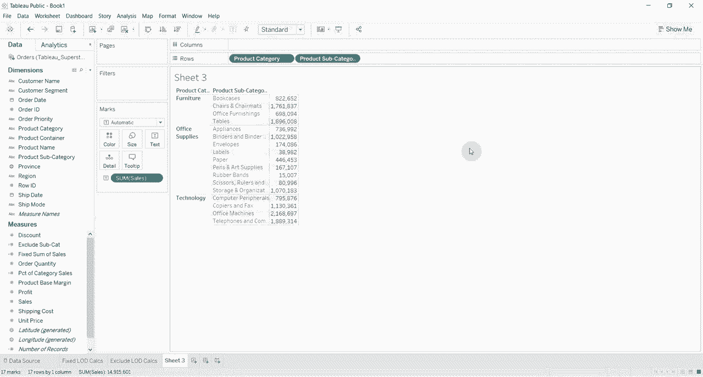

# Tebleau操作详解，照着实例学做图！数据科学家的必备可视化工具，简单快速做出精美图表！＜实战教程系列＞ - P6：6）包含详细级别计算 - ShowMeAI - BV1iq4y1P77U

嗨，大家好，欢迎来到“Tableau两分钟”系列的另一集。今天我们将讨论详细级别计算。我们在这个系列中有两个之前的视频，涵盖了固定详细级别计算和排除详细级别计算。今天我们将讨论第三个也是最后一个，即包含详细级别计算。如果你还记得，这是对前两个视频的回顾。固定详细级别计算是我们始终在同一维度上聚合一个度量，一个固定的维度。

😊，排除详细级别计算将允许你在聚合一个度量时排除一个维度。😊，而包含详细级别计算则允许你在计算一个度量时包括一个维度。当你聚合一个度量时，所以我们接下来要做的是创建与我们在其他两个仪表板中创建的相同的表格。所以我们将产品容器拖到，我很抱歉，我们将产品类别拖到行架上，产品子类别拖到行架上，然后我们将销售拖到我们的ABCs上，创建一个漂亮的小表格。现在让我们继续创建一个。

😊。

详细级别计算，因此我们将说包含子类别，这将是一个详细级别计算，我们始终包括产品子类别，然后我们将说销售总和。

然后结束这个。嗯。找一些拼写错误。

好的，我们来吧。接下来，我们将把包含子类别拖到我们的表格中。所以你会看到，目前它们是相同的，因为它们实际上是以相同的方式聚合的，而在我们的视图中有产品子类别，事情变得有趣的是当我们从视图中移除产品子类别时。

😊。

我们改变了聚合的级别。所以我们接下来要做的是将聚合级别更改为最大。

然后我们将去掉产品子类别。现在你会看到，现在我们的包含子类别与我们的销售不同，而这个包含正在计算每个子类别的销售总和。然后它会取最大值，选择其中最大的子类别，这就是它在这里显示的内容。所以如果我们把产品子类别放回去，我只需按控制Z撤销。😊

你可以看到家具产品类别中销售额的最大总和是来自桌子的，总额为1896008。因此，如果我们去掉产品子类别，单看家具，你会发现也是1896008，这显示了我们能够获得的销售额最大子类别的总和。如果我们想要将其更改为最小值或其他聚合级别，如果我们将其改为最小值，那么它将显示出最小类别的产品子类别。如果我们再将产品子类别放回去，你会看到最小的是办公家具，销售额为698094，然后我们再将其去掉。

698094，最后，如果我们愿意，我们可以选择平均值，这将给我们该产品子类别的平均销售总额。😊。

产品类别。这就是如何使用包含进行详细级别计算的方式。这是获取两个不同度量级别的好方法，因此我们可以在可视化中获取产品类别中最大子类别的销售额，以及该产品类别的总销售额。如果你有任何问题，请在评论中留言，视频描述中有我们用于此工作簿的数据链接，以及该工作簿在Tableau公共上的链接。如果你喜欢今天分享的Tableau小贴士和技巧，请订阅我们的频道“Tableau in two minutes”，我们下次再见。

😊。
