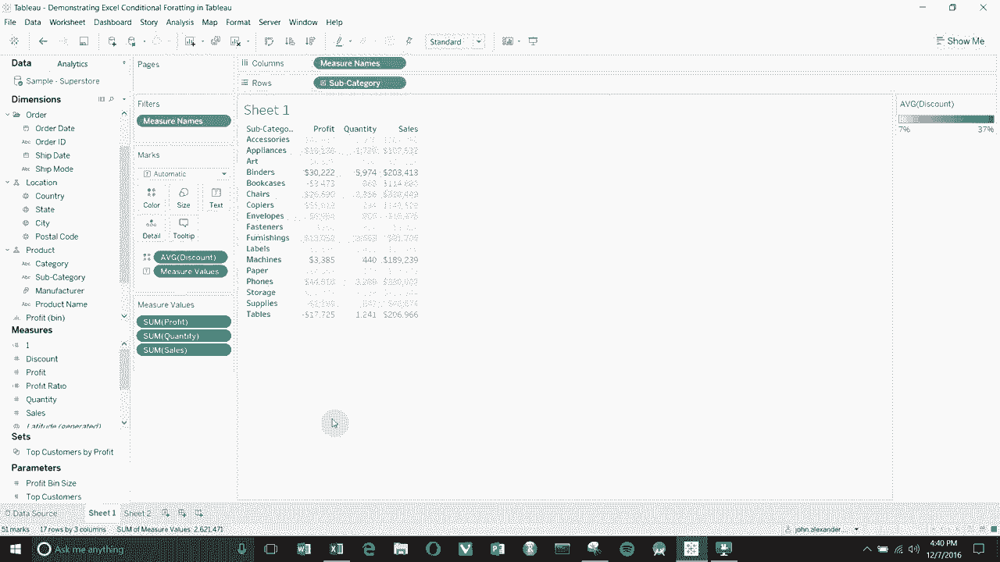
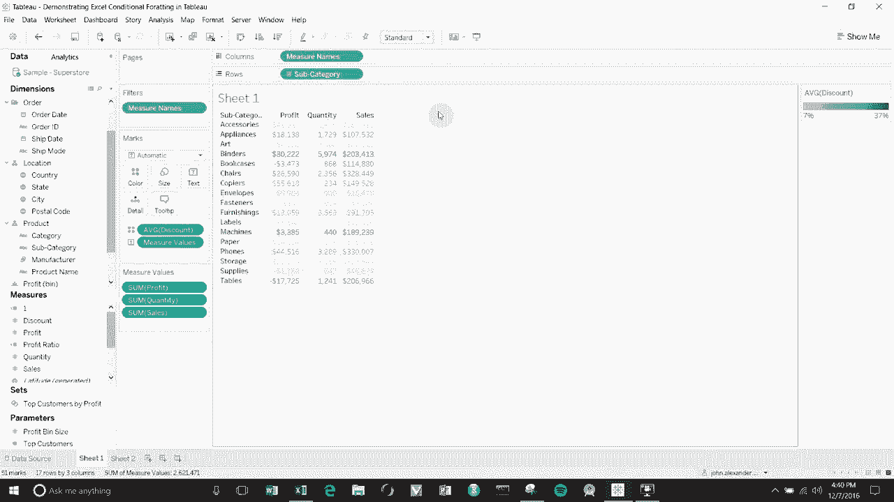
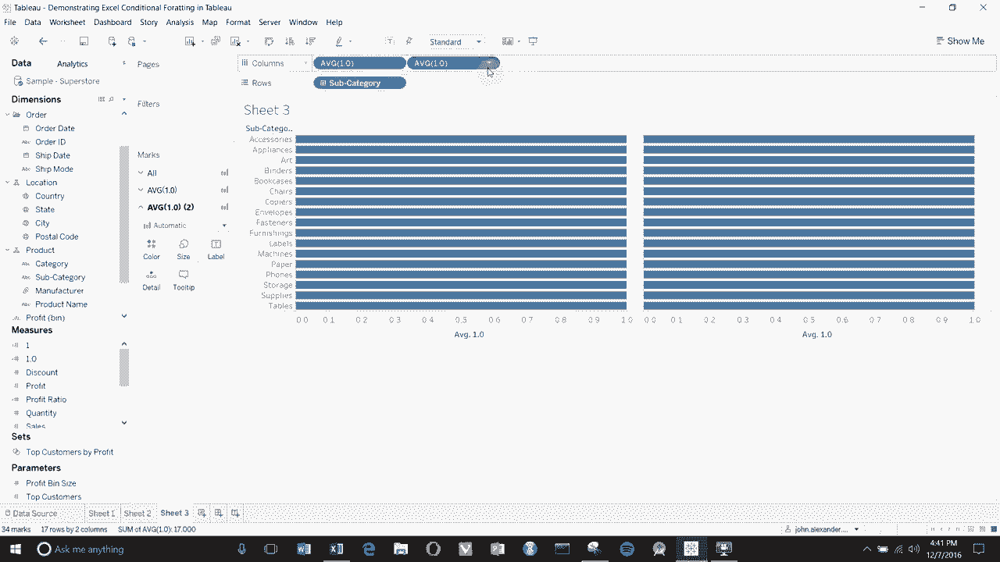
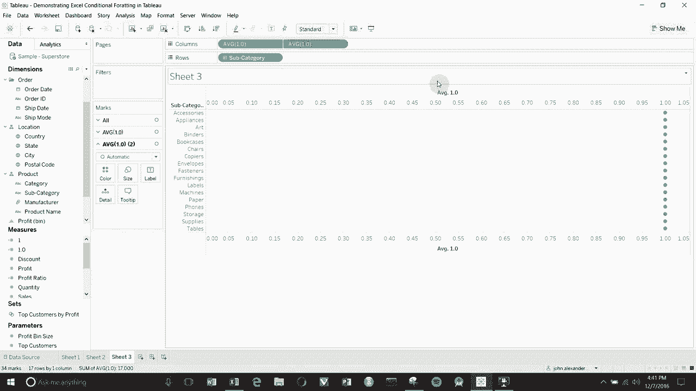

# Tebleau操作详解，照着实例学做图！数据科学家的必备可视化工具，简单快速做出精美图表！＜实战教程系列＞ - P8：8）创建 Excel 样式条件格式 

你好，欢迎收看另一期“Tableau两分钟”。今天我们将介绍如何在Tableau中创建Excel样式的条件格式化。所以Tableau的一个挑战是很难按不同项目为不同列上色。如果我们想在这个特定图表中更改颜色，单词颜色。

如果我们想按折扣来处理，就将其拖到颜色架上。但这里的每一列颜色都是一样的。如果我们想让利润按利润上色，数量按数量上色，销售按销售上色，那将会更加困难。但在Excel中，这非常简单。所以在这里你可以看到，销售额更高，利润数字以绿色显示。

较低的利润数字以红色显示，销售从0到330000时从白色变为深绿色。而数量则用这些小图标表示总共售出的产品数量。😊。

看起来很简单。确实在Excel中很简单，但在Tableau中如我所说要稍微复杂一点。所以我们要创建的是这种图表。

抱歉，这种表格使用那种条件格式化样式。首先，我们将打开一个新的工作簿。然后我们将创建一个计算字段，基本上表示什么都没有，但我们会称它为1。0，给它的值为1。0。

这是我们在构建表格时用来调整布局的东西。首先，我们想按子类别查看。所以我们将子类别拖出来，创建我们的第一列。然后我们将1。0拖到列架上。

两次。然后我们将更改聚合方式。

设为平均值。设为平均值。然后在这一项上，我们会点击右侧的向下箭头。我们将选择双轴图表。现在你可以看到这给了我们一个单一的。

轴实际上给我们提供了两个轴，一个在上面，一个在下面。仅在1。0的位置有一个单一的点。现在看起来还不太像表格。让我们让它更像表格。如果你还记得在Excel中，第一列是利润。

现在我们将继续设置，我们要编辑坐标轴。我们将点击同步双轴。将值设置为0到2。然后将标题改为利润，这就是我们在第一列时的样子。现在我们要去刻度标记。

我们将从顶部坐标轴上移除所有刻度标记。然后我们将点击O。记住，不要有刻度标记。然后在常规屏幕上，我们想同步双轴并将固定范围设置为0到2。你会很快明白我们这样做的原因。点击O，好的。

现在我们在坐标轴的顶部有利润标签。我们有一个单一的坐标轴向下，然后我们所有的点在中间成一条线。我们将在底部坐标轴做类似的事情。我们要编辑坐标轴。它已经设置为固定，因为我们同步了双轴。

我们只需删除标题，这样下面就没有标题了。然后我们将刻度标记设为无，次要刻度标记设为无。点击它。然后我们有一条简单的线条在中间。现在，显然我们还需要做更多的工作，因为图表背景上仍然有这些小线条。

所以我们将去格式。然后我们将去格式，点击线条，也就是这堆小线条。点击列。然后我们将所有这些设置为无。所以都是无，无，无，无，Nan，无。好，完美。现在我们有一个开放的背景，只有一组点在中间。

你还会注意到，当我们在标记卡上设置时，我们现在有三个不同版本的标记卡。所以我们有这两个项目在上面创建我们的双轴图表。我们还有所有平均值1.01和平均值1.02。现在，我们可以单独操作这些，试图创建与我们之前一样的效果。

Excel。

所以如果你记得我们这里的第一个列，我们只是用利润来着色。

所以我们可以将利润放在最上面的标记卡上。我们要做的是将利润拖到标签上。然后我们将利润拖到颜色上。我们将此图表类型更改为文本。然后你会看到我们创建了一个非常相似的东西。

所以一切都是由我们的利润着色。我们有利润在图中，但中间有这些大而烦人的点。为了去掉这些大而烦人的点，我们要去其他标记卡。平均值1.02。点击它。我们将改变图表类型，圆形和方形都无所谓。

然后我们要尽量将大小缩小。现在我们在中间有了微小的点，然后我们将进入颜色。我们要一直向下滚动使其不透明。这给了我们利润的列。太好了，现在，使用同样的技巧，我们可以构建其他列。

所以我们将再次使用这个字段来构建我们的第二列。即销售。在这种情况下。我们正在为背景着色。所以我们想要去。再次拖动我们的1.0。看到一些1.0，哎呀，我错过了。好的，然后我们要再次更改，将其改为平均。这个也改为平均。丹。😔，创建双轴图表。然后我们将编辑坐标轴。

如果你记得的话，这个我们叫做销售。哎呀。并且要同步x轴固定为0到2。去掉刻度线。好的，这样就创建了这个。我们要创建第二个。只需删除标题，去掉刻度线，应用无刻度。好的。现在我们状态良好。你可以看到通过创建这个其他的双轴图表。

我们现在有了第二个。😊，抱歉，第三个和第四个，标记卡，所以3号，4号。现在。在这种情况下，我们将再次将数字放在销售上。所以让我们在顶部的标记卡上这样做。我们将其转换为文本图表，就像之前一样。哎呀，我们有点乱了。所以我们将其转换为文本图表。

然后我们将销售拖到文本上。现在你可以看到我们在这列中有销售。可是我们将做一些不同的事情。对不起。我们要回去。实际上我们将保持为自动。我们将移除销售。当我们来到这里时。

我们将第四个设置为文本。然后我们将在文本上拖动销售。好的，之所以这么做。是因为这个卡片，顶部的在下面，这个。底部的在上面，我们希望销售。名称在我们的点上方。你会很快看到为什么，所以。我们要做的是拿。

这个字段和这个字段现在将创建我们的背景。如果你之前是会员。我们所做的就是将点变得非常小，然后我们把它去掉。这次我们要操控这个点。我们要拿出帆。我们将其拖到颜色上。现在你可以看到我们的点是由我们帆的总和着色的。

所以，较暗的颜色意味着更高的销售，较亮的颜色意味着较低的销售。😊。我们将图表类型更改为条形图。现在你会看到。我们有条形图大约延伸到一半。原因是如果你记得。我们将坐标轴的刻度设定为0到2。标记，测量是平均值为1。

所以我们本质上得到的是一根条形图延伸到一。我们想要做的是。拍一张浴缸的照片。在这里，我们只是要在此基础上加一。因此。我们只需双击列架上的药丸。将一加到平均值上，使其成为2，因为比例是从0到2。

所以这将覆盖整列。我们将按回车。你可以看到它延伸到了另一边。确保这匹配。我们将以稍微不同的方式使用它，创建用户公式，因为它也可以用来操控布局，当你想操控布局时。但我们还没有准备好这样做。因此，我们想要做的是只创建那根条形图，加一使其延伸到另一边，然后蓝色似乎有点傻，我们上次用了这个颜色。

那我们为什么不改变颜色呢，我们将这个改成一些漂亮的绿色。应用。好的。你可以看到这越来越接近了，但我们可能想让条形图宽一点，以便它们能够覆盖整个区域。为此，我们只需点击大小，向上拖动大小，可以一直拖到顶部，现在每个单元格的背景颜色是由该单元格内的销售总和决定的。因此，我们快到了。

离目标更近了。😊 我可能想让这个稍微透明一点，以便我们可以看到背景中的一些数字。现在我们进入第三列，第三列是我们将做一些巧妙的布局，确保我们的形状和数字不会重叠，就像在其他一些图中那样。

所以再次开始第三列，我们将取1.0，拖动两次到这里。

在这里的列架上。将聚合设置为平均值。然后我们将创建一个双轴图。像这样。对我们的轴做所有相同的事情，所以设置为同步，从零到二。这是我们在图上创建的数量。然后我们将再次关闭刻度线。

我们在另一个轴上做的所有相同的事情，然后我们将在底部轴上做同样的事情，所以我们将去掉标题。去掉这里的刻度线。关闭刻度线。好的。现在你记得当我们在销售列中创建利润列时。

我们做的第一件事是将文本拖到单元格中。那正是我们将要再次做的事情。所以你可以再次看到，通过添加一列。我们在这里的顶部有两个平均值，并且在这里的标记卡底部创建了两个平均值。😊 所以再次，第二个始终在顶部。这最后两个是我们这里的最后两个。

所以我们要去第二个。我们将图表类型更改为文本。我们将在这里获取数量。我们将在这里获取数量并将其拖到文本中。有时 Tableau 会在标记卡之间上下弹跳。所以在操作时确保你在正确的卡片上。

现在你可以看到在我们的数量字段中，我们有每个数量的数字。这是一个好的开始。现在我们想要创建形状。所以我们要去我们的另一张卡片。我们刚刚上升了一层。我们将更改图表类型。改为形状。然后我们将再次更改形状，第二个往上。

我们将形状更改为实心圆。记住，第二个往上。有时它会跳来跳去，然后我们将数量拖到颜色架上。它将根据这里的数量进行着色。现在。我们在 Excel 中有一个稍微不同的配色方案。你也可以在这里编辑颜色。

也许对于这个，我们想使用一些紫色。为什么不呢。你可以看到，但现在图形中的形状和标签重叠在一起了。所以我们需要以某种方式移动它们。现在，如果你还记得我们如何处理销售以创建这个条形图并让它延伸到顶部，我们编辑了上面的药丸以添加一个，使其能够延伸到整个宽度。我们可以做同样的事情。在这两个药丸上各添加一个意味着它们将在列中居中。

但假设我们想将它们移动，向左移动一、两次，向右移动一、两次。就像我们在这里的 Excel 一样。😊。

我们要做的是编辑这个。这将是我们的第一列。记住，我们的第一列是数量形状和颜色。我们将向左减去，大约是t3，3，3，3，3。好了。这将其向左移动约三分之一。然后我们要过去这里。

双击这个，然后我们将添加点3，3，3，3，3。这将使其向右移动约三分之一的距离。现在你可以看到我们的形状和我们的列彼此并排。我们似乎忘记了上面的标题。她现在会处理这个，好了。

现在我们有利润、销售和数量。😊，你可以以与其他图表相同的方式调整这些列的大小，所以我们可以抓住边缘。将其拖动直到获得一些更合理大小的列，一些更接近 Excel 大小的列。

再次，你可以操作形状。你可以在这里设置自定义形状。
