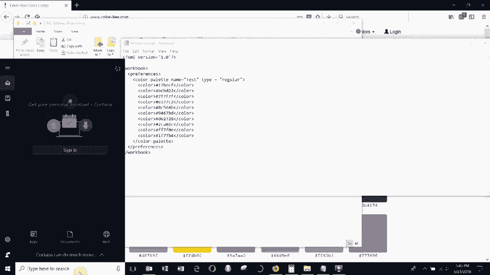
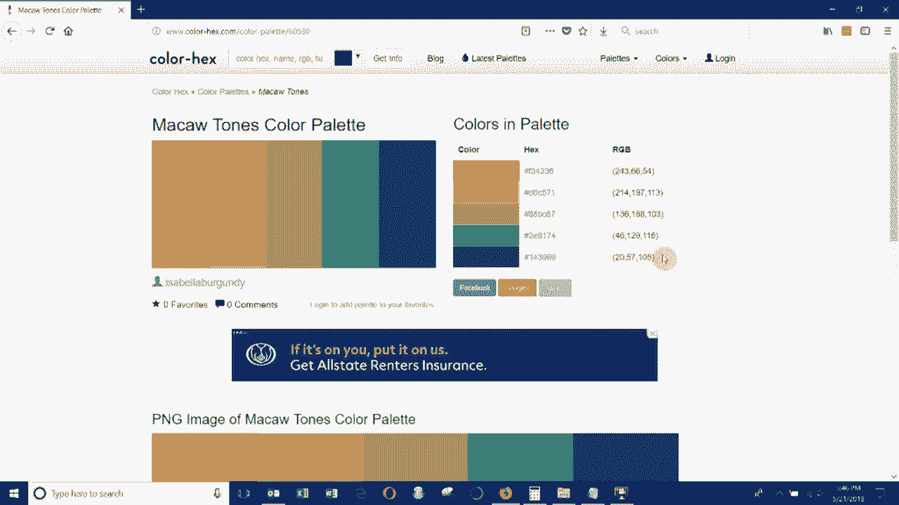
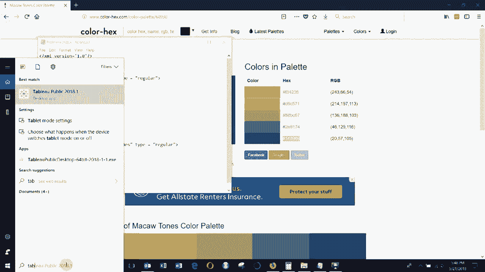

# Tebleau操作详解P12：12）添加自定义颜色 

嗨，大家好，欢迎来到另一集“Tableau两分钟”。今天，我们将展示如何将自定义颜色调色板添加到Tableau中。可能你有一些公司颜色或者其他东西想添加，你可以做到这一点，但实际上它主要是在tableableau外部工作。所以你需要做的是编辑一个叫做Pres do Tps的文件。

这个文件在你的My tableableau存储库中。你可以看到它。就在这里。😊。你可以在Notepad中打开它。一旦你进入Notepad，你可能会看到一个看起来像这样的文件，因为没有添加任何内容。所以你需要做的，只是一个简单的XML文件，如果你以前处理过XML，如果没有，使用起来非常简单，所有内容都包含在这样的标签内，所以我们有工作簿的开始到工作簿的结束，我们要做的第一件事是添加这个preferences行。

😊，这个preferences行就在这里。然后你可以看到我们有一个叫做test的自定义颜色调色板，这是一个常规的颜色调色板，意味着它将是独立的颜色块，而不是连续的。在这里，我们有每种颜色的十六进制值，你可能还记得以前玩绘画时会用到红色。

绿色和蓝色的值与这些非常相似，它们只是同样内容的互联网语言版本。😊。

一旦你有了这个，你就可以打开Tableau。😊。

当你这样做时，让我们连接一些数据，没错。在这个特定情况下，连接什么并不重要。所以假设我们拿国家，将其拖到Mark卡上，然后在这里编辑颜色。你可以看到我们的颜色调色板。😊。

Colt就在底部。这是我们在preferences表中添加的那个。所以让我们从头到尾展示整个过程。你需要做的是去一个互联网浏览器获取一些颜色的十六进制值。color hex.com是一个不错的网站。如果你点击最新调色板。

他们这里有一套调色板。我对这个McCo色调调色板相当喜欢。所以你可以看到我们有五种不同的颜色。对我来说，它们似乎是互补的。然后你有每种颜色的十六进制值。这些就是我们想要放入我们的tableau文件中的内容。

所以我们将打开preferences Tps。😊。

将它拖到这里，这样你就可以看到所有内容在一起。然后我们将添加一个新的颜色调色板。你会看到所有内容都在这两个调色板之间。只需在开始和结束时添加即可。然后你可以看到我们为另一个调色板命名为测试。

既然这个有名字，我们就叫它 Mac 色调。这是一个常规的，针对每个项目将会有独特的颜色，所以我们将与维度一起使用。然后我们有五种不同的颜色，所以我们来复制五个。😊 就这样，首先我要做的就是删除所有颜色，抱歉。

删除我们现在所有的值。😊 删除后，我将把这些十六进制值复制并粘贴到记事本中。好了，完成后我们将保存它。然后我们需要再次打开 Tableau。😊

将重新连接到数据，确保每次更改调色板中的颜色时都关闭并重新打开 Tableau。否则它将不会出现在列表中。我们只需将国家拖到我们的图表卡中，然后我们可以编辑颜色，下面你会看到我们的新调色板。

😊 

然后我们可以将其分配给我们的国家。这就是如何在 Tableau 中使用自定义颜色。如果你有任何问题，请在评论中留言。如果你喜欢我们的内容，请订阅我们的频道。视频描述中有数据链接，这次我们还包含了一个快速链接，以便你添加颜色调色板所需的 XML。

如果你有任何问题，请告诉我。下次再见。😊 
