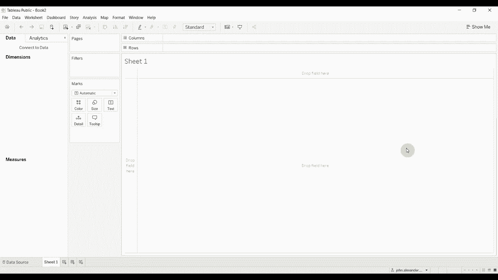
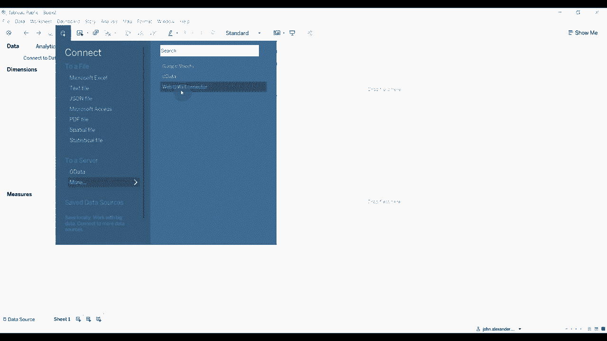
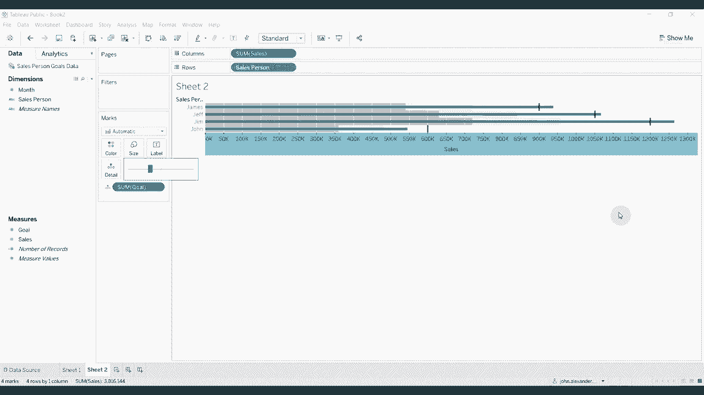

# Tebleau操作详解P15：15）创建子弹图 

大家好，欢迎收看《两分钟学会Tableau》的又一期节目。今天，我们将向您展示如何创建子弹图。子弹图是一种很好的数据展示方式，可以显示目标以及朝着该目标的某种成就。因此，我们将连接一些包含虚构销售人员销售目标的数据。

因此，你可以看到我们的销售人员目标数据中，有约翰、吉姆、詹姆斯和杰夫这四位销售人员按月份的数据，以及他们当月的销售和目标😊。

现在，创建这些图表最简单的方法就是将销售人员拖到行架上，将目标和销售拖到列架上，然后使用显示功能来创建一个子弹图。这样你就可以看到，条形图代表目标，而黑线代表销售。这并不是一个合理的顺序。

所以我们实际上可以通过单击交换参考线字段来轻松交换这些图表。现在我们有目标😊，这些是由这些线表示的。然后我们有销售的蓝条，表示他们实际售出的数量。显然，当这条线高于黑线时，他们就超过了目标。现在。

使用“显示我”功能来创建这个图表很好，但我认为如果你能够自己创建，就可以获得更多的自定义选项。所以我们将把销售人员拖到行架上。我们将把销售拖到列架上。这样就创建了我们的条形图。

接下来，我们将把目标拖到详细信息架上😊，然后添加一条参考线。这条参考线我们将按单元格来设置。每个条形图对应一条。我们将其设置为总和。我们将其设置为目标的总和，并使我们的线稍微厚一些，颜色深一些。

接下来，我们将删除标签，这样我们就只有这个条形图，显示每个销售人员的目标。现在，如果我们回过头来看看这个图，还有一些阴影部分。这是很容易做到的。所以我们将添加第二条参考线。

不过这次，我们将添加一个分布。再次，我们将按单元格来做。平均值的60%到80%是可以的，但我们要确保这是目标的总和，而不是销售的总和。再次点击以退出，删除标签，然后使用填充下方选项。

这将填充到60%，使用这种深灰色，然后到80%用稍微浅一些的灰色。点击，哦，再次现在。我们在这里有了阴影，但你会注意到条形图稍微细了一些。所以我们可以去掉这个大小。稍微调小一点。你会看到每位销售人员现在都有一个到60%目标的深色阴影。

然后这个较浅的阴影填充到他们目标的80%。显然，100%目标的条形图，以及这条代表他们实际达到的蓝线。因此，在一个非常小的空间内压缩了关于人们相对于特定目标表现的大量信息。这就是本期《Tableau 两分钟》的全部内容。如果你有任何问题。

如果你有问题，请在评论中留言。如果你喜欢我们说的内容，请订阅我们的频道。像往常一样，视频描述中有工作簿和数据集的链接。下次再见！😊 
