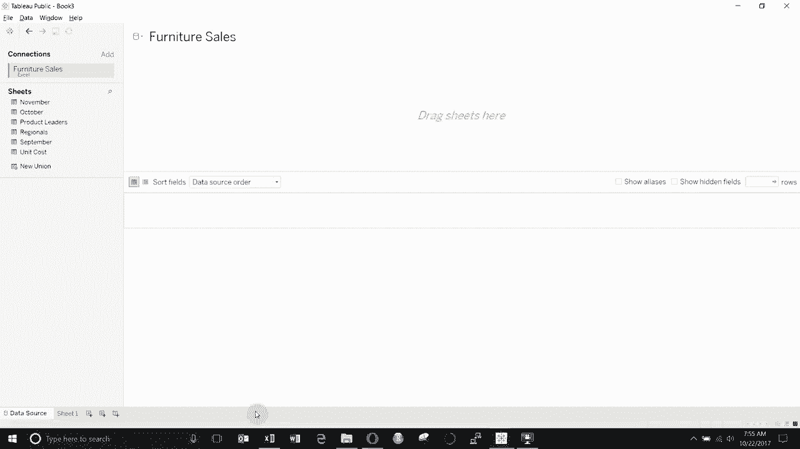
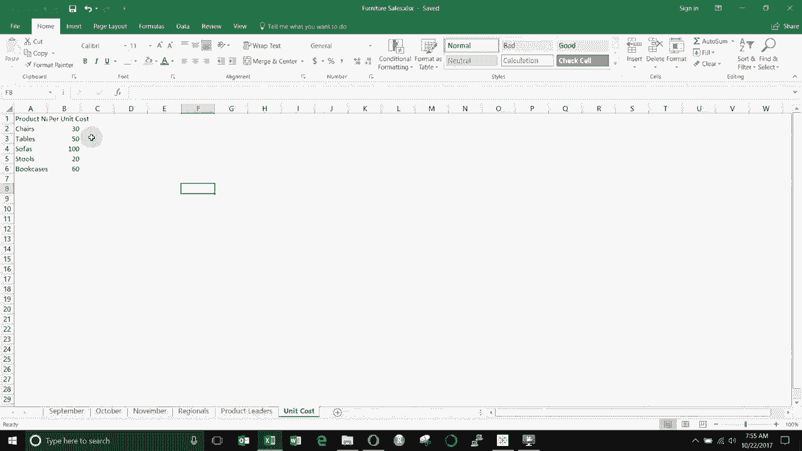
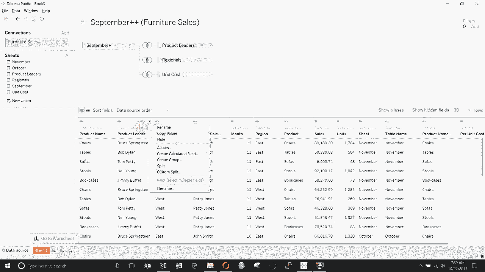
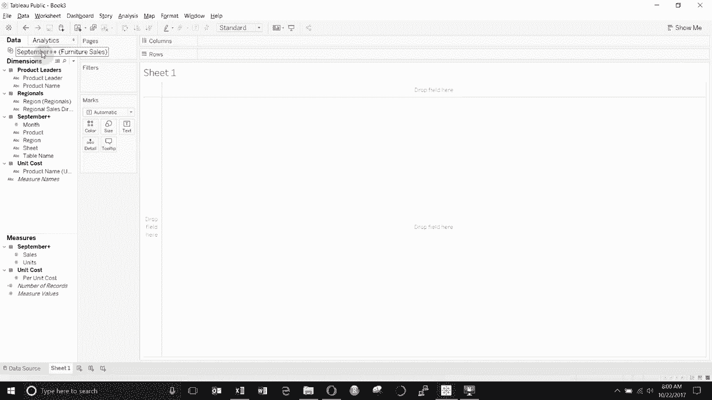

# Tebleau操作详解P3：3）连接与合并数据源 

大家好，欢迎来到《两分钟学 Tableau》的另一期，今天我们将演示如何在数据源窗口中合并和连接数据源，因此我们将从多个表中创建一个数据源。为此，我创建了一个家具数据集，假装是家具销售，你可以看到我们有三个月的销售数据，九月、十月和十一月，我们有区域领导的列表，我们有产品领导的列表，还有每单位的成本。

😊。

创建这些将它们合并为一个大的数据源。我们将直接进入Tau。你可以看到我已经创建了与家具销售Excel表的连接。所以我们要做的第一件事是把九月份的销售数据拖到我们的销售表，或者说拖到我们的家具销售大表中。😊。

你可以看到，这给我们带来了九月份的销售数据。现在我们还想把十月份和十一月份的销售数据合并在一起，如果将它们作为不同的数据源会很麻烦，因此我们将继续拖动它们，你可以看到如果你将它们拖到彼此正下方，然后可以拖动并放置在“拖动到合并”的地方，这样做的结果是将两个表堆叠在一起，所以你可以看到现在我们在这里有九月份的销售数据，而十月份的销售数据在上面，我们对十一月份也做同样的操作，直接拖到底部，再次你可以看到我们现在的数据源中有九月份、十月份和十一月份，第一张大表你会注意到它完成了两个任务，并且在我们的列中添加了两个字段，第一个是表名。

😊，第二个是表名，这两个恰好都是它们的月份。😊。所以如果我们在数据源中没有这个月份标签，我们实际上会为每个表创建另一个标签，以便识别哪个是哪个。😊，接下来我们要做的事情是将我们的区域领导连接到我们的销售表，因此我们要把区域领导拖出来。

拖到左侧，你会看到这里有一个小的维恩图，这给我们提供了一些联接选项，你可以看到当维恩图的中心被上色时，我们就有了内连接，当左侧圆圈被覆盖时，我们有左连接，当右侧圆圈被上色时，我们有右连接，而当两个圆圈都被上色时，我们有完全连接，这自动选择了我们的连接标准，因此我们在两者中都有区域领导。

😊，列，因为区域字段在两个数据源中都存在。我们也将其设置为内连接。如果你用SQL来写这个，你会写两个表的内连接，区域等于区域。现在，如果我们想连接第二个表，我们可以在这里连接我们的产品领导者。

我们将其拖放，但你会看到有一个红色的感叹号，因为这两个字段名不匹配，所以我们需要从这个小列表中选择字段名。我们将从左侧数据源中选择产品，然后如果我们查看这个，你会看到我们有产品名称。由于该字段略有不同，我们必须指定连接标准，一旦我们这样做，就会在这里显示小的内连接符号。

所以这将是SQL中内连接的等价物，产品连接在。😊。点乘等于B点乘名称或类似的东西。因此，这两张表连接后，我们现在有了一个相当全面的数据源率，我们拥有所有的销售数据，我们的区域领导者已经连接，我们的产品领导者也已连接，所以我们可以按不同的人汇总这些数据。

无论区域是什么等等。😊，如果我们想添加成本，我们也可以将单位成本拖到这里。这样会根据产品名称进行连接，这正是我们想要的，我们也可以设置为仅从主要销售表连接，我们可以按产品设置，然后它会根据产品名称连接。我喜欢将我的连接设置成这样，当你进行这些连接时，你必须记住的是，这两个字段必须是相同类型的，因此你不能连接数字。

😊，数字列到字符串列，即使它们包含相同的信息。你必须确保实际进行转换。你可以在这里更改每列的类型，还有很多信息可以使用。你也可以将其设置为列表。有时我不想看到数据，有时你想看到一个列表，这样更容易去更改这个图标，因此我们可以将其从字符串更改为数字，变为真或假。

有时这是一种很好的连接方式，有时你需要对其进行操作以确保连接正确。因此，一旦我们进入工作表，你会看到Tableau很好地组织了我们的字段，所有维度都在这里。

我们按数据表组织这些内容，因此我们有产品领导的区域。九月加上我们的销售表，以及来自单位成本表的项目。😊。或者合并为一个数据源，当你查看我们的视频时，你会看到类似的设置。但我们在顶部的不同表下有所有的数据源，这就差不多是本期《两分钟内了解 Tableau》的总结。如果你有任何问题，请在评论中留言，视频描述中有工作簿和数据源的链接。如果你喜欢我们所说的内容，并希望获得更多 Tableau 的技巧和窍门，请订阅我们的频道，获取新视频，我们下次再见。

😊。
