# Tebleau操作详解P5：5）固定详细级别计算 

大家好，欢迎来到《两分钟学 Tableau》的另一期，今天我们将走过详细级别计算。详细级别计算有三种类型，今天我们将讨论一种叫做固定详细级别计算，这也是最简单的。所以我已经连接到我的超级商店销售数据集，如果你想跟着做，视频描述中有链接。

😊，我们要做的是拖出一 handful 的产品项。并将它们拖到行货架上，创建一个小表格。所以。我们不想要产品容器或产品类别。然后我们要产品子类别。😊。

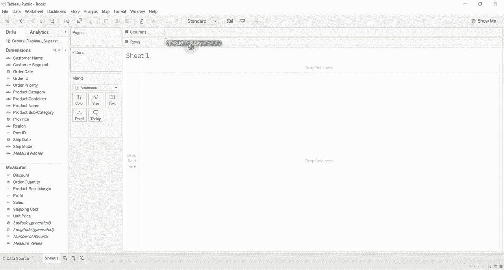

然后我们要拖出来的是销售到我们的 ABCs 这里，这将给我们每个产品子类别和每个产品类别的销售总和。现在固定详细级别计算将进行销售总和，就像我们这里一样，但它会在我们告诉它的详细级别进行销售总和，所以我们会说这是固定的。

😊。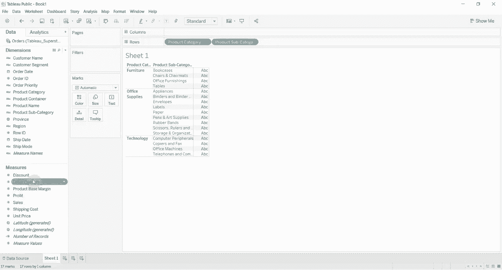

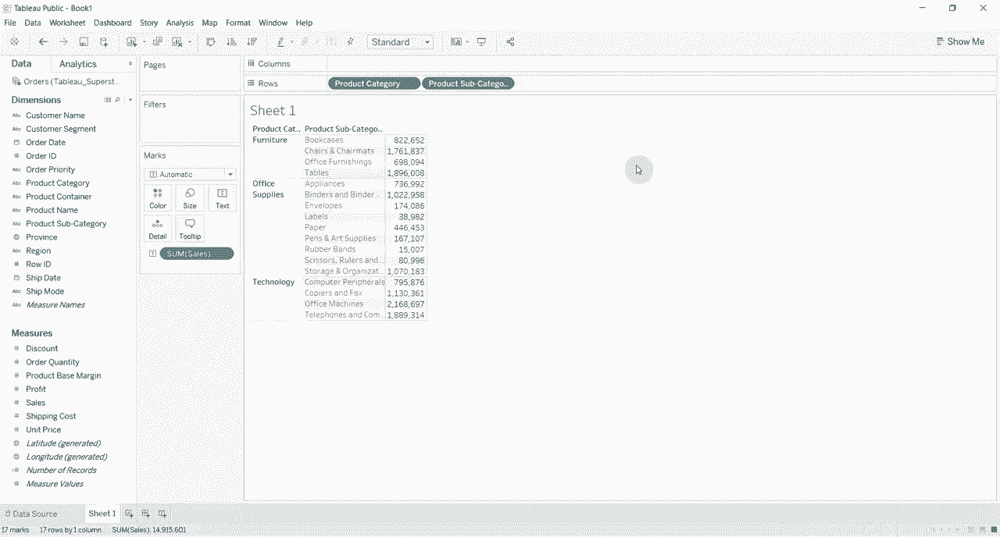

一些。销售的总和。我们将放入一些花括号。我们会说固定。然后我们将告诉它我们想要放在什么样的详细级别。在这种情况下，我们将放在产品类别层级。所以产品类别。然后放一个冒号，接着给出我们想要的表达式。

在这种情况下，销售的总和。然后我们将关闭那个括号。好了。😊。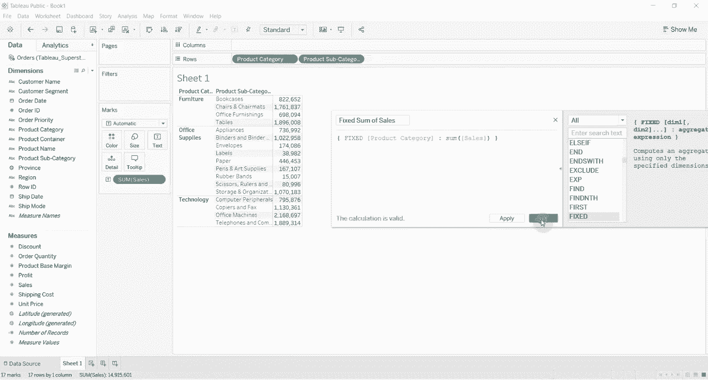

好的，然后我们还要将固定销售总和拖到我们的表格上。现在你可以看到我们所做的事情是计算了家具的销售总和。家具中的每个数字都是相同的。办公用品中的每个数字也是相同的。科技中的每个数字也是相同的。并且它总是会在那个产品类别层级进行计算。

所以如果我们把省份拖出来，就让我们把它拖出来。😊。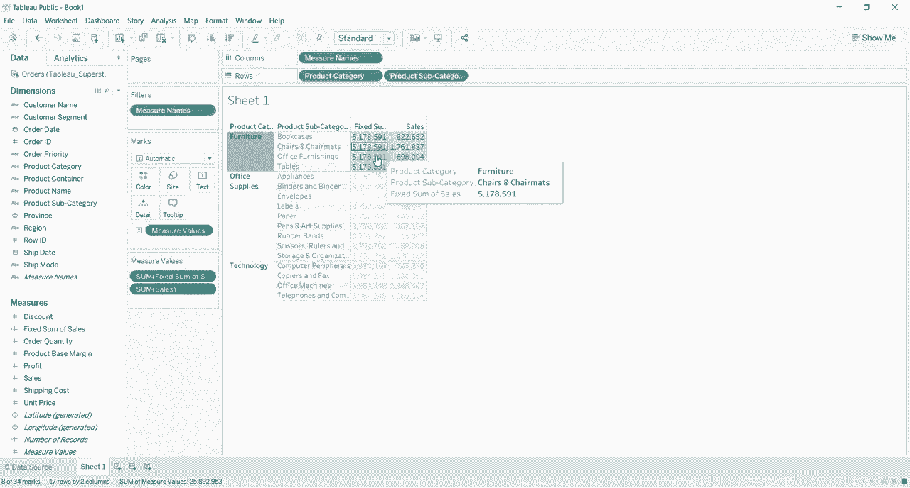

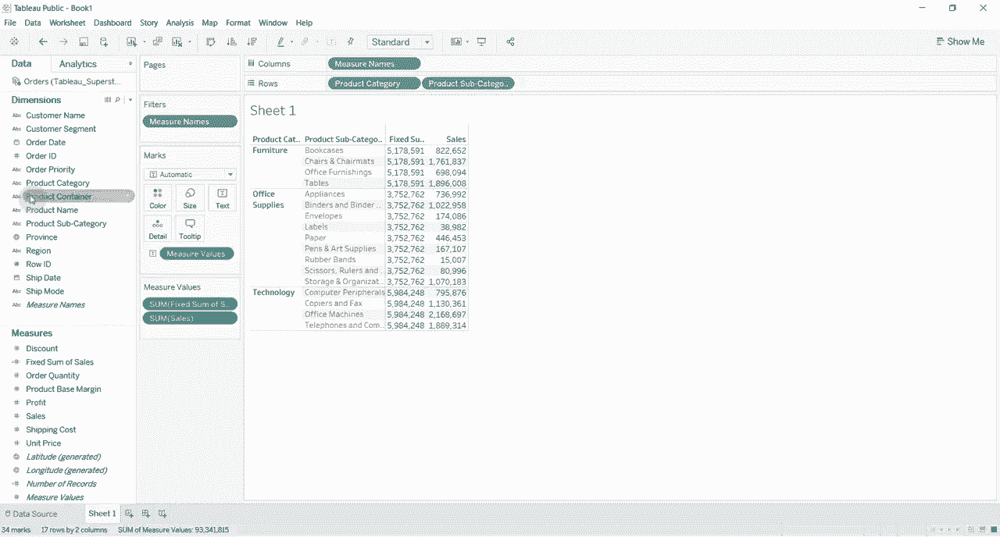

你可以看到我们仍然在按产品类别层级进行计算。所以我们仍然有这个。你知道的。所有家具的50178，591。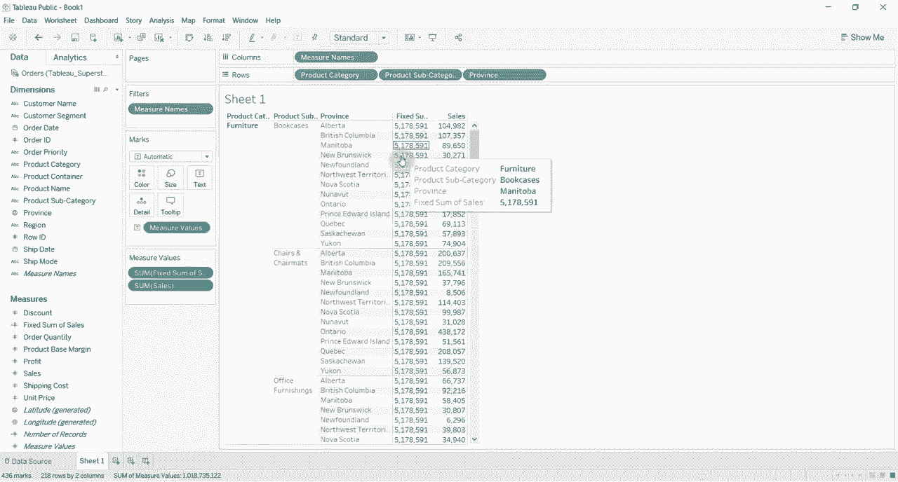

无论省份是什么，无论现在是什么产品子类别。让我们先拖回Pro，为什么这有帮助呢？假设我们想要了解书柜在家具销售中占多少百分比，那么我们可以取我们的销售数字，创建一个计算字段，计算类别销售的百分比，所以我们将取销售总和。

😊。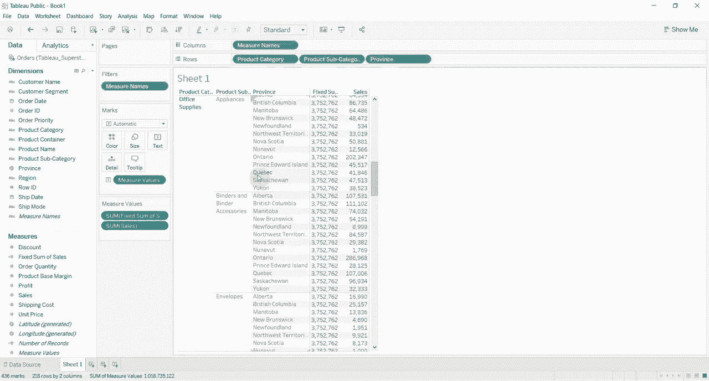

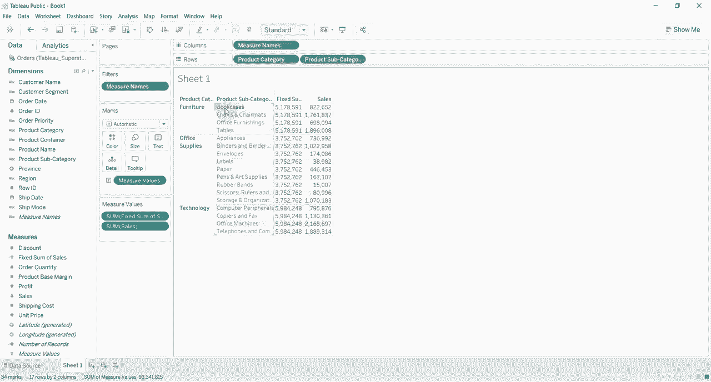

然后我们要将其除以销售总额，即固定销售总额。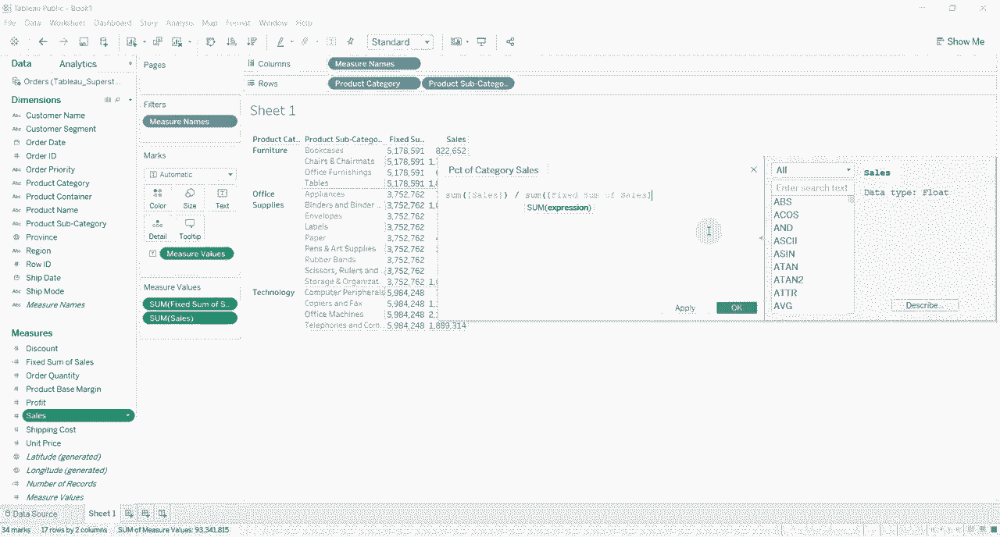

好的，按产品类别来分。😊，百分比类别销售。将其拖到度量值架上，显然它将变为零，因为它四舍五入到零。所以我们将格式化为百分比。😊。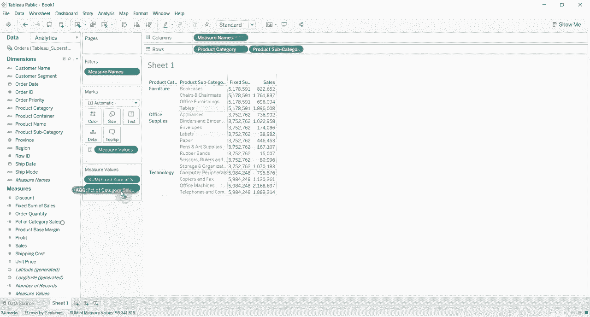

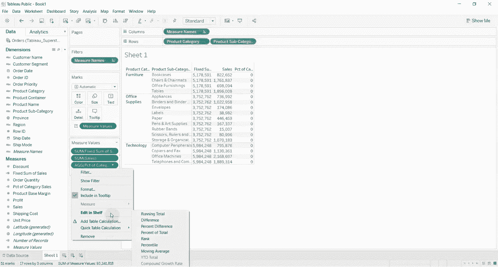

看，这样你就可以看到。😊，家具书柜占总家具销售的15.9%。所以这就是你如何再次使用固定细节级别计算的方法，固定细节级别计算是指无论在视图中有其他项目，它总是以产品类别级别进行计算。请继续留在这里，我们将继续使用这个工作簿来展示包含和排除细节级别计算，仅需几分钟。

😊。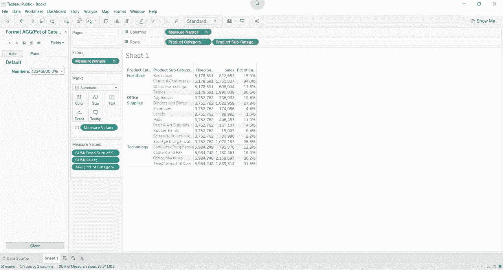
