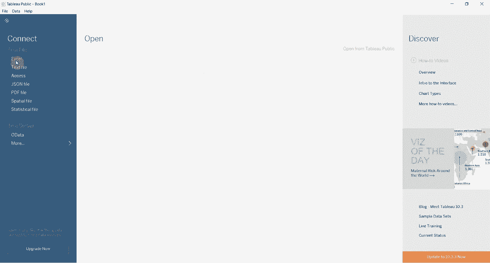
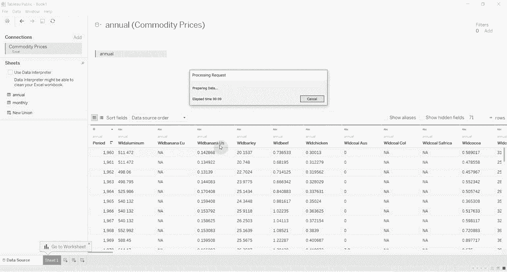
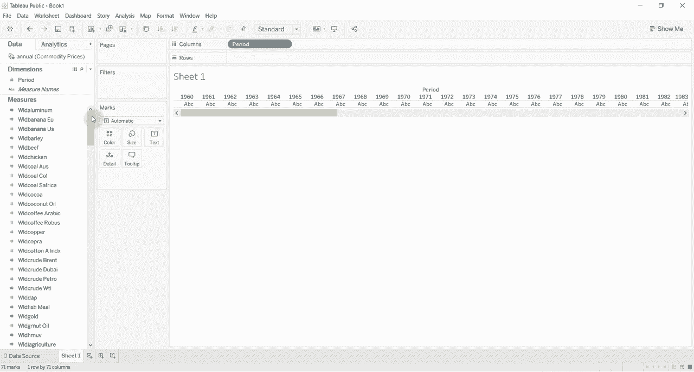
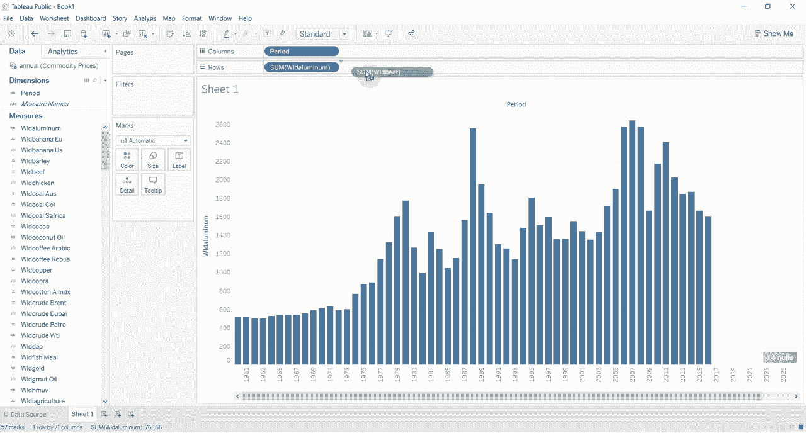
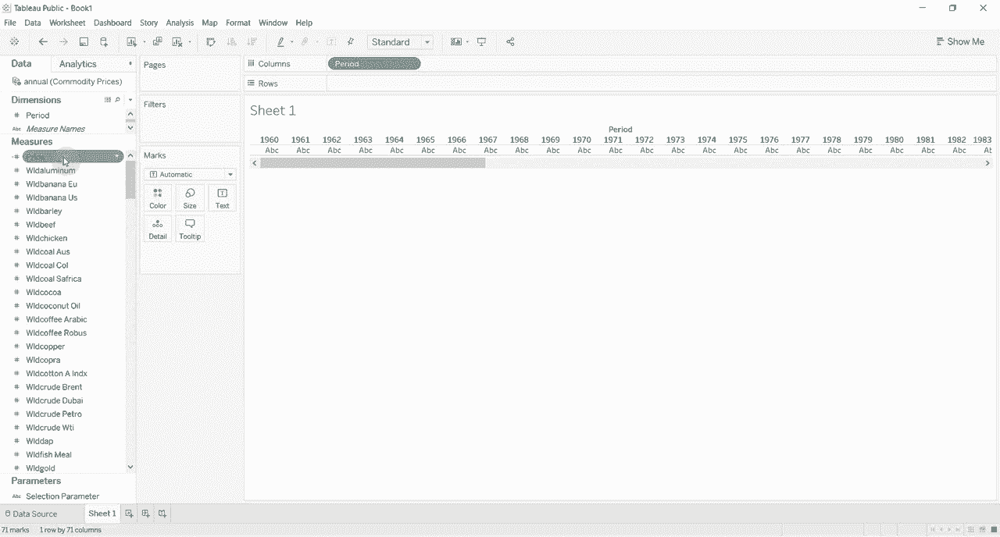
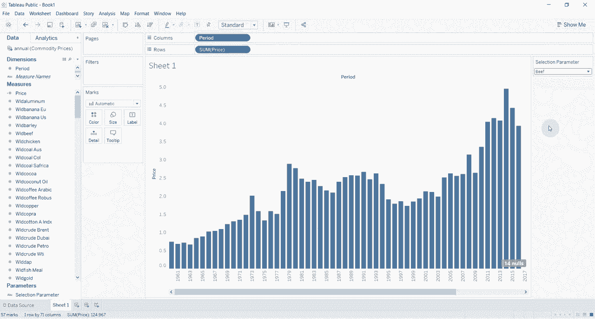
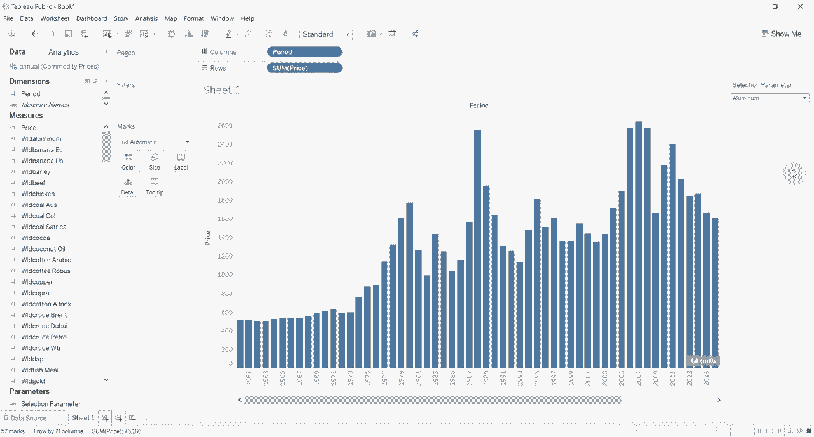

# Tebleau操作详解P7：7）参数和下拉菜单切换度量 

嗨，大家好，欢迎来到另一集《两分钟学Tableau》。今天，我们要演示如何使用参数来更改图表上的度量。也许你有两个不同的度量想要查看，比如说平均价格、总收入之类的。你可以使用参数在这些之间切换。

我们将演示如何做到这一点。首先，我们需要连接一些数据。我将使用一个商品价格数据集，这是我在之前的视频中用过的。你可以下载这个数据集，链接在评论区。这是全球经济指标数据集之一。我们将使用年度数据。

我们使用的内容真的重要吗？我们将在这里进行大量清理。所以我们要改变这个期间。然后我们将进入我们的工作表。😊。

你可以看到，我们在顶部有多个不同的定价选项。各种各样的商品，包括铝、香蕉、大麦、牛肉、鸡肉、煤等。我们将使用一个参数，允许我们在这些选项之间进行选择。所以我们需要做的第一件事就是进行一些数据清理。

我们必须快速将这些转换为其他的。

我不小心创建了一个副本，我并不想那样。我们将快速将这些转换为变量的数字，然后将它们拖到度量栏上。所以我们首先需要将数据类型更改为小数。

你会看到这将所有内容更改为数字，然后我们将这些拖到这里的货架上。接着我们要获取“期间”，也就是我们在顶部创建的年份。我们将其转换为度量，然后拖到列货架上。现在你会看到我们的小可视化图表，展示了所有的年份。假设我们想查看铝的价格。

通常情况下，你将其拖到图表上，我们会得到一个非常漂亮的柱状图，显示铝的价格。但是如果你想查看牛肉的价格，唯一的方法就是把它添加到旁边，或者拖动并放在上面，这样就会替换掉之前的内容，现在我们在查看牛肉的价格。

但是我们可以通过一个参数来改变这一点。所以我们要做的是，首先创建一个参数。😊，这个参数让我们可以选择几个不同的选项。所以我们要说这是我们的选择参数。我们将把数据类型更改为字符串。

然后我们将给它一个允许值的列表。我们将有的第一个值是牛肉。第二个值是铝，或铝，取决于你来自哪里。我们只需点击。好的，我们暂时只保留这两个值。然后我们将创建一个计算字段，即价格。

我们暂时就叫它价格。然后我们将说如果我们的参数，我们称之为选择参数，正好等于wo。牛肉。那么，这个价格将等于牛肉的价格。我们会在那里跟踪它，El。选择参数正好等于alllu。W，这不是我们想要的E。铝。

好的。我们将忘记想要给这两个加上引号。它完全等于铝。然后，我们将显示价格。有铝吗？elselse？

如果有箭头，我们将返回0，然后结束它。记住，您总是需要在if计算后放置end并点击O。然后我们将取价格。

它在这里的顶部。我们要把它拖到周期上。好的，所以不太确定这是什么。我想是牛肉。如果我们点击下面的参数并点击显示参数控制，你会看到目前选定的是牛肉。但如果我们把它改成铝。

我们的图表发生变化，现在我们有铝的价格。

就这么简单。显然，你可以有多个选项。如果你在里面有多个选项，我们可以为这个列表上的所有内容设定一个选项。这样我们就不需要在行架上更改度量。这意味着当你构建仪表板时，你可以给用户选择改变他们在可视化中查看内容的选项，而不必经历更改字段或在屏幕上同时有一堆不同可视化的麻烦，你只需给他们在特定可视化中改变所查看内容的选项。

非常感谢您参加本期“Tableau两分钟”的节目。如果您有任何问题，请在评论中留言。视频描述中有数据的链接，如果你喜欢你所看到的。如果你喜欢学习Tableau，那么请订阅以获取更多Tableau提示和技巧，我们下次再见。😊

