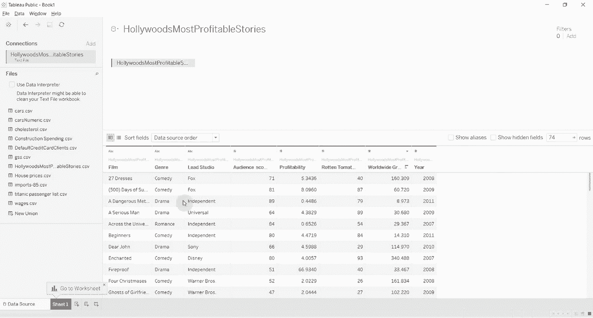

# Tebleau操作详解P9：9）表计算创建总计的百分比 

大家好，欢迎来到又一集《两分钟了解Tableau》，今天我们将初步探索表计算的世界，我们将使用表计算来确定某个总数的百分比，我们将使用有关好莱坞电影的数据，所以我们将打开文本文件，查看好莱坞最盈利的故事，评论中会有数据集的链接，这是一种tableableau。

😊。

标准类型。你可以看到我们有一些电影，显示了精英工作室和电影制作年份，以及这部电影在全球的收入。我们要做的是看看哪些类型对哪些工作室最有利可图。

那么哪个工作室从每个类型中获得的利润比例最大呢？为此。😊。

我们将把主工作室拖到行架上，然后将类型拖到行架上，这样你就可以看到每个工作室的类型。然后我们将拖动全球总票房，并将其放在这些ABcs上。我们要做的另一件事是打开小计。

这样做是有很好的理由的，稍后你会明白。所以我们要去分析，然后总计，添加所有小计。然后我们会回到分析，再到总计，显示列的总计。😊。现在你看到每个工作室都有一个总计，底部还有一个总总计。😊。

所以现在我们要查看每个工作室从每个类型中获得的收入百分比，为此我们将使用表计算。这是一个快速的表计算，所以我们只需点击全球总票房上方的下拉箭头，选择快速表计算，然后选择总数的百分比。

😊，现在你可以看到这一列的所有内容都转换成了百分比。但是很有趣，我们的总数不再是100%，因为我们的总总计是100%。这实际上意味着狮门影业的动作电影并不是总总计的93%。我们不想按照总总计来计算，我们想在工作室之间进行比较。为此。

我们将更改用于计算此表计算的细节级别。所以我们将再次点击下面的全球总票房，选择使用。😊，主工作室。哦，抱歉。我们将选择类型。然后你会看到，对于每个类型，我们现在在每个工作室内计算总数。

所以每个工作室的总计为100%。我喜欢在那儿有总计的原因是因为这使得查看你计算所有这些表计算的水平更容易。如果我们想看看哪个工作室占据了更大的比例。

😊，总收入。从特定类型来看，最简单的方法是实际上将这两个药丸翻转过来，现在你可以看到我们在喜剧方面的情况。我们有null，这是一个有用的工作室，不是吗，所以null 100% CBS的总收入都是来自喜剧，Fox的总收入也是100%来自喜剧。

20世纪福克斯的收入中74.7%来自戏剧。所以这不是一个特别干净的数据集，但你可以看到，通过使用表计算来计算总百分比，我们能够做出一些使这些数字在不同工作室之间可比较的事情。

😊，如果我们想要知道每个工作室产生的喜剧收入百分比。我们可以这样做，我们通过再次点击计算使用，然后点击Le Studio。你现在会看到喜剧数字。现在稍微小一些，因为我们有很多工作室在制作喜剧，我们可以回到分析中，重新加入我们的小计，因为显然它们被去掉了。

当我们进行更改时，你可以看到现在每个类型的总和加起来为100%。所以本质上通过玩弄这一细节。😊。并询问我们是按类型还是按主工作室水平计算。我们要么计算每个工作室在每个类型中所占的收入百分比，要么计算每个工作室为每个类型所产生的收入百分比。

所以这是同一枚硬币的两面，非常感谢你加入我们的这期《Tableau in two minutes》，如果你有任何问题，请在评论中留言，显然这会在网站上，你可以从我们的网站下载数据，只需在评论中寻找链接，非常感谢，我们下次再见。

😊。
