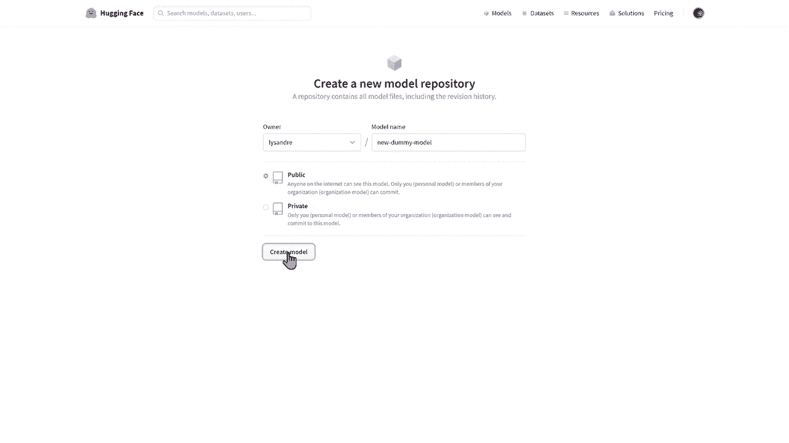
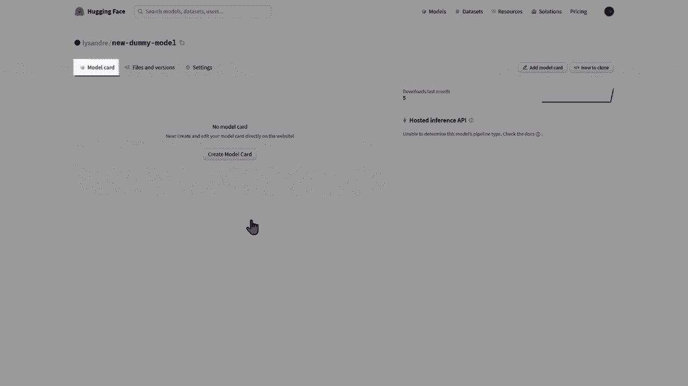
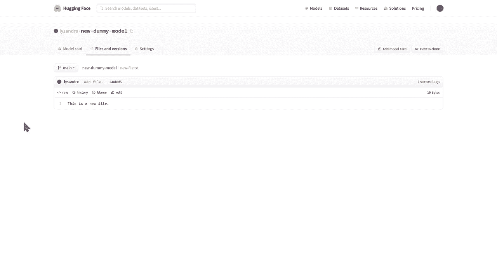
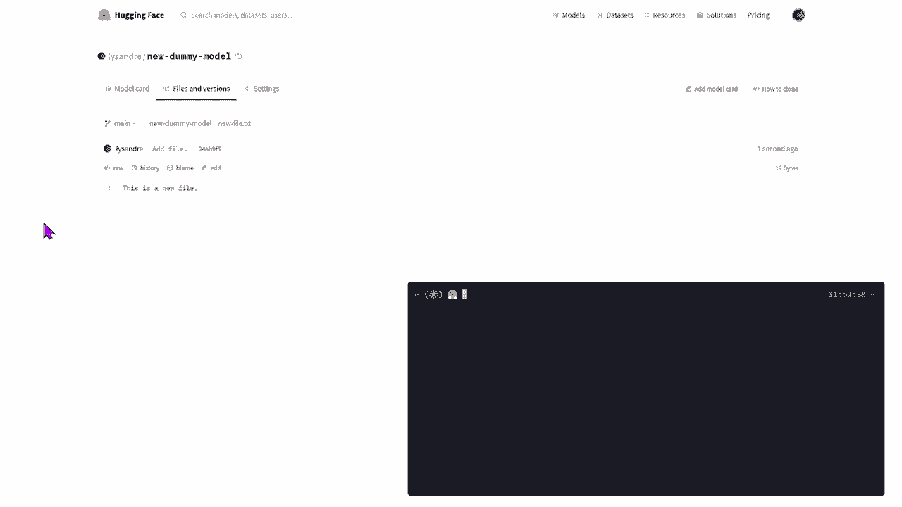
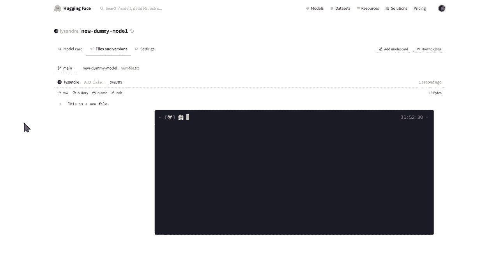
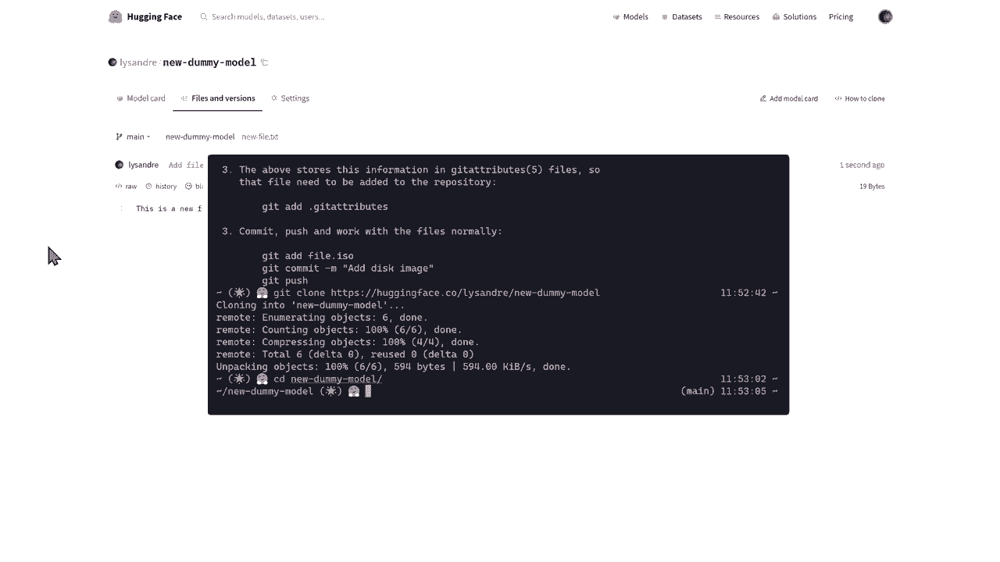
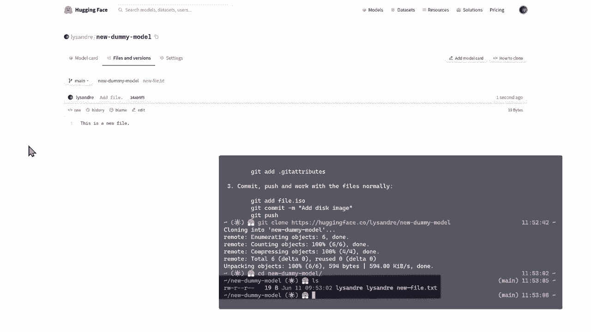
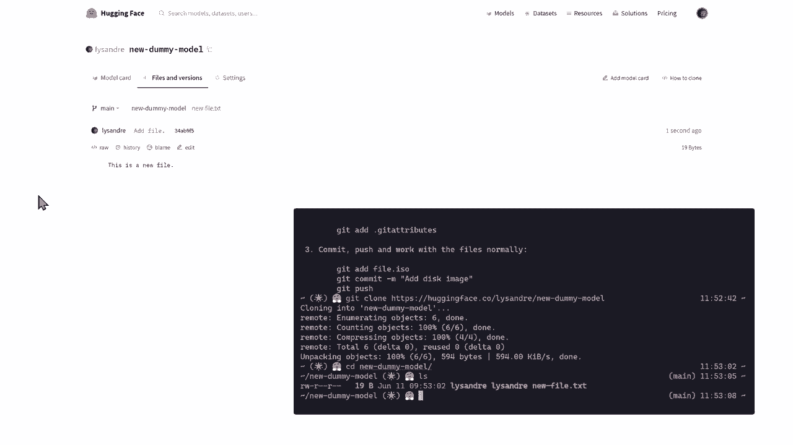
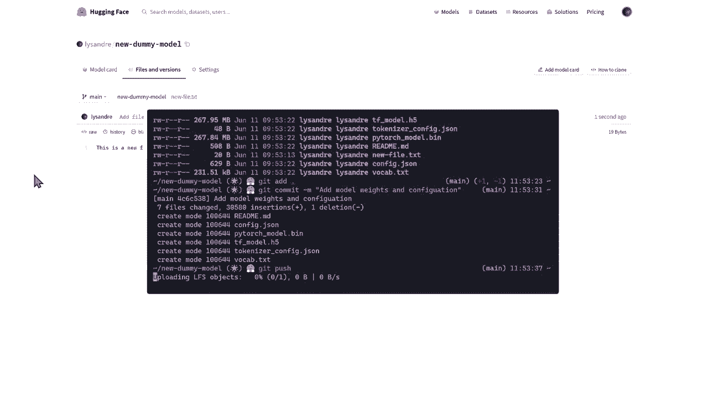
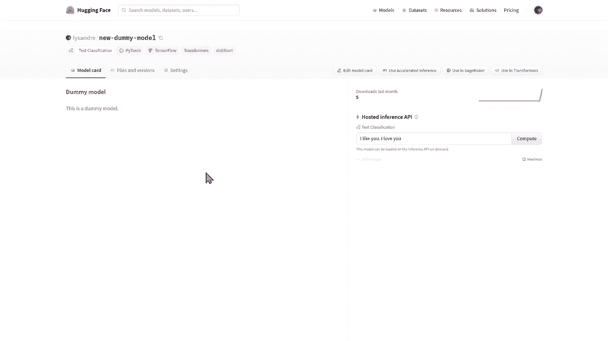

# Transformers原理细节及NLP任务应用！P32：L5.3- 在Model Hub管理模型repo 

在本视频中，我们将了解如何在Hoging F模型中心管理模型库。要处理库，你首先需要一个Hugging Face账户。创建新账户的链接在描述中提供。一旦你登录，你可以通过点击新模型选项来创建一个新的库。

你应该看到一个类似于以下的模型。😊 在所有者输入框中，你可以输入自己的命名空间或你组织的任何命名空间。😊 模型名称是将用于识别你模型的标识符。最后的选择是在公共和私有之间。公共模型对任何人可访问。

这是推荐的免费选项，因为这使你的模型更容易访问和分享。你命名空间的所有者是唯一能够更新和更改你模型的人。一个更高级的选项是私有选项。在这种情况下，只有你命名空间的所有者才能查看你的模型。

其他用户不会知道它的存在，也无法使用它。让我们创建一个虚拟模型来玩玩。一旦你的模型创建完成，就需要管理该模型。

你可以看到三个标签。你面对的是第一个，模型卡页面。

这是你用来向世界展示你的模型的页面。稍后我们将看到如何完成它。第二个是文件和版本。你的模型本身是一个Git库。如果你不知道什么是gett库，可以把它看作一个可以进行版本管理的文件夹。

如果你以前从未使用过Gid，我们建议你查看一下本视频描述中提供的介绍。gett库让你可以看到这个文件夹中随时间变化的内容，因此称为版本。稍后我们将看到如何添加文件和版本。最后一个标签是设置标签，允许你管理模型的可见性和可用性。

😊 首先让我们开始向库中添加文件。通过网页界面可以使用“添加文件”按钮来添加文件。添加的文件可以是任何类型，Python、文本，随你选择。在你添加文件及其内容的同时，你还应该为你的更改或提交命名。通常。

使用命令行添加文件更简单。我们将向大家展示如何使用Git来做到这一点。😊 

除了Git，我们还使用Git LFS，代表Git大型文件存储，以管理大型模型文件。

首先，我确保我的系统上正确安装了Git和Git LFS。视频描述中提供了安装Git和GiLFS的链接。然后我们可以通过克隆存储库进行工作。我们有一个包含单个文件的存储库。😊。

我们刚刚通过网页界面添加到存储库的文件。

我们可以编辑它以查看该文件的内容并进行更新。

结果发现我有一个可以用于情感分析的模型。我会简单地将内容复制到这个文件夹中。这包括模型权重、配置文件和分词器到存储库。我可以用Git add命令跟踪这些文件。然后，我开始进行更改。

并将此提交命名为添加模型权重和配置。😊，最后。我可以将新提交推送到hugging phase。co远程。

返回到网页界面的文件和版本选项卡时。我们现在可以看到新增的提交和更新的文件。我们在这里看到两种将文件添加到存储库的方法。第三种方法在关于pushush到Hub API的视频中探讨。

该视频的链接在描述中。不幸的是，我们模型的主页仍然非常空。让我们添加一个readme markdown文件来稍微完善一下。这个readme被称为模型卡，它与模型和分词器文件在模型存储库中的重要性不相上下。它是模型的核心定义，确保了社区成员的可重用性和结果的可重复性。

😊，并提供一个平台，让其他成员可以构建自己的工件。这里我们仅为简化起见添加一个标题和简短描述，但我们鼓励您添加与模型训练相关的信息、预期用途和限制，以及已识别和潜在的偏见。

评估结果和代码示例，说明您的模型应如何使用。😊。为模型中心贡献模型的出色工作。现在可以通过简单指定您的模型标识符在下游库中使用该模型。😊。

是的。
