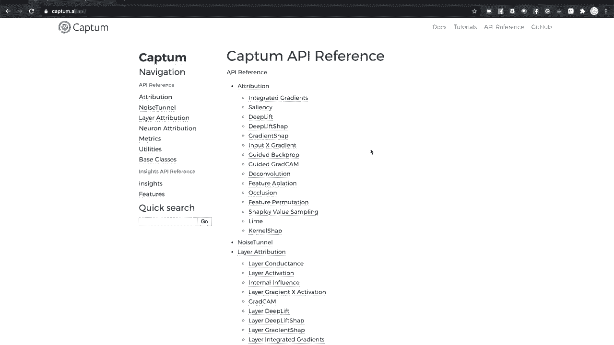
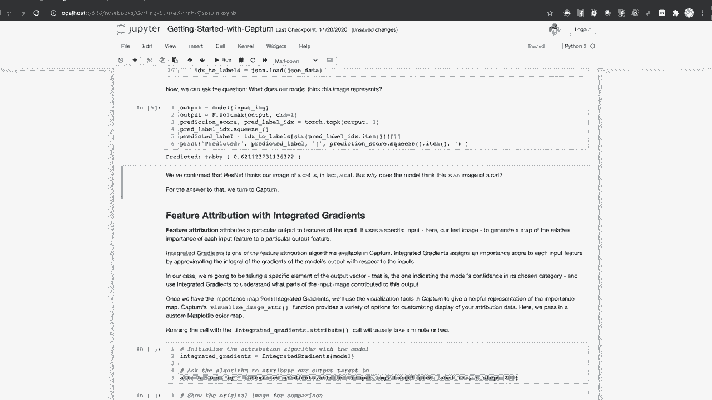

# 【双语字幕+资料下载】140分钟入门 PyTorch，官方教程手把手教你训练第一个深度学习模型！＜官方教程系列＞ - P7：L7- 使用 Captum 进行模型理解 - ShowMeAI - BV19L4y1t7tu

Welcome to the next video in the Pytorrch Tra series。

 This video gives an overview of Cap Pytorrch's tool set for model interpretability。😊，In this video。

 we'll discuss。The basic concepts of captain that we'll be covering attributions。

 attribution algorithms and visualizations。We'll demonstrate how to perform and visualize feature attributions for a computer vision classifier。

Will apply layer attribution to the same classifier to examine the activity of a model's hidden layers。

And finally， we'll look at captive insights and API for creating visualization widgets for images。

 text and other features。

Captain provides a deep set of tools for explaining the behavior of your pietorrch models。

 This video and the accompanying interactive notebook provide only an overview of core features。

 The website at Captain AI contains more in depth tutorials， documentation and an API reference。

To run the interactive notebook associated with this video， you'll want to install Python version 3。

6 or higher。Flaask 1。1 or higher， and the latest versions of piey torch， torch visionion and captain。

Captain can be easily installed with Pip or with Ananaconda by specifying the Pytorr channel。

To start with， we're going to take a pre trained image classifier。

 Resnet trained against the imagenet data set， and we're going to use the tools within cap to gain insight into how the model responds to a particular input image to give its prediction。

This first sells a bunch of imports， including attribution methods and visualization tools from captain。

 which we'll examine shortly。Next， we'll get our pretrain model。

Then we'll pull up an image to work with whereverver you got this video in the interactive notebook should also include a folder of images for use in this tutorial。

 In our case， it's going to be a cat。Next we'll define some image transforms to prepare the image for consumption by the model。

And bring in the human readable labels of the thousand imagenet classes。Now。

 let's see what the model thinks this is。And thinks our cat is a cat。

But why does the model think this is a picture of a cat。

For the answer to that， we can look under the hood of the model of cap。

The core abstraction in cap is the attribution。 and that is a quantitative method of attributing a particular output or activity of a model with its input。

The first kind of attribution is feature attribution。

This lets us ask which parts of the input were most important in determining a model's prediction。

It lets us find answers to questions like。Which words in this input question were most significant in deciding the answer。

Which pixels in this input image drove the model's classification of the image。

Which features of the input data were most significant to my regression model's prediction。

Feature attribution just covers inputs and outputs， though。

What if we want to see what's happening inside the model。For that， we have layer attribution。

This attributes the activity of a hidden layer of a model to the model's input。

It lets us answer questions， like。Which neurons in this layer were most active， given this input。

Which neurons in this layer were most important to how the input influenced a particular output neuro。

How is the activation map output by this convolutional layer correlated to my input image。Finally。

 there's neuron attribution。 This is similar to layer attribution。

 but goes down to the level of individual neurons in the model。In this tutorial。

 we're going to look at feature attribution and layer attribution。

First， feature attribution。Attributions are realized by an attribution algorithm。

A particular method of mapping model activity to inputs。

The first feature attribution algorithm we'll look at is called integrated gradients。

This algorithm numerically approximates the integral of the gradients of the model's output with respect to its inputs。

 essentially finding the most important paths through the model for a given input output pair。

We'll go ahead and create an integrated gradient object， initializing it with our model。

Then we'll call the attribute method on it。We'll feed it our input。

 our output label and an optional number of steps to run。

Note that running the cell can take a couple of minutes。

 The process of integrating the gradients is computationally intensive。

Once that cell finishes running， we have a sort of numerical importance map of the cat image with respect to the cat label generated by the model。

For a simple regression model with few output categories， we might just print that out as a table。

 but for a more complicated C model with a larger input like an image。

 it would help to be able to relate the importance map to the image visually。

Captain's got you covered。Visualization module gives you tools for exactly that。Here。

 we're going to make two calls to visualize image at。The first displays the original image。First。

 we need to make some adjustments to the image。 We call a squeeze to remove the batch dimension on the image。

 We make sure we're running on CPU。 We detach the image tensor from computation history。 Otherwise。

 the image tensor will keep tracking its computation history unnecessarily。And finally。

 we make it a numpy array and switch the dimensions around and put the color channels last。

The first argument of this method would normally be the attributions。 But for this call。

 we're going to make that none。 We're just displaying the original image。

The second argument is our transformed image。Third argument is a visualization method。

 a string that indicates how you want the visualization to work。Here， we told Captain。

 we just want to display the aboginal image。Finally， we give our visualization an instructive title。

The second call will make a visual mapping of the important regions of our image。

The first argument is the attributions we got from integrated gradients。

 And the second is our transformative image。For a method will specify heat nap。

Where color intensity maps to the importance of an image region。

Capize you to use custom color maps from map plotlib。

 And we've made one here that will slightly enhance the contrast of our heat map。

We specify s as positive。 We're only looking at positive attributions。Running a cell。

 we can see that the model is paying attention to the outline of the cat。

 as well as the region around the centre of the cat's face。

Let's try another feature attribution algorithm。 Next， we'll try occlusion。

Integrated gradients was a gradient based attribution algorithm。 Occlusion is different。

 It's a perturbation based method that involves screening out portions of the image and seeing how that affects the output。

As before， we're going to specify our input image and our output labeled to the attribution algorithm。

For occlusion， we're going to specify a few more items。

 The first are the sliding window and the stride length。

 And these are analogous to similar configuration options in a convolutional neural network。

We're also going to set our baseline。That is， our representation of an occluded image cell， 0。

Depending on how your data are normalized， you may wish to specify a different baseline。

 but for zero centered data， it makes sense to use 0。

We'll run the attribute call and give it a minute。And in the next cell， we're doing something new。

We're calling visualized image Adder multiple。To show multiple visualizations of the occlusion attribution。

Besides the original image， we'll show three visualizations。

 The first two are heat maps of both positive and negative attributions。

 You can see that we're providing a list of methods with heat map being the second and third。

 We're also specifying a sign for each visualization。

 And here you can see that we've askedtra positive attributions on one heat map and negative on the other。

 These indicate which。For our final visualization， we'll use the mask method。

 This uses positive attributions to selectively screen the original image。

 giving a striking visual representation of the areas of the image the model paid most attention to for this input output pair。

Running the cell， you can see that this maps well to what we learn from integrated gradients。

 Most of the activities are on the cat's outlined in the center of its face。

What about what the model is doing under the hood。Let's use a layer attribution algorithm to check the activity of one of the hidden layers。

Gradcam is another gradient based attribution algorithm designed for conves。

It computes the gradients of the output with respect to the specified model layer。

 averagevers the gradients for each channel and multiplies this average by the layer activations。

And uses this as a measure of the importance of a layer's output。

To get started with layer attribution， we'll create a layer gradcam object and initialize it with our model and the layer we wish to examine。

Then we'll give it the input output pair and ask it to do attribution。

We can visualize this with a heat map， as we did before。 in this way。

 you can visually examine which areas of a confidencein activation map were like to your output。

We can do better than this， though。Since the output of a convolutional layer is usually spatially correlated to the input。

 we can take advantage of that by up sampling that activation map and comparing it directly with the input。

The layer attribution parent class has a convenience method for up samplingling the lower resolution convenant activation map up to the input size。

We'll do that with the interpolate method here。And asked the visualizer for a blended heat map。

 showing the original image with a heat map superimposed and a masked image。

Visualizations like this can give you insight into how hidden layers contribute to a particular output from your model。

Captain comes with an advanced visualization tool called Cap Insights。

 which lets you put together multiple visualizations in an in browserrowsed widget that lets you configure the attribution algorithm and its parameters。

Captain Inights lets you visualize text， image and arbitrary data。

We're going to try three images now， the cat， a teapot and a trilaite fossil。Again。

 these images should be available wherever you got the interactive notebook that goes with its video。

First， we'll query the model to see what it thinks each of these are。And it seems to be really okay。

Now， let's set up cap Ins。We're going to use the attribution visualizer object。

 and we'll configure it with our model。A scoring function for the model's outputs here， softm。

A list of the classes the model recognizes here I am stripping out an ordered list of the image net class names。

We'll tell it that we're looking at image features。

 Captive Insights also handles text and arbitrary data， as well。And it'll give it a data set。

 which is just an iterable that returns a batch of images and labels。

Note that we haven't specified an algorithm or a visualization method。

These are things that you set up in the in browserrower widget。Now， we ask the visualizer to render。

It starts off empty， but we can set up configuration parameters and ask it to fetch our visualized attributions with the fetch button。

I'm going to leave things at the default setting for integrated gradients。

 Captain needs a few minutes to generate the attributions。

But now we can see that it ranks the first few predictions for each image with their probabilities and provides heat map attribution for the important regions of the image。

 In this way， Captain insightights lets you experiment with attribution methods and understand the activity that LED to your model's predictions。

 both correct and incorrect and lets you do it visually with minimal code。Finally。

 don't forget to look at Captain AI for documentation。

 tutorials and API reference and access to the source on Gitthub。

