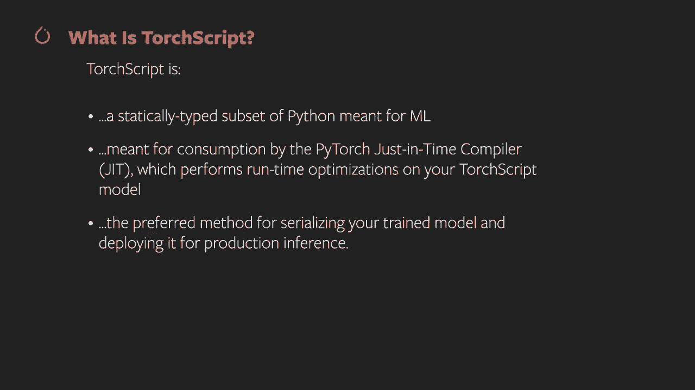
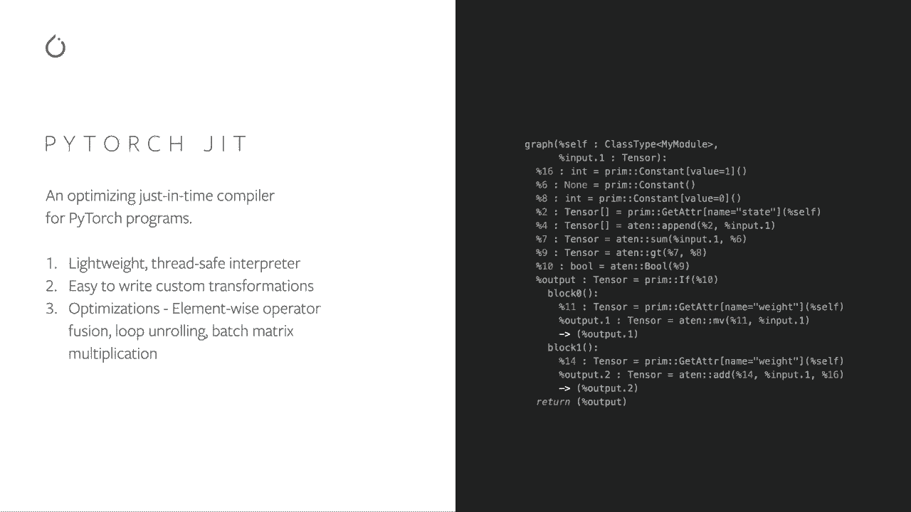
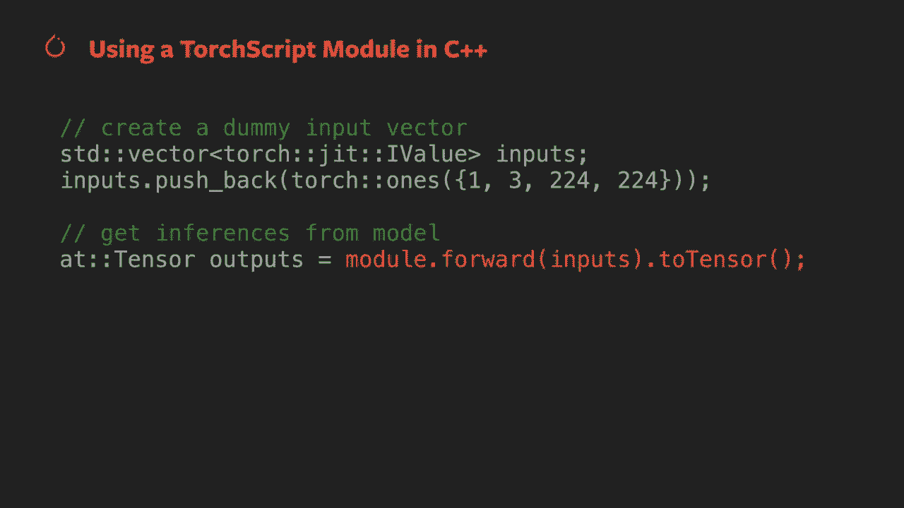
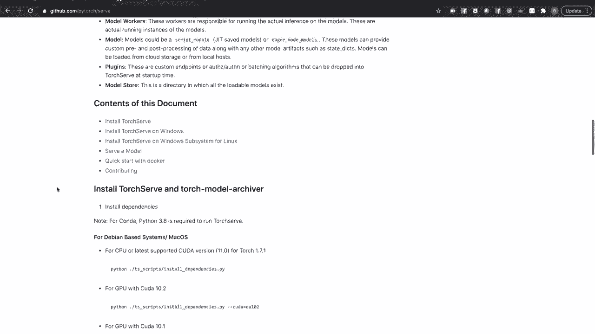
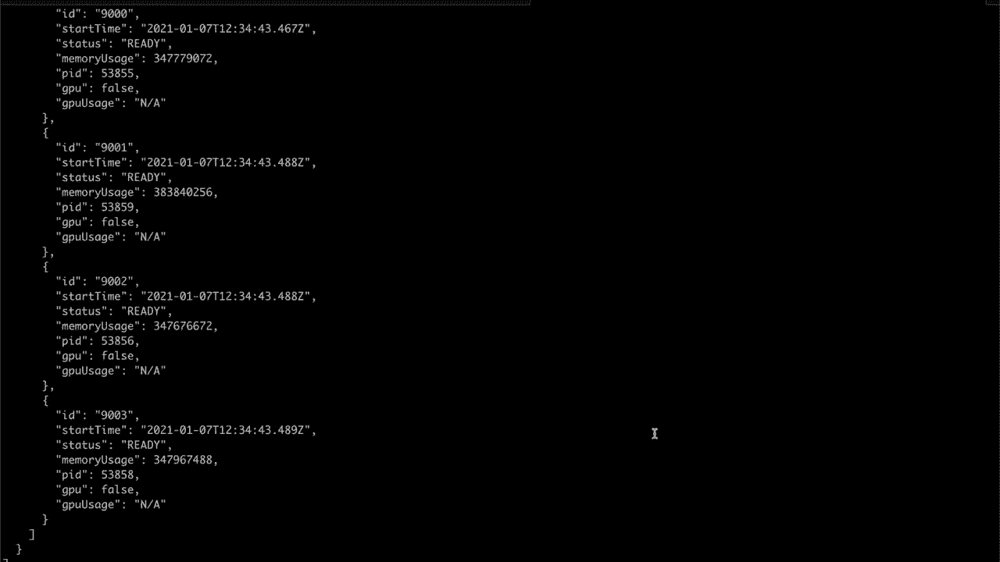
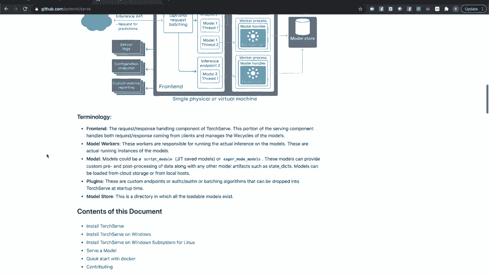

# 【双语字幕+资料下载】140分钟入门 PyTorch，官方教程手把手教你训练第一个深度学习模型！＜官方教程系列＞ - P8：L8- 使用 PyTorch 进行生产推理部署 - ShowMeAI - BV19L4y1t7tu

Welcome to the next video in the Pytorrch training series。

 This video will talk about deploying your piy torch model for inference and production。

 In particular， this video will talk about。

Putting your pi torch model in evaluation mode。Converting your model to torch script and performing inference。

Using torch script with C plus plus。And deploying your model with torchserv。

 which is Py Torch's model serving solution。No matter which deployment method you use。

 the first thing you should always do is put your model into evaluation mode。

 Evaluation mode is the opposite of training mode。 It turns off training related behaviors that you don't want during inference time。

In particular， it turns off autograd， you may recall from the earlier video on autograrad that piytorrch tensors。

 including your model's learning weights， track their computation history to aid the rapid computation of backward gradients for learning。

This can be expensive in terms of both memory and compute and is not something you want to inference time。

EVval mode also changes the behavior of certain modules that contain training specific functionality。

In particular， dropout layers are only active during training time。

 setting your model in Eval mode makes drop out aOA。

Batch norm layers track running stats on their computed mean invaris during training。

 But this behavior is turned off for eval mode。Next。

 let's look at the procedure for putting your model in evaluation mode。 First。

 you'll want to load your model for a Python based model that will involve loading the model's state dictionary from disk and initializing your object with it。

Then you call the eval method on your model。And you're done。

Your model has now turned off training related behaviors for inference。

It's worth noting that the Eval method is actually just an alias for calling the train method with an argument of false。

You may find this useful if your code already contains a flag that indicates whether you are doing training or inference。

Once you're in Eval mode， you can start sending your model batches of data for inference。

In the rest of this video， we're going to talk about different methods for deploying your model for inference。

 but for all of them， making sure your model is in evaluation mode is your first step。

So what is torch script， it's a statically typed subset of Python for representing Py torch models。

And it's meant to be consumed by the jet， the Pytorrch just in time compiler。

 which performs runtime optimizations to improve the performance of your model。

It also allows you to save your model and weights in a single file and load them as a script module object that you can call just as you would your original model。

So how do you use torch script。Build， test and train your model in Python， as you normally would。

When you want to export your model for production inference， you can use the torch。jet。

trace or torch。jet。script calls to convert your model to torch script。After that。

 you can call the dot save method on your torchscript bundle。

To save it to a single file that contains both the computation graph and the learning weights for your model。

The just in time compiler executes your torch script model。

 performing runtime optimizations such as operator fusion and batching matrix multiplications。

You can also write your own custom extensions to Torch script and C++。

The code on the right shows what torch script looks like。 But in the general case。

 you won't have to edit it yourself。 It's generated from your Python code。

 Let's walk through the process of using torch script in more detail。

The process starts with the model you built in Python and train to the point of readiness for deployment。

The next step is to convert your model to torchscript。 There are two ways to do this。

 Torch dotjet dot script and torch dotjet dot trace。

 It's important to note the differences between the two techniques for converting your model to torchscript。

Torch。jet doesscript converts your model by directly inspecting your code and running it through the torchscript compiler。

It preserves control flow， which you'll need if your forward function has conditionals or loops。

 and it accommodates common Python data structures。However。

 due to limitations of Python operator support in the Torchscript compiler。

 some models won't be convertible using Torch。jetscript。

Torch dot Je dot trace takes a sample input and traces it through your computation graph to generate the torchscript version of your model。

This doesn't suffer the operator coverage limitations of torchdt script。

 but because it only traces a single path through your code。

 it won't respect conditionals or other control flow structures that might cause variable or non deterministic runtime behavior。

It's also possible to mix tracing and scripting when converting a model。

 See the documentation for the Torchdot Je module for notes on mixing the two techniques。

It's worth looking at the docks to see the optional arguments for a script and trace。

There are extra options for checking the consistency and tolerances of your torchscript model。Now。

 we'll save our tor script model。 This saves both your computation graph and your learning weights in a single file。

 which means you don't have to ship the Python file with your model's class definition when you want to deploy to production。

When it's time to do inference， you call torch dotje dot load on your model and feed it batches of input in the same way you would the Python version of your model。

Everything I've shown you up to now has involved manipulating your model in Python code。

 even after you've converted it to Torch script。There are situations and environments， though。

 where you may need high throughput or real time inference and would like to do without the overhead of the Python interpreter。

 It may also be the case that your production environment is already centered around C plus plus code。

 and you'd like to continue using C plus plus as much as possible。

You may recall from an earlier video in this series that the important tensor computations in P torch happen in the Libtorrch。

 a compiled and optimized C plus plus library。Pytorrch also has a C plus plus front end to this library。

 This means that you can load your torchscript model in C plus+ and run it with no Python runtime dependencies。

The first thing you'll need to do is to go to pytorrch dot org and download the latest version of Libtorrch。

 Unzip the package and place it where your make system can find it。

 This slide shows a minimal C make file for a project using Libtorrch。

 Know that you'll need to be using C plus plus 14 or higher to make use of Libtorrch。In Python。

 you'd import torch， use torch dotjet do load to bring your torchscript model into memory and then call your model with an input batch。

 The process is not so different than C plus plus。First， include torch slash script dot H。

 This is your one stop include for working with torch script and C plus plus。 Next。

 declare a torchcht script module variable， then use torch Jet load to load it into memory。

To get predictions from your model， call its forward method with an appropriate input。

Here we have created a dummy input with torch ones。

 You'd be bringing in your own inputs of whatever size your model requires。

Once you have your output predictions as a tensor， you can manipulate them with the C++ equivalentence of the tensor methods you're used to in Pytorrch's Python frontant。

The Piytor。org tutorial section includes content walking you through setting up a C++ project。

 as well as multiple tutorials demonstrating aspects of the C++ front end。

Setting up a production model serving environment can be complex。

 especially if you're serving multiple models， working with multiple versions of models require scalability or want detailed logging or metrics。

Torch Ser is the Pytorrch model serving solution that covers all these needs and warmth。

Torchserv loads instances of your model or models and individual process spaces and distributes incoming requests to them。

 and has a number of features to make it useful for creating M based web services。

It has data handlers covering common use cases， including image classification and segmentation。

 object detection， and text classification。It allows you to set version identifiers for models。

 and you can manage and simultaneously serve multiple versions of a model。

It can optionally batch input requests from multiple sources， which can sometimes improve throughput。

It features robust logging and the ability to log your own metrics。

And it has separate restful APIs for inference and model management， which may be secured with HtTPS。

I'll wrap up this video by walking through setting up and running Torchserv with one of the examples available at Github。

 com/ptorrch/ serve in the examples folder。We'll set up a pretrained image classification model for inference。

First， let's install Torchserv。 I'll demonstrate the process for setting it up on a Linux or Mac system。

 but torch Serf also works on Windows if that's your preferred server environment。First。

 I'm going to create a new condoda environment for torchur。

I'm going to clone the source repository because it has convenient scripts for correctly installing torchserv dependencies。

When you run the dependency install script on a machine within N Vidia GPus。

 you may need to specify what version of the couda drivers you have installed。

Details are in the install procedure described and Torch serves Read Me on GitHub。

Since I'm installing on a Mac， I can skip that。Now， with the dependencies installed。

 I can either install from source or use Piperconda。 I'm actually installing two programs。

 Torch Ser and the torch model Archivr， which we'll get to in a minute。

If you' are installing with Conda， don't forget to specify the Ptorrch channel with D C Ptorrch。

The your torchserv environment needs is a model store directory。

 All your models served by torchserv are stored in this folder。 You can name it anything you like。

 but I'm going to keep that simple。Next， we'll need a model to serve。

Tsserv expects models to be packaged in a model archive。

 which contains your model's code and weights， along with any other files needed to support your model。

 For example， in a natural language application， you might have embeddings or vocabularies that you need to package with your model。

A model archive is created by the model Archivr， which was the package I installed alongside torch Ser above。

First， we'll need to download some train model weights。Next。

 let's create a model archive from these weights。Taking these arguments， one at a time。

Every model has a name here， Dennet 161。A model needs a version number here we just went with 1。0。

We're going to be using a Python based model， so we use the model file flag to bring in the Python file containing a model class。

The serialized file argument specifies the file containing the model weights。

If we were loading a torch script model， we'd skip the model file argument and just specify the serialized torch script file here。

We're going to bring in an extra support file， a JSO file containing mappings of the model's trained category Is to human readable labels。

Finally， every model archive needs a handler to transform and prepare incoming data for inference。

 I'm going to use the built in image classifier handler。

 but it's also possible to write your own handler and specify that file here。Now。

 you can see we have a dotton mar file。 This is our model archive。 It belongs in the model store。

 So let's put it there。Now， let's start torchservf。 We'll do so with four arguments。

The start flag should be self explanatory。By default。

 Torcherf stores its current configuration and loads its last config on startup and the NCS flag suppresses this behavior。

The Model Store flag lets us specify our model store folder。And optionally。

 we can tell torch Ser to start with a model loaded。

 We'll specify our new model archive for Densnet 161。Torter puts out a lot of helpful information。

 all of which is also saved in log files， Let's have a look at the logs folder now。

Note that a log directory has been created alongside our model store。

And here you can see we have logs for all torchserv， behavior and metrics。Now。

 the torch serve is running， let's do some inference。

We'll grab a sample image from the source rep over our input， and then we'll call curl。

On the torchserv side， the default image classifier model takes care of unpacking the image and converting it to a tensor。

 feeding it to the model and processing the output。

 This shows a simple case of using the torchserv inference API over H TtP。

 but you can also access it via GRPC or use the Kf serving API used by Kubbeflow on Kubernetes。

And here we have the top five classes identified by the model。

If we want to learn about the status of the server or manage which models we're serving or how many worker processes are devoted to each worker。

 we can use the management API。Above， used a prediction API on his default port of 8080。

The default for the management API is Port 8081。 Let's use this curl command to see how the server reports what models it's serving。

The model is end point enumerates models being served， which right now is just our densenet model。

 Let's get a little more detail on it。And here you can see it specifies things about this particular model。

 including how many workers are spun up， et cetera。

We can be more specific if we have more than one version of the model by adding the version number to the URL。

This shows the default configuration for a Ser model， with 12 workers running。

You can also use the management API to alter that configuration。

 so let's change the number of workers。So I set both the mini max workersers to four。And now。

 if I ask for。The status of our model again， we should see the number of workers has changed。

The management API lets you register new models from a local model archive or from a URL。

 It lets you unregister models or set the default version of a model to serve or get the status of a model or model that you're serving。

Finally， we can stop Torser with the stop flag。The Torch Ser GitHub Repo also has walkthroughs and examples from many common tasks。

 including specific server management tasks， setting up HTPS， writing a custom handler and more。

And as always， everything I've described here and more is documented fully in the documentation and tutorials at Pytorch dot org。

