# 【双语字幕+资料下载】Hugging Face速成指南！一遍搞定NLP任务中最常用的功能板块＜实战教程系列＞ - P4：L4- 基于PyTorch的分类实现 - ShowMeAI - BV1cF411v7kC

Let's do this manually and see how we can call our models。 So in Pytorrch。 when we do inference。

 we also want to say with torch dot no gra。 So this will disable the gradient tracking。

 I explain this in a lot of my tutorials。 So you can just have a look at them if you want to learn more about this。

 And then we can call our model by saying outputs equals。 And then we call the model。

 And then here we use two asterisk。 and then we unpack this batch。 So if you remember here。

 this is a dictionary。 And here basically with this， we just unpack these values in our dictionary。

 So for tens offlow， you don't do this。 So you just pass in the batch like this。 But for pytorrch。

 you have to unpack this。 And now we get the outputs of our model。 So let's。

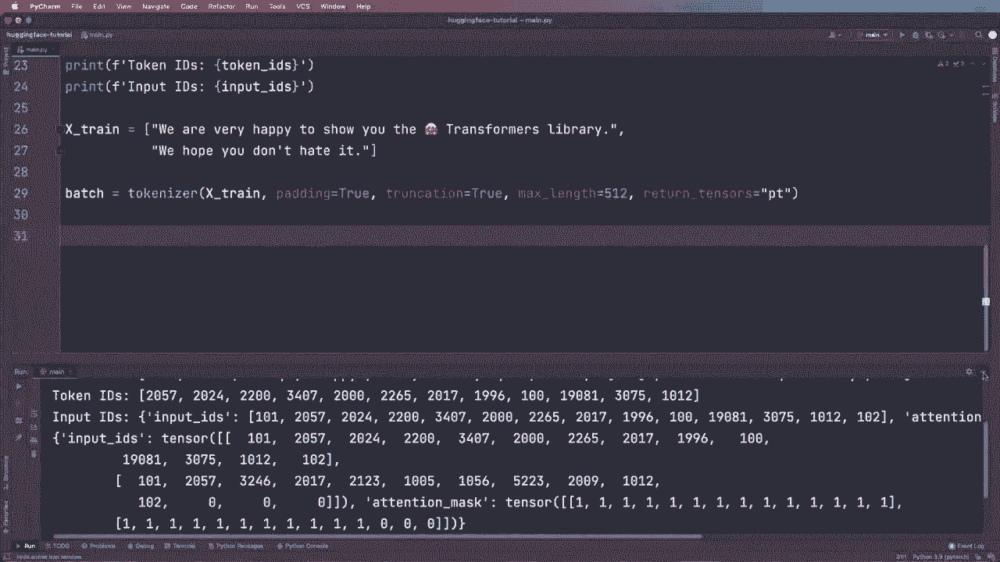

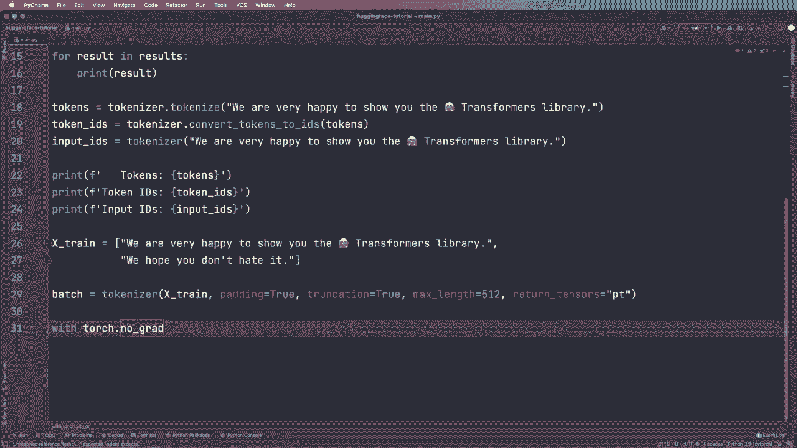

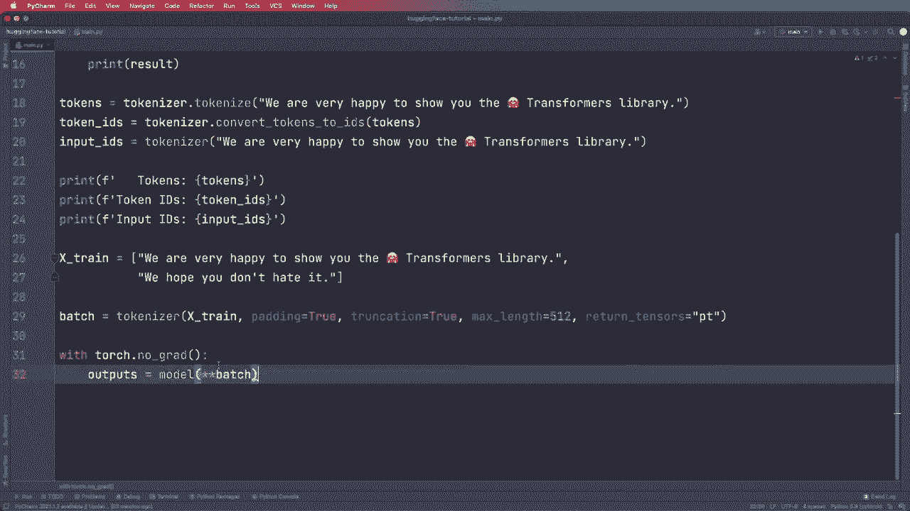

Print the outputs。 And as you might know this， these are just the raw values。

 So to get the actual probabilities and the predictions， we can apply the soft max。

 So let's say predictions equals torch or we also have this in F dot soft max and then here we say outputs dot logics and we want to do this along dimension equals1。

 and let's also print the predictions and then let's do one more thing。

 So let's also get the labels labels equals and we just get this by taking the prediction with the the index with the highest probabilities。

 So we get this by saying torch dot arc max and we can either put in the predictions or。

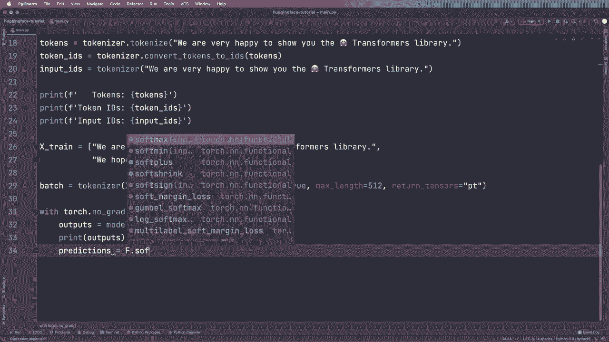

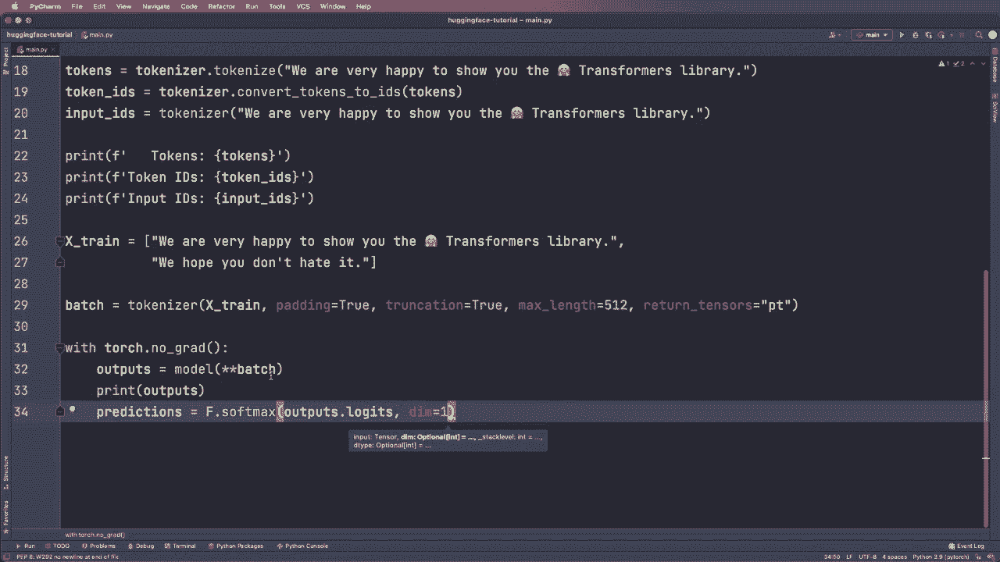

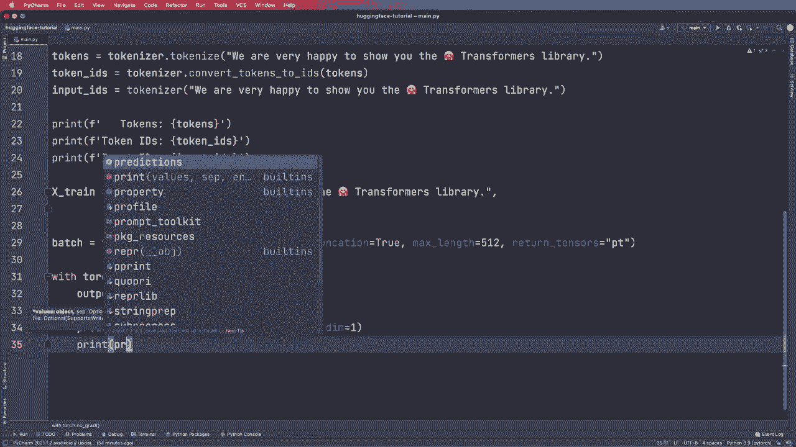

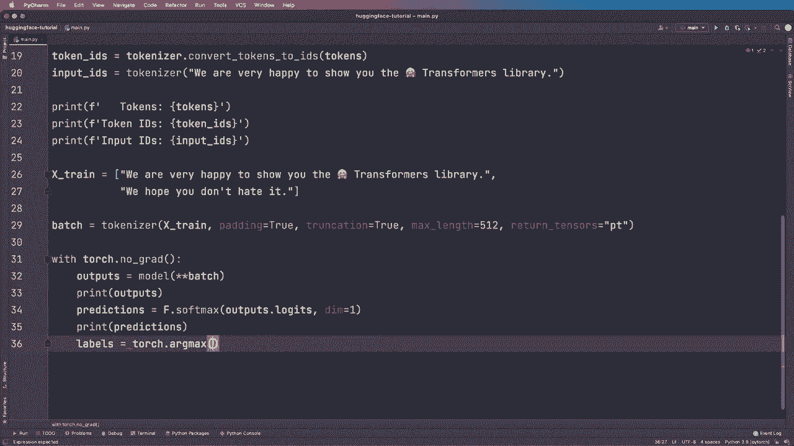

We can put in the outputs and actually don't need this。

 but just for demonstration let's use the predictions and then again dimension equals one and then let's print the labels as well and now let's actually do one more thing So let's convert the labels by saying labels equals and then we use list comprehension and call model dot config dot I to label and then it needs the actual label ID and then we iterate so we say four label ID in labels to list and now what this does you will see this when we print this So we print the labels and now let's actually。

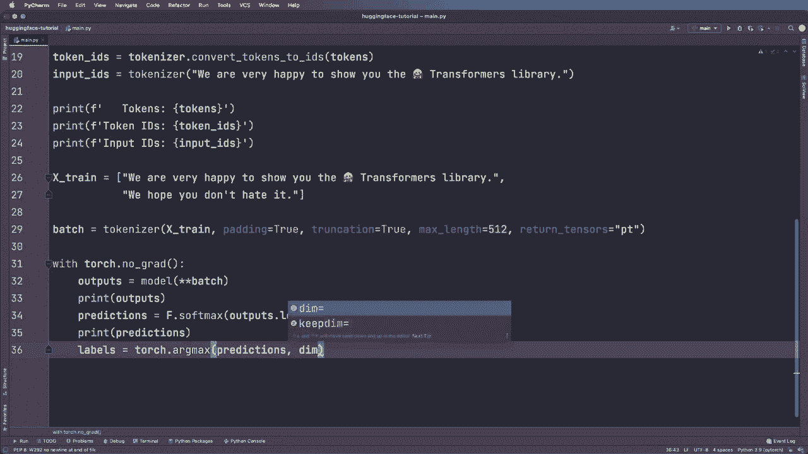

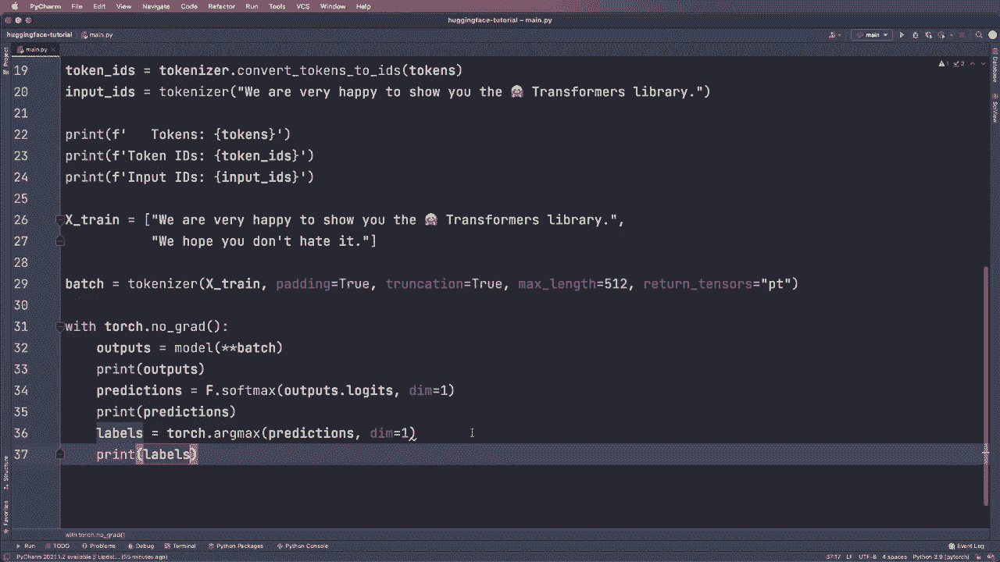

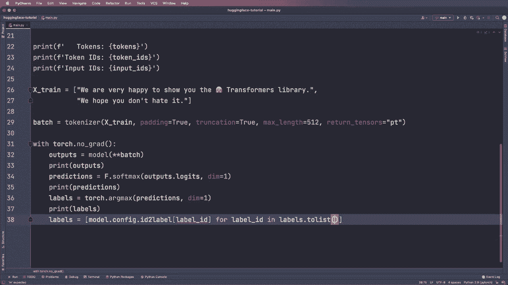

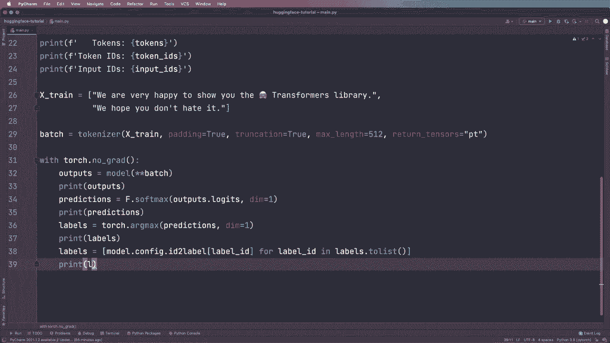

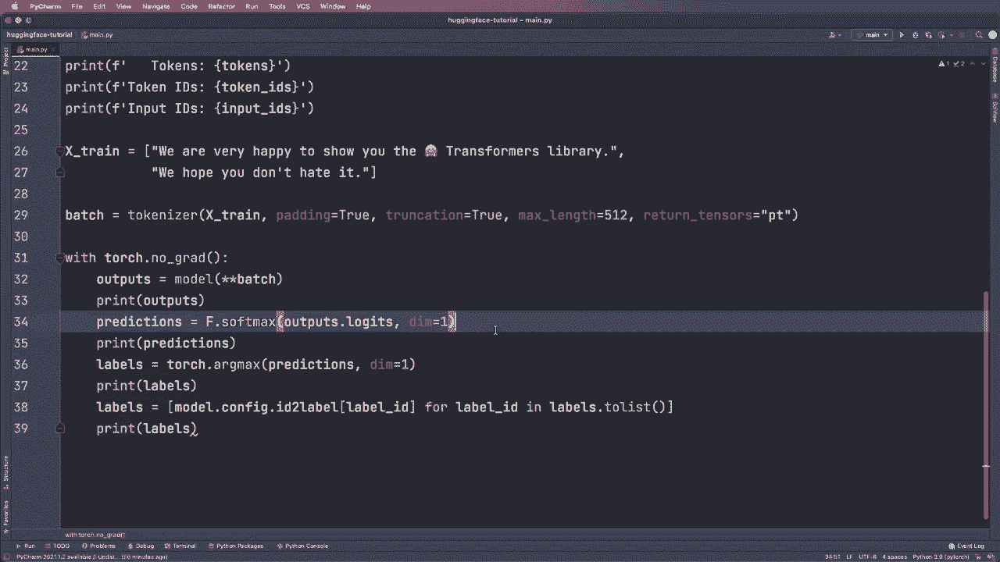

R this and see if this works。 Alright， so this works。 So as you can see here， we print the output。

 So these are our output。 This is a sequence classifier output。 And as you see。

 it has the launchets argument。 So that's why we used outputs dot launchet。😊。

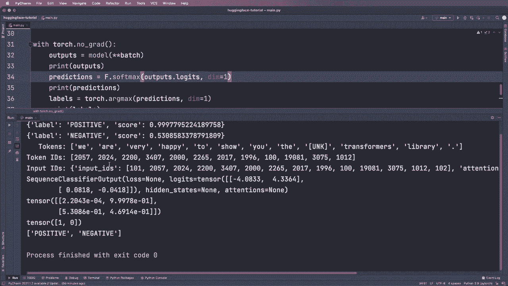

And then we get the actual probabilities。 and then to get the labels。 we used Arcm。

 So this is a tensza with the label1 and the label 0。

 And then we converted each label to the actual class name and then we get positive and negative。

 So by the way， this function， I think is only dedicated to a auto model for sequence classification。

 For example， if we just use a auto model， Then I think it won't be available。

 So that's what these more concrete classes will do for you。

 it gives you a little bit more functionality for the dedicated task。

 So we see that the loss is none in this case。 So if you also want to have a loss that we want to inspect。

 Then we can give the loss or the。😊。

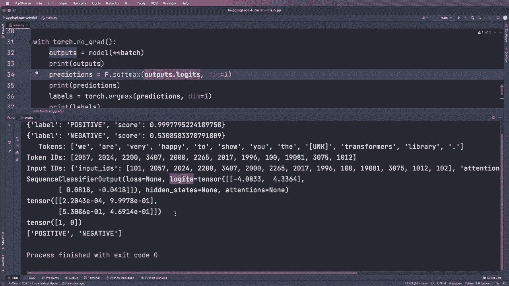

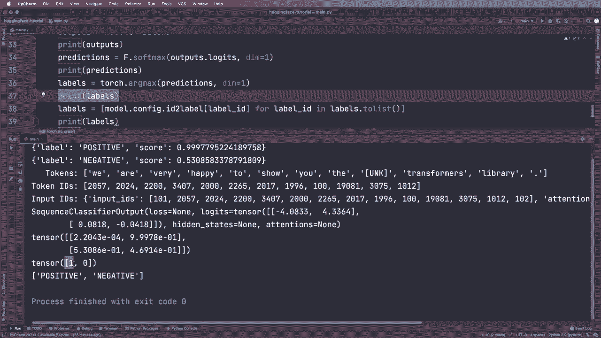

Not the loss， but the labels argument to our model that it knows how to compute the loss。

 So we say labels。 and then we create a torch dot tenor by saying torch dot tenor。

 And then as a list， we give it the labels1 and 0。 And now let's run this again。

 And then you should see that we should see a loss here。 And yet， now here we see the loss。

 And again， this labels argument is， I think special to this automod for sequence classification。

So， yeah， this worked。 And now if we have a careful look at the probabilities。 So first of all。

 we see we get label positive and negative。 and here for the first one。 This is the highest probabil。

 So 9。997。 And here for the second one， this is the largest number。 So it took this one。

 And this is 5。30。 So if we compare them with the results that we got from our pipeline。

 Then we see these are exactly the same numbers。 So now you might see what's the difference between a pipeline and using tokenizer and model directly。

 So with the pipeline， we only need two lines of code。 And then we actually get what we want。

 So we get the label and we get the score we are interested in。 So this might be just fine， but。😊。

Yeah if you want to do it manually you can do it like I showed you and you will get the same results that you can then use。

 So yeah， that's how you can use a model and a tokenizer and yeah so using the model and the tokenizer will be important when you for example want to find tune in your model so I will show you roughly how to do this later but yeah so this is how you use model and tokenizer and let's just assume we did find tune in our model。

