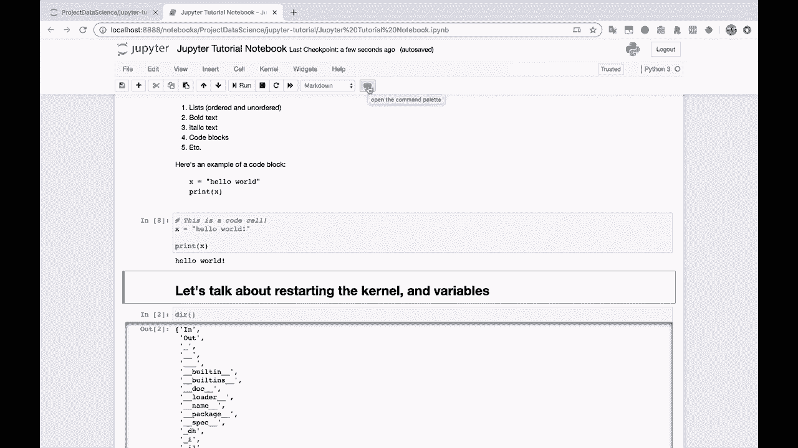
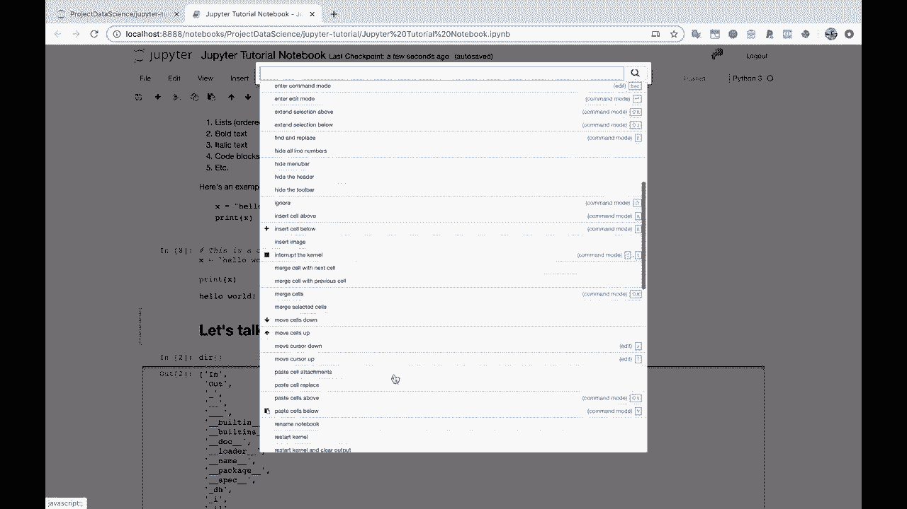

# 【双语字幕+资料下载】Jupyter Notebook 超棒教程！50分钟，把安装、常用功能、隐藏功能和Terminal讲解得清清楚楚。学完新手也能玩转！ - P7：7）其他Notebook功能 - ShowMeAI - BV1yv411379J

Alright， so let's take a tour of some of the other things we can do here in Jupiter notebooks。

 So one of the things I'll show you really quickly is。Is a collapsing。Collapsing cells。

 So let's say that I say， you know， for value in range 100。Let's print value。Well。

 this is gonna create a really long print out， right。 And suddenly， our notebook is。

 is like twice as long。 If I do this for 10， it becomes even more noticeable。 Oh。

 and Jupyter notebook already collapses it for me。 So that actually kind of takes away from what I was going show you。

 But so notice here， if we print out all of the range all of the values from 0 to 999。

 Our Jupyter notebook now is pretty de enormous。 We' got to scroll all the way down。😊，So。

One of the things that Jupiter Notes has to help with this is you can click the sidebar here and click this。

 and this will collapse this cell。Into a smaller scrolling version of itself that does not take up the entire notebook。

 So this is very helpful。 So I can go ahead and do that to this du section up here as well。

 Make that a little bit smaller。That's a very handy thing。Let's come up here and take a tour of the。

 the menu bar。And these buttons down here， so。You have your normal save button， save and checkpoint。

You have this plus button， which is insert cell below so we can use that here。 I like to use the B。

The B。Shortcut。 So you just hit the letter B on your computer。Are on your keyboard whenever you are。

 So I guess there there are two different modes here that we should talk about really quickly。

 One of them is text entry mode， like printing hello world。

And that's whenever the color is green here， that tells you that you're entering text or code。

 and if you just click on the cell itself， then that puts you in this kind of master execution mode where you can use keyboard shortcuts like the letter X to delete cells or the letter B to insert cells below。

B for below， a for above。All right， back up here to the toolbar。

 you've got you can cut selected cells。You can copy them， you can paste them。

You can move cells up or down。 So if I click this cell here and then click this button。

 that moves it up。 This one moves it back down。You can run a cell。You can interrupt the kernel。

 interrupt the kernel。 And what I mean by this is let's say let's practice interrupting the kernel。

So， interrupting the colonel。Let's say that I， that I create an infinite while loop that I do something stupid like this。

 This is pretty stupid。And， you know， say print one。And just to。Let's see。

 just to not accidentally like crash the kernel here。 I'm gonna say time dot sleep point2 so that it。

Alright， there we go。 This is never gonna stop。 This is always。

 this is gonna keep running till the end of time or at least as long as computers exist。

 or as long as my battery lasts。 So how do I， how do I stop this。

 How do I stop this from executing well。You can come up here and click this little stop button。

 interrupt the kernel or kernel interrupt， and let's do it click。There we go。

 Let's scroll down and see what happened。And， you'll see that essentially。

 what it does is a keyboard interrupt。 And it says， hey， you know， Colel。

 whatever it is that you're doing， we want to stop you， We want to interrupt you。

 You should stop doing what you're doing。 So in this case， I created an infinite loop。

 an infinite while loop here。And we're able to stop it through the kernel interrupt there。Alright。

 so this one restart the kernel， just like we did with the kernel restart。And this one。

 restart the kernel， then rerun the whole notebook。So you'll notice that up here under cell。

 we have things like run cells， run all， run all below。

 So these are all different options for executing your notebook。 You know， if you wanted to。

 you could come in here。And just run all of yourselves beginning to end If you had a work flow that you wanted to just go all the way through。

 for example， if you weren't doing， you know， for instance， exploratory data analysis。

 where you were doing a little bit more back and forth with your analysis。All right。

And then this drop down cell here that we've seen， this changes cells from markdown to code。

So if I change this cell to code， well suddenly it doesn't make a lot of sense because this is not Python code。

I'm going to change this back to Markdown。And execute it again so that it。

 so that it formats itself all nicely。Can change this cell from code to a markdown， which， you know。

It works， but that's not what we wantan to do。 We want this to be a code cell。

'cause this has Python code。So， there you go。And let's see this last button here。

 open the command palette。

So if you click this， then you have access to a bunch of different commands。

 too many for you to read。

