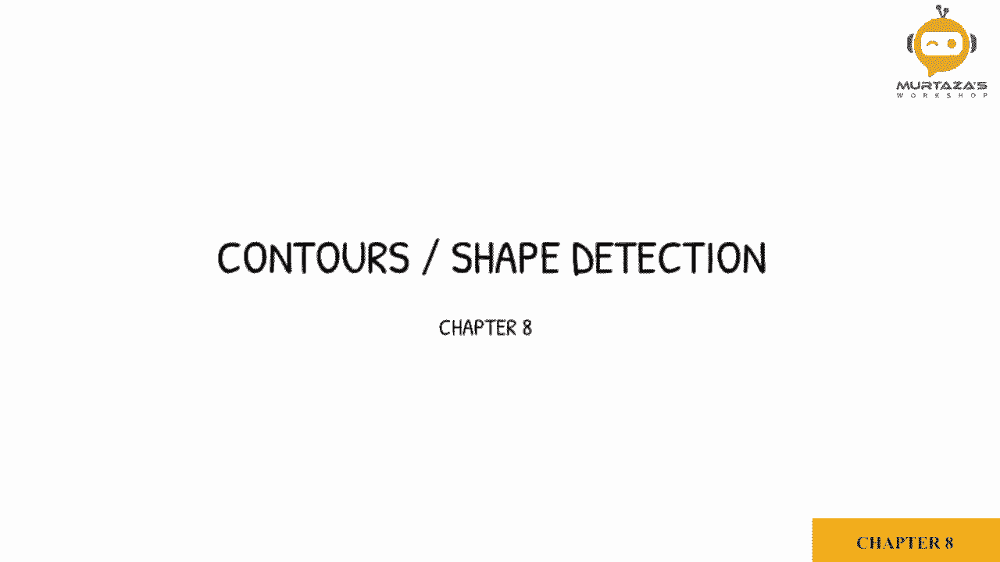
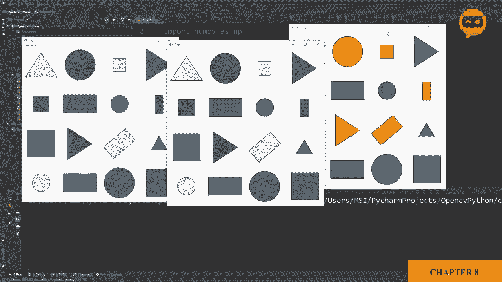
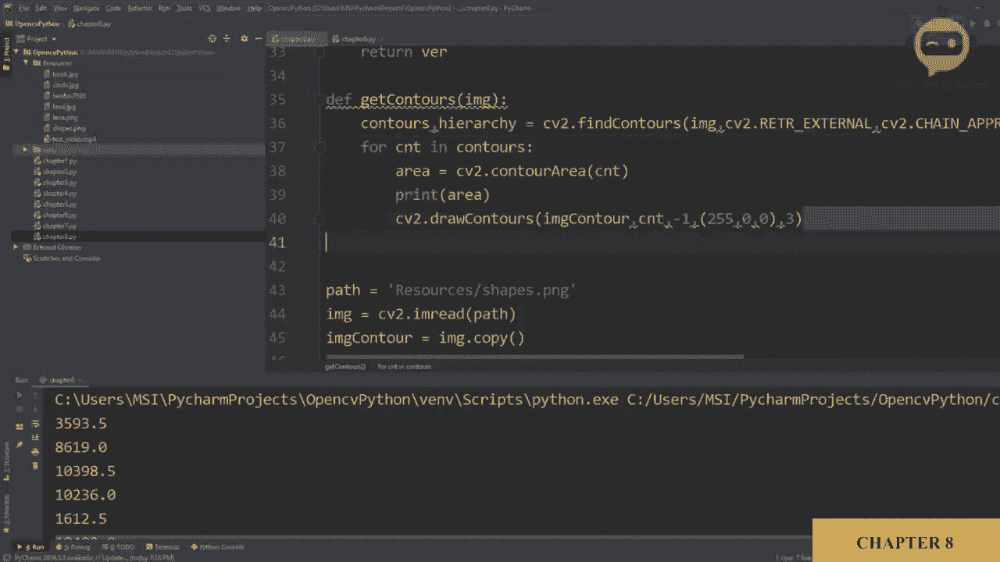
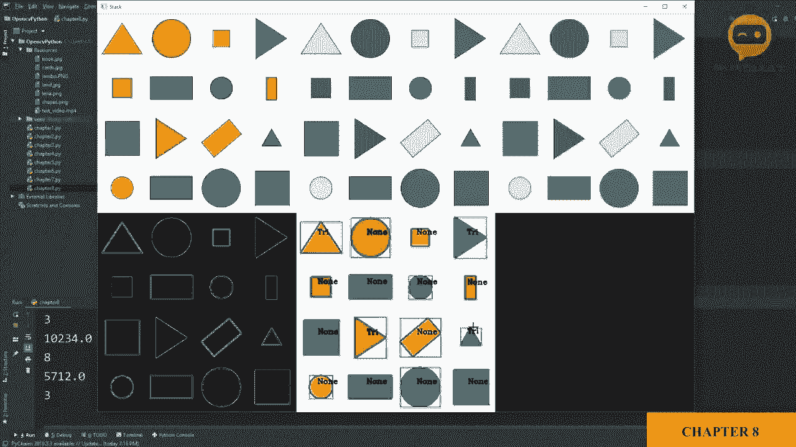
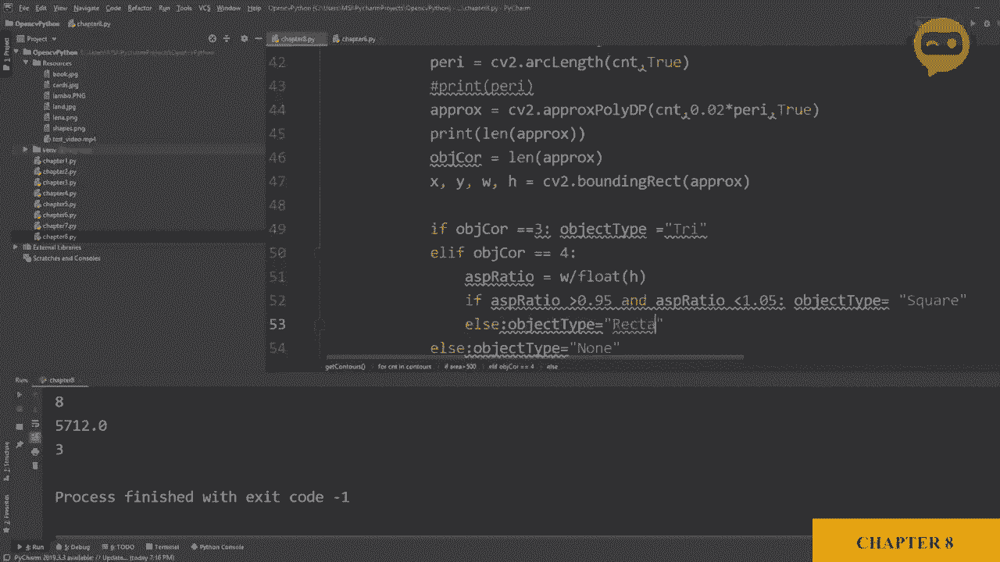
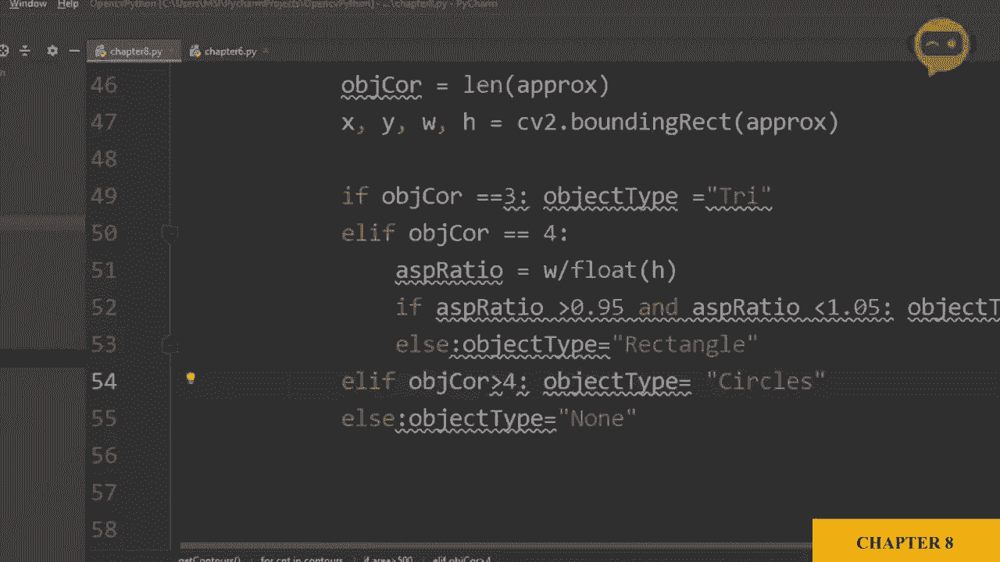

# 【双语字幕+资料下载】OpenCV 基础教程，安装、原理、实战， 3小时带你搞定这个热门计算机视觉工具库！＜实战教程系列＞ - P11：第8章：轮廓与形状检测 - ShowMeAI - BV1zL411377L

So now we are going to detect shapes in an image， so we will detect their contours。

 the corner points， and based on those， we will decide what is the shape of this object。

So what we have is our packages。We have the image of shapes in the resources。

 and what we are doing is we are just。Printing it out using the IM show function。

 so this is our image it has triangles， circles， square and rectangles。

 so we are going to detect each one of them and we will categorize which category it belongs to and we will show how many corner points it has plus the area of each of the shape。

So， let's start。So we are going to pre processces our image first。

 so we are going to convert it into grayscale and then we will find the edges so that we can find their corner points。

So let's start by converting it into grayscale。So we will use the CVT color function。

And here we will write our image。That we want to change， and we will define。

What color do we want the channels to be， So we will say B G R2 gray。

Then we will add a little bit of blur。So we will use the Wassian blur function。

 So we have our image gray。And then we need to define the kernel， so we will say。

 let's say it is7 by 7 and then we have the sigma， so the higher the value of the sigma。

 the more blur you will get， so let's put it at one and we will see if we need more。

So then we are going to detect the edges。Actually， before that。

 let's print it out and see if everything is working well。 So we have the。Image gray。Image gray。

 And then we have the image blur。 So we will write here。Gray， and we will write here blur。

So if we run this。We should get three images。And yeah， so we are getting。

The gray image and then we have some blur added to it。

Actually， at this point， it will be a good idea to use our stacking function so that we don't have to play with that too much。

 So in chapter 6 we yeah， this is the function。We used。 so let's copy that。

And we will go back and we will paste it here at the top。So。Let's use the stocking。

 So we will say that our。Image stock。Is equals to stacked images。 We will give it a scale of 0。6。

 and then we will define our image array。Now， inside that。

 let's say we are going to put our image and then image gray。And then， our image blur。

So we can remove all of these and then we can just say stock。And then， image stuck。

So if we're on this and there you go， So we have our image， all three images stacked together。

So next we are going to find the edges in our image。So we will use the canny edge detector。

 so we will write image canny。Is equals to C2 dot scanningny。Canny， we will define the image。

 We will give it the blur image， and then we have to define the threshold。

 so we can just pick some threshold， let's say 50 and 50 and see if it works well。

So we can add another。Another row。And。So we can add。Image Gny。 image， Gny。And then the rest。

 we can keep the same， or we can define a black image so we can define our image blank so we can say image。

Mage blank is equals to nuy dot。Zeros， like。Image。And then， we can put this。Here。Let's run this。

 And there you go。 So now we have our edges。 And from these edges， we are going to find our contours。

So， let's go back and。Now we are going to create a function。

 so earlier we were not creating functions， but because this is a little bit of more code。

So now we are going to create a function。 So let's go up here and we are going to define a function by the name get contours。

So in this， we are going to define our image。And it will input an image。 And then from there。

 we will find our contours。 So the first thing we will do is we will write。Conuntours。And then。

 we will write hierarchy。Hi are。Let's keep it small。

And then we are going to use our C2 dot find contour function。Find contours。Now in that。

 we have to define our image， the one we want to find the contours in and the second parameter is our retrieval method。

 We have different types of retrieval methods。 The one we are going to use is the external method。

 so retrieval。We will write R E。 What is it， R， E T。E are， yeah。R， E， T， E， R yeah， external。

 And what this does is it。It retrieves the extreme outer contours。

 There are other alternatives that will detect all the contours。 They will not be filtered out。

 but this one is specifically good if you want to find the outer details or the outer corners。

 So we will use this。 And then we have the。Approxiation where you can request for all of the information。

 or you can request for compressed values。 So it will reduce the points for you for this example。

 we are going to get all the contours that we have found。 So we will say。C， V2 dot chain。

Approxiation as none。So once we have our contours， they are saved in the contours。

So what we will do is we will say that we want to loop through it so for。C and T in contours。干。Tos。

So for each contour， we are going to。Find the area first。 So we will say area。Is equals to CB2 dots。

Contour。Area， and we will just mention the contour that we want to find the area for。Now。

 the second thing we will do is we will draw this contour。So okay， let's， before we do that。

 let's just print it out so you can see。What kind of areas are we getting， So if we run this。Oh。

 actually， we have to call the function。 My God。 So we need to go down and here we will say。

Get contours， and we will send the image canny。And there you go。

 So these are all the areas we are finding for each of what you call the shapes that we have detected。

So next， we are going to draw them so that we can see them clearly。

We are going to use the drop contours function。 So C V2 dot draw。Contours。

 we will give it the image that we want to draw it on。So we are going to use let's create。

I don't want to put it on the original image。 So what we can do is we can create a copy of our original image。

 so we can say here that。Image contour。Is equals to。Image dot， copy。

So we will copy the image so that we can。Put the drawings on this image， the image contour。

 So we are going to define where is it。 So we will say image contour。 We want to put it on that。

 and then we have to give it the contour itself。 So that will be C and T。

And then we have the contour index。 So here we will say negative one because we want to draw all the contours。

 and then we have to write 2，5，5。Then let's say， we are going to make it。

What color is that that is blue。 Okay， and then we will put it。As thickness as 3。

So so each time it will loop， it will draw the complete contour it finds in CNT。

So this is what this statement is doing。 So let's run that。

And oh， we did not put the image contour here。 So image。

Contour。

And there you go。 So now we have all the shapes and we have detected all the contours。

 You can see there is a blue line around them and it seems to have detected fairly well。

So next， what are we going to do。 So next， we are going to check for the minimum area。

 So we will give it a threshold normally， if if it's just an image like this， you don't have to。

 but it's a good idea to give a minimum threshold for the area so that it does not detect any noise。

 So we can say if our。Area is greater than， for example， 500， 500 pixels。

Then we are going to do the calculations， the maths of it if you want to completely neglect it。

 then we will just put it down here rather than up there。

And if we write that， and we can see all of our shapes have areas greater than 500。

 so we should not have any。

Issues， so the next thing we are going to do is we will calculate the curve length。

So the curve length will help us approximate the corners of our edges， corners of our shape。

 So let's write that down so we are going to write here。Pimeter is equals to C， V2 dot Aland。

And we want to find the Arkland off。Our contour。And we will say that it is closed。

 so we will put it as true。So， we can。We can print this out if you want to see it print。Barry and。So。

So now we are getting the length of each of the contour， the arc。The Arkland or the parametermeter。

What do you call。Or the control parameter。So next， we are going to approximate the。

 the corner points， how many corner points we have。 So we will write a pro is equals to。C， V 2 dots。

Approx polllly。And we are going to give our contour， and then we will give it a resolution。

 So this you can play around with。So we will multiply it with our length。The Aland， so。

Here you can play around with this a little bit if you are not getting good results。

And then you can write here through again because it is closed。

 We are expecting all our shapes to be closed。 So next。

 we are going to print the value of our blocks。Now。

 this will give us the points of the corner points。 So of each of them， each of the shapes。

 So if we see here for each of them， we have certain number of points。 So here， for example。

 we have three points。Here we have more than three， maybe seven or eight。Then we have 1，2，3，3。

 and then so on。 So what we can do is instead of printing this。

 we can print the length of each one of them。So that will give us the idea of what the shape is。

So here you can see we have 383， so we can say that 3 is triangle。

 4 is either a square or a rectangle that we will find out later as well。

 and then we can say that anything above four is a circle。

So because we are only detecting three or four categories so we can assume that。

So next we are going to create our。Object corners。 So object corners is equals to length of our approximation。

 And now we are going to create a bounding box around our。Detect object。

So now we are going to get the values of our bounding box。

 If we were to draw draw a bounding box around our object。

 what will be the x and y and the width and the height。 So let's get that x。Wai。Weth and height。

So we will get that from C2 dots。Bounding box， bounding rectangle， and then a rockx。Okay。

 let's put some spaces here。And here as。Okay， so this will give us the X Y and the width and height of each of the objects or the shapes。

 and let let's draw them right away so that we get a clear picture of what we are doing C2 dot rectangle。

And we we want to draw it。 So where do you want to draw it。 Let's draw it on the image contour。

And then we are going to give it the point number one， which will be your x and y。

 so it will be x and y and your point number two will be your x plus width and x plus y plus height。

 so it will be x plus width and y plus height。Then we are going to give it a color。

 Let's give it a different color so that we can tell it is a bounding rectangle。

 and then we will give it a thickness。So that should do it。 So let's rerun it。

And there you go so now we can see that we have bounding boxes around each of the shapes we are detecting so from these bounding boxes we can get information such as what is the total width and height of the object where is the center point of the object so these kind of things can be useful maybe in another project。

 but for now what we will do is we will categorize these objects。

Into whether they are circle， whether they are triangle， rectangle or square。

 So the first one is let's start with the smallest one， which will be our triangle。

 So we will say that if。Our object。Cners are3。Then we want our object type。Object type。

 This is a variable to be。Triangle。There's just a string。

What we can do is we can print this string out。In our image， so we can say CB2 dot put text。

We will define our image contour， and then we are going to write what we want to print。

 which will be our object。What did I write it as， Oh， this is capital。 Let's make it small。

 So object type。And then we are going to write where do we want to print it out。

 So let's print it at the center of the object a little bit shifted from the center of the object。

 So what is the center of the object。So this will take some room。 So I will put it down here。

 So the center of the object will be x plus。Wait。Divided by 2。And we will shift it a little bit。

 so we will reduce 10 pixels。And then we will write the center of our y， which will be y plus。Height。

 divided by 2。And this we will keep the same。Or should we let's let's put some what do you call。

Dviation in this as well。 So let's put -10。 So it will be a little bit higher than the center point。

 So what is the next thing， Yeah， the next thing is the font。 So we will write C V2 dot font。

 We don't want anything fancy。 So we will write。We will use the first one。

 and then we will write our scale。Scale， let's put it 0。5。 And then we have our color。

So let's put the color as 0，2，5，5， and then 2，5，5。And then the font scale， we will put it as2。Okay。

 so where did I do the mistake， Ca it's not showing it properly。 Yes， the comma。Okay。

So that should give us triangle everywhere。 There is a triangle。Object type reference before。

objectject type。Okay， so we did not define what happens if it's not3。 So for now， we can say else。

Object type is equals to。Is equals to none。

So there you go。 Oh， that's yellow in color。

Which is kind of hard to read。So we will put it in a different color。 Let's put it black。

 I think black will be easy to read。And we can increase the size a little bit。 So it's easier to see。

And we can also increase the size cause we still have some room。So， let's run that。And there you go。

 So now we can see that all the triangles。

They are detected correctly， and the rest of them are none。 So next。

 we are going to define the rest of them。 So that will be here。

 if our object or it should be else if else if。Our objects。Cners equals 4。

Now this one is a little bit tricky here we are going to check if we are getting a square or a rectangle now how can we decide that what we can do is we know that a square if we divide the width and height we should get one because the width and height of a square is the same so what we can do is we can see that if we divide them we will get the aspect ratio and if that aspect ratio is between a certain range we can say it is a square if it's not we will say it's a rectangle。

So the first thing we will do is we will get the aspect ratio。

 so we will write aspect ratio is equals to it will be width divided by height since we are dealing with disimal numbers。

 we have to define one of them as float。Loloat， so it gives us。Float value。 So once we have that。

 we are going to put another if statement if our aspect ratio。Is greater than 0。95。And。

Our aspect ratio。Is。Less than  one point。0，5， which means we can have a deviation of 5%。

Then we will say that our object type。Is equals 2。squarequare。If that's not the case。

 then our object type is equals 2。Bectangle。

So let's run that。And there you go。 So here we are getting a square rectangle， square， square。

 rectangle square。 So next， we will write it for the circle， so we will write。

Else， if。Object corner。Is greater than 4。Then we are going to write object type is equals 2。Circles。

So， let's run that。

And there you go。 So now we have the circle， we have the rectangle and we have the squared triangle。

 So all of them we are detecting properly， except for this one。

 it will take a little more complication to solve that， but we can try that later on。

