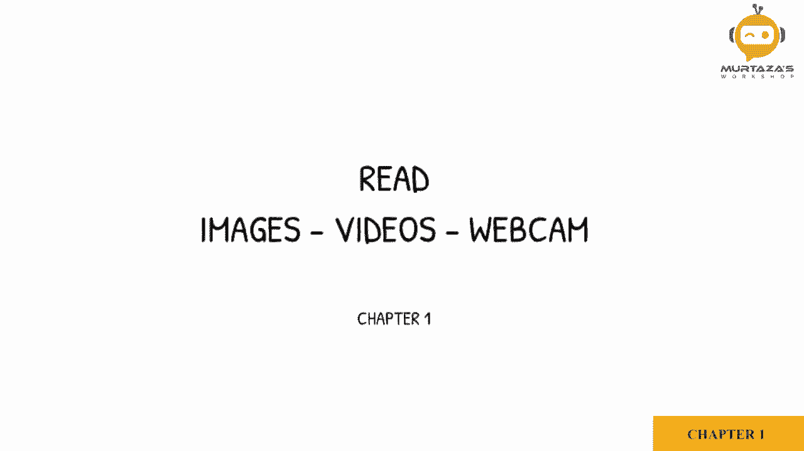
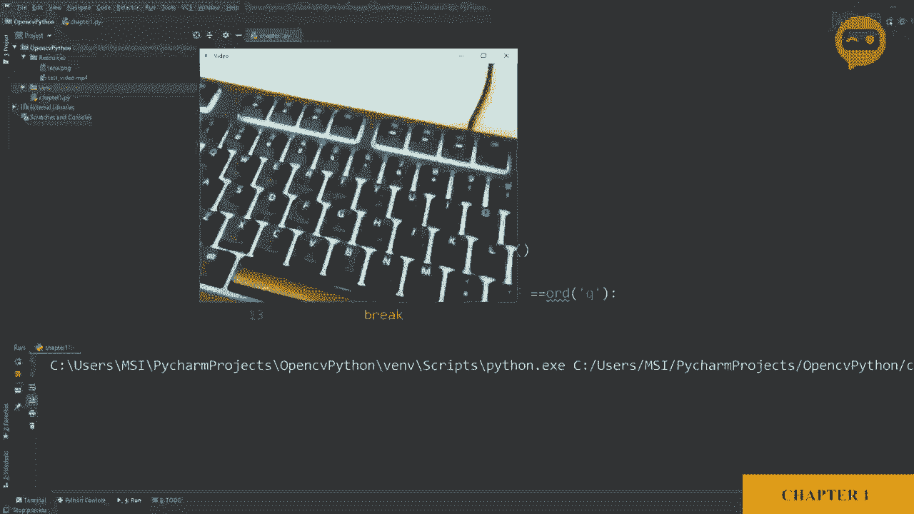

# 【双语字幕+资料下载】OpenCV 基础教程，安装、原理、实战， 3小时带你搞定这个热门计算机视觉工具库！＜实战教程系列＞ - P4：第1章：图像视频摄像头数据读取 - ShowMeAI - BV1zL411377L

。So the first thing we will learn is how to read images， videos and webcam。

So in order to read images， we have a function by the name I am read。

So let's start by declaring the variable in which we will store the image， so we will call it IMg。

And then we are going to。Use our package， which is CVv2。

 and then inside that package we have the function I am read。Now， this means we are reading an image。

 Now， all we have to do is mention the path where this image is present。

So I have created a resources folder in which we have the image Lina。pNG。So， we are going to。

Define the path of this。So it is in the resources and then it is Lena。pNg。

So this imports our image from our resources folder， but now we need to display it。

 so to display we have the function known as IM show， so we will use our package CB2。

im show and in IM show we have to define two arguments。The first one is the name of the window。

 so we can say our output。And then we have to define which image do we want to display。

 so we will say IMG。So let's run this。Now the image did appear， but it went out immediatelyly。

 so in order to add a delay so that we can see we will write CVv2。

 weight key and then we will add the delay if we put0 it means infinite delay。But if we add a value。

 it means。That many milliseconds， so for example， 1000 will mean one second。So for now。

 we will put zero and run。So here is our output image。

So next we are going to learn how to import a video。

So we have a video in the resources folder by the name test video， so let's import that。

So we are going to remove what we had before。 So now we are going to create a video capture object。

 So let's call it cap。C， V2。Dot。Video capture。So now in this video capture， again。

 we just have to define the path where our video is。So we will type in resources。And then。

 we will say。We will mention the name of the video， so which is test。Underscore video dot M4。

So this will import our video， but now we need to display it and as you know video is just a sequence of images。

 so we will need a wide loop to actually go through each frame one by one。

So we will add a white loop。喂。Zhu。Now we will capture our image。

So all this will do is it will save our image in this variable and then it will tell us whether it was done successfully or not。

So this variable will be a booleion， which is true or false。Next， we are going to show this result。

So we will use the IM show function as before， and then we will type in our video， for example。

And then we will say I G。Now we are going to add something that will add the delay and wait for the。

Keyboard Q press if we want to break out of the loop。

So you do not need to go into the detail of how this works。

 all you need to know is that this adds a delay and it looks for the word the key pressQ in order to break the loop。

So let's run this and see what happens。So here we can see our video。 Now， the video is quite short。

 so it played and it turned off。 So here you can see。 And if we press cu， it will。Close。

So that's great。 Now we have successfully imported a video。Next。

 we are going to learn how to use a webcam。Now using a webcam is very similar to importing a video。

 so instead of the file path we are just going to write the ID of our camera so if you just have one webcam or you have a laptop connected so you can press zero and this will use the default webcam if you have more than one you can add the ID as you go along so here we will create this webcam object。

And then we will define some parameters for it。So we want it to be of a specific size。

So we will define the width， which is the ID number 3 as 640。And then we will define the height。

 which is IDd number 4。As。4，80。Now， the rest of the code pretty much remains the same。

So let's run this and see what happens。So here you can see the live feed from my webcam。

So as you can see， the brightness is not very pleasant。

 so what we can do is we can change the brightness from the settings and the ID for that is 10。

So we can write， for example， 100。So now you can see the brightness。Is much more pleasant。

