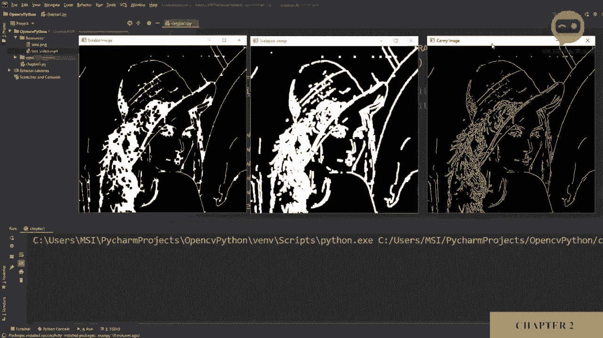
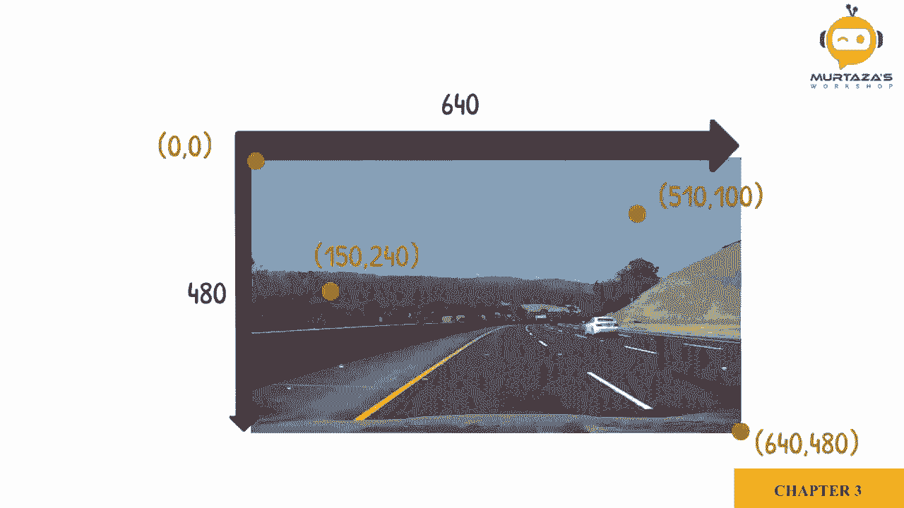

# 【双语字幕+资料下载】OpenCV 基础教程，安装、原理、实战， 3小时带你搞定这个热门计算机视觉工具库！＜实战教程系列＞ - P6：第3章：图像缩放与截取 - ShowMeAI - BV1zL411377L

Let's have a look at the Open TV convention。

In mathematics， while plotting a graph， the positive side of the X axis is towards east。

 and the positive side of the Y axis is towards the north。In open C， the X axis is the same。

 but the positive Y axis is towards the south To understand it further， let's look at an image。

Given that this image is 640 by 480， the origin of the image would be at this point。

Whereas the maximum width and height would be at this point。Looking at a few more points。

 we can further understand the convention。

First we are going to learn how to resize an image now to resize the image we need to know the current size of our image。

 so here we have a simple example where we are importing the library and then we are importing a image by the name Lamo which is shot for Lamborghini and we are just displaying it so let's look at our image。

So this is our image。Now to find the size of our image， we are going to write print。

And then we will check the shape of our image， so It dot shape。So if we run this again。

It gives us 462 by 623 by3 Now this first 462 is the height， 623 is the width。

3 is the number for your channels， which is BGR。Now， in order to resize。

 we are going to use the resize function。So we will write。IM G。Resize is equals to C2 dots res。

And here we are going to write which image we want to resize， which is our main image。

 and then we need to define the width and the height of our resize。

 so here we have to define the width first and then the height so the width let's say we want to make it。

So currently we have 623。Let's make it 300。And we can make the height as 200。

So let's show this image。So here is our original image and here is the image that we have resized。

So as you can see， we have successfully resized the number of pixels。

 so if you want to check the shape again， you can write print and instead of image we can write image resize。

So if you print that again， you can see the original image is the one above and the resized image is the one below。

So the same way you can actually increase the number of pixels as well。

 but of course it will not increase the quality， but it can increase the number of pixels。

 so for example，1000 by 500。So here we have a stretched out image。So yeah， so you can do that too。

So next we are going to learn how to crop an image and cropping can be very useful when you want specific parts of an image。

Now image itself is just a matrix or an array of pixels。

 so what we can do is we can delete in terms of an array or a matrix。What we can do is we can write。

Image， corrupt。Is equals to。Image， so this is our main image that we want to crop。

 but now we don't need an open CV function。 We can just use the matrix functionality so we can say we can define the starting point and the ending point for both our width and height。

So for example， now this is a little bit tricky because the height comes first and then the width above in the open CV function。

 the width came first and then the height， so here we have the height first and then the width。😊。

So we want to define how much height do we want to maintain so let's say we want so this is our maximum height 462 so let's say we are going to keep it from 0 to 000 to 200 so 0 till 200。

And then the width we are going to keep， let's say， for example， from 200 to 500。So，200 to 500。

So we are going to display this now。So let's run it。😔，And there you have it。

 So this is your cropped image so we can hide our。Rerecied image。And there you go。

 this is your cropped image coming directly from your main image， so if we can just put it back。

 it will go somewhere here， yes。So what we have done is if you can。Yeah， if we can do it like this。

 we can see better the numbers so the height we cropped from 0 to 200。

 so this is your starting point0 and till here is 200 so this area till here is 200。

And then the width is from 200， so we started from this point， 200， and we went till 500。

 which is this point。So this is how you can crop an image。

