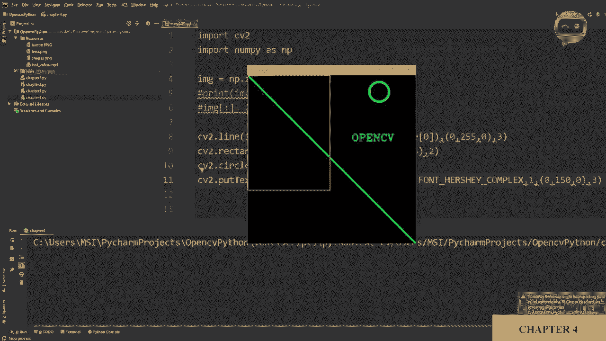

# 【双语字幕+资料下载】OpenCV 基础教程，安装、原理、实战， 3小时带你搞定这个热门计算机视觉工具库！＜实战教程系列＞ - P7：第4章：形状与文本 - ShowMeAI - BV1zL411377L

So now we are going to learn how to draw shapes on images， we will learn how to draw lines。

 rectangle， circles， and we will also learn how to put text on images。

So first we will create a matrix filled with zeros now zero means black。

 so we will use the Ny library to actually create our matrix。So we will write image。

Is equals to NP dot zeros。Now， inside that， we will define the size of our。Mattrix。

 which will be 512 by 512。 and then we will just display our image。 So let's write it down here。

Cv2 dot I am show。 And then we have the window， which is image and then the image itself。

So if we run this。😔，And there you go， so this is our block image。Now， this is。

A gray scale image because it has only 512 by 512 pixels or boxes。

 so we can confirm that by printing this out and we can write image dot shape。

 this is how you check the dimensionality of an image。Or a matrix。

 So this is 512 by 512 as we have mentioned here。 But now if we wanted to add the the color functionality。

 we have to give it three channels。 So we will write that this is 512。 or this is 512 by 512 by 3。

This gives us the values from0 to255。Now next we are going to look at how we can color this image。

 so if we wanted to color the complete image， we will just write IG。

 we will say that we want to do it for the whole image and then we will define the color so for example I want it to be blue so I will write 255。

255 and 0 and0 so if we run this now you will see the whole image becomes blue。Now。

 what does this colon in the middle means？So if you remember from the previous chapter when we did cropping。

 we used the limits of width and height。 So this is the same the same concept。 So for example。

 if I write here 200。And 300。Then I will write another range。

 The first range is the height and the second range is the width。 So let's say I write here 100。To。

300。So if I run this now， you will see the colored part is only the range that we have defined here。

So if we wanted to color the whole image， we will just write a column this means that it is for the whole image itself or the whole matrix。

Now moving on， we will learn how to create， let's just put this back to black。🤢。

And let's just comment this out as well。 Now， we will learn how to create lines。 So for line。

 we have the Cv2 dot line function。 So Cv2 dot line。

And then we have to define which image are we talking about。 So we we will say IMG。

 which is our image。 Then we have to define the starting point and the ending point of the line。

 So the starting point， let's say we will put 00。And the ending point。

 let's say we will put 30 and 300。Then we need to define the color， so we will say0， then 255。

 and let's say 255。 this will give us green。And then we can define the thickness。

 it is not important， but you can define the thickness， so let's say we'll put it as three。

So let's run that。😔，And there you go， so our image is now green， sorry。

 our image has now a green line。And it starts from 00 and it goes up to 300， 300。 Now。

 if you wanted to bring it till the end， we what we can do is we can write the width and height instead of giving it a number。

So we know that image width and height we can get from the shape now the shape matrix has three elements。

 the height， the width and the channels， so the first one is0 which is the height so in this annotation we have to define the width first so we will write here one and then we will write here image dot shape。

And then we will write here 0。 So this is the height。This is the height and this is the width。

So if we're run that， we should get。A diagonal line going all the way。Okay that's great。

 So next we will move on to rectangle， so we will write cv2 dot rectangle and it follows the same convention so you have to write the image and then you have to define the points。

 let's say0，0 and then we have to define the ending points。So that would be the corner point。

 the diagonal point and let's say that is。To 50 by。3，50。Okay， and then we will。Add the color。

 So let's change the color this time。 So we will put 0，0 and 2，5，5。

And then we have to define the thickness。 So thickness， let's say two。

So let's run this and there you have your rectangle。Now the thickness you can increase。

 but what if you wanted to fill this area？So you can't just keep increasing the thickness until it gets you know。

 in the middle， well you can do that， but it's not a good idea。

 but C2 actually has a function for that so you you can write CVv2 dot filled。

And you have to write it in capital letters， so you can use that to actually fill your rectangle。

So next we will move on to little， let's put it back first。 Next， we will move on to circles。

 So we will write C2 dot circle， and then we will write our image。

We have to define the center point of this the circle。 So let's say。450。

Then we have to define the radius， let's say 30， and then we need to define the color。Color。

 we can put 2，5，5，2，5，5。 I think it will be a shade of blue。 and let's put。Thickness as 5。Let's see。

 here you go。 Okay， so now you have the circle。And you can see our center point is 450。

 which means we start from here till here， 400 and from here till here is 50。

And we have the light blue color okay。So next we are going to learn how to put text on images。

 so we have the function called Cv2。t put text。And we will write again like before we will write our image。

 and then we have to define what text do you want to show。So we can display here， for example， open。

CV。Should't be saying。Open TV， and then we will write。The origin where we will start it。

So let's say we want to start it。At 300， and。Hundred。Okay， and then。

Now this one is a little bit different than before we have to define the font of our text。

 so CV2 already has a few fonts in its library， but there's not a lot of them。

 but we have a few so you can write cv2。 font。C we2 dot。Fons， and then a bunch of fonts will show up。

 We don't need anything fancy。 So we will just select the first one。And then we have our scale。Then。

 we have our color。Let's put it 1，50 and then 0。 And then we have our。Tickness。

So let's run this and see how it looks like， So there you go we have it in green written open CVv。

So let's， let's put it down a little bit。 so we will put it down， let's say， 200。Yeah。

 so let me show you what thickness and scale does to。The text。 So if I increase it to2。

Now you will see it's much bigger， in fact it's going out of the image itself。

So let's put it back to one， by the way， you can put it at point decimal places as well。

 so you can write 0。5。And it will。It will become really small。

And then you can define the thickness as well。So for example， we'll put this as one。

And here you can see the difference。

