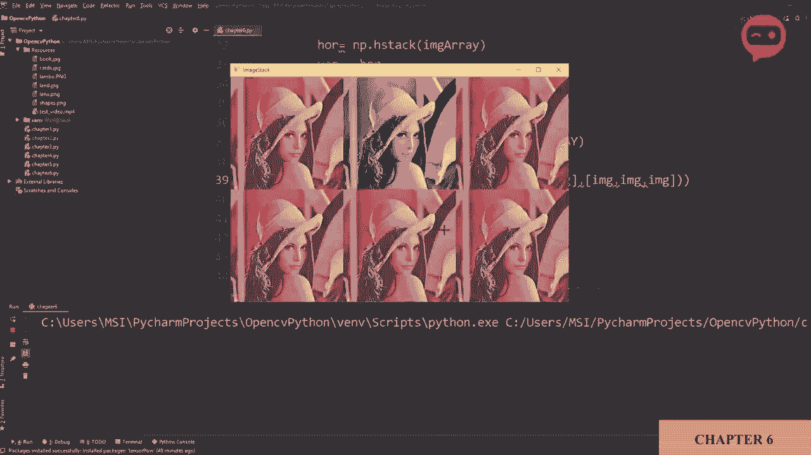

# 【双语字幕+资料下载】OpenCV 基础教程，安装、原理、实战， 3小时带你搞定这个热门计算机视觉工具库！＜实战教程系列＞ - P9：第6章：图像拼接 - ShowMeAI - BV1zL411377L

。So now we are going to learn how to join images together now this can be useful if you have a lot of images and you are running it again and again。

So it's hard to manage all these windows together， so we will put all the images together in one window。

So let's see how we can do that so we have a image here by the name Lina in the resources folder and。

We are going to stack it with itself， so first we are going to use the horizontal stack function。

So horizontal here， we will say Nmpy dot Now these are Ny functions， not open CV functions。

 so we will use Numpy horizontal stack。And we will write our image first， the first image is image。

 and then image again。So let's display this I am show。So let's display this Cv2。 im show。

Our window name is horizontal。And we will write our image。Actually， it's better to write I G。😔。

Horizontal， and then。IMT。Horizontト。So let's run that。😔，And there you go。

 So now we have the image stacked together with itself in the horizontal direction。

 Now let's do the vertical。So image vertical is equals to NP dot for vertical stack。

And then we will define image and image。So we will copy this。Paste it down， image vertical。

And we will call this vert。Okay， so now we have two images。

 one horizontally stacked and one vertically stacked。Now there are few issues with this method。

 one we cannot resize the image， it will come as it is。

 so if I wanted to stack two more images on the right hand side。

 it will take up the whole space or it might go out of the frame。

So the other issue is that if the images do not have the same number of channels。

 which means they are not RGB， both of them or maybe one of them is gray， one of them is RGB。

 then it will not work so both of them have to have the same number of channels because we are talking about matrices。

So what is the solution for that so for that I have created a small function that can be called and it can handle all these things。

 so all you need to know is how to call that function。So let's look at that function。

 I will copy that here。So， I will。Just。Comment this out。 and at the top， I will add the function。

So here we have our function。Let's bring this down。

So you do not need to worry about all the details of this function。

You just need to know that it stacks images together， how to use it， this is what you need to know。

 so let me explain how it works So what you need to do is you need to create an image stacks。

 for example， you can say image。Stack is equals2。 Now you will call the function。

Stack images and then as it mentions you have to mention the scale so you can scale all the images down and you can scale them up as well。

 so let's say we will put 0。5 as the scale and then you need to define the matrices of the images。

So let's say I have image， image and。Image。So this will give us a horizontal stack we need to display it。

 so let's copy that。😔，And we will right here。Iage stack。And we will write here， image。なか。

So there you go。 So now it's scaled down and we have three images together。

 So now if we wanted to add the vertical stack， we will just add a comma and then we can add another row。

But again， if if you have three columns in the first row。

 then you have to have three columns in the second， so it's quite intuitive anyway。

 so here you can see you have。Easily， you can stack all the images together and even if it's one of the images is not the same channels。

 you can still stack them together， so let me demonstrate that image gray is equals to C2 dot。

CBT color， and then we can put our image and C2 dot color， BGR2 gray， and we can put。

 let's say in the middle here。The gray image， so let's run that。And there you go。

 so you have a gray image stacked with the other。

Colored images。