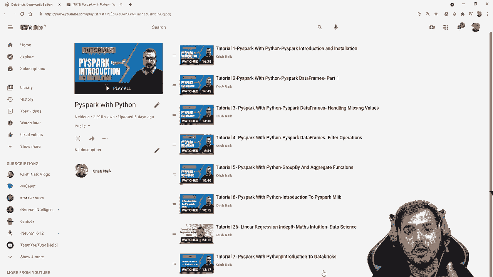
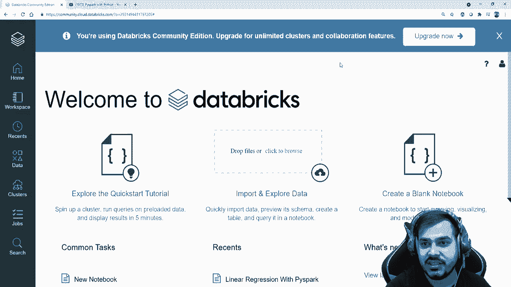
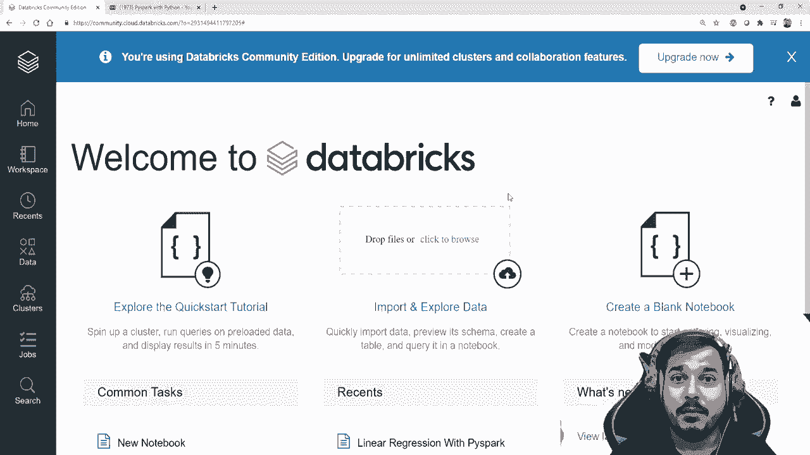
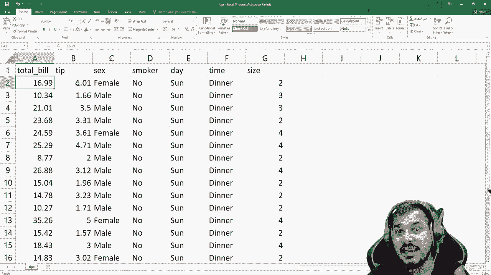
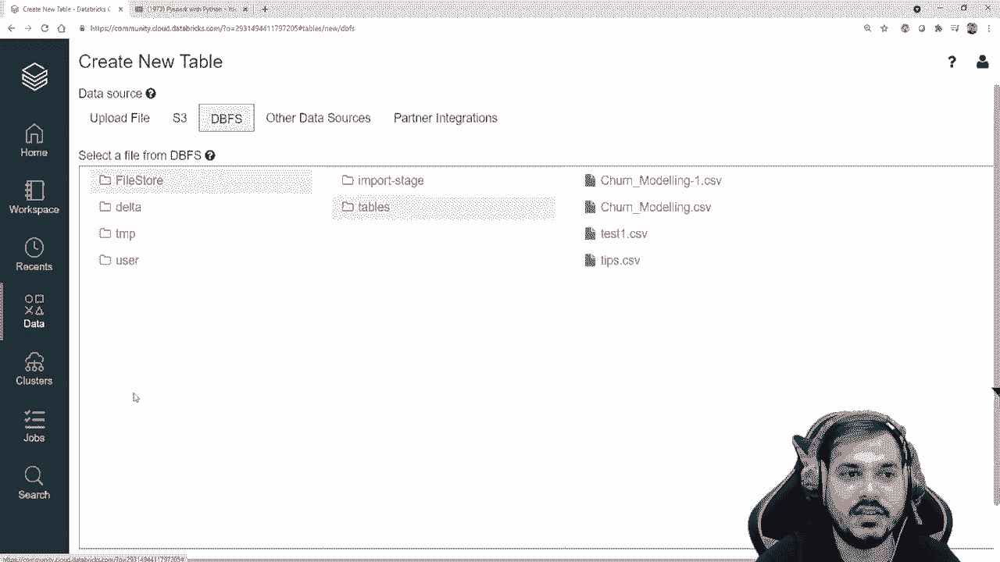
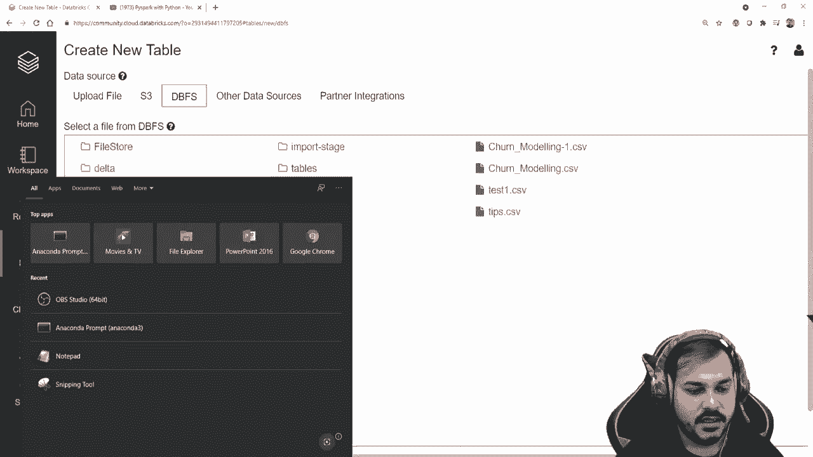
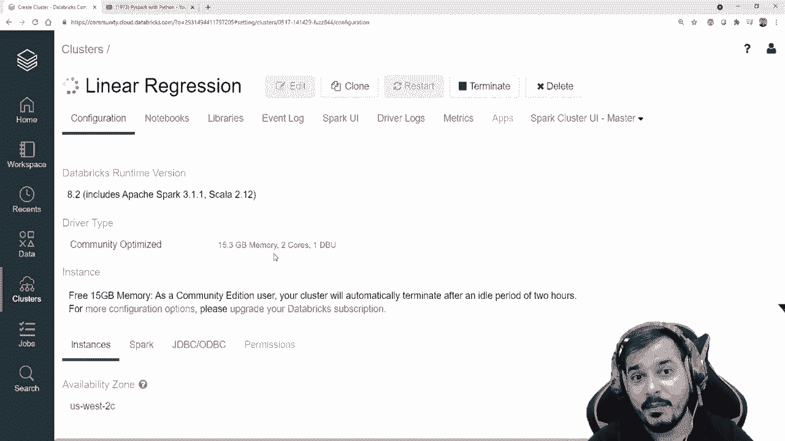

# 【双语字幕+资料下载】PySpark 大数据处理入门，带你玩转Python+Spark大数据操作与分析！＜实战教程系列＞ - P8：L8- Databricks 中的 Pyspark 多元线性回归实现 - ShowMeAI - BV1sL4y147dP

。

Hello all my name is Krisnak and welcome to my YouTube channel so guys we will continue the Pi Park tutorials and today in this particular video we are going to go towards tutorial 8 where we are going to implement linear regression with the help of Pipar。

😊，Now this is the entire playlist which I've actually created over here I have also put up a video on linear regression theoretical understanding Now in the tutorial aid we'll take a problem statement and then we'll try to solve it probably a regression problem statement。

 The first algorithm that we are going to discuss is the linear regression algorithm and we'll try to solve a problems and this linear regression is a multilinear regression problem statement and we'll do this in databs Now Ive already given you the introduction of databs in the large class I hope you have made your account and I hope you have started using it if you don't know how to make an account please watch a tutorial 7 the entire playlist link will be given in the description。

😊。

Now this is my Datas community account。 remember in the community version we can only create one cluster。

 I'll also be showing you in the upgraded versions probably in the future I'll be buying it and I'll try to show you how you can also create multiple clusters unlimited clusters but for that you also need to use some clouds like AWs or Azure Now first of all。

 what data I'm going to use。 So this is the entire data that I'm going to use guys this data is called as tips data。

 So that basically means people who are actually going to the restaurant。

 what tip they have actually given based on the total bill or I can also go and solve this particular problem based on all this particular parameters。

 what should what probably is the total bill that the person is going to pay so this is the problem statement that I'm going to solve Now here you can see this is a multiline regression problem statement here you have many。

 many features right So let's proceed Now first of all。

 what I'm going to do I'm just going to click to the browse and I'm going to upload this particular data now。

😊。

To upload this particular data set， I have this particular data set in my path。

 So probably I'll also be giving you this particular data set， so don't worry about it。

 Let me just quickly just a second。 Let me just upload the data set over here okay。

Ppar okay so here you can see that。 This is my dataset， which I'm actually uploading tips。

 So let me open it right now here you'll be able to see that your tips data will get uploaded you know。

 in this Dfs directly。 So here you'll be having something like file stores slash tables。 Okay。

 now what you can actually do now let's go and click on this Dvfs and here you can see on file stores Probably you can also click on tables。

 Here you have this tips dot csv。 I've also uploaded is all datas in my previous videos。

 Probably I was just using this。 Okay but here I'm just focusing on tips do csv Now what I'm going to do over here。

 Let's go and do the first step。 remember the first step in data breaks is that we need to create the clusters okay。

😊。

Create a cluster right now， by default in the community version。

 Datas actually helps you to create a cluster。 just one single cluster。 Okay。

 but if you are using the paid version， the upgraded version。

 it will actually help you to create multiple clusters If you have the excess of AWS cloud。

 So I'm just going to click on the cluster。 let me create a new cluster。

 So I'll say this is my linear regression cluster， okay。😊，And then I'm going to use this runtime 8。

2 scalar。 this this is there。 I'm just going to click the cluster and remaining all things will be almost same in this cluster in this instance。

 you'll be getting 15 Gb memory and all the other information here， you can check it out。

 you can also be getting two course and one I debutbu。 Okay。

 so which I have actually already discussed my previous。 So I'll go and click on cluster。

 this will take some time。 And remember guys， if you really want to use any kind of libraries just click over here。

😊。

Install those libraries which you want like suppose if you want to use seaborn you want to use scarers you want to use Tentensorflow So here you can basically type their along with the versions and youll be able to install it okay but right now I don't require any libraries Im just going to use spice plug that is my menu so guys click on the clusters over here and here you can see that probably after a minute this particular cluster is actually created Okay now again go to the home。

What you can do is you can create a blank notebook I've already created one notebook so that I have the basic code written so I'm just going to open this and let's start this particular process now first of all。

 I have something called as file location I know my file location is basically tips do csv the file type is csv and then I'm just using spark do3 dot csv file location header is going to true in schemeche is equal to2 and let me just write Df dot show this will actually help me to check the entire data okay so I'm just going to execute it in front of you and let's make it line by line I'll try to write down all the all the codes it will definitely be helpful for you to understand so please make sure that you also type along with me to understand the code much more better okay so here now I'm going to execute this now here you will be able to see my my clusters will start running okay and then you can see waiting to run running the command probably we will be able to see it。

I'll just zoom out a little bit so that you'll be able to see properly。And again， guys。

 for the first time， if you are starting this particular cluster， it will take time。 Okay。

 so spark job it is running and now you'll be able to see my data set。😊，That is my tips data set。

 which is uploaded in this specific file location。 So this is my entire data set total bill tip sex smoker day time size perfect now lets go to the next step what I'm going to do I'm just going to write Df dot print schema。

So I can also use tab， you know， itll be able to load this entire thing。

 So now here you can see that this is my entire features total bill tip sex smoker day time So here is all your features like double double sex is string smoker is string day string time is string antigen now remember you may be thinking Kris why I am actually doing this in databs to just make you understand how this will basically run in the cluster right now I just have one single cluster guys。

 that basically means and the maximum Ram in this particular cluster somewhere around around 15 gb but just understand if you're working with 100 g of data and what happens this kind of processing will get a split in multiple clusters right so in this way you'll be able to work with big data also in the upcoming things right now this is all I think guys right now let's go and try to understand over here which is my independent feature my independent feature is my tips feature sex smoker day time and size and my dependent feature is basically total bill。

So based on all these particular features， I need to create a linear regression algorithm which will be able to predict a total bill。

 So let's go ahead now over here I'm just going to write Df dot columns。

 So if I want to check my columns this is my columns over here so I can see this is my exact columns this many columns I actually have Now one thing about this particular feature over here guys you have columns like sex smoker day time right this all are categorical features right and probably you know this categor features needs to be converted into some numerical values then only my machine learning algorithm will get will be able to understand it So let's see how to handle categor features So here I'm just going to write a comment。

😊，Okay。Hanling。Categryical features， right。Now I'll try to show you how to handle this kind of category features Now。

 one way in Pispar and obviously we know in normal e scale and you know。

 we we try to use one hot encoding， we try to use ordinary encoding we try to use different kind of encodings in this。

 and similarly we can use that same encoding over here also with the help of Pipar So for this particular process we have something called a string indexer So I'm just going to say from Pispar you know from Pispar dot ml dot feature。

😊，Okay。I' am going to import something calledash string indexer。

So I will be using this string indexer。 This string indexer will actually help us to， you know。

 basically convert string category features into some numerical features。

 numerical features basically is ordial encoding。 Like suppose if I have gender like male or female itll be shown as zeros and ones。

 And over here you will be seeing guys， most of the categories over here oral encoding。

 Now you may be thinking one hot encoding what is the process that I'll try to show you in the upcoming videos with different different machine learning algorithm。

 The reason why I' am making it， because it is better to learn one thing at a time， right。

 so I'll try to show all those kind of examples。 Also now let's proceed and try to see that how we can convert this category features like sex smoker day and time。

 Probably time is also category features See over here。 So if I see this all features over here。

 let me do one thing。 Okay， let me just write D dot show。😊，So this is my entire features。Quickly。

 if I go and see， this is time is also a categor feature。 So quickly。

 let's go ahead and try to see how we can basically use this。 Let me delete this thing also。

 or let me just write it one second。 So I have actually， you know。

 imported this library called a string indexer。 Now what I'm going to do over here is that let me write an indexer object saying as this。

 and I'll write string indexer。😊，And here， first of all。

 I really need to provide which all are category features。 Now， remember in this string indexer。

 if I go and press shift tab， probably over here here you'll be able to see I have to give input columns。

😊，So let me rush here I have to give input columns and I have to give output columns。

 I also have options of providing input columns as multiple columns and the output columns as multiple columns。

 So let me try both the thing。 Okay， so over here first of all， let me try with input columns。

 So here in the input columns I will provide my first value Now suppose I want to really convert the sex column into。

😊，Into my category feature。 So here Ill write output column Okay。

 and here Ill say sex underscore indexed。Now， here what we are actually doing guys。

 here I'm actually giving my sex column， and this sex column will be converted into an oral encoding with the help of the string indexer。

 Okay， now in the next step， what I'll do， I'll just write Df。 Okay。

 probably I'll just use Df or what I can do。 I can I can just create another probably I can create another data frame So I'll write Df underscore the score R probably see because I don't want to change that Df and again run that particular code now I'll say indexer。

😊，Dot fit。 Okay， so I can definitely use fit， and then I can use transform。So here also。

 it is almost same like that。 only guys fit underscore transform。

 And here also I' am going to use Df Okay， and then if I go and see Df dot Df underscore R dot show here now you'll be able to see that this sex column one more sex underscore index column will be created and it will have the oral encoded values in this particular column。

 So let's go and see this So once I execute。😊，Perfect， I think it is running。

 Probably it will take time。 Now here you can see that Im having one more column。

 which is called a sex underscore the index。 wherever the female value is there， the value is one。

 wherever the male value is there， the value is 0， right。

 so we have handled this particular column and we have basically converted this category feature into the or encoding。

 Now still， we have many feature。 So what I'm going to do， I'm just going to use this indexer again。

 Okay， I probably I'm just going to write over here。 now multiple columns I will specify。

 So first column， I've already changed it。 So I'm going to change this into something else。 sex。

 instead of sex， it will become smoker。😊，Okay， smoke good。But I showed you guys。

 instead of writing input columns， now， I have to write input columns， right。

 So in this multiple columns when I'm giving。 So this is smoker。

 Then I have one more feature if I see they。Day and time。 day and time is more two features。

 So I'm going to write over here day underscore。 So guys， now how I've written smoker day and time。

 Similarlyly， I will be writing three more columns over here。

 So the first column should be because I'm going to create the oral encoding and I probably create a new column over here。

 So this will be my smoker underscore indexed I'll close the braces over here。

 my second feature will basically be day underscore index right and my third feature will probably be time underscore index。

 So here I'm go going to create three more features and then I'm giving index dot fit Df underscore R okay。

 because now I have my new data frame and then I'm going to say Df underscore dot show Now once I execute it guys。

 I hope it should not give us an error Okay， it is saying that invalid Para value given for Para output columns could not convert class So I have to make this as output。

lums so that was the issue right so now you'll be able to see that it's executing perfectly fine。

 Now here you have all the features available。 sex underscore index smoker underscore index day underscore index and time underscore index and all you can see over here is or encodings like 0。

12 right and we have now converted this all string values into this kind of all category values that are available in this feature into numerical values。

 now my model will definitely be able to understand。 Okay， now we have done this guys。

 Now let's proceed what is the next step that we basically do that we are going to discuss now the now the steps are pretty much easy because we have already created this specific data set。

 Now what we have to do is that there is something called as vector asler Now always remember guys in Pipar you know whenever we have all this particular feature we need to group all the independent features together and the dependent feature separately。

 Okay， so guys， well write from from Pipar。😊，Dot。Ml dot feature。

 I'm going to import something called as vector asmbler right so I'm just going to use this vector asmbler。

 This will actually help us to group independent features together and a dependent feature separately。

 So let me just go ahead and write vector asmbler and then I'm going to initialize this the first parameter I have to provide is basically my input columns here my input columns what all input columns I have let me just see before this let me quickly do one thing is that let me make a cell。

😊，Okay， move a cell up， create a cell or let me just remove this and probably just let me write you know。

 Df underscore R dot columns。Okay， so how many number of columns we have。

 So I have all my information with respect to the column。 So my input column over here。

 the first thing that I am definitely going to provide is my tip column because tip is required。

 tip is the first independent feature。 and it is a numerical feature。

 then I have something like sex underscoreco indexed。

 Okay so I'm just going to copy this paste it over here。 and this is my another input feature。

 And remember， guys， we really need to follow the order。

 So now my third feature is basically smoke index。 And before this also I can also specify size okay。

So I will be specifying size， size， sex index， smoker index， Okay。

 and then probably I'll also create day index。Okay， the index comma。I'm just going to use time index。

Okay so this is these are all my independent features and with respect to this now remember this will be grouped together and I also have to say that if this is grouped together let's create a new feature and entire and name this entire group okay so here I'm just going to say output column is equal to and here I'm just going to specify this are my independent feature so I'm going to name this entire thing as my independent feature pretty much simple now let me do one more thing let me create a variable called as feature asmbler so that will be able to transform this values so feature asmbler is equal to vector asmbler and here I have to provide my input columns and output columns pretty much simple pretty much easy now the next step that I'm going to do is that right output is equal to I'm just going to say dot transform because I really need to transform and this needs to be transform from my D underscore art okay so let me just executed now now here。

😊，It has got executed here you can see the entire output all these things I created these are my independent features now in the independent and why we need to create this independent features that is a that is the specification that is given in Pipar always remember we need to create a group of features and probably a list all these independent features will be done together Now if I go and see my output dot show。

😊，Here now youll be able to see I will be able to see one more feature which has this or let me just write output dot select because probably all the features have been grouped together and it is very difficult to see all the features in just one screen I'm just going to take this independent features and just click on dot show Now once I do this。

😊，Here， you will be able to see。All these particular features are there。

 remember this needs to be shown in the same order。 The first feature is tip。

 then size sex underscore index smoker underscore index day underscore index time underscore index。

 So this are my independent feature Now I just have one feature and over here you'll be able to see that it is just having a list of all the features like this and this is the first major step to create okay now let's go to the next one Now I know what is my output now what I'm going to do is that out of this entire output if I go and see my output。

😊，Output dot show here you will be able to see all the features are available right in output dot show。

 So here you'll be able to see all the features are available。 Now， you know。

 which is your output feature， right， So this is my dependent feature and this independent features are my independent feature。

 So what I'm going to do。 now I'm just going to select output。

 or I'll say this is basically my finalized data and I'm just going to pick up two columns that is output dot select。

😊，And inside this， I'm just going to give my two features。

 which I am going to say one is independent features。Okay， independent。Features。

 I hope that name is right。 Otherwise， I'll just confirm it once again， so。Let me click it over here。

Independent features and one is total underscoreosscoable， perfect comma。Total。Undercope Bill， okay。

 now if I just go and execute this now I'm just picking up two features right from this。 Now。

 if I go and find out finalize data dot show， now I'll be able to see two important features。

 That is independent features and total bill。 Remember， this is all my independent features。

 and this is my dependent feature。😊，This is very much simple till here if it is done， guys。

 the next step is basically I'm just going to copy and paste some code。

 I'm just going to apply the linear regression。 So first of all， from Pipar do ml dot regression。

 I'm going to import the linear regression。 and then I'm going to take this entire finalized data and then do a random split of 75 and 25% and then in my linear regression。

 I'm just going to provide my independent features as my feature column This is two parameters is to be given in linear regression。

 one is feature column here I'll be providing independent features。

 the second one is basically total bill， which is my dependent feature。

 And now I will just do a fit on train data。 So once I do it， my regressionor model will get created。

 And probably this will take time Now here you can see all the information。

 amazing information you are getting with respect to train and test and remember guys。

 whatever group we have made this independent feature， this is in the format of UDt okay。😊。

You can see the full form of Uity。 that is not a big problem at all。 Okay， now I have my regressor。

So what I'm going to do， I'm just going to say regressor dot coefficient since this is a multiple linear regression。

 So I'm just going to use regressionor dot coefficient。

 And these are all my parameters or different different coefficients。

 because I have around  six parameters。 So this are all the six different different coefficients。

 Always remember in a linear regression， you will be having coefficient based on the number of features。

 and you will also be having。😊，Intercept。 So here I'm just going to say intercept。Okay。

 so this is basically my intercept that is 0。923 Okay， so here you have both the information。

 Now it is the time that will try to evaluate。Evaluate the test data。

 So here I'm just going to say attached。 and this is basically my predictions， right。

 So here let me write it as something like this。So， predictions。Okay。Prediction。

 and what I'm going to do， I'm just going to write bread， underscore results。

Reult is equal to this one， and this will basically by be my results， okay。testest is not defined。

 Why test is not defined because this should be test data。 I'm actually sorry， okay。But it's okay。

 you will be able to get so small small errors。 Okay， now if I really want to see my pre results。

 just go and see bread dot predictions。 There will be something like predictions dot show， okay。😊。

If you write like this， here you will be able to get the entire prediction， okay。

So remember in this prediction， this is your independent feature。 This is your total bill。

 This is your actual value， and this is a prediction value。 actual value， prediction value。

 actual value and prediction value here， you can actually compare how good it is。 you know。

 by just seeing your total bill and the prediction value。 Pre much good。 pretty much amazing。

 You are able to see the data。 I'm just going to write my final comparison。 Okay。

 final comparison perfect。 I'm very much good at it， you can see it。

 let's see some of the other information like what are information。

 we can basically check it out from this。 we can we have lot of things probably you want to check out the R square。

 So what you can write， you can basically write a regression dot。

 if I press tab this coefficient intercept。 then you have lost。

 then there is also something called R square。 if I go and execute this。

 This is basically my R square or let me just write it。😊，I think prediction。Pre predictions。

I don't think so r square is where lets see whether we will be able to see the r square value or not。

Just to thick in。 I'm just checking out the documentation page。哦。O。Oh， sorry。

 I don't have to use regressor over here。 So here I will be using prediction dot results and let me compute the R square。

 So this is my R square。 Similarlyly， you can also check out prediction results dot mean absolute error。

 So you have mean absolute error。 You also have prediction underscore result dot mean。Square error。

 So all these three values。 you can definitely check it out。 So here is your mean absolute error。

 Here is your mean square error。 So these are my performance metrics that I can definitely have in。

And whenever you guys， whenever you face any kind of problem。

 just make sure that you check the documentation in Apache spark and documentation。Now， in this way。

 you can definitely do this entire problem statement。 Now I'll give you one assignment。

 Just try to Google it and try to see how you can save this particular file。

 probably in a pickle format or probably in a temporary model pickle file。 you know it's very。

 very simple。 You just have to use the regression dot save but try to have a look and try to see that how you can save this particular pickle file。

 Now this was all about this particular video。 I hope you like this Now just try to solve with any other problem statement。

 try to do this in the upcoming videos。 I'll also try to show how you can do one hot encoding and probably you'll be able to learn that too So I hope you like this particular video。

 please subscribe the channel if you're not subscribe as the next week。 I have a great day。

 Thank you and all bye bye。😊。

