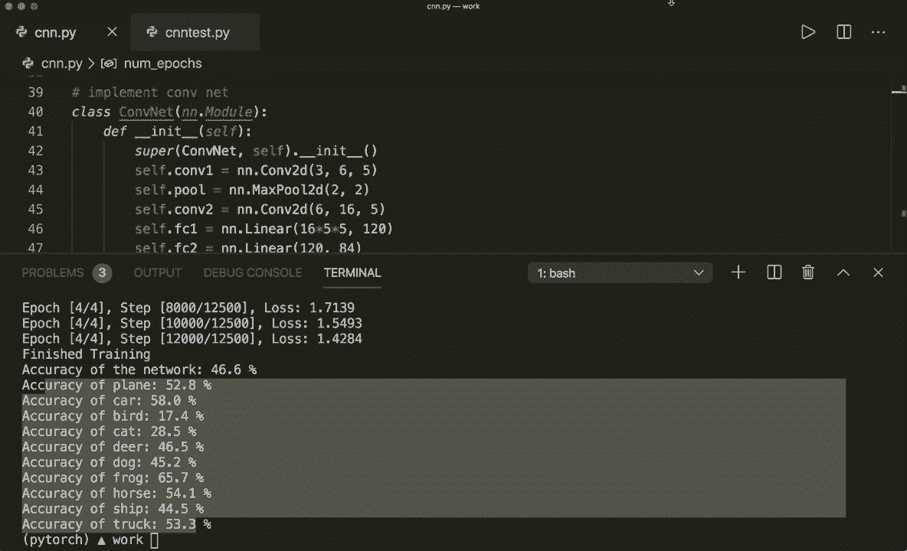

# 【双语字幕+资料下载】PyTorch 极简实战教程！全程代码讲解，在实践中掌握深度学习&搭建全pipeline！＜实战教程系列＞ - P14：L14- 卷积神经网络 (CNN) - ShowMeAI - BV12m4y1S7ix

Hi， everybody。 Welcome to a new Pytorch tutorial。 Today。

 we are implementing a convolutional neural network and do image classification based on the Cypher 10 dataset set。

 The Cypher 10 is a very popular image data set with 10 different classes。 Like we have airplanes。

 cars， birds， cats and other classes。 and this data set is available directly in Pytors。

 So we will create a convolutional neural net that can classify these images。

 So now let's talk about convolutional neural networks very briefly。

 I will not go into too much detail now， because this tutorial should be focused on the Pytorch implementation。

 but I will provide further links in the description if you want to learn more in detail。😊。

So convolutional neural nets or confnets are similar to ordinary neural networks。

 They are made up of neurons that have learnable weights and biases。

 And the main difference now is that convolutional nets mainly work on image data and apply the so called convolutional filters。

 So a typical conf architecture looks like this。So we have our image。

 and then we have different convolutional layers and optional activationation functions followed by socalled pooling layers。

 And these layers are used to automatically learn some features from the images。 and then at the end。

 we have a one or more fully connected layers for the actual classification task。 So yeah。

 this is a typical architecture of a CNN。And these convolutional filters。Now。

 they work by applying a filter kernel to our image。

 So we put the filter at the first position position in our image。 So this is the filter here。

 And this is the input image。 So we put it at the first position， the position。

 and then we compute the output value by multiplying and summing up all the values。

 and then we write the value into the output image。 So here at the red position。

 And then we slide our filter to the next position。 So the green position。

 then if you can see this here。And then we do the same thing and the same filter operation。

 And then we slide our filter over the whole image until we are done。

 So this is how convolutional filters work。And now with this transform。

 our resulting image may have a smaller size because our filter does not fit in the corners here。

 except if we use a technique that is called padding。

 but we will not cover this here in this lecture。So getting the correct size is an important step that we will see later in practice。

And now let's also talk about pooling layers briefly。 So pooling layers or more specific。

 In this case， the max pooling max pooling is used to downs sampleampble an image by applying a maximum filter to subre。

 So here we have a filter of size 2 by2。 And then we look at the two by two subre in our original image。

 And we write the maximum value of this region into the output image。

 So max pooling is used to reduce the computational cost by reducing the size of the image。

 So this reduces the number of parameters that our model has to learn。

And it also helps to avoid overfitting by providing an abstracted form of the input。So yeah。

 these are all the concepts we must know and again。

 please check out the provided links if you want to learn more and now enough of the theory and let's get to the code。

 So here I already wrote the most things that we need so we import the things that we need then we make sure that we also have the GPU support then we define the hyperpar and if you don't know how I structure my Pythtorch files and please also watch the previous tutorials because there I already explained all of these steps。

So then first of all， we load the dataset set and here as I said。

 the Spher 10 dataset is already available in Pytorarch so we can use it for from the Pytorch dot datas module。

 Then we define our Pytorch data sets and the Pytorch data loaders so then we can do automatically batch optimization and batch training。

Then I defined the classes and hard coded them here。

 And then here now we have to implement the convolutional net。And then as always。

 we typically we create our model and we create our loss and the optimizer。 So in this case。

 as this is a multiclass classification problem， we use the cross entropy loss。

 and then as optimizer we use the stochastic gradient descent。

 which has to optimize the model parameters and it gets the defined learning rate and then we have the typical training loop。

 which does the batch optimization so we loop over the number of epochs and then we loop over the training loader so we get all the different batches。

And then here again， we have to push the images and the labels to the device to get the GPU support。

 Then we to do our typical forward pass and create the loss。

 And then we do the backward pass where we must not forget to call to empty the gradients first you with the zero Gr。

Then we call the backward function and optimize a step。And then print some information。

 Then when we are done， we evaluate the model。 And as always。

 we wrap this in a width torch do no gr argument or statement。 So because we don't need the。

 the backward propagation here。And the gradient calculations。 And then we calculate the accuracy。

 So we calculate the accuracy of the total network， and we calculate the a for each single class。 So。

 yeah， so this is the script。 You can also find this on my Github。 So please check that out there。

And now the only thing that is missing now is to implement the convolutional net。So for this。

 we define a class confnet， which must inherit an end dot module。 And as always。

 we have to define or implement the init function and the forward function for the forward pass。

 So now let's write some code here。

So for this， we have a look at the architecture again。 So here， first。

 we have a convolutional layer and then followed by a reo activation function。

 Then we apply a max pooling。 Then we have a second convolutional layer with a relu function and a max pooling。

 And then we have three different fully connected layers。 And then at the very end。

 we have the softms and the cross entropy。 So the softm is already included in the cross entropy loss here。

 So we don't need to care about this。 So yeah， so let's set up or create all these layers。

 So let's say self dot con1 equals And here we get the first convolutional layer by we get this by saying n and dot conf to the。

And now we have to specify the sizes。 So the input channel size now is 3 because our images have three color channels。

So that's why the input channel size is 3。 And then let's say the output channel size is 6 and the kernel size is 5。

 so  five times 5。And now let's define a pooling layer。

 self pool equals N N dot max pool 2 D with a kernel size of 2 and a stride of2。

 So this is exactly in the as in the image that we have seen。 So our kernel size is size 2 by 2。

 And after each operation， we shifted to pixels to the right。 So that's why the stride is 2。

And then let's define the second convolutional layer。 So self con2 equals。

 And now the input channel size must be equal to the last output channel size。 So here we say 6。

 And as output， let's say 16 and kernel size is still 5。 And so now we have our convolutional layers。

 And now let's set up the fully connected layer by saying self dot F1 equals and and dot linear。

 And now here as an input size。 So first， I will write this for you。 So this is 16 times 5 times 5。

 and as output size， I will simply say I will say 100。 So you can try out a different one here。

 And I will explain in a second， why this is 16 times 5 times 5。

Then let's set up the next fully collected layer。 So this has 120 input features。

 and let's say84 output features。 And then let's use a next of final fully connected layer。

 So we have F 1， F2 and F3。 And this is an input size of 84。

 and the output size must be 10 because we have 10 different classes。

So you can change the 120 here and also the 84， but this must be fixed and also the 10 must be fixed。

 So now let's have a look at why this is， this must be this number。

 So here I have a little script that does exactly the same thing。 So oh。

 let me change the number of epoch。 Oh yeah， this is4。 So here。

I have the same thing in the beginning。 I load the data set， and let's also。嗯。

Print or plot some images。And then here I have the same layers。

 So here I have the first convolutional layer and the pooling layer and the second convolutional layer。

 And first of all， let's run this and plot the images， so。Let's say Python， CNN test dot pi。And。

I've already downloaded it。 So it prints。 also yeah， it's very blurt。 but I think you can see this。

 This is a horse and maybe a bird and another horse。 And yeah， I， I don't recognize this actually。

 So let's run， run this again。See some better pictures， maybe。So， yeah， it's still very blurred。

 Then I think this is a deer， a car， a f and a ship。So。Yeah， so。Let's see。How the sizes look。

 So first， we just print images that shape。 So this is 4 by 3 by 32 by 32。

 And this is because our batch size is 4。 And then we have three different colour channels。

 And then our。Images have subized 32 by 32。So now let's apply the first convolutional layer。

 So we say x equals cont1。 and this will get the images。

 And now let's print the next size after this operation。So let's don't。 sorry， I don't want to。

Pot this anymore。So now we have the next size， so this is 4 by 6 by 28 by 28 and so there's6。

 now we have six output channels as we specified here and then the image size is 28 by 28 because as I said。

 the resulting image may be smaller because our filter doesn't fit in the corners here and the formula to calculate the output size is this。

 So this is the input width minus the filter size plus2 times padding。

 So in this case we don't have padding and then divided by the strip and then plus1 So in this example we have an input size 5 by5 a filter size 3 by3 padding is 0 and stride is 1。

 So then we have the output size is 5 minus-3 plus 1。 So this is2 then divided by。

1 is still 2， and then plus one。So that's why here our output image is 3 by 3。

 And now we have to apply the same formula in our case。 So we have 32 minus the filter size。 So-5。

 So this is 27。Plus 0， still 27 divided by  one， still 27， and then plus 1。 So that's why it's 28。

So here we have 28 by 28。 Then let's apply the next layer。

 So the next operation is the pooling layer。 So let's save this and run this。

So now our size is 4 by 6 by 14 by 14。 So this is because as in the example。

 our pooling layer with a kernel size 2 by2 and a strip of2 will reduce the images by a factor of2。

 So yeah， and now let's apply the second convolutional layer。

 So let's print the size after this operation。 So clear this first。And run this。 And then again。

 we would have to apply the formula， as I just showed you to reduce the size。

 So here Pythtorarch can figure this out for us。 So the size is 4 by 16 and this is because the next channel output size。

 and that we specified is 16， and then the resulting image is 10 by 10。

 and then we apply another pooling operation that will again reduce the size by a factor of 2。

 So this is why now we see that the final size after both convolutional layers and the pooling layers is 4 by 16 by 5 by 5。

 So。And now， if we have a look again。 So now after。

These convolutional layers。 Now， when we put them into our classification layers。

 we want to flatten the size， So we want to flatten our 3D tenor to a 1 D tenor。

And now this is why now， if we have a look at the size now。

 the input size of the first linear layer is exactly this that we have here。 So 16 times 5 times 5。

 So this is very important to get the correct size here。

 But now we know why this is this must be 16 times 5 times 5。 And now we have the correct sizes。

 So now we have all the layers defined。 and now we have to apply them in the forward pass。

 So we say x equals。 And now let's apply the first convolutional layer， which gets x。

 And then after that， we apply an activationation function。 So we can do this by calling F。

 So I imported。Torch and and functional S F。 And then I can call F dot relu and then put in this as the argument。

 And then after the activationation function。 So by the way。

 the activationation function does not change the size。

So now we apply the first pooling layer So self dot pool and wrap this here。

 And so this is the first convolutional and pooling layer。

 And then we do the same thing with the second convolutional layer。

 And now we have to pass it to the first fully connected layer。 And for this， we have to flatten it。

 So we can do this by saying x equals x dot view。 And the first size， we can simply say1。

 So Pytorch then can automatically define the correct size for us。 So this is the number of batches。

 the number of samples we have in our batch here。 So four in this case。

 And then here we must say 16 times 5 times 5。And now we have our tens of Latins。

 And now let's call the first fully connected layer by saying x equals self dot F1。

 And this will get X。 And then we apply an activationation function Again， we simply use the relo。

 I also have a whole tutorial about activationation functions。

 So please check that out if you haven't already。So now after this， we apply the second one。

 So x equals this， the second fully connected layer with a re activationation function。

 And at the very end， we simply have x equals self dot the last fully connected layer F C 3 with X。

And no activation function at the end。 and also no softmax activation function here。

 because this is already included in our loss that we set up here。 So then we can simply return X。

 And this is the whole convolutional net model。 Now you should know how we can set up this。And yeah。

 so then we create our model here， and then we continue with the。

A training loop that I already showed you。 So now let's save this。 and let's run this。

 So clear this and say Python， C andN dot P and hope that this will start the training。So。Oh yeah。

 One thing I forgot， of course， is to call the super in it。 So never forget to call super。

 And this has to get the con and self， and then。Dot underscore in it。

So let's clear this again and try this one more time。And。Now， this should start the training。

 So I don't have GP U support on my MacBook。 so this can take a few minutes。

 So I think I will skip this and continue when the training is done。 So we'll see you in a second。

Alright， so now we are back。 Our training has finished。 and if we have a look。

 we can see that the loss slowly decreased， and then we have the final evaluation。

 So the accuracy of the total network is 46。6% and the accuracy of each class is listed here。

 So it's not very good。 and this is because we only specified for epochs here。

 So you might want to try out and more epochs but yeah。

 now you should know how a convolutional neural net can be implemented。

 And I hope you enjoyed this tutorial。 If you enjoyed this。

 please leave a like and subscribe to the channel and see a next time by。😊。

