# 【双语字幕+资料下载】PyTorch 极简实战教程！全程代码讲解，在实践中掌握深度学习&搭建全pipeline！＜实战教程系列＞ - P17：L17- 保存和加载模型 - ShowMeAI - BV12m4y1S7ix

Hey， guys， welcome to a new Pytorch tutorial Today。

 I want to show you how we can save and load our model„ÄÇ

 I will show you the different methods and safe options you have to know„ÄÇ

 And also what you have to consider when you are using a GP U„ÄÇ So let's start„ÄÇ

 These are the only three different methods you have to remember„ÄÇ So we have torch dot safe„ÄÇ

 then torch dot load and model dot load state dit。😊，And these are all the methods we must remember。

 and I will show you all of them in detail„ÄÇ So Torch dot Sa here can use tenor models or any dictionary as parameter for saving„ÄÇ

 So you should know here that we can save any dictionary with it„ÄÇ

 And I will show you how we can use this later in our training pipeline„ÄÇüòä„ÄÇ

So torch doa then makes use of Python's pickle module to serialize the objects and saves them„ÄÇ

 So the result is serialized and not human readable„ÄÇAnd now for saving our model„ÄÇ

 we have two options„ÄÇ The first one is the lazy method„ÄÇ So we just call torch do save on our model„ÄÇ

 and we also have to specify the path or the file name„ÄÇ And then later„ÄÇ

 when we want to load our model， we just set up our model by saying model equals torch do load and then the file name again。

 And then we also want to set our model to evaluation method„ÄÇ So by saying model do evil„ÄÇ

 So this is the lazy option„ÄÇ and the disadvantage of this approach is that the serialized data is bound to the specific classes and the exact directory structure that is used when the model is saved„ÄÇ

 So there is a second option， which is the recommended way of saving our model。😊。

If we just want to save our model， our trained model and use it later for interference。

 then it is enough to only save the parameters„ÄÇ And as you should remember„ÄÇ

 we can save any dictionary with torcha„ÄÇSo we can save the parameters by calling torch dot save and then model dot state di„ÄÇ

 So this holds the parameters and then the path„ÄÇAnd then later„ÄÇ

 when we want to load our model again first， we have to create the model object。

 and then we call model dot load state dit„ÄÇ And then inside this„ÄÇ we call torch dot load path„ÄÇ

 So be careful here since load state di doesn't take a only a path„ÄÇ

 but instead it takes the loaded dictionary year„ÄÇ And then again„ÄÇ

 we set our model to evaluation mode„ÄÇ So this is the preferred way that you should remember„ÄÇ

 And now let's jump to the code to see the different saving ways in practice„ÄÇ

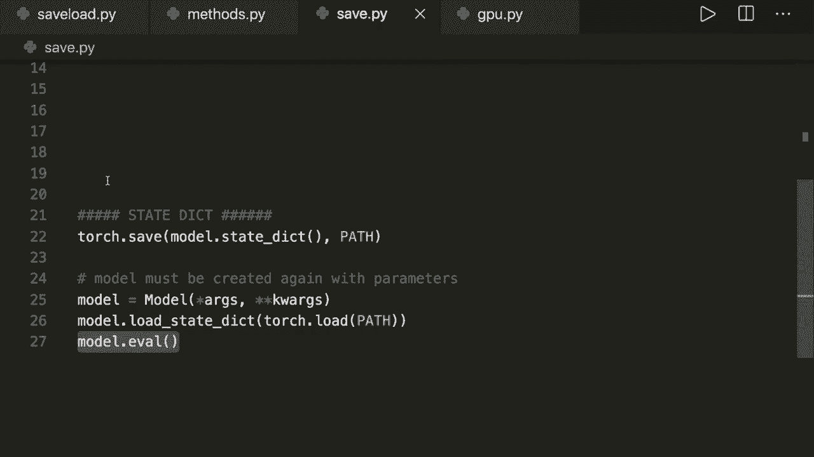

So here I have a little script where I defined a small model class and here I created our model and now let me show you the lazy method first„ÄÇ

 So first we define our file name so we say file equals and let's call this model do p So it's come and practice to use the ending dot p so short for pytorrch and then we save the whole model by saying torch do save and then model and the file So let's save this and let's run the script So let's say Python save load do pi and now if we open up our browser So we can ignore this warning here then we see here we have the model do p„ÄÇ

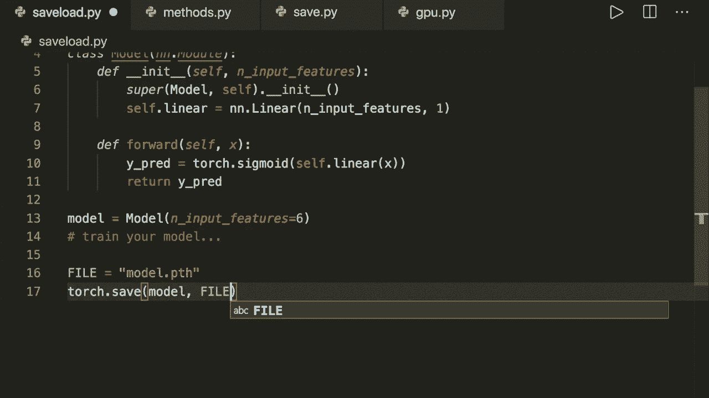

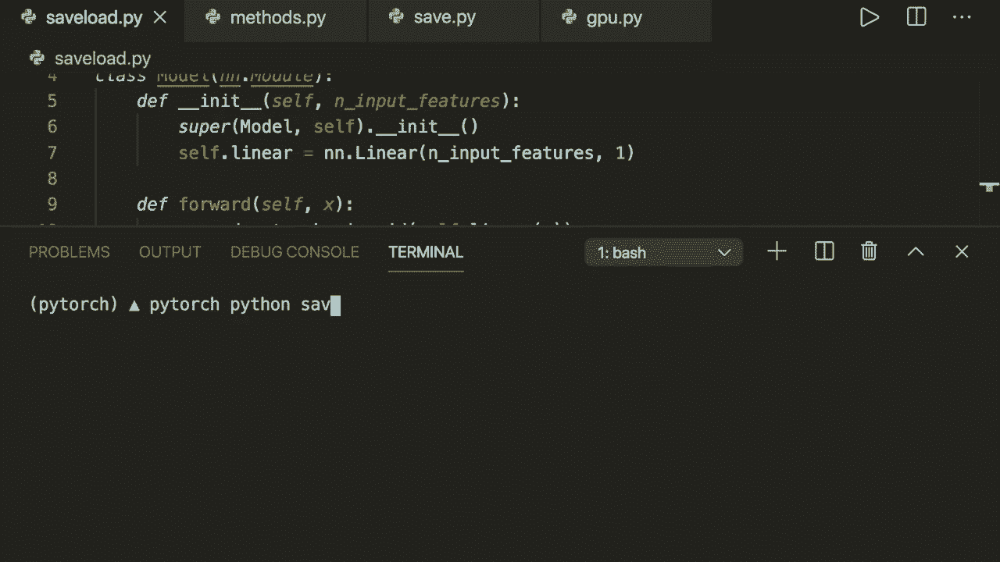

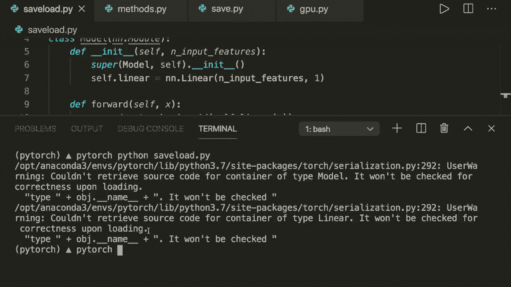

In the Exper„ÄÇ

And if we open this， then we see that this is some serialase data， so this is not human readable。

And now if we go back to our code„ÄÇ So let's load our model so we can comment this out„ÄÇ

 and we also can comment this out„ÄÇ

And then we can load our model by saying， model equals。Equals torch dot load。 and then the file。

 And then remember， we want to set it to evaluation method。So we say model dot evil。

 and then we can use our model。 For example， we can inspect the parameters。

 So let's say for Para in model dot parameters„ÄÇ

And then， let's print our Para。And save this。 And let's。Clear this and run our script again。

And let me make this larger for you„ÄÇ So now if we run our script again„ÄÇ

 then we can see that we loaded our model and we can use the parameters„ÄÇSo this is the lazy option„ÄÇ

 And now， let me show you the preferred way of doing this。

 So instead of just saying torch dot save model here and what we instead want to do is to say torch dot save„ÄÇ

 and then we want to save the state dit„ÄÇ So here we have our model again„ÄÇ

 And then we say torch dot model dot„ÄÇ

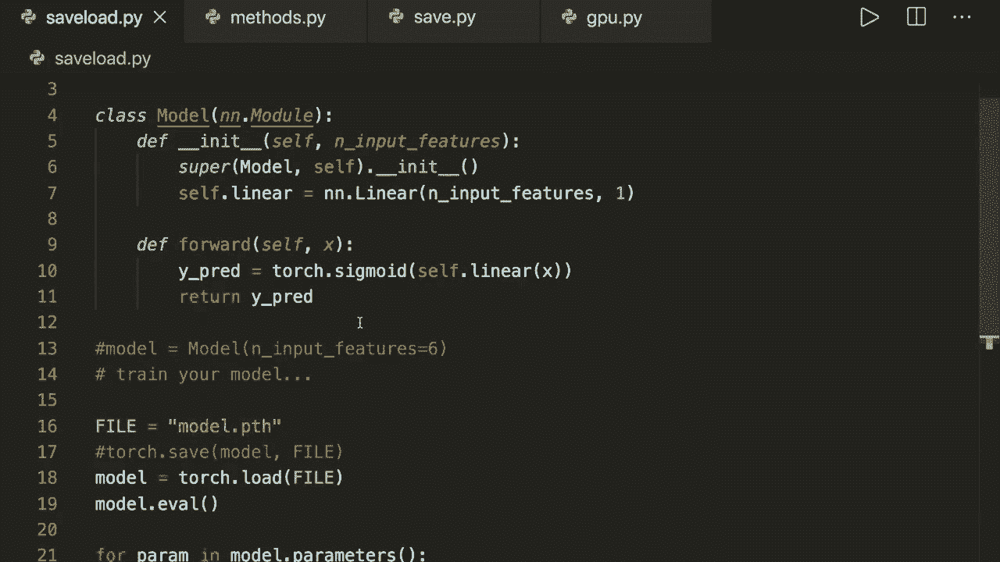

Tarch dotafe model dot state。State diiced。And then， let's run this。So， let me clear this。

And let's open up the Explorer and delete this file here„ÄÇ

And now if we run our script again， then we again have the file。

 But now here it only save the state dictates„ÄÇ And now if we want to load our model again„ÄÇ

 we first have to define it„ÄÇ

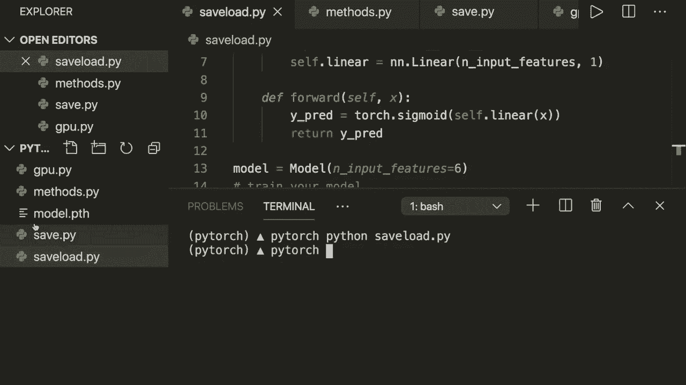

So let's call this loaded model„ÄÇLoaded model„ÄÇEquals„ÄÇ

 and then let's also say the model and the number of input features is the same„ÄÇ So it's 6„ÄÇ

 And then we call loaded model dot load state di„ÄÇ And inside this„ÄÇ Remember„ÄÇ

 we have to call torch dot load„ÄÇ and then the file name„ÄÇ And then again„ÄÇ

 we set our loaded model to evaluation mode„ÄÇ

And then if we run this， So let's print the parameterss of the loaded model。 And up here。

 let's also print the parameterss of our normal model„ÄÇ

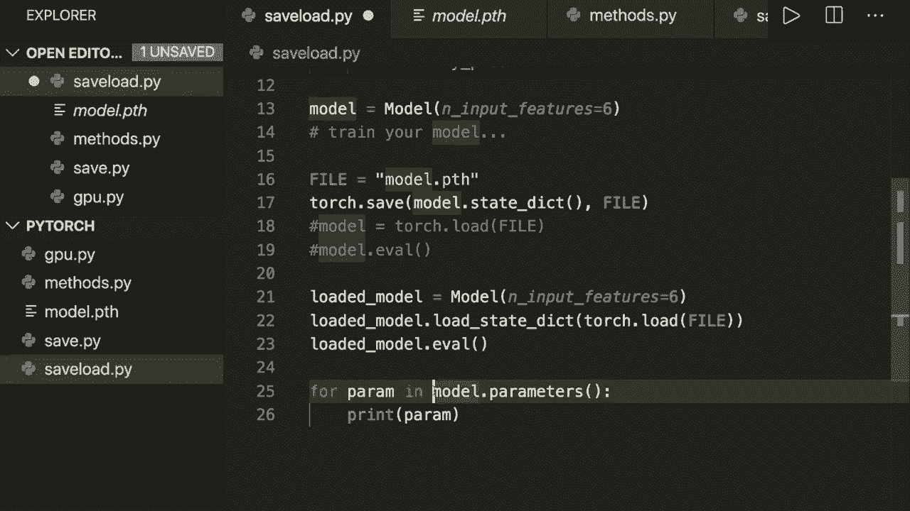

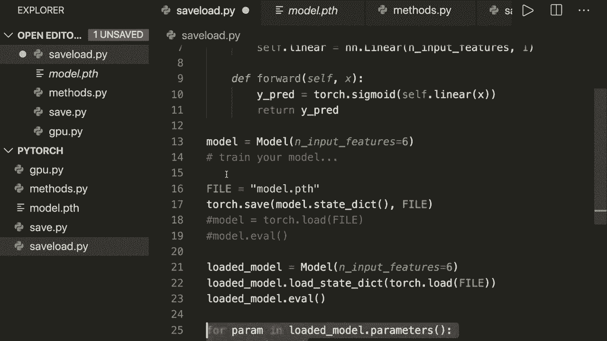

So this， if we don't do any training here， Then our model is still initialized with some random parameters。

 So let's run the script and let's check if the parameters are the same„ÄÇ

So here， yeah， we see that it worked。 and it first printed the parameters of the model of the normal model。

 and then here of the loaded model„ÄÇ So these are the same„ÄÇ

 So we see we have a tenzo with the weights„ÄÇ and we also have a tenzo with the bias„ÄÇ

 and this is the same for both of our model。 So we see that this worked， too。 So yeah， again。

 so this is the recommended way of doing it by saying safe dot model state diict„ÄÇ

 And then when we load it， we call a load state dict method。

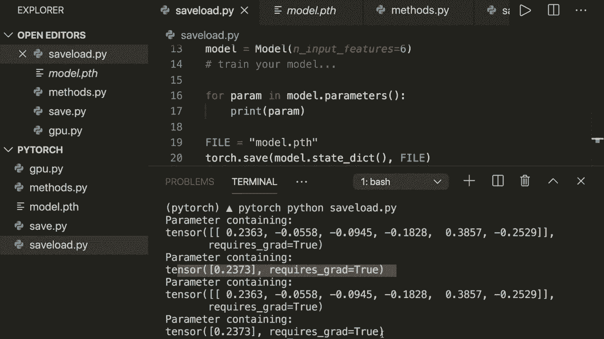

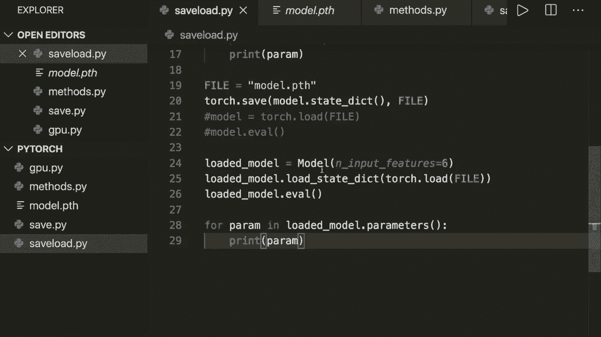

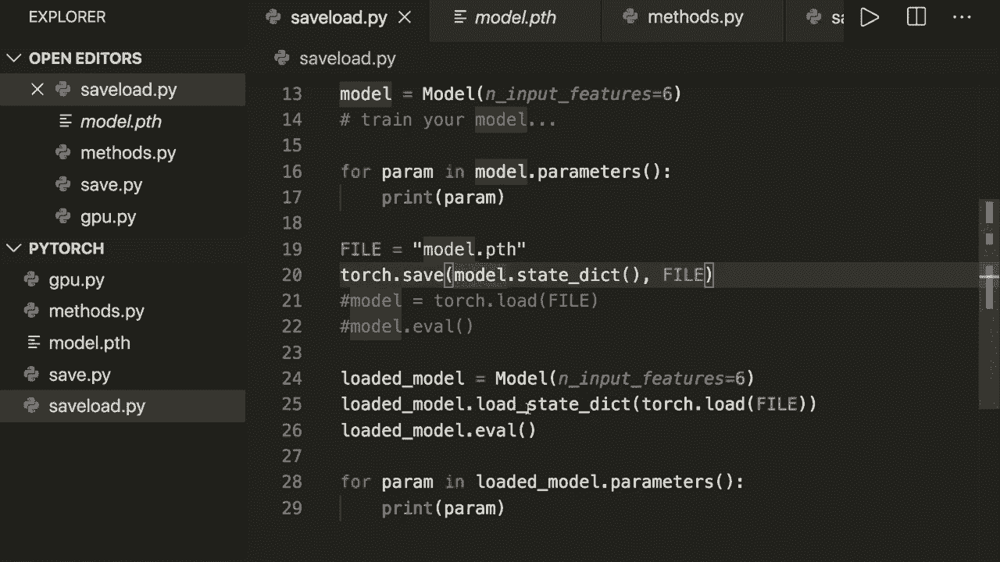

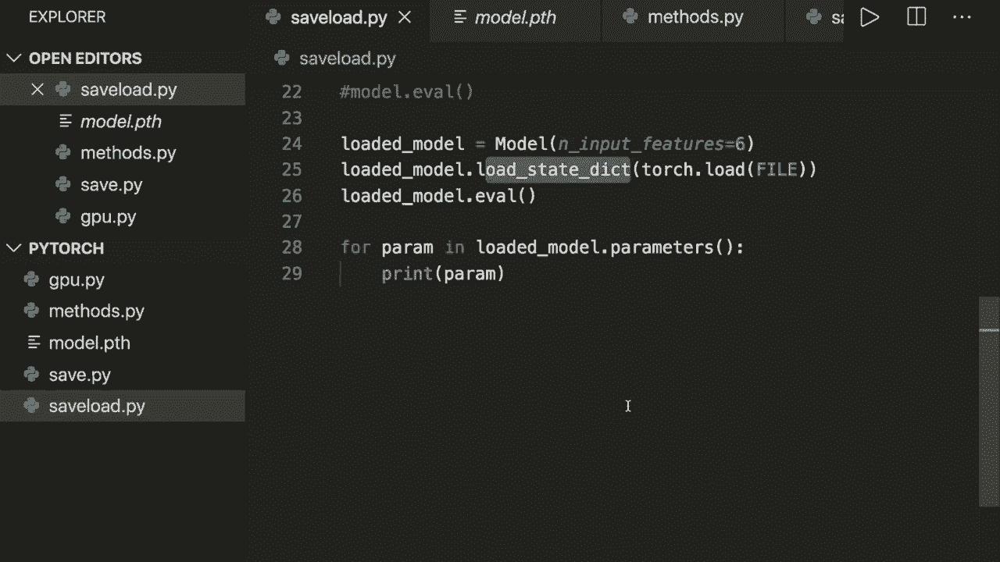

And yeah， so here we just save the state di。 So this holds the parameters。

 So let me show you how this state dit looks like„ÄÇ So when we have our model„ÄÇ

 let's print model dot state„ÄÇüòä„ÄÇ

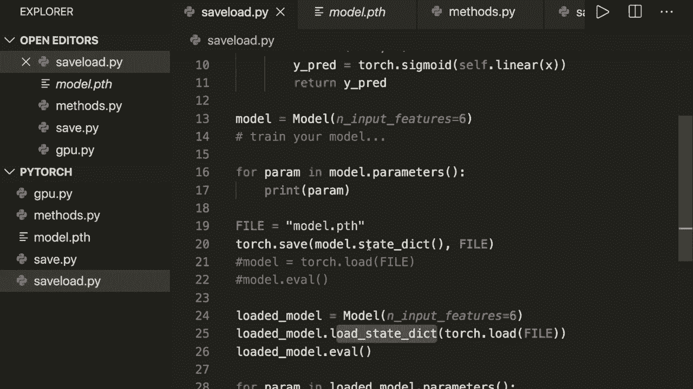

Dickt， and let's save this。And let's clear this and run the script。

 Then we see here we have our state dick„ÄÇ So here we have the linear weight„ÄÇ

 which has the tenzo with the weights„ÄÇ And then we also have the„ÄÇBastenzor„ÄÇ So this is our state dic„ÄÇ

And now let me show you a common way of saving a whole checkpoint during training so as you know„ÄÇ

 we can save any dictionary here„ÄÇSo let's say we also have a optimizer here„ÄÇ

 So let's say we defined a learning rate„ÄÇ So let's say this is 0001„ÄÇ And we also have a optr„ÄÇ

 This is， let's say， torch dot optim。Dot。Let's use stochastic gradient descent。

 And here we want to optimize the model parameters„ÄÇ

 and we will also have to give it the learning rate by saying learning rate equals the learning rate and our optimizer also has a state di„ÄÇ

 So we can also print the optimizer state di。 Now， if we clear this and run this。

 then we see the state dictionary of the optimizer where we can see， for example。

 the learning rate and the momentum„ÄÇSo now during training„ÄÇ

 let's say we want to stop somewhere at some point during training and save a checkpoint„ÄÇ

 Then we can do it like this， so。

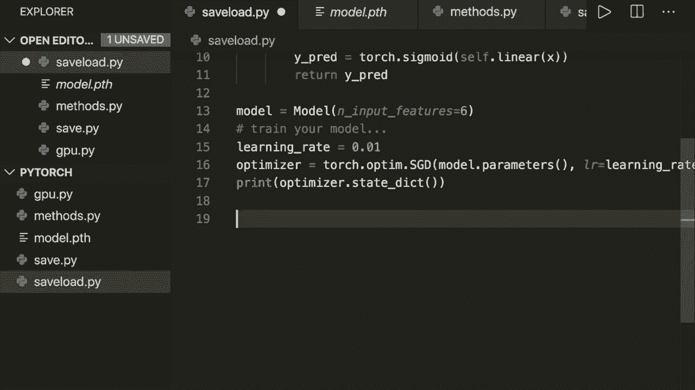

We create our checkpoint， and this must be a dictionary。 So let's create a dictionary。

 And as a first thing， what we want to save is， for example， the epoch。 So let's define the epoch。

 So the key is called epoch。 And let's say we are just， we are an epoch 90。

 And then we want to save the model state„ÄÇ So we have to give it a key„ÄÇ let's say model state„ÄÇ

 And here we use model dot state diict„ÄÇAnd then we also want to save the optimizer state dick„ÄÇ

 So the key， let's say， optim state。 And then here as a value， we have to call optr state dick。

 So this is our checkpoint„ÄÇ And now we can call torch dot save„ÄÇ

And then save the whole checkpoint。 So let's say torch checkpoint as， as a file name。

 Let's call this check。Point dot P， T H。

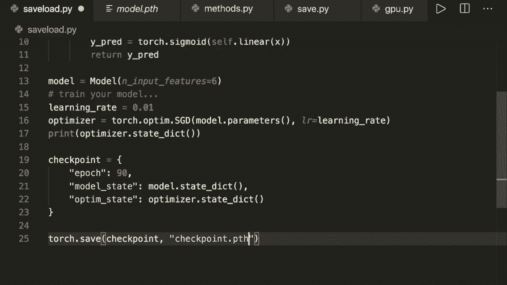

And now again， let me show you the explorer and let's run the script。

So now we clear this and run this„ÄÇ Then we see we have our checkpoint here„ÄÇ And now„ÄÇ

 when we load this， we want to load the whole checkpoint， so。

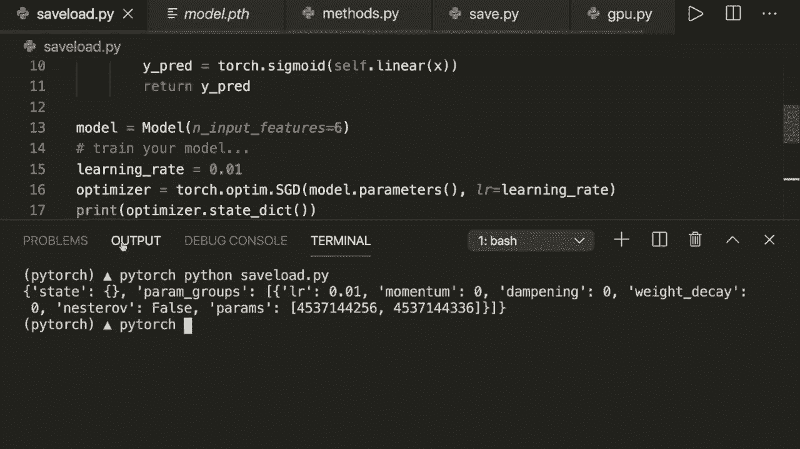

We can comment this out。 And also， we don't need this， so。

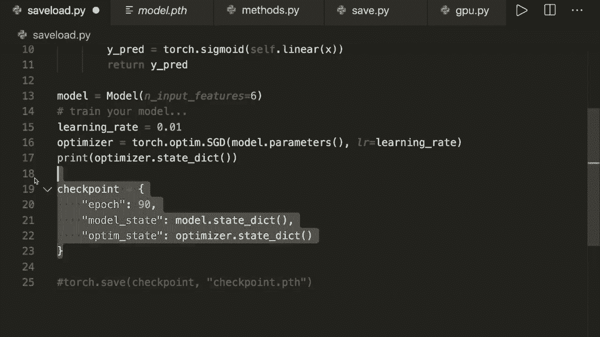

Let's say our loaded checkpoint。 So let's say， loaded checkpoint。Equals torch dot load。

 And then the file name was the same as this one„ÄÇ

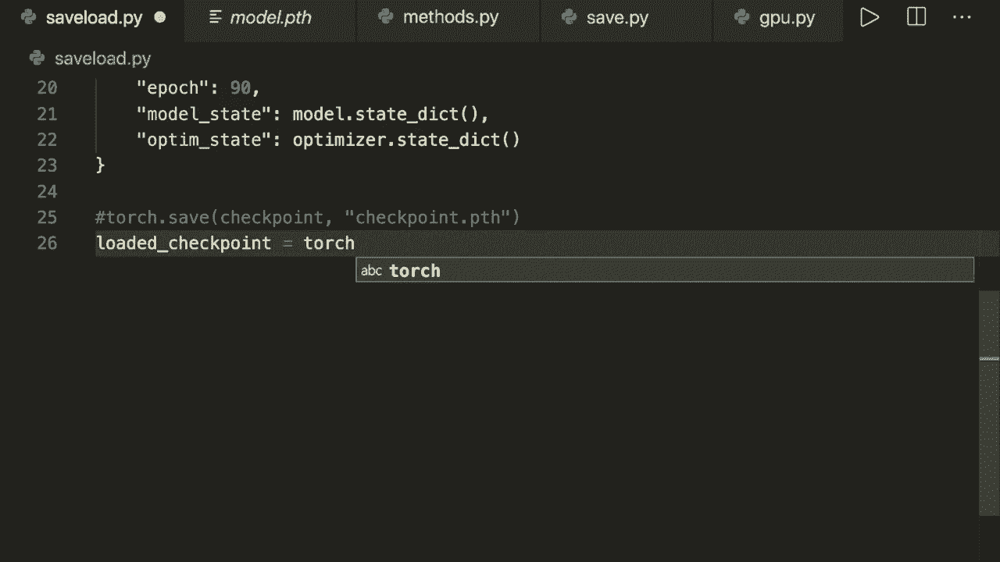

And now you have to set up the different„ÄÇModel and optimizes again„ÄÇ

 so we can get the epoch right away by saying epoch equals load at checkpoint„ÄÇ

 So this is a dictionary„ÄÇ so we can just„ÄÇ

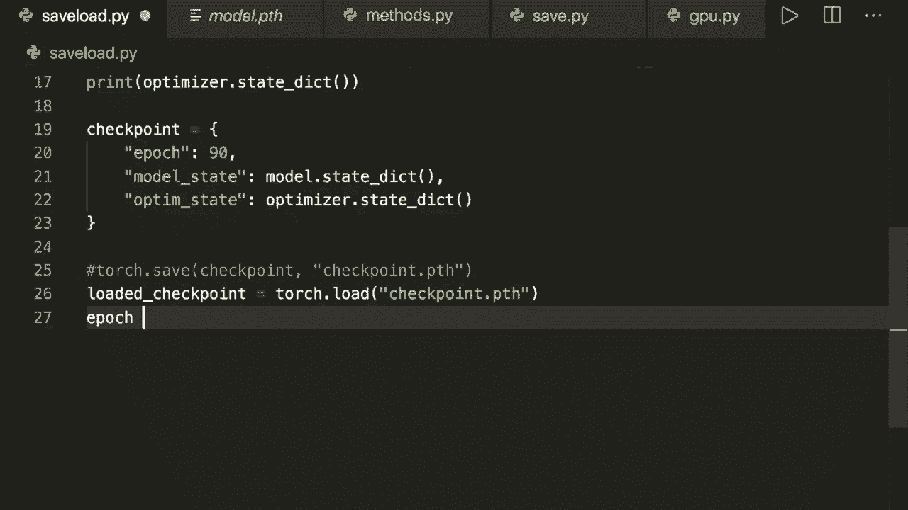

Call the„ÄÇOr access the epoch key„ÄÇ And then for the model„ÄÇ remember„ÄÇ

 we have to create our model here again„ÄÇ So let's say model equals„ÄÇ

 and then the model with the number of input features equals 6 and the optimizer equals the same as this one„ÄÇ

 So we don't have to use the same learning rate actually„ÄÇ

 So let me just grab this one here and paste it down here„ÄÇ And for example„ÄÇ

 we can use the learning rate 0。 And then later， we can see that we load the correct learning rate into the optimizer。

 So„ÄÇ

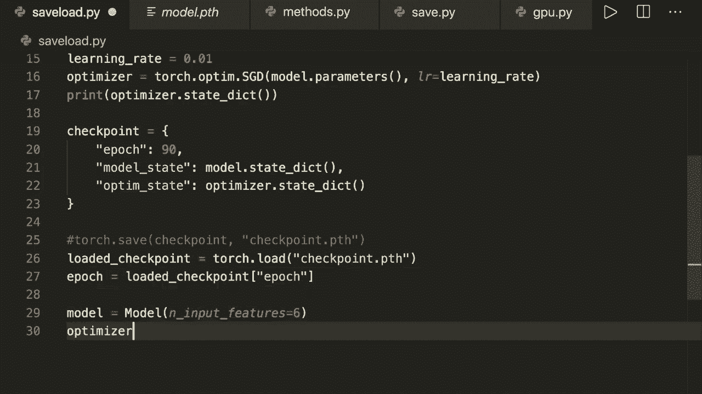

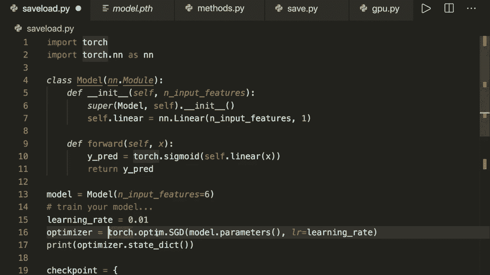

Now， let's say model dot load state。Dicks， and then here we give it the checkpoint。

 and then we access the key„ÄÇ We call it model state„ÄÇ

 So this will load all the parameters into our model„ÄÇ and the same with our optimizer„ÄÇ

 So we call optimizer dot load state dis„ÄÇ and then we use the checkpoint„ÄÇ

 And here we call it optim state„ÄÇ So now we have the loaded model and the optr and also the current epoch„ÄÇ

 So we can continue our training„ÄÇ

And let me show you that this is all correct by saying we want to print the optimizer dot state di„ÄÇ

 So if you notice here， we set the learning rate to 0 and then we loaded the correct state di。

 So now if we run this。 And as a last thing， we printed the optimizer state di。

 then we see we have the same learning rate as in the initial optimizer„ÄÇ So this work2„ÄÇ

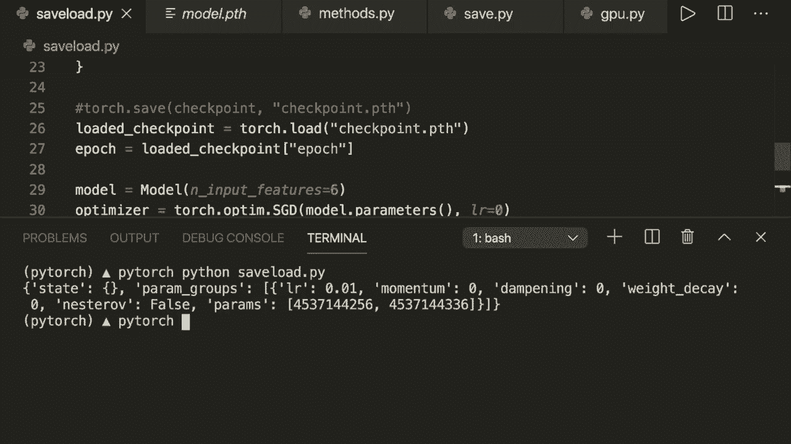

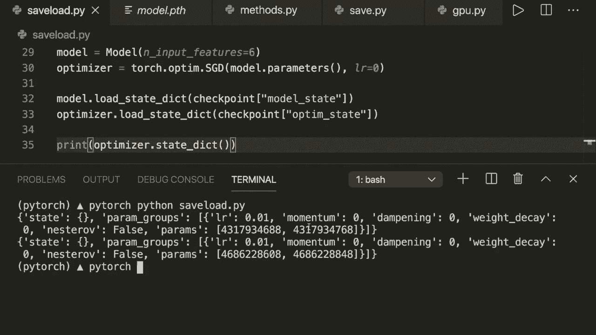

So this is how we can save and load a whole checkpoint„ÄÇ And yeah„ÄÇ

 these are all the three ways of saving you have to know„ÄÇ And now as a last thing„ÄÇ

 I want to show you what you have to consider when you are using a GPU during training„ÄÇ

 So if you are doing training and loading both on the CPU then you don't have to make any difference„ÄÇ

 So you can just use it like I did here， But now if you save your model on the GP。

 And then later you want to load it on the CPU， then you have to do it this way。

 So let's say somewhere during your training， you set up your ka device and you send your model to the device and then you save it by using the state d。

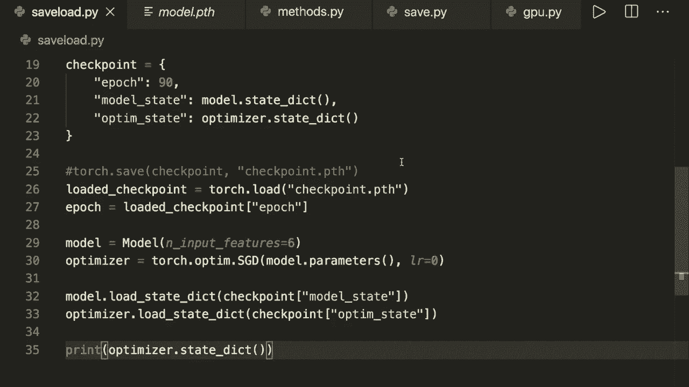

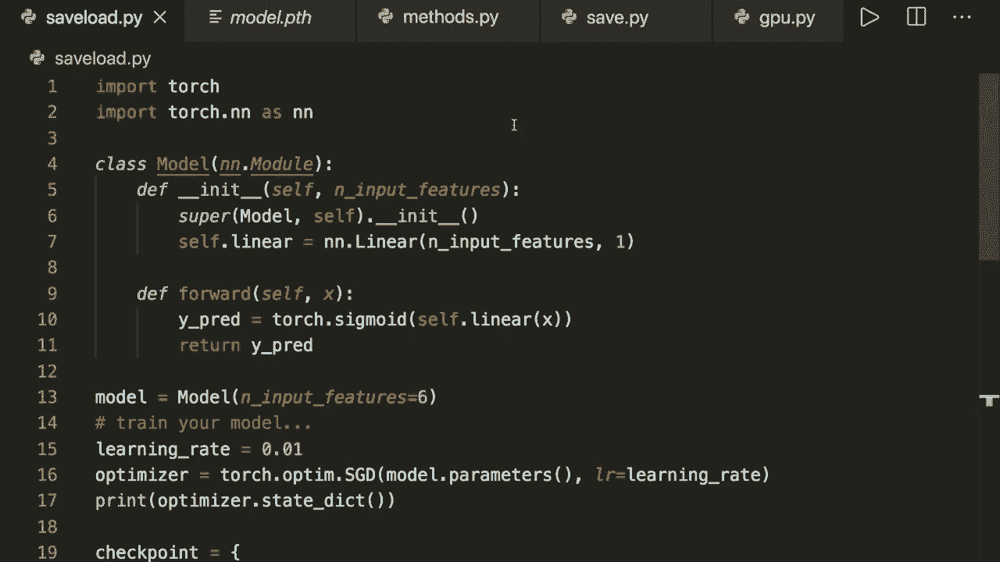

And then you want to load it to the CPU„ÄÇ So you have your CPU device„ÄÇ

 then you create your model again， and then you call load state died and then load path。

 And here you have to specify the map location„ÄÇ And here you give it the CPU device„ÄÇ

 So this is if you want to save on the GP and load on the CPU„ÄÇ

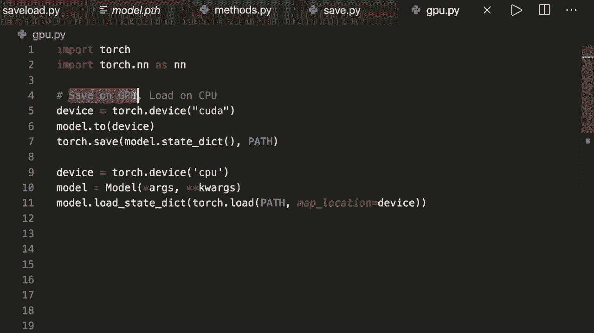

Now， if you want to do both on the GPU。 So you send your model to the Kuda device and saved it。

 and then you also want to load it on the GPU， then you just do it like this。 So you。

Set up your model， you load the state di， and then you send your model to the Kuda device。

And now as a third option„ÄÇ So let's say you saved your model on the CPU„ÄÇ So you didn't send„ÄÇ

 you didn't call model to Kuda device somewhere。 But then later， during loading。

 you want to load it to the GP， you have to do it like this。 So first you specify your Ka device。

 Then you create your model„ÄÇ

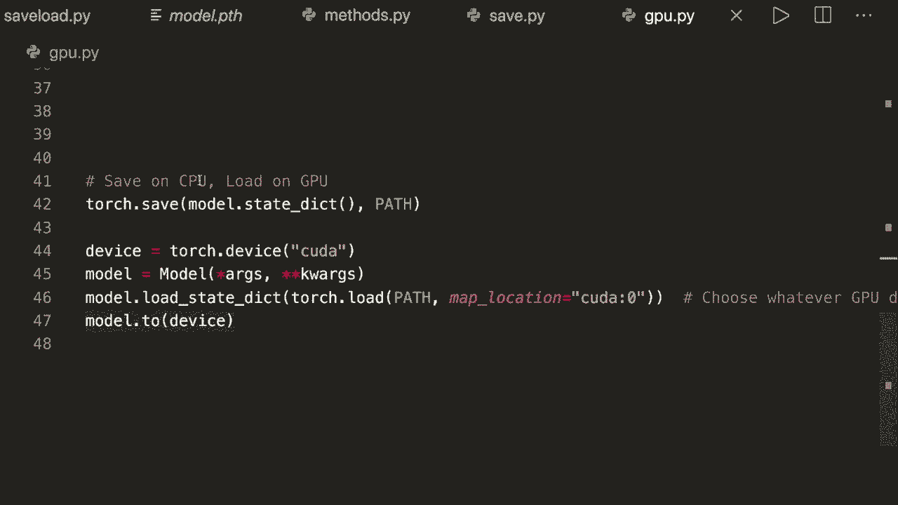

And then you call model dot load date diiced and then torch load with the path and then as map location„ÄÇ

 you specify Kuda and then colon and then any GPU device number you want„ÄÇ So for example„ÄÇ

 Kuda colon0„ÄÇ and then also you have to call model to device So to the ka device„ÄÇ

 So this will send the model to device to the device and also all the loaded parameter tenzoos to the device So then you can continue with your training or interference on the GPU„ÄÇ

 and of course， you also have to send all the training samples to the device that you then use for the forward path。

So yeah， this is what you have to consider when you're using a GPU。

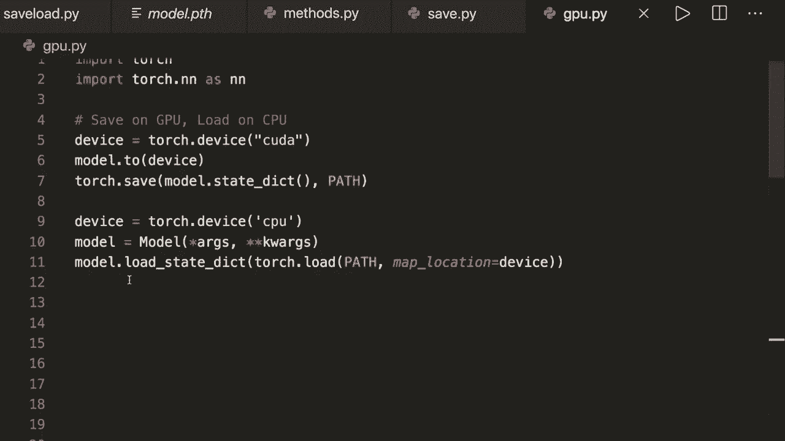

And now， you know all the different ways of saving and loading your model。 And yeah。

 that's all for now„ÄÇ I hope you enjoyed this tutorial„ÄÇ

 And if you like this then please consider subscribing to the channel and see you next time， bye。😊。

