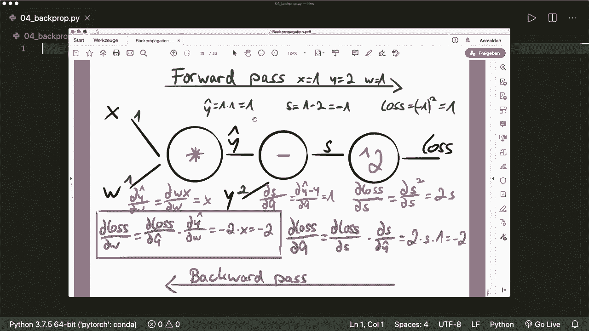
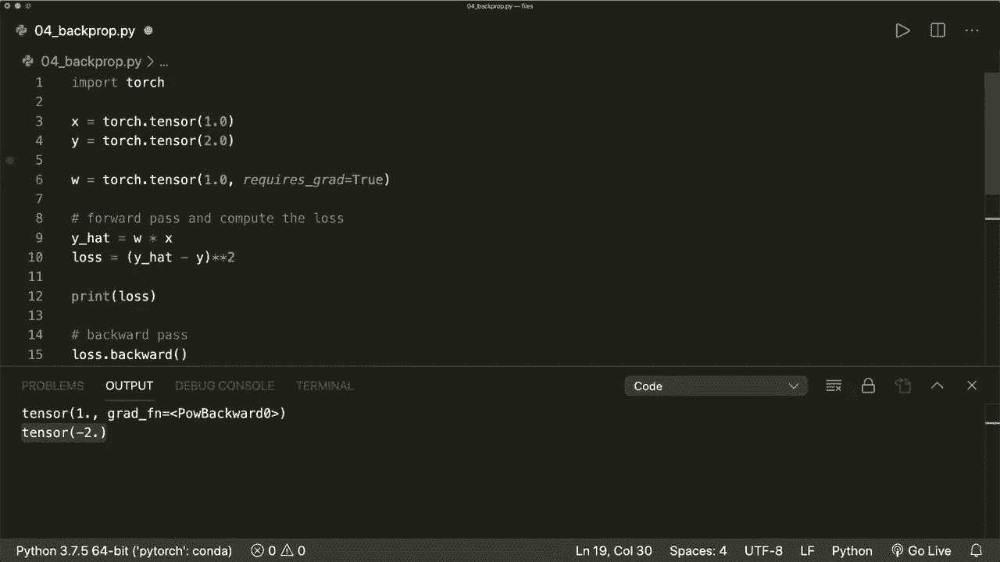

# 【双语字幕+资料下载】PyTorch 极简实战教程！全程代码讲解，在实践中掌握深度学习&搭建全pipeline！＜实战教程系列＞ - P4：L4- 反向传播 - 理论与实例 - ShowMeAI - BV12m4y1S7ix

Hi， everybody。 Welcome to a new Pytorch tutorial。 In this video。

 I am going to explain the famous Beck propagation algorithm and how we can calculate gradients with it。

😊，I explain the necessary concepts of this technique。

 and then I will walk you through a concrete example with some numbers。And at the end。

 we will then see how easy it is to apply back propagation in Pytorarch。 So let's start。

And the first concept we must know is the chain rule。

 So let's say we have two operations or two functions。So first， we have the input X。

 and then we apply a function A and get an output Y。

 And then we use this output as the input for our second function。 So the second function B。

 And then we get the final output C。And now we want to minimize our C。

 So we want to know the derivative of C with respect to our x here in the beginning。

And we can do this using the so called chain rule。 So for this。

 we first compute the derivative of C with respect to y and multiply this with the derivative or of y with respect to X。

 And then we get the final derivative we want。So first， here。

 we compute the derivative at this position。So the derivative of this output with respect to this input。

 And then here， the derivative of this output with respect to this input。

 And then we multiply them together and get the final gradient we are interested in。

 So that's the chain rule。And now the next concept is the so called computational graph。

So for every operation we do with our tens source， Pyto will create a graph for us。

 So where at each note， we apply one operation or one function with some inputs and then get an output。

So here in this case， in this example， we use a multiplication operation。

 So we multiply x and y and then get C。And now at these notes。

 we can calculate so called local gradients， and we can use them later in the chain rule to get the final gradient。

 So here， the local gradients， we can compute two gradients， the gradient of C with respect to x。

 And this is simple。 since we know this function here。

 So this is the gradient gradient of x times y with respect to x， which is y。 And here in the bottom。

 we compute the derivative of x times y with respect to y， which is x。

So local gradients are easy because we know this function。 And why do we want them。

 Because typically our graph has more operations。 And at the very end。

 we calculate a loss function that we want to minimize。

 So we have to calculate the gradient of this loss with respect to our parameter X in the beginning。

And。Now， let's suppose at this position， we already know the derivative of the loss with respect to our C。

 and then we can get the final gradient we want。 So the with the chain rule。

 So the gradient of the loss with respect to X is then the gradient of loss with respect to C。

Times our local gradient。 So the derivative of C with respect to x。And yeah。

 this is how we get the final gradient then， and。Now， the whole concept consists of three steps。

 So first， we do a forward pass where we apply all the functions and compute the loss。

Then at each note， we calculate the local gradients。

 and then we do a so called backward pass where we compute the gradient of the loss with respect to our weights or parameters using the chain rule。

So these are the three steps we are going do。 And now we look at a concrete example。

 So here we want to use linear regression。And if you don't know how this works。

 then I highly recommend my machine learning from scratch tutorial about linear regression。

I will put the link in the description。So basically。

 we model our output with a linear combination of some weights and an input。

 So our y hat or y predicted is w times x。And then we formulate some loss function。 So in this case。

 this is the squared error。 Actually， it should be the mean squared error， but for simplicity。

 we just use the squared error。 Otherwise， we would have another operation to get the mean。

 So the loss is the difference of the predicted y minus the actual y， and then we square it。

And now we want to minimize our loss。 So we want to know the derivative of the loss with respect to our weights。

 And how do we get that， So we apply our three steps。 First。

 we do a forward pass and put in the x and the W。 And then here we put in the y。

And apply our functions here。 And then we get the loss。

 Then we calculate the the local gradients at each note。 So here。

 the gradient of the loss with respect to our S。 Then here。

 the gradient of the S with respect to our y hat。And here at this note。

 the gradient of Y hat with respect to our W。And then we do a backward pass。 So we start at the end。

 And here we have the first， we have the derivative of the loss with respect to our S。

And then we use them， and we also use the chain rule to get the derivative of the loss with respect of the Y hat。

And then again， we use this and the chain rule to get the final gradient of the loss with respect to our W。

So let's do this with some concrete numbers。 So let's say we have x and y is given。 So x is  one。

 and y is 2 in the beginning。And so these are our training samples。 and we initialize our weight。

 So let's say， for example， we say our w is one in the beginning。And then we do the forward pass。

 So here at the first node， we multiply x and W。 So we get Y hat equals one。Then at the next note。

 we do a subion。 So y hat y is 1-2 equals -1。And at the very end， so we square our S。

 So we have have S squared， so。Our loss， then， is one。And now we calculate the local gradient。

 So at the last note， we have the gradient of the loss with respect to S。

 And this is simple because we know the function。 So this is the gradient of S squared。

 So this is just 2 S。And then at the next note， we have the gradient of S with respect to Y hat。

 which is the gradient of the function Y hat minus y with respect to Y hat， which is just one。

And then here at the last node， we have the derivative of Y hat with respect to W。

 So this is the derivative of。W times x with respect to w， which is x。And also。

 notice that we don't need to go。 Don't need to know the derivatives in this。Graph lines。

 so we don't。Need to know what is the derivative of S with respect to Y。 And also here。

 we don't need this because our x and our y are fixed。

 So we are only interested in our parameters that we want to update here。And yeah。

 and then we do the backward pass。 So first， now we use our local gradients。

So we want to compute the derivative of the loss with respect to Y hat。

 And here we use the chain rule with our two local gradients that we just computed。

 which is 2 S times 1。 and S is -1， which we calculated up here。 And then so this is  -2。

And now we use this derivative and also this local gradient to then get the final gradient。

 the gradient of the loss with respect to our W， which is the gradient of the loss with respect to Y hat times the gradient of Y hat with respect to W。

 which is -2 times x and x is 1。 So the final gradient is -2。

So this is the final gradient then that we not want to know。 And yeah。

 that's all how back propagation works。 And let's jump over to our code and verify that Pyto get these exact numbers。

 So let's remember x is 1 Y is 2 and w is 1。 And then our first gradient should be -2。

So。

Let's see how we can use this in pie torch。 And， first of all， we import torch， of course。

Then we create our vector or tenor。 So we say x equals torch dot tenor。 and this is1。

 and then our y equals torch dot tenor。With two。And then our initial weight is a tenzor。Also。

 with one。So 1。0 to make it a float。 And here， and with our weight。

 we are interested in the gradient。 So we need to specify require Sc equals true。

And then we do the forward pass。And gets and compute the loss。So we simply say， why hat equals。

W times x， which is our function。 And then we say loss equals y。Hats。Minus。The actual y。

 And then we square this， So we say。This to the power of two。And now， let's print our loss。And see。

This is one in the beginning。 And now we want to do the backward pass。 So let's do the backward pass。

 and pi touch will compute the local gradients automatically for us and also computes the backward pass automatically for us。

 So the only thing that we have to call is say loss backward。

 So this is the whole gradient computation。 And now our w has this dot Gr attribute。

 And we can print this。 And now this is the first gradient。

 in the after the first forward and backward pass。 And remember， this should be-2 in the beginning。

 And here we see we have a tensor with -2。 So this is working。And the next steps would be。

 for example， Now we update our weights， and then we do the next forward and backward pass and do this for a couple of iterations。

And yeah， that's how Beck propagation works and how， and also how easy it is to use it in Pytorch。

 And I hope you enjoyed this tutorial。 Please subscribe to the channel and see you next time， bye。😊。

