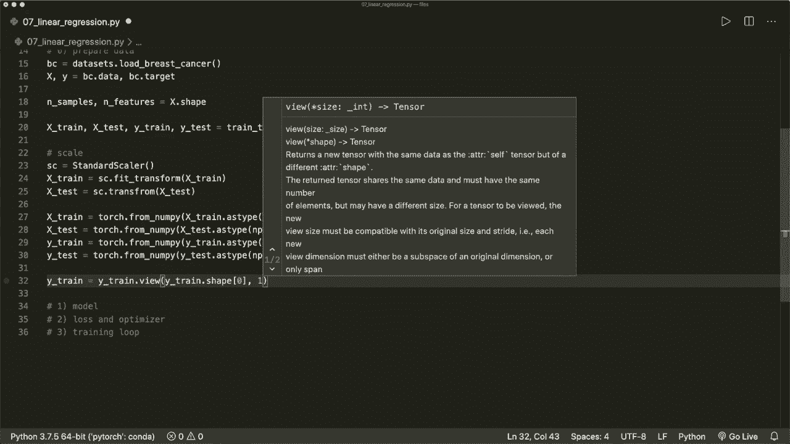

# 【双语字幕+资料下载】PyTorch 极简实战教程！全程代码讲解，在实践中掌握深度学习&搭建全pipeline！＜实战教程系列＞ - P8：L8- 逻辑回归 - ShowMeAI - BV12m4y1S7ix

Hi， everybody。 Welcome back to a new Pytorch tutorial。 This time， we implement logistic regression。

 If you have watched the previous tutorials， then this should be very easy Now。 Once again。

 we implement our typical pytorch pipeline with those three steps。 So first， we set up our model。

 We define the input and output size and the forward pass。

 Then we create the loss and the optimizer functions。

 and then we do the actual training loop with the forward pass。

 the backward pass and the weight updates。😊，The code here should be very similar to the code in the last tutorial where we implemented linear regression。

 We only have to make slight adjustments for the model and the loss function。

 So we add one more layer to our model， and we select a different loss function from Pytor built in functions。

So， let's start。First of all， let let's import some things that we need。 So we import torch。

 of course， and we import torch dot nn as an n。 So the neural network module。

 Then we import Ny S NP P to make some data transformations。 Then from Sk learn。

 we import data sets to load a binary classification data set。Then from SK learn dot pre processing。

 we want to import standard Scalar because we want to scale our features。

 and then from SK learn dot model selection， we import train test split because we want to have a separation of training and testing data。

And now let's do our three steps。 So first， we want to set up the model。

 Then we want to set up the loss and the optimizer。 And then in the third step。

 we do the actual training loop。And as a step 0。We want to prepare the data。So let's do this。

 So let's load the breast cancer data set from S K learn so we can say B equals data sets dot load breast cancer。

 This is a binary classification problem where we can predict cancer based on the input features。

 So let's say X and Y equals B dot data and B dot target。And then we want to say， oh， first of all。

 let's the get the number of samples and the number of features by saying this is。X dot shape。

So let's print this first So print the number of samples and the number of features to see how our data set looks like。

And。We see we have 569 samples and 30 different features。 So a lot of features here。

And now let's continue。 And let's split our data when we say X train and X test and。

X test and y train and y test equals here。 We can use the train test split function where we put in x and y。

And we want to be the test。Size。

To be 20%。 So this is 02。

And let's also give this a random state equals， let's say，1，2，3，4。

And there should be a small S。And now let's convert。 or， first of all。

 now we want to scale our features。 Sc them Here。 we set up a standard scalar S C equals standard scalar。

 which will。Make our features to have zero mean and unit variance。

 This is always recommended to do when we want to deal with a logistic regression。

So now we scale our data， So we say x train equals sc dot fit transform。

 and then as an input we put in x train。 and then we want to do the same thing with our test data。

 So we say x test equals SC dot here we only transform it。嗯。And here we put in X test。 Now。

 we scaled our data。 Now we want to convert it to torch tenzoos。 So let's say x train。

Equals torch dot。 And here we can use the function from nuy。

 And then we put an x train and cast this to a flow 32 data type。 So we say x train dot S。Type。

Numpy dot float 32。 because right now， this is of type double。

 and then we would run into some errorss later。 So let's cast this and convert this to a tenor。

 And now let's do this with all the other arrays。 So let's say x。

Test。Equals。This。And our Y train。And also， our y test tenzon。W test。And now。

 as the last thing to prepare our data is to reshape our why。Tenzo。 So Y train equals Y train dot V。

 This is a built in function from Pytorarch that will reshape our Tzo with the given size。

 So it gets the size。 Y train。

That shape，0。

And one。 So right now， our y has only one row， and we want to make it a column vector。

 So we want to put each value in one row with only one column。 So this will do exactly this。

 and also for our y test。 So Y test equals this y test。

And now， we are。

Think we are done with our data preparing。So now let's set up our model。

 and here our model is a linear combination of weights and a bias。

 And then in the logistic regression case， we apply a sigmoid function at the end。So let's do this。

 And for this， we want to write our own class。 So let's call this model。

 or we can also call this logistic regression。Chatic。Regression。

And this must be derived from N and dot module。And then this will get a in it。Which has self。

 And then it gets the number of input。Features。And here， first， we call the super in it。

 So let's say super。

Logistic regression and self dot in it。

And then here we define our layer。 So we only have one layer self dot linear equals。

 And here we can use the build in layer N N dot linear。 And this gets the input size。

 So an input features。 and the output size is just one。 So we only want to have one value。

 one class label at the end。

And then we also have to implement the forward pass here， which has self and the data。

 And our forward pass is first， we apply the linear layer and then the sigmoid function。

 So here we say why predict it。Equals torch dot sitete。

So this is also a build and function that we can use。 And here we apply ourselves to a linear layer。

 So linear layer with our data X。 and then we return our y predicted。

So this is our model。 And now let's create this。 So model equals logistic regression of size。

 And here we put in the number of features that we have。 So now our layer is of size 30 by  one。

And。No， sorry，30 input features and one output feature。

And now we have our model on。And now we can continue with the loss and the optimizer。 So for a loss。

 the loss function now is different than in the linear regression case。

 So here we say criterion equals N， N dot B， E loss。 So the binary cross entropy loss here。

And our optimizer is the same。 So this can be。嗯。This is torch dot optim dot S G D for stochastic gradient descent。

 And this gets some parameters that we want to optimize。 So here we just say model dot parameters。

 And it also needs a learning rate。 So let's say our。

Learning rate equals 。01。 And then here we say L R equals learning rate。

 So now this is step 2 and now step 3。 So let's define some number of epochs。Equals， let's say。

 100 iterations。 And now we do our training loop。So now we do four。Epoch in range nu epochs。

 And then first， we do the forward pass forward。Pass and the loss calculation。

 Then we do the backward pass， and then we do the updates。

So let's say y predicted equals here we call our model and as theta， it gets x train。

 and then we say loss equals criterion， and this will get a the y predicted and the actual y training。

 So the training samples or the training labels。

AndNow we do the backward pass and calculate the gradients， and again。

 we simply have to call lost dot dot backward and piytch will do all the calculations for us。

And now we update our weights。 So here we simply have to say optimizer dot step。 And again。

 Pytorch will do all the update calculations for us。

And then we don't。 or， we must not forget to empty our gradients again， so。Want to0 the gradients。

 because the backward function here will always add up all the gradients into the dot gra attribute。

 So let's empty them again before the next iteration。 And we simply must say optimizer dot0 gra。

And then， let's also。Print some information If epoch plus  one modo 10 equals equals 0。

 So every 10th step， we want to print some information。 Let's use an F string here。 Let's say， epoch。

And here we can use epoch plus one。 And then we also want to see the loss。

 So the loss equals loss dot item。 And let's format this to say， to only print four decimal values。

And yeah， so now we are done。 This is our logistic regression implementation。

 And now let's evaluate our model。 So the evaluation should not be part of our computational graph where we want to track the history。

 So we want to say with torch dot no Gr。

And then do our evaluation here。 So here I want to get the accuracy。

 So let's get all the predicted classes from our test samples。 So let's say this is model。

 And here we put an X test。

And then let's convert this to class labels。 So 0 or 1。 So remember。

 the seeoid function here will return a value between 0 and 1。

And。If this is larger than 05， we say this is class 1。 and otherwise it's class 0。

 So let's say why predicted classes equals y predicted dot round。

 So here we can use a build and function again。And this will do exactly this。And yeah， so if we。

Do don't use this statement。 Then this would be part of the computational graph。

And it would track the gradient calculations for us。 So here we don't want this。

 We don't need this because we are done。 So that's why we used this with statement here。

 And now let's calculate the accuracy by saying act equals y predicted classes。

 And here we can call the equal function equals y test。And then thes sum。 So we want to sum。

Them up for every prediction that is correct。 It will add。Plus 1。

 And then we divide this by the number of samples of test samples。 So why test dot shape。0。

This will return the number of test samples， and then let's print our accuracy print。

Accuracy equals。嗯。Ac dot4 F， also only for decimal values。

 And now let's run this and hope that everything is correct。

And。Standard scalr has no attribute transform。 So here I have a typo。

Transform。Now， let's run this again。Trans。Form。One more try。And now we are done。

 and we have a accuracy of 089。 So it's okay， it's good， but it's not perfect。

 So you might want to play around with， for example， the number of iterations。

 and where do we have it。

The number of epochs or the learning rate， for example。

 or also maybe try out a different optimizer here。 but basically yeah that's how we implement logistic regression。

 I hope you liked it。 If you liked it， please subscribe to the channel and see you next time bye。

