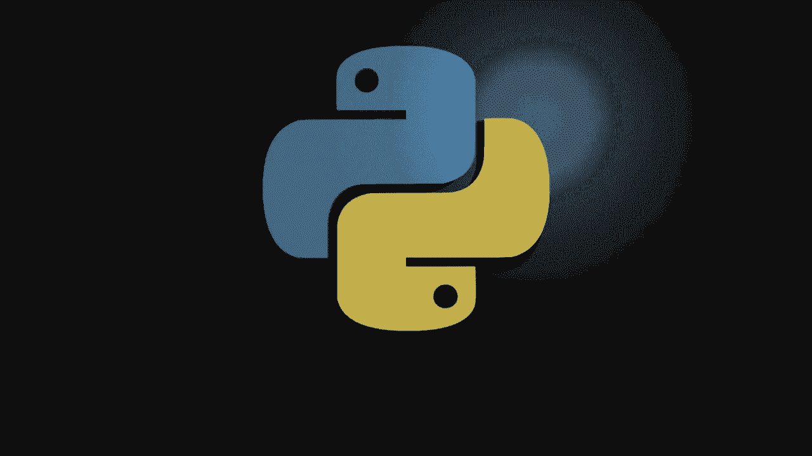
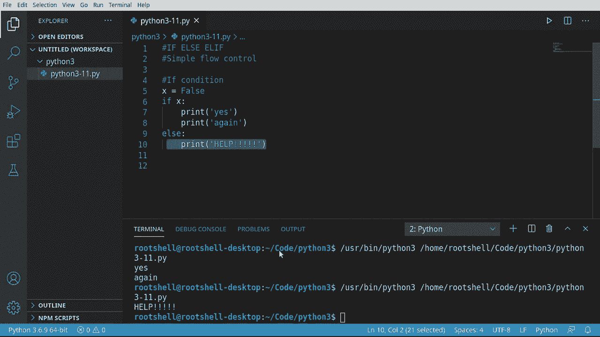
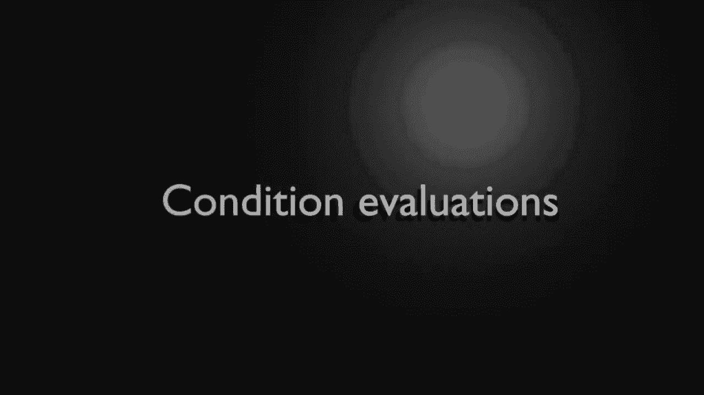
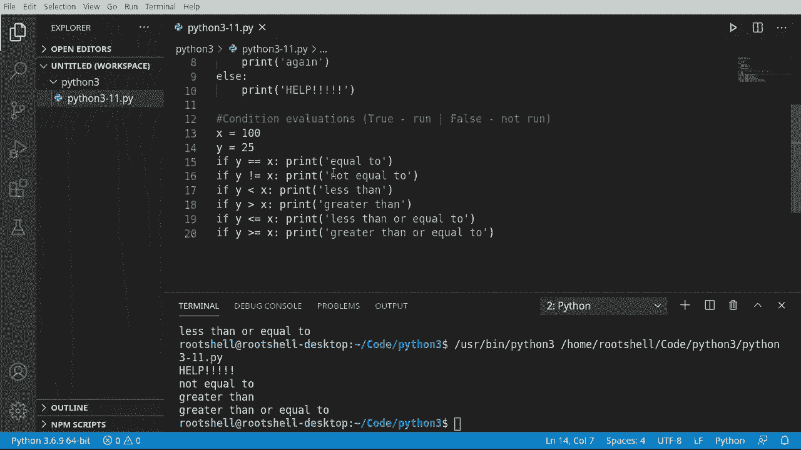
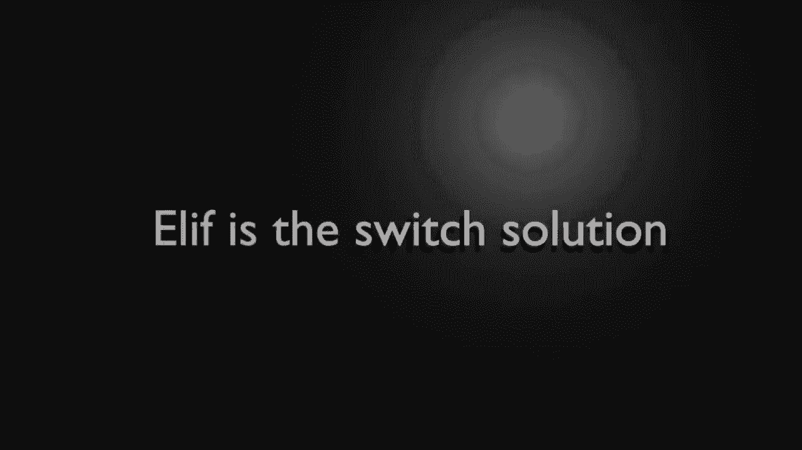
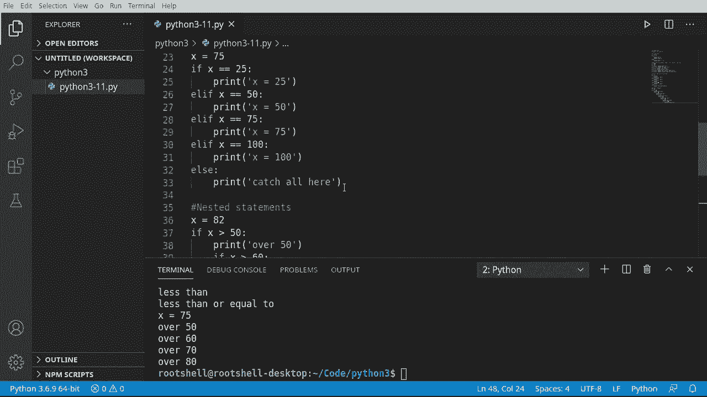

# 【双语字幕+资料下载】Python 3全系列基础教程，全程代码演示&讲解！10小时视频42节，保证你能掌握Python！快来一起跟着视频敲代码~＜快速入门系列＞ - P11：11）Python流量控制：If - Else - Elif - ShowMeAI - BV1yg411c7Nw

Welcome back everyone。 My name is Brian， let's continue our journey with Python 3。

 So in this video we're going to talk about if else and ElF。

 what are these three things Well it is simple flow control when we talk about flow。

 We're talking about the flow of an application and this is the basic building blocks for that flow control。

Before we dive in， we need to talk about some basic theory。 Don't worry。

 I'm going to keep it super short。 We have a variable。 Let's call it X and x is true。

 A very simple bull。 We can turn it on。 We can turn it off。Now， we're talking about flow control。

 Think of flow control。 Like when you were a child and your parent looked at you and said。

 if you do this， then this is going to happen。 That's essentially what we're talking about。

 It's a decision。 It's not super hard to wrap your head around， but it does take some explanation。

 So X equals true。 We've got our if statement。 And if it's going to function on some sort of condition。

 condition。Most of the time will evaluate to true or false。So we're going to say if x equals true。

Then， do something。We'll have some code that'll run if it's true and we'll have some code that'll run if it's false。

Now， this is not always the case。What I mean by that is sometimes this over here simply doesn't exist。

You're only going to evaluate for true， but you can do things like， say， if it's true。

 do this else do that。 And it can read like a book。 You can literally say， if Bob。Equals happy。

 then do something if Bob is not happy， do something else。It's really that simple。However。

 you need to understand this is the fundamental building block of almost all applications。

This is called flow control， you are controlling the flow of the application's logic。All right。

 enough theory。 Let's die right。 in we're going to look at if conditions， so。

We're going to create a variable called X。 and we're going to say it is true。

 This is just simply a bull。 we've seen this before。

Now I'm going to say if and you notice Al in V S code， it gives us these little templates。

 We're just going to do normal if。We're going to say if x。Polen。

 and now we want to print something out。Let's go ahead and run this and see what happens。

And it says yes。 So our programming logic is x is true。 And if x， notice how I just said if x。

 we could have said if x。Equals true。Then it's going to print this out。

 but it knows it's smart enough to know you don't really need that。Also notice this in depth。

 we've talked about this a little bit before and this colon so if you're coming from another programming language。

This is really what it looks like under the hood。You have these brackets as everybody loves and。

 you know， C plus plus C sharp JavaScript， all the C style languages and the code's pretty much indented Well Python does away with that so all of this。

It's converted into that。 and it's much shorter， much easier to read。

 You don't have all these weird sggly lines you got to worry about。Now you can continue to execute。

As long as it's on the same indent。For example。X is true if X print yes and again。See yes and again。

Now we are going to say else， and this is where we pop back。

Need that right there to tell Python that we've got more coming。

And we're going to just simply print oh。What's going to happen when we run this？Well， x is true。

 so if x， and then it's going to run this。Else， it will run that else is funny because else says。

 hey， if this didn't happen， then instead run this code here。Whenever you see these indents。

 think of this as a block of code， it's actually called scopepe。

So this would be a scope and this would be a scope。

 it's a much more complex topic that we'll cover in a future video but I want you to be aware that exists let's go ahead and run you see yes and again it never printed no。

I'm going to say help， I mean， just to make sure this really stands out on the screen。 Run it again。

 We never see it。Why， because this is true？If x。Then print this out。 It never jumps to L。

 So let's change this defaults。And you'll get a feeling for how programming logic takes place。

 X is now false。It's going to say if X。Print these else， print that。

So what's going to happen here is it's going to get to x and say， nope， X is not true。

 so ignore this block of code and instead jump down to else and run this block of code， see help。

Works as expected。

So what we've really been talking about is condition evaluations。

 and they're pretty much going to be true or false， meaning true， run it or false。

 don't run it or just do something completely different。

Let's take a look at some condition evaluations here。 So I'm going to say x equals 100。Y equals 25。

 So I'm just creating two little variables here and let'll say if。 and we're going to say y equals x。

We want to tell Python there's more coming。And we're going to print this out。

 Not I'm doing this all on one line。 you don't necessarily need。To do these tab indents。

 you can do everything on one line if you want to。So we're saying if y is equal to x。

 notice there's two equal signs。 If you do this， you're saying make y the value of x。

 and we don't want that。 We want to test for equality here。We're going to say。be个潮。

And we can just through the magic of copy and paste， speed this up just a little bit here。

And we're going to look at our condition evaluators here。 So I'm going to say if y is not equal to。

And then we can say less than。So if y is less than x。And I want to say greater then。

 So if wise is greater than what we're really getting at here is you can do some really。

Complex decision making based off values。And they're very simple。

 very easy to understand all you need to do is understand the symbols。For example。

 this guy right here looks super confusing， but we're saying if y is less than or equal to。

Notice how you have this compound here， so now this gets really complex and you've got it all on one line。

 but it is super convenient to do that。And you can do the exact app。

 but you can say greater than or equal to。Let's go ahead and test this out here。

 so we're going to run this and you can see it doesn't print everything。

It says not equal to less than and less than or equal to， so what's going on here？

We're evaluating y versus x， so we're saying is y equal to x， Well it's not。

 there're two different values。So it's not going to run this code。

 This is what I mean by the condition evaluations will go to true， run it or false， not run it。

There are other ways of doing it， but we're keeping things super simple。

And then we're saying if y is not equal to x， which is going to evaluate the true because those two are not equal。

 then print this out and sure enough we see。Not equal to I'm not going to go through each line。

 but you can kind of view and see which one of these evaluate to true， for example。

Is y greater than x。Well， of course， it's not 25 is less than hundreds， so this will never run。

 and we don't see it down here。Now， if we change this value。

You'll notice the output changes as well Now it's not equal。

 but it's greater than and greater than or equal to。This is extremely cool and is extremely flexible。

 Now， you start to understand our computers make decisions。 It's based off simple， if logic。😊。

If this statement or this condition evaluates to true， then run some specific code。

All right， all of this seems pretty cool。 but look at this。 it's kind of a jumble mess。

 It's just this big wall of if statements。 it's very hard to read。 There's no indentation。

 then you got to kind of read through every single one to find the one you're looking for。

Let's talk about LF， which is really a switching solution， when I say switching。

Other languages have a concept called a switch， which is just like think of a big panel of light switches you can turn them on and off。

 Python doesn't really have that concept。 There's ways around it。

 but it doesn't really have that specific concept。So let's look at a way of getting around this。

 So I'm going to say x is 10。 Now we want a bank of switches。

 We want to be able to turn code on and off at will。So I'm going to say if。X。Equals 25。

 Then we're just going to print out。Segals 25。Now， we want to take this and kind of smash it into something without doing a completely new if statement。

 We want this to stay all in one line， because believe it or not， these are two different statements。

 and they'll execute separately。So what we're going to do here is L F。X。Equals 50。

So really now it's going to read this as one giant line， so it's going to say if x is 25。

 execute this， else， if x is 50， execute this。And we can just take this concept and keep expanding on it。

Go ahead。Say if。X is 75。And let's go ahead and say 100。We can end this and say， you know what。

 If we didn't find any of these switches using the L A statement。

 we can simply say else and then make what's called a catch all。

Which is going to execute if none of these fired off。So it's at 10。

 Let's see what's going to happen here。It triggered our catch all， see？

So it went through and evaluate and says is x 25， no， is it 50， is it 75 is it 100。Else fired off。

 let's switch this to 75， see what happens。You can see now it just says x is 75。

 So what's going on here is it says。Evaluate this， evaluate this， evaluate this， turn to true。

Run this code now we're done， so it'll jump all the way out。Very simple， very easy logic。

 and it looks much better than just this giant wall of text。 Super easy to follow。

As you dive deeper and deeper into a programming， you're going to find there's always another way of doing it if you didn't like L if。

 there is another way。And it's called nested or nestled statements。

 And this is basically a statement in a statement in a statement in a statement。

 And you can go on forever and ever and ever。 Let's go and take a look。 So I'm going to say x equals。

 and let's just pick a number randomm 82。 And we're going to say it X。Is greater than 50。Frince。

And'll say over 50。But wrap that in some quotes here。And because it's over 50， we want to keep going。

 So I want to say e x is well， greater than 60。Then。

 and we can use the same logic over and over and over。

 And this now becomes a very repetitious pattern。So for example。

 I can just say this and we just grab this and keep going。

Notice how the indents get bigger and bigger and bigger。You have to do this otherwise。

 Python considers that a new statement。So for example， this would actually create a problem here。

 It's not going to execute the way we want it to。 So what we need to do is indent， indent and。

And this is what I love about VS code is it puts these lines where the indent is。

So now you can see this is a statement。This is a statement。And so on and so on， and it gets very。

 very cool very quickly。Now， sometimes pasting betrays you and you just simply got to tab it over again。

 the lines will be your guide and literally tell you where you to go。So let's say。If it's over 90。

And I don't want to take this too ridiculous。Let's go ahead and say。F。

X is greater than or equal to 100。 And we're just going to end it here。Pri。

Let's just say that X stood for some sort of progress。Now。

 we've got some issues here right off the bat。 you I saw this little squiggly line here it's saying unexpected indent。

 so we've got to back this out here。And fix our indentations。Oh didn't like that。

 so we can just grab this whole thing and in then it。Should fix it， there it goes。Save and run。 Oh。

 we have another indentation error。 Let's see what's going on here。

So this is the part of Python that will drive you absolutely bonkers。

 If you don't have your indentation right， it will let you know， and you'll get an indentation error。

Now that all my indentations are fine， it should run as expected。So which one would you use Well。

 it depends。 So， for example， in this scenario， we have what's called fall through， meaning x is 82。

 So it's going to evaluate true， jump to the next one， true， jump to the next one true。

And jump to the next one true。 And then it's suddenly fault。 So it stops executing here。

 even though there's more of the statement。 and you have these lovely little indents love them or hate them that you have to contend with。

 Remember， the indentations tell Python where you are in the programming logic。😊。

So some people like Liv， some people like fall through expect to see both of those out in other people's source code choose the solution that works right for you。

 My personal preference is for LF。

