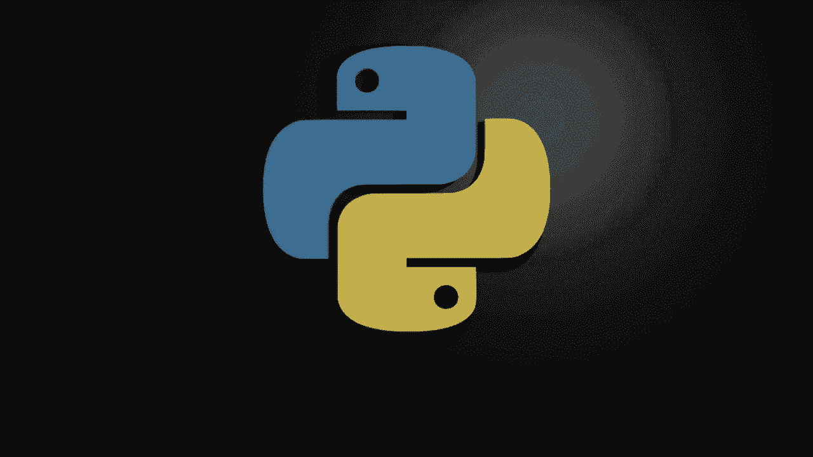
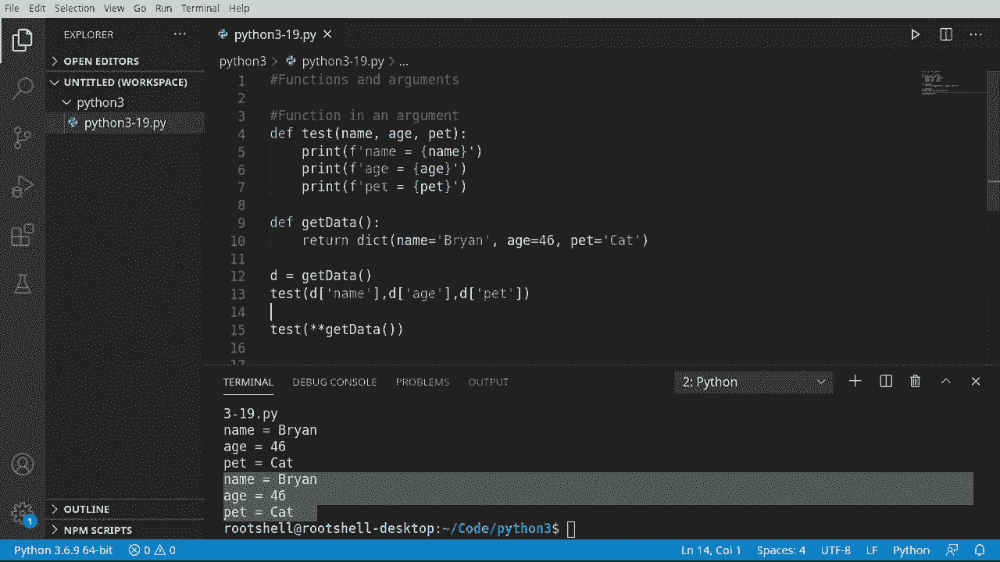
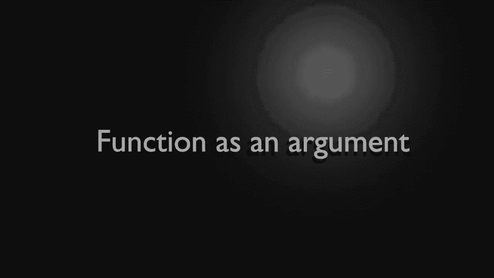
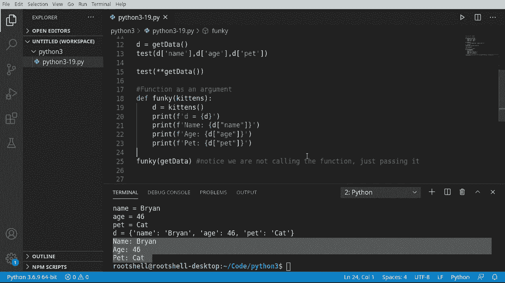

# 【双语字幕+资料下载】Python 3全系列基础教程，全程代码演示&讲解！10小时视频42节，保证你能掌握Python！快来一起跟着视频敲代码~＜快速入门系列＞ - P19：19）函数和参数 - ShowMeAI - BV1yg411c7Nw

Okay， functions and arguments， functions are really cool。

 but wouldn't it be cooler if you could use a function？In a functions。Argument。

 what do we mean by that？ So let's say where we're going to do something like this， de。Test。

 and then in here， we would do something like death。Test two or test1 or whatever we wanted to do。

Not exactly how we're going to do it， but yes， we are going to use functions as arguments。

 Let's dive in and take a look。Let's dive right in here。

 We're going to look at a function in an argument。sounds a little squarely。

 but let's take a look here。 So I'm going to say。Deaf test。

 And we're going to have some parameters here。 I'm going to say name， age and pet。

 we've seen that kind of before in previous video。Good print these out。 Some say print。Do the match。

 copy and paste， we can speed this process up just a little bit。 This going be a super。

 super simple little function here。So we're just going to print out name Age PeT。

 there was vastly easier ways we could have done that。

 but I just want to really print that out one line at a time using the information we've learned so far。

From here， we're going to make another function called get data。

 and this is pretty common not just in Python， but pretty much every programming language out there where you'll have one function that returns some type of data and another function that actually does something with the data。

So， here， we're going to return。diicctionary。Using the well same kind of Ada pattern here。

 some must say。Byan。Inter whatever age you want。 I won't tell anybody if you enter， you know。

 something much younger or older。 if you're into that， I don't know。

So I' just going to return a dictionary of name， age and pet。

Now we have some fundamental problems here。For example， how do we actually use these two together？

 Well， there's the standard way， as I call it。Which you would just call this， stand along， get data。

But now you have to feed it in like this。Best。And you have to do this。 really long， annoying。

You got to get the order right and all this other fun stuff， which is really not that fun at all。

And you can do that all day long。 And of course， if you change one thing。

 you've got to change everything else。 and it becomes just a royal nightmare， but it does work。Yeah。

 we did look at an easier way with packing data or unpacking data， I should say。

 and we're going to say test。And now， we're going to call。Yet data。

But there's a fundamental problem here。If we call it like this and we're actually calling that function。

 we are returning a dictionary， but now we need to unpack it。 example， if I just run it。

 it's going to say missing two required positional arguments。Agent pet。

 So now let's just go ahead and tell Python to unpack that。Save and run but now it works。

 and it's very simple， very easy you can do it all in one line。 super cool the way that works。

Okay， so we're going to cover something a little different。 It's a function as an argument。

 We've already covered a function in an argument right here where we said test。

 and then we've called get data with these parentheses and we had unpack it。

 And we've got all these special characters in the special order that we got to get just right or nothing works。

 We're going to do something a little bit easier。I'm going to say deaf。 and I need a good name。

 Let's call it bunky。 Why not。I don't know what name to give it。 So we're going to call it funky。

 and we're going to have a variable called data。So far everything's very abstract。

 nothing's really defined， we just have a variable called data。

And we're going to make another variable called D。 And it's going to be。The result of data。

Notice how data is being called like a function， even though it's also a variable。Other languages。

 you would call that like a function pointer， but basically what's going on is worthre saying。

Rrab some function and then call it doesn't matter what we name it， we could name this。Kittens。

And then D is going to be the result of kittens。 The name really isn't matter。

 What matters is we are going to call this as a function。 And Python is smart enough to know， hey。

That variable is a function pointer under the hood。 Do something with it。

 So I're going to go ahead and print out。第一。Now to do this， I'm going to say。放见。

And we're going to reuse。Our Gi data function from up here。

 which is just going to return a dictionary object。So here is the important bit。

 I'm going to just say this。Notice there's no stars。 There's no extra parameters。 It doesn't。

Looked like this。It's just the word， yet data。And I'm going to actually put a special note right there。

Let's go ahead and run this， see what it looks like。 So this is the result right here。

 It is our dictionary。And in case we are just super， super concerned with that， we can say。E equals。

And then第。Sa run just to verify D equals。 blah， blah， blah。

 So what's going on into the hood here is we are saying our function is going to have a variable。

 and we're going to take that variable and now treat it like a function。

 and Python's smart enough to go out。And say， O， Funky is getting this guy right here。

 And we're now converting that。To an argument for our function。 that is extremely cool。

 As long as everything just works， we can then go ahead and do something like this。😊，Let's say print。

And we can do this a number of different ways。 I'm going to do it the long way just because why not。

And' go ahead and go D。And we got to worry about those single double quote issues again。

 there are other ways of doing this。Age。If you're wondering where I'm hitting these and typing it horribly。

 it's actually from our dictionary object up here。 So I know we have a name at age and then a pet。

 So let's go ahead and grab the pet， too。We could have done this a number of different ways。

 We could have done for loop。 We could have， tested to see if it was actually in the dictionary keys。

 grab the item。 however we wanted to do it。And Ta just works。

 main takeaway from here is we can actually use a function as an argument and then use that variable as a function。

Very cool the way that works。