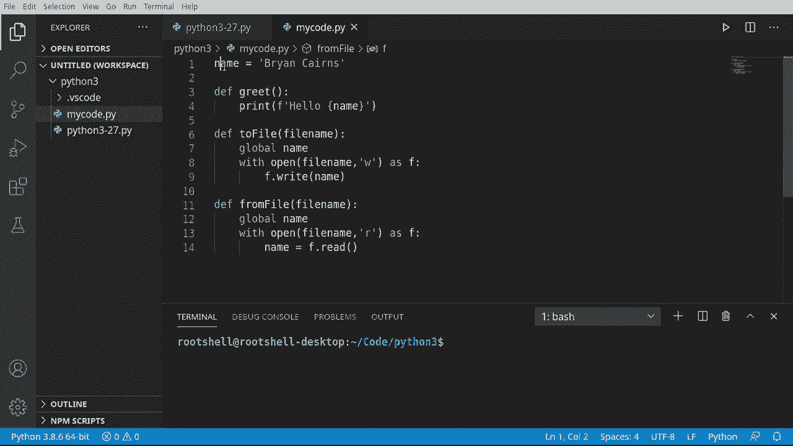
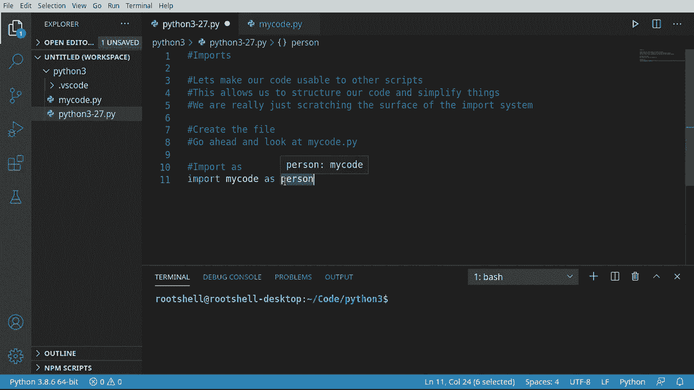
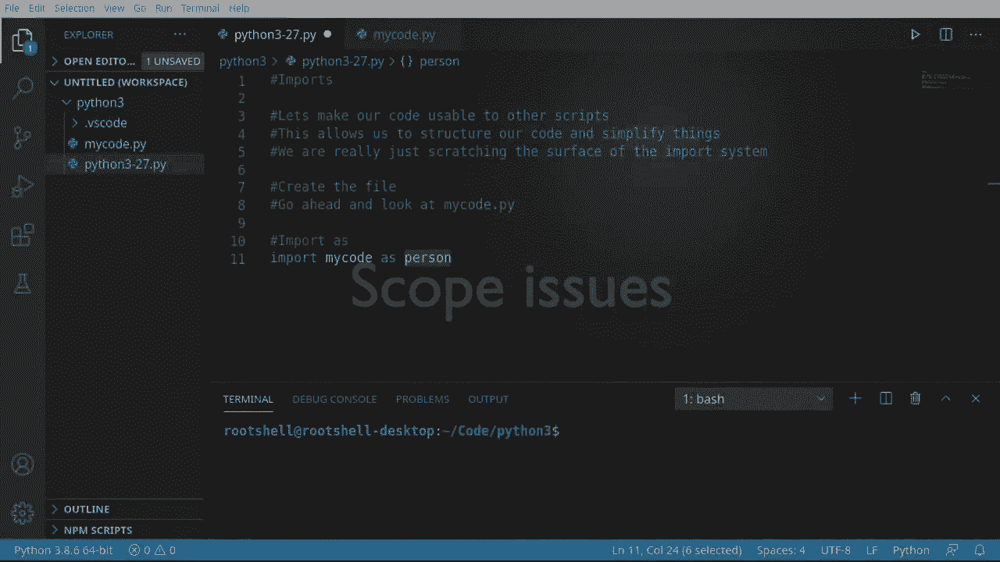
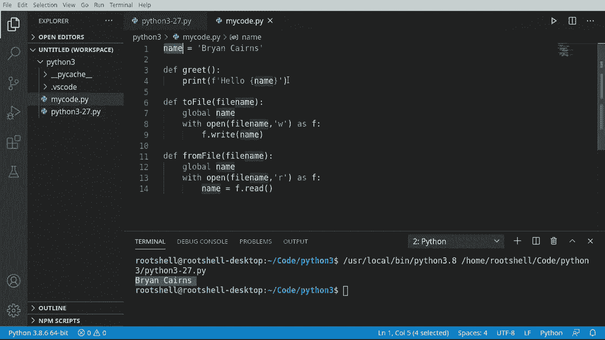
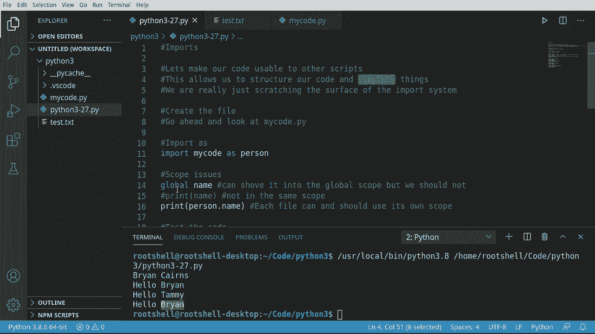

# 【双语字幕+资料下载】Python 3全系列基础教程，全程代码演示&讲解！10小时视频42节，保证你能掌握Python！快来一起跟着视频敲代码~＜快速入门系列＞ - P27：27）导入工具库 - ShowMeAI - BV1yg411c7Nw

Welcome back everyone， this is Brian， and we're talking about imports in this video。

Imports allows our code to be used by other scripts and it allows us to use other people's scripts。

 but most importantly， really what importing allows us to do is simplify things we can actually now structure our code and then import things as we need them。

Now the import system is actually pretty complex， so in this video we are just scratching the surface。

 we're going to talk about some real high level issues。

 and I want to show you how to split your code into different files。

We're going to have to split this into multiple videos throughout this series。

 So we're going to continually go back to the import system and add to the complexity over time。

 Let's dive in。

First things first， we want to make a separate file， so I'm going to just plop in some notes。

 We're going to create a file and I'm going to leave this comment in there for anybody who just doesn't watch this video and just finds the code out on Gitthub。

 It's just going to say go ahead and look at my code Py and we're going to go over here and we're going actually make a new file We're going to give it the name mycode py。

And inside of this file， well， we're just going to add some code here。

 So I'm going to say name equals。嗯。Whatever your name is， why I horribly screwd that up。

 You ain't even spell my own name， right。Actually， I spelled it right。

 I just had a case sensitivity wrong。 We're going to make a function called greet。

And I'm just really freestyling this。 I don't really have anything in mind。

 We're just going to add a bunch of code and functions here。

So I'm just going to make a function calledG， what's going to print out hello and then whatever the name is。

 notice the scope here， name is actually up in the global scope of this file。I'm going to say de。

 and let's go ahead and say two file。 We've already learned how to work with the file system in a previous video。

 If you missed it， go ahead and go back in the playlist and watch that video。M say file name。我不。

Nam really don't need to say global because we're not trying to modify it。

 We're just trying to read it。 Python's pretty leaning about that， but just to be safe。

 we're going to say global。And then open。File name。We want to write to that file again。

 if you completely skippped that video， I would highly encourage you to。Go watch it。

Then we're just going to say F right。 and we're just going to write everything out to the file。

In this case， we're just simply writing the name， we take this。Very simple pattern。

And just change it around。So now we have from file and we are going to open that in read mode。

And then we're simply going to do the exact opposite here。Quick refresher when we say with。

It's going to remove this when we're done with it。 So it's going to automatically close that file for us。

 so we don't have to worry about any of that complexity。Okay。

 so our file is all done and it's not super hard， it's just got a variable and some functions。

Let's go back to our original Python file here does absolutely nothing。Actually。

 let's jump back here and make sure you save that。Now， what we're going to do is use import as。

 And I think weve touched base on this， but we haven't really doven into what's going on here。

 So I'm going to say import。And you want my code。As。And let's just give it a name person。

 could be anything we want。 we could call ice cream cone kitten。Code， whatever we want。

 But what's really going on here is import is saying， import this module。Now。

 module is a concept we haven't really covered， and we are going to cover in a future video。

 But right now， when I say the term module， just think about external code code that's outside of our file。

 So import is going to look in and invisibly， there is a little。Right there。

It's going to look in the current directory for something named My code and directory structures with imports gets a little confusing。

 we' going to cover that in a future video。 So everything right now is in the same folder at the root of your project。

So import this file， there's an invisible dot Py at the end of this。Which is of course。

 my code now if you misspelled this， it's simply not going to find it。Now we're saying as。Person。

So what it's doing here is it's importing this entire file。

 This thing that we've already written has one variable。

 So it's now creating a variable called person。 And you can see how person is now my code。

 So that entire file is now sitting in this variable for us to use。

It gets way more complex than that， but that's about as simple as I can explain it。 Basically。

 we're taking this entire file and converting it into a variable。

Now， at this point， I would highly encourage you to test this， Just simply run it。

 It should do absolutely nothing， but if you had some sort of misspelling or something。

 you're going to get something like this module， not found error。

 And then no module named Na is your key here。 The name is misspelled。

 So let's go ahead and fix that。 Just wanted to demonstrate that。Let's talk about some scope issues。

We can run this and see that it's working as expected， let's go ahead and clear that out。

Let's go ahead and use our global， some to say Global。Name。Not an error。 Thank you In teleence。

 Global name。Go ahead and print this out。What's happening here。Name， error。 name。

 name is not defined。 Wait a minute， what。In our file。

 we have name and we're using it via the global scope。 So what's really going on here。

And what we're trying to illustrate is that a module。Has its own scope。

 so the global scope of the module is not the global scope of your script or your application there。

 two completely different scopes。So。Even though， we can explicitly。Try to shove this。

 even though it's already a global。 we can try to shove it in the global。 It really doesn't help us。

 It's still not to find。Now， if I do something like this， comment that out， run this what happens。

Same thing。 Name， name is not defined。 So it doesn't really matter which way you try。OhThat is super。

 super frustrating if you're newbie。 So how do we get the name out of here， Well， remember。

 we have taken this entire file and converted it into a variable。

 We have made pretty much our own data type。 So we're going to go ahead and print。

Person or whenever you name that。And now we want the name attribute。

And it automatically knows it's a string， so life is now going to be good。

Let's plop and know it in here just so anybody out in Githubland can see easily what's going on。

 Cl this out and run。Oho， it's because I still got this in there。 Sorry about that。

Let's try that again。 All right， So there we go， Brian Karen。

 So if you were like me and you forgot to comment that out， you're going to get that nasty air。

Very good illustration of scope in terms of imports and modules。 Any time you have a new file。

 think you have a different scope。 There are ways to jump between them。But for realistic purposes。

 they are two different scopes and you should treat them as such。

Last thing we need to do is really just do some testing。 So we're going to go ahead and test code。

 And I'm going to add some space is there。 Just get some screen real estate。

Let's go ahead and say person。That name equals， and I'm going to switch this to Brian instead of Brian Karen's。

And else go ahead and do person dot greet。All that function。And let's just do person。That。File。

Let's give this a very simple name。 Test dot EX T。 It's just going to dump that name out to a file。

Let's go ahead and say person。 name。What's Tammy。Go ahead and do the grid again just so we can see that we did change that variable。

Let's go ahead and load that file。Now， as long as our file name matches up。

 it's going to load it just fine。Go ahead and greet again just so we can see that we did actually load that name from the file。

 let's go ahead and run see what happens。So the original name is Brian Cas， I switched it to Brian。

 switched it to Tammy， and then we loaded it from the file。

 and we can see we now have this test Txt out here。So in a nutshell， just to recap。

 imports is a really， really great way of structuring your code and it really simplifies things。

It does have its complexities， which we're going to cover in future videos and we've touched upon a little bit here with scoping issues。

 it gets way more complex than that because what we're really touching on with imports。

Is the cornerstone or the foundation of modules， and unfortunately。

 before we can dive deep into modules， we got to learn other things first like， well， classes。

 which is coming up very， very soon。

