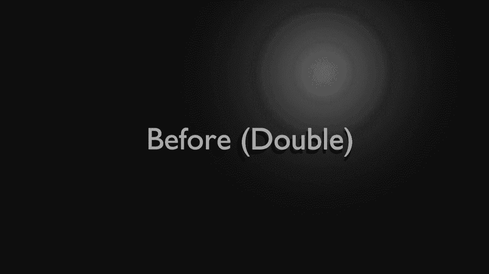

# 【双语字幕+资料下载】Python 3全系列基础教程，全程代码演示&讲解！10小时视频42节，保证你能掌握Python！快来一起跟着视频敲代码~＜快速入门系列＞ - P34：34）底层核心 - ShowMeAI - BV1yg411c7Nw

Welcome back， everyone。 This is Bryan In this video， we're going to talk about the underscore。

 The underscore is often ignored has multiple uses and just gets downright confusing。

 One of the hurdles of learning not just Python， but any language is the syntax。

 and Pythons syntax is a bit different than other languages。 So it often leaves people。

 even season programmers a bit mystified as to what these things are。 For example。

 you could have a single underscore。 You could have a double underscore。 It could be before。

 It could be after， or it could be a combination of before and after。

 but each one of these different methods has。 Well， a slightly different reason for being。

 and we're going to dive in and take a look。😊，The first use case we're going to do is a single。

 and it's going to be skipping。 Now， when I was a young lad， I used to skip school。

 and it had just did not do many favors。 But in this case， skipping is actually a positive thing。

 We're going to say4 X in range。And I just want to print out hello， and I want to print out hello。

 say like five times， do something like that。 So I'm just going to put a number in here。Now。

 do you notice a fundamental problem， X？It's not used。The code runs just fine。

 But if you run this through any sort of streamlining program or any sort of interpreter that's going to try and tell you how to make your program faster better。

 It's going to start complaining that X is not used。

 So what we can do is just simply replace X with a single underscore。

Go ahead and clear our program out and you'll see that it runs exactly as expected。

Basically by using an underscore as a variable you're saying I don't care。

 I just need a variable and I'm not ever going to use it Python。

 make a variable and then get rid of it， that's really what we're saying so in a sense we are now skipping the whole variable process。

Now， to really dive into the complexity of the underscore。

 we need to make a test class that we can play around with here。 so I'm going to go in here。

Say person dot P， Y。 And let's go ahead and say class person。And for right now。

 I'm just going to say pass。 So all we're doing is just simply creating that class。

 and then we're going to go ahead and import it。Or say from person， import start。

Just know that we're going to be flipping back and forth between our script in our class because I want to really demonstrate a lot of the usage of underscore and it's not really apparent why it's needed unless you're working inside of a class。

First thing we're going to really look at here is called the weak private and it is the single before。

 if you scroll up， this is what it looks like right here。

And it's for internal use only it's called a week private because we're playing around with scope。

 and this is why I made a class， as we're about to see here。 So I'm going to get rid of this pass。

I must say， we pride， so。When you get the image in your mind of a weak private。

 what are we talking about here， what we're talking about scope is as far as internal or external。

 if something's private， it's internal to this class， if it's public。

 it's external to the class a weak private means that it's internal to this class。

 but that safeguard is weak， meaning you can access outside of the class。

Even though you really shouldn't， let's go ahead and demonstrate here。

 So I must say underscored name。Equals。有 name。What have we done here。

 We've made a variable called underscore name， equal no name。

 That single underscore denotes that it is a weak private。 We're telling the world that， hey。

 we want to use this internally。 We don't really want the outside world playing around with it。

However。We can demonstrate why this is a weak private， because we can actually play around with this。

 if we want it to。Now， I would highly encourage you not to play around through privates。

 but if you really feel inclined， just， you know， make sure you keep that business to yourself。

And we're going to say self dot underscoreing name。Equals name。

 fairly obvious what we're doing there。 We're just saying the self。

Name this guy is going to equal that argument。Now we can go ahead and print this out and just verify that it did actually change。

Let's slip back here and let's see it in action。Some going say P equal。Person。y。And we want set name。

Ran。Go ahead and run us。 see what happens。 Sure enough， name said to Bryan。

 So it's working as expected。 Now， oftentimes， you'll get asked。

 if you go variable dot and your intelligenceence pops up。 you see all these things with underscores。

 and there is underscore name。Interesting， so really。

 now what we can do is we can grab this guy and do things with it， even though we really。

 really shouldn't。s demonstrate， So I'm going to say。Wait private。

And let's go ahead and change this to P name。So now we can actually read the week private。

And even though we really shouldn't。I' just going to say， no。Even though we really shouldn't。

 we can access and modify that we private。I put no， because you should never， ever， ever do that。

 If you see an underscores in it， do not try to modify it， even though Python will let you do it。

 bad things could happen。 that underscore， that single underscore， denotes its internal use only。

 when we say internal， internal to its scope。 In this case， the class。So yes。

Whomever made this class is nice enough to let you access it。 You really shouldn't。

 You shouldn't rely on that。 Instead， you should rely on functions to get and set values。

Okay， let's just take a step back and let's think about scope for a minute。

 We've talked about internal use only weak privates。 But now we're going to talk about。The double。

 and it's before this is internally used only， and it avoids conflict in a subclass and tells Python to rewrite the name。

 It's also called mangling。 So what are we really talking about here。

 Well we're talking about a variable that starts with two slashes in front of it。

What we're doing is we're telling Python。We want it for internal use only and take another extra step and change the variable name automatically。

Oo， that sounds kind of scary。 So let's go ahead and figure out what we need to do here。

 So let's jump into our class。😰，And I'm going to make a note here so I don'll get lost。

Strong private。 This is what we're talking about here。 You want to have a strong private。

All joking aside。 Let's take a look here。 some say deaf。And I want to underscore， underscore， think。

So。Seems pretty simple， actually， when you think about it， so I'm going to print。Thinking to myself。

 I mean， no one can really read your thoughts。 And if you could。Well。

 we'd all probably be in a lot of trouble。We're going to say deaf。

 and we're going to make another function called work。And I'm going to say self。Undersre。Thank。

And because we're in the same scope， everything works as expected。

But now let's introduce another class。Child。And we've talked about inheritance before。

 so this should be nothing new。 just going to inherit the person class。And we're going to say deaf。

T double， it's need a name。 I don't really care what it is。And we're going to say self。

Underscoore and u O。 notice how。Even though we're inheriting from person。It's not seeing underscore。

 underscore， think。It's just got that。 Well， let's， let's try to force it。

 so we're going to grab this whole thing。And let's see what's going to happen there。

 Let's go ahead and save our class and jump back to our script file here。

And I'm going to make a new instance here。 So I'm going say play good person。

Could have reused the other other instance， but we're just going do a whole new one。

 I' going say P dot org。And let's watch this actually work。 so thinking to myself。

 I can call it as expected。Now， what we're going to do is try to do the same thing we did with a week where we're going to go in here and we' going to say P。

Not underscore， underscore。Think and notice how inc is anyone going to help us out here。

We're going to just try and run that and oh oh。Has no attribute。

What's going on here is we've now made that a strong。

 private and mangling is happening in the background for subclasses。

 so we cannot even access that function。 It's just gone。

 There's just no way to even see it from the outside world。

 but we can see it perfectly fine in our internal class。Oh boy， all right， so let'scious。

I'm at that out and let's play around with us a little bit further here。So I'm going to say C equals。

Child。Remember， a child actually inherits from the person。And in the child class。

We have a test double， which is going to call self underscore underscore think。

 which is actually a part of the person。Where are you there you are。

This is where mangling is really going to be demonstrated here someone say C。And I want to say。

 test double。Any guesses what's about to happen here， let's go ahead and clear this。

 save run and oh oh。Child object has no attribute。 childild think， so。

That's really what's going on here is we're saying that it's only allowed in that class in which it's declared。

Pretty much there's millions of uses for it， but really what you'd want to know is that if you want to make something private and to that class and only that class。

 you would do the double underscore。I'm going to go ahead and comment these out so we can move on。

Let's go ahead and demonstrate a really cool feature。 We're going to talk about after any。Now。

 what are we talking about after any right here， any number of slashes after really。

 there is a good use for this。 Let's say I want to make a class object， and I'm going to call it。

Person。Does anybody see the problem with this before I run it， Raise your hand， You in the back。 O。

 class。You guessed it in valid syntax because class is a key word。Oh that is frustrating。

 I really wanted to name this class。Well， this is where。

We can do something like this and really what we've done is we've create an entirely new name。

 but we can still call it class。Pritifies it， is that even a word preifies it， beautifies it。

So we can use the word class， but we can still not have a naming collision。

With any of the keywords and that's really what this is designed to do。

Is it helps avoid naming conflicts with key words and then from here。

We can just say something like no print。Class， and then we can print it out。

 work with it as we want to。See，h made an object and everything's going to work as we would expect。

Wrap this whole thing up， we're going to talk about both and after and we've used this before。

 and this is considered special to Python for functions like init and main and things like that we've seen it before。

 but I want to kind of go into our class here and look at how we could actually use it。So。

 let's go here。We're going to say before and after， and of course， we've done the。In it。

If you skip that video， basically this is the constructor。But you notice the syntax here。

 we've got double before and double after。 So basically。

 what we're telling Python is this is going to be internal to the class。

 and we want to avoid naming conflicts。 And at the same time， it will not mangle it for subclass。

 But each subclass will have its own instance。 That's how we can have a constructor for person and a constructor for child。

 We covered that in our video about the initializer。

So let's go ahead and make our own function using before and after， I'm going to say death。哦。

It would been really cool if I would have like spelled it right the first time。 There we go。

And I'm going to just say print。Awesome one。So it looks pretty simple。

 And it's actually in the spirit of Python。 It is dead， simple， and it actually works as expected。

 So let's go ahead and say P equals。Person。E dot underscore underscore。

 and you notice there's a lot of stuff in here that starts with underscore underscore。

I'm going to say call。And we're just calling a function here。Say run and call someone to it works。

Now。Side note， I would not recommend starting any function that you want to be accessed outside of this class with an underscore。

 simply because the underscore。Starts with a weak private。

 which you're basically saying to the outside world， hey， this is going to be internal to the class。

 and it gets stronger from there where you can actually start mangling it。 or you can tell， you know。

 everyone， hey。Internal， don't want you to use it， but also don't mangle it。

 That's the before and after。When in doubts。Double underscore is your friend。Before and after。

 if you do it with the mangling effect for strong private， you may start having some weird issues。

So always keep that in mind。But the general rule of thumb is anything private's going to start with an underscore and do not access anything private in a different scope。

 even though we've demonstrated how to do it， it is not the best way of doing things。

 You should use a getter and a setter， which we've demonstrated like right here， set name。

