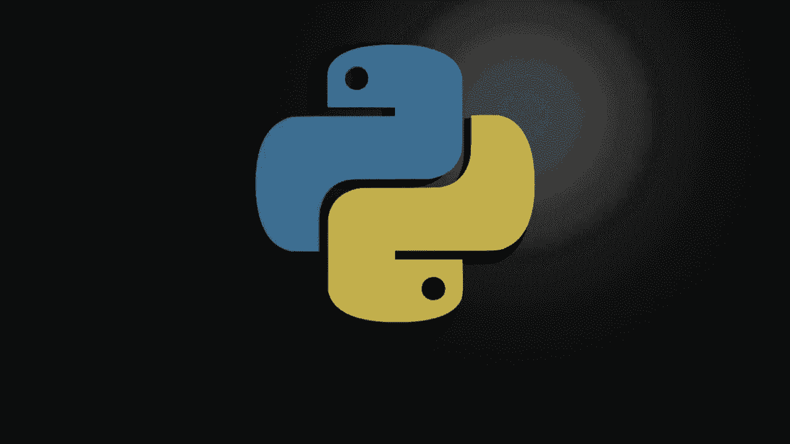
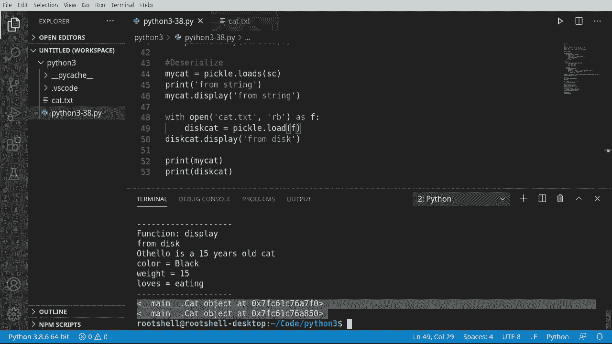

# 【双语字幕+资料下载】Python 3全系列基础教程，全程代码演示&讲解！10小时视频42节，保证你能掌握Python！快来一起跟着视频敲代码~＜快速入门系列＞ - P38：38）使用 Pickle 进行序列化 - ShowMeAI - BV1yg411c7Nw

Welcome back everybody， my name's Brian and this video we're going to talk about pickle。

 everybody's favorite， so what the heck is a pickle what are we even talking about this made me giggle so bad when I first was reading about it so。

Pickling is a way of saving food。 It's a very old way of doing it。

 And we're going to do the same thing with objects。 So we're going to serialize them。

 which is a more modern term， but we're going to preserve an object。

 and that object can be saved and stored in another location， for example， on a disk。😊。

So that's right。 you can make an object， save it， start your program back up and reload that object like nothing happened。

 This is incredibly cool。 This is called serialization and it gets very， very complex。Pickle。

 while being great is not perfect。 It does have some limitations。

 I would encourage you to go out and research dill， D I L L。

 and there are other serialization tools out there as well to overcome some shortcomings of pickle。

 We're going to go over just the very， very basics of pickling。So。What can you pickle first off。

 pretty much most Python data types and top level classes。

 meaning if you make a class in a class in a class， in a class。You're going to have problems。

 so first things first。Let's go ahead and import pickle。Okay， diving right in here。

 first thing we're going to do is we are going to put in a decorator。

 same decorator that we've used in the previous videos and if you missed my decorator video。

 kit rewind on the playlist and watch the decorator tutorial。C you missed it。

 all it's going to do is print a line。Print the function name， all the function， and print a line。

All right， so our class is going to be overly simple because I'm focused on serializing and desializing this。

 We're looking at just the basics of serialization。 So we're going to say cat。And then。

 we want to go deff。And I'm going to in it。And we want to。And it。With name。Page and info。

So name and age seem pretty self explanatory。 We're looking for like a string in an integer。

 But what is info。That's why we want to really dive into this video things are not always what they seem so。

We're going to say self。 name。Equals name。And then we're just going to through the magic of copy and paste。

Al be best if I just grab it right on the top there。And whoopsy， we don't want to mangle those。

 There we go。 Almost created a little headache for us。 So we're going to say self underscore name。

 self underscore age， self underscore info。 Again， the underscore denotes that these are internal to the class。

 and we don't want other peoplele playing with them。

 So from here we're going to make a this be function。And we want to display some type of message。

Let's go ahead and use our decorator。Just to decorate that， make it look nice and neat on the screen。

And then we're going to just print out the message。Whatever the message is。

But now we also want to print。And we want to put the。Or to put the name。Along with the age。Is a。

Or I should say， is is old。HThat doesn't make much sense， does it？

I help the by spelled all of that correctly。 There we go。So name is a age years old cat。 There we go。

 makes more sense now， and then we're going to take info and that's going to be a dictionary item。

 So I'm going to say four。Okay， come a be。In self underscore info items。

That way we can iterate through those dictionary items and print them out。

And then we're going to just say。That was that。Pretty self explanatory what's going on here。

As you can see， this is not a super， super complex class。Just wanted to cover the basics of it。

 So you knew exactly what we were doing。 I'm going to go ahead and make an instance of this。

 I'm going say o fellowello。This was the name of one of my cats。Unfortunately， Kitty passed away。

 He was probably the best cat I ever had， but I loved him to death。All right， so Othello。15。

And then we're going to make a dictionary。And fill。一个Y。Wait， oops， wait， he was a very fat cat。

And he loves。Eating it was like his hobby， it was almost like a competitive sport for this cat。

And then we're going to say。Oh fellow dot display。 Just wantan to test this out。

Before we do anything else， I're going to say display。Nexting。Same run， O O， self info。

 What do we got here，38。9ine30h yes。Little bit of an issue there。

See the previous tutorial I did on air handling。 All right。 so let's go and clear that。 there we go。

 So function。 And we can now see our decorator is working as expected。 There's our line。

 There's the function name， our message， and then Othello's 15 year old cat color black weight loves eating。

 and then in decorator。 So everything is now working。😊。

What we're going to jump into next is actually serializing and desializing this object。

 Notice how we're not talking about serializing the class。Because the class is a blueprint。

 we're going to serialize the actual object。All right。 fasten your seat belts。 Here comes the pickle。

 I almost' feel like I should have like a pickle with a cape on it or something。

 But so I'm going say。Lets see， which is short from serialized cat。

 And we're going to say serialized cat is pickle。 I pickle when I say that。

 So we are going to dump S。 If you remember from a previous video， if it ended in S。It was a string。

 So that's exactly what's going on here。 Sam convention。

 So we're going to dump to a string and we're going to dump the othello instance of that cat to a string。

Now， I'm going to go ahead and just print this out。Say run。

This is what Othello looks like after he's been pickled。 And man。

 that sounds really morbid pickling a cat。 But so you can see some familiarity here。 underscore main。

 so you can tell exactly where that object is。 And then it's got like name。 And then you see Othello。

 and there's some data in here。 So this is really what pickle is doing is it's dumping it into a pickle format。

 This format is not compatible with applications outside of Python。

 and it's not what you would call backwards compatible。

 meaning you can't take the newest version of pickle and then serialize something and load it with an older version of pickle。

 That's more advanced video that we'll get into in the future， But just keep that in mind。

 That pickle will try to use the newest version。😊，So let's go ahead and save this。

 some must say with。Open。And we want some sort of bio at cat。 TXt。And we want to。Right binaryary。

 because this is a binary file。 We're going to write this out。As F， remember， if we do with。

 it's going to open it， give us a variable called F。

 which stands for the file and it's going to close it automatically when we're done。All right。

 so we've got this。 and we're going to say pickle。Dump so this is the difference between dump S dumps versus dump with no S。

 D is's going to say what do you want to dump， I'm going to give it an object。

 and I'm going to tell it where。 So we're going to dump that to a file。

Go ahead clear this out and let's run it。 So now we have this cat file and it says files not displayed in the editor because it uses unsupported text encoding。

 All right， so we're going to right click and we're going to open with And in a previous video I showed you how to install the hex editor。

 but just in case you go out here and you just type in Hex。And there's a hex editor。

 you just install it。 So flipping back， we're going to actually get rid of that。Going to right click。

Open with exed。 And this is what the serialized object looks like。

You can see it is verbatim the same thing， but we've written these bytes out in a binary file。

We can now take this file。And say email it or transport it across a network or leave it sit on a hard drive。

 whatever we wanted to do and have another Python program。De serialialize or open it back up。Okay。

 now that we've serialized and we wrapped our head around the serialization or the pickling process here。

We're going to de serialize， which is the exact opposite。 It's reading the information back。

 Some must say， my cat。Equals， and I want to say pickle。That load S。

 because we're going to load a string。And the string is the serialized cat that we did up here。

 So we're just going to grab him。Pp it right there。And I'm going to print。From string。

Just so we know where we are in the console。And we can actually just say。My cat。A display。

And from string。So really， what we're doing is we're taking the string representation of that cat and notice how it's got a eat be in front of it。

 that's denoting that this is binary。So it's going to， I should say， bytes。

 but it's going to take that as a string， put it into pickle and then load it back into a usable object that we can call functions and run code on。

 This is extremely cool。😊，So there。Rumstring， rumstring。 and it's exactly the way it was。

 It tells a 15 year old cat。 He's black 15 and loves to eat。

 So we have revived my cat back from the dead。Crazy， as that sounds。 Weve unpled my cat。

So this is really， really cool。 and just to prove that we can do this from a file。

 we're going to literally take this。Cobby， paste。And we're going to say， set right binary。

 it's a read binary as file， and we're going to pickle。Load instead load S。

And we want to load that file。And I'm going to say。Disk。Short for disco cat， why not？

And we're going to take that。And then we're going to say disc display。From disk。

And so what this code is going to do is' going to go out， open this binary file。

Open with Hex editorit， it's going to load the bytes from the file， create an object。

 and then we can now work with that object， but these are now different objects even though they're coming from the same data source。

诶。R diskk。Othello， color black， weight 15， loves eating。Now。

 if we do something a little bit interesting。Just to wrap this up。I'm going to print these out。

 I'm going to print。My cat。 And I'm going to print。This cat， just to show you what's going on here。

You can see。Hat object at。 And then they are two。Different memory locations。

 meaning these are now two different objects。This is one of the little cautionary tales of serializing and desializing is you can actually save an object and then reload that object multiple times and you may not want two othllellos personally I'd love to have two that cap。

 but it may not be your intent， so be a little bit careful when you're desializing your objects。

