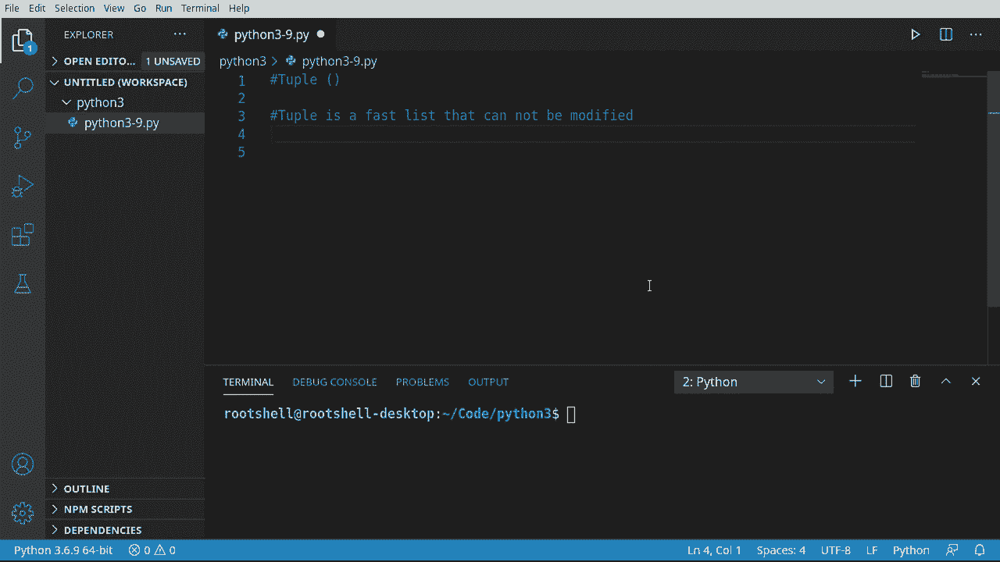
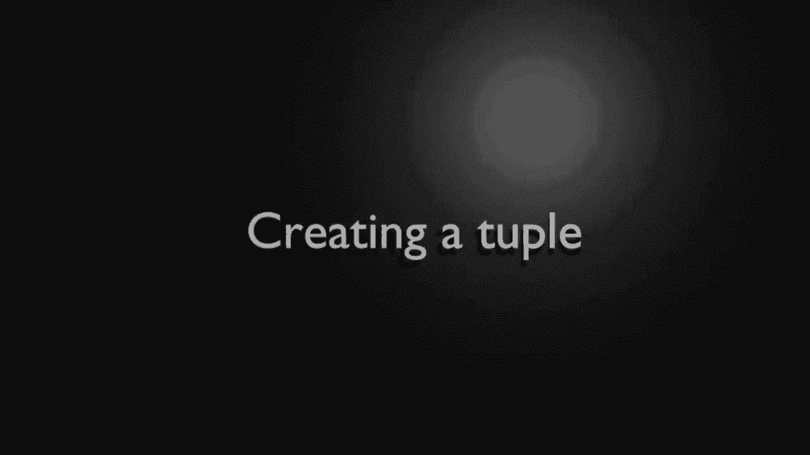
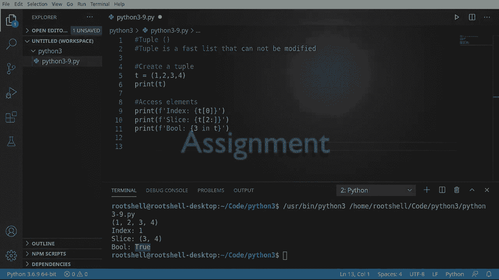

# 【双语字幕+资料下载】Python 3全系列基础教程，全程代码演示&讲解！10小时视频42节，保证你能掌握Python！快来一起跟着视频敲代码~＜快速入门系列＞ - P9：9）Python元组：快速且只读 - ShowMeAI - BV1yg411c7Nw

Welcome back， everyone。 This is Brian。 Let's continue our journey into Python 3 with the tuple kind of a funny name。

 but this is really， really cool。 So a tuple is a fast list that cannot be modified。 It's read only。

 Once you create it， you can make zero changes to it。😊。

This thing exists solely to exchange data and it's typically used between classes， between objects。

 between frameworks and between devices。 For example。

 let's say somebody made a package that was going to give you this CPU and Ram and hardware and all this cool information about your device。

 They don't want you to be able to modify that。So it may seem kind of plain and boring on the surface。

 but you can do some really cool tricks as we're about to see。

First thing we're going to do is create a tuple。 go ahead and make a variable named T。

And's give this an assignment。 notice how it's got these little curve brackets here。

When you see these curveb brackets， think of it like a shield defending it because it's read only。

 you cannot change this。We're just going to give it some information。

 We don't really care what we put in there because we're just testing it out， say print。Anti。

You guessed it it's got these curved brackets， and that is what denotes it's a tuple。

The major takeaway here is the different style bracket denotes what it's going to be。

 whether it's a tuple， a set or a list or a dictionary which we haven't covered yet。

Now that we have a tuple， let's look at how to access the elements inside of that tu。

 It's dead simple。 We've done this before。 Let's go ahead and say， print。F。

 and we're going to access via the index。Give it our index position。

 remember this is a zero based index， so zero is actually the first position and then one two and so on and so on。

Run works exactly the way you would expect it to。Let's go ahead and do a slice because slicing is pretty easy and fun。

And we're going to grab this and say， I want to go from two to the end of the couple there。

Works as expected。Go ahead and clear this out，Let's look at a bull operation。

What we want to do now is we want to look for something specific inside of that tuple I want to say is3 in T。

What this is going to do is tell Python hey， take this value and inside of this tuple。

 and it could be a list or a set or a dictionary。 we haven't covered dictionaries yet。

And it's going to search and see if it's actually in there。Let's a returnable saying yes or no。

 in this case， true because three is right there。

This is extremely easy to work with， and it's blistering fast。

Okay， bonus material， let's talk about assignment。When I say assignment。

 what are you really talking about， I mean， tuples are kind of boring。

 You create them and you can access elements other than that， you're done。Well。

 you can do some really cool things， not just with tuples with lists and sets。

 but tuples make it really simple to understand。So we're going to make it tuple。

 and we're going to put some variables。 These are not values。 These are variables。

 Remember of variables， something that'll change X， comma Y， comma Z。

Now I'm going to make another topple， and we're going to give it values，1，2。3。What are we doing here。

 what we're saying take these variables and give them these values and Python under the hood is going to figure out which one needs to be which。

Then print X。Let's print Y。And let's go ahead and print Z。See this in action，1， two， three。Beautiful。

Now let's talk about the range function， and this is something that a lot of people don't really talk about too much。

You just see it and you expect that it'll just magically work， Let's grab this。There we go。

 So we've got X Y Z， and we're going to get rid of this right here and we're going to say we want Python to do all that work we don't want to sit here and type out values all day long。

 so I'll say range。And let's give it a one， see what happens here。You're expecting an error。

 you got an error。Not enough values to unpack expected three got one。Well。

 let's just test thisthere and say we want 6。 We're going to give it more than it needs。 And。

 of course， another error too many values to unpack expected 3。 So it's telling you， I demand 3。

 Where's it getting 3。From right here。Under the hood， Python is making。A tuple。Of variables。

 and we can assign to those variables using the range function。Now。

 range itself is not returning a tuple。 We can test this out by just simply grabbing this。

Then print this out。 We're going to actually print range 3。Notice how we got 0，1，2。

 So there is our range， but then we're printing range 3 and it's saying range 0 to 3。

So what we're really expanding upon here is that the range itself is telling Python。

Go through a loop， something we're going to talk about in a future video。

 but you have a start and an end。 we haven't really given it a start name。 We just said， hey。

 make three values。 It's going to start at 0。 go three times。What if we don't want to start at zero。

 we want to start at one。Well， we give it a。Start。And now we have to give it an in position here。

Forward。Why4 because we need a starting position plus a length of how many we need to unpack。

 which is four。1 plus 3 equals 4。hNow it just works exactly the way you think it would。

