# 【双语字幕+资料下载】Pytorch 进阶学习讲座！14位Facebook工程师带你解锁 PyTorch 的生产应用与技术细节 ＜官方教程系列＞ - P11：L11- PyTorch 性能 - ShowMeAI - BV1ZZ4y1U7dg

🎼。

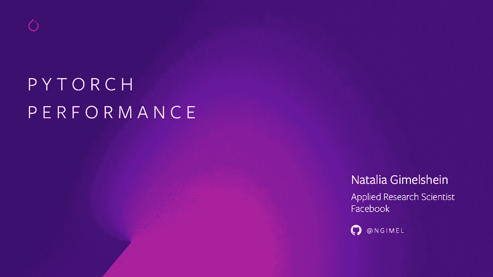

Hello， I'm Naal Gahan and I'm an applied research scientist at Facebook and I work on Pytor performance。

Today I will talk about low precision support and new obstructions for performance that we've implemented in Pyrch and operator benchmarking。

So low precision support。😊。

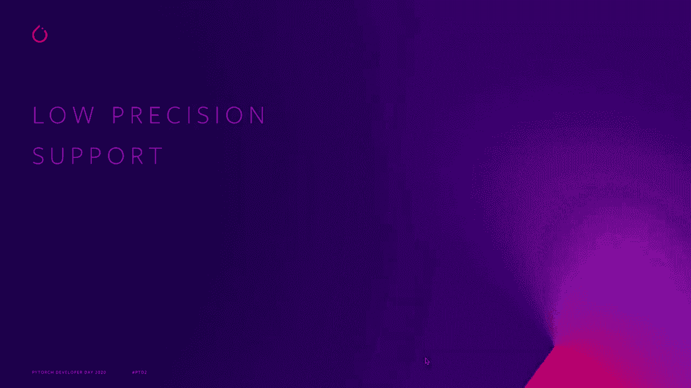

On modern hardware you can sacrifice a little bit of precision to achieve a substantially better performance Pytorch makes working with low precision data types easy and convenient with support quantization but that's covered elsewhere I will mostly be talking about T32 and physics6 data types and before 16 is undirected development for CPU and GPU and it is already supported on PytoroticsL。

The diagrams on the right show the memory representation of the correspondingent data types green boxes are exponent bits。

 red boxes are monicip bits。😊，You can see that before 16 can represent a wide dynamic rangee with eight exponent bits。

 it's the same dynamic rangee as for standard FP32 data type。

 however it only has a limited precision with 7 minusisab bits FP16 is making an opposite tradeoff and it has a limited dynamic rangee with a better precision T32 is the best of both worlds。

 its dynamic rangee is the same as the standard FP32 data type。

 but it has as many monisab bits as a P16 does。T32 is enabled in a byytor on new MPR GPUs It is backed by 32 bit storage so standard networks can transparently benefit from it when computationally intensive operations read input data they read only 10 bits of mons so there is some acurcis。

 however internal accumulation happens in a P32 so we don't expect any effect on conversions。

You can turn T32 on and off to see its effects on performance and conversionvergence using the commentss below with benchmark in approximately 3x speed up on Hi face Roberta model and approximately2 x speed up on ster conves such as Resn that's compared to FP32 performance on the same hardware。

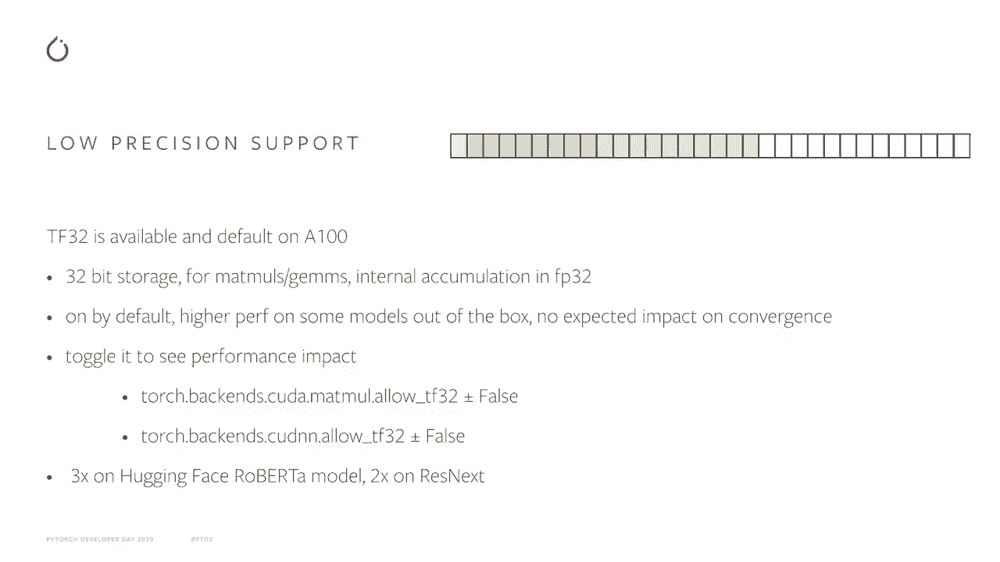

TF32 works out of the box and doesn't require changes to existing scripts and that's great however if you are willing to change your existing script a little bit to achieve even a better performance。

 FP16 can be useful。Automatic mixed precision is now supported in Pythr and this feature has evolved from popular ABIX package maintained by NviD。

🤢，It automates training of networks in FP16 and takes care of numerical issues that arise in a P16 training due to its limited dynamic range。

InPyrche was designed to cover a wide range of use cases。

It supports operations on unskilled gradients， it supports operations on Sprse gradients。

 higher auto gradients can be computed via torsche autograd， custom autograd functions。

 both Python and C+ path are supported if you have complicated scripts involving multiple models and multiple losses that is supported to。

Andter example and documentation are available on Pytor's website。

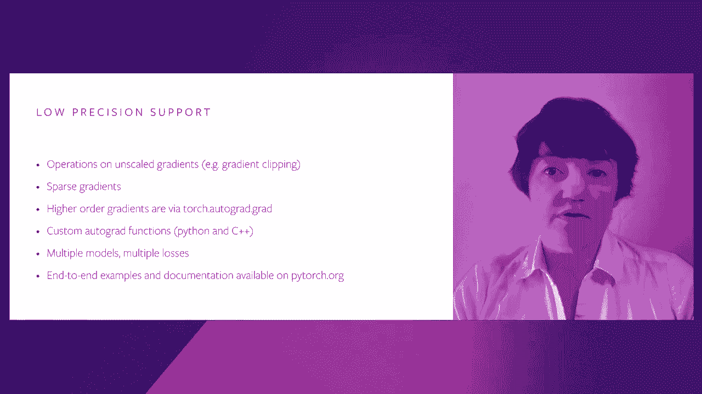

This is a simple example of using amp。 There are two important parts。

 The first one is scalar object that controls all scaling and the second one is M Autotocast context manager all scaling is required to ensure conversions and numerical stability and Autocast context manager make sure that mods and convols are run in FP16 thus achieving the best performance while operations that require full precision are run in FP32。

Finally， there is a slightly different syntax for calling an optimizer step and you also have to update a low scale for the next iteration as shown in this snippet。

 but overall the code changes required are pretty minimal and you should be able to achieve an even better performance than you can with TF32 Also if P16 is supported on all the regens of GPUs such as Volta entering。

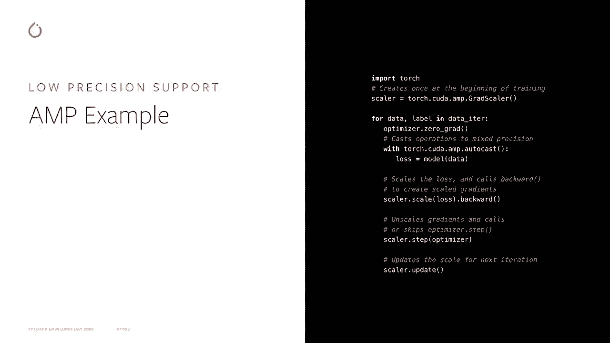

Now let's move on to the next topic and that's channels lost in many backends and for many data types such as for example。

 T32 and FP16 that we've just discussed， convolutions perform best when data is in channels lost format Pyr supports channels lost physical memory format while preserving traditional semantic meaning of the dimensions so for example for four details our first dimension is still number of batch elements second dimension is channels and the rest are spatial dimensions。

To fully take advantage of channel SA support， all or most operations in the model have to support channel SA and most operations in Pytorrch do。

 for example， a popular model in TorchViion are covered。

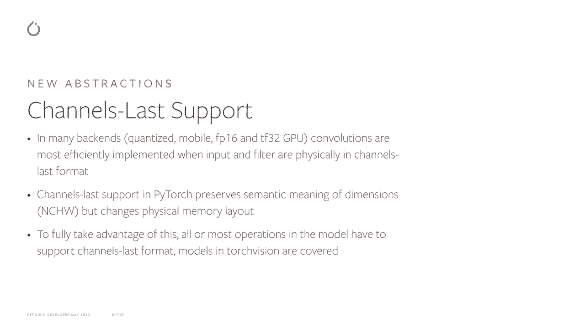

Here we have a small example that shows how to convert model to channels Los format by calling a helper function。

 the input has to be in channels Los format also， so you have to either modify your data load to directly provide input in channels lost or call a conversion function on input manually December in the script。

Input layout is propagated across most operations， so intermediate variables in the network will remain channel fast。

Copy and Tensor factory operations also preserve layout as shown here on the example ones like operation。

 similar like tensor factories will also preserve the layout of their inputs pointwise operations always preserve the layout of their inputs and copy operations also produce the outputs in the same format as the input was for Convnets you can expect about 20% gain from switching to channel cost。

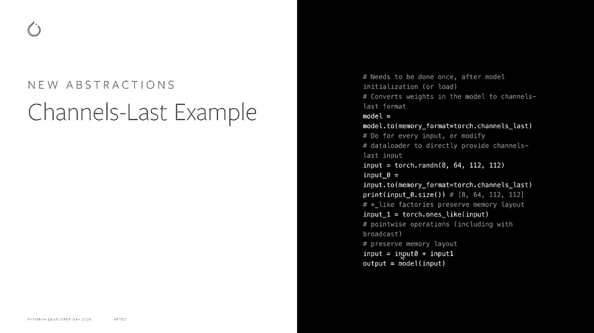

Another interesting feature that we implemented in Pythr forage APIs that provide efficient pointwise operations on batches of tensors。

Instead of launching a small kernel for each tensor in the batch。

 for each launches a few larger kernels， each processing many tensors。

This pattern is especially common and useful for optimizers。

Even now you can avoid launching multiple kernels if you copy the tensors to a contiguous memory region and then operate directly on this contiguous memory region。

 but this requires extra memory and can be brittle if different subsets of tensors participate in operations for each operates on tensous in disjoint memory regions directly and lists can be cheaply assembled before each application。

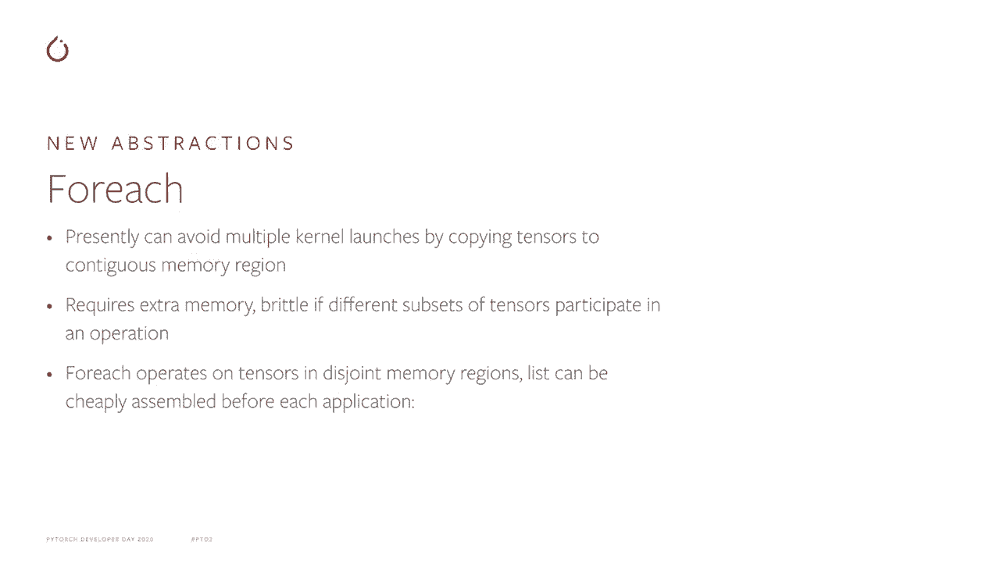

Here are the timelines that compare operating on batches of tensors in a loop and forage。

The GPU timeline for a loop is shown in the bottom row。

The you can see that GPU here is idle most of the time， they are very short kernel。

 but mostly it's space between kernels CPUU is busy constantly launching those small kernels。

In contrast when we are doing the same operation using4H APIs。

 GPU is always busy and it's running a relatively larger kernels CPUU is busy in the beginning submitting those kernels but then it idle for the rest of the time while the upper timeline shows just a handful of tensors processed in the lower timeline a few hundred tenors were processed in the same amount of time。

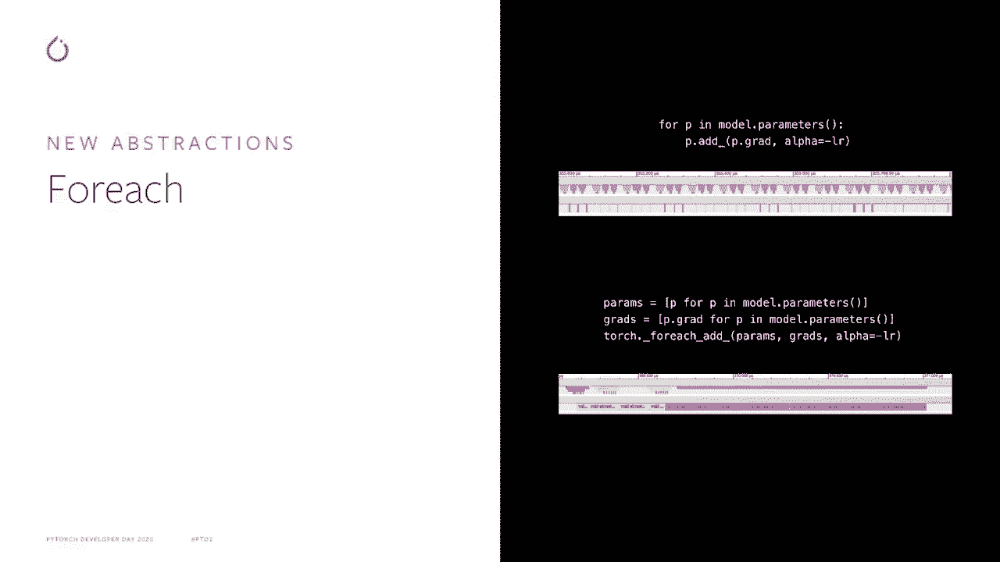

Poche 107 has common optimizers implemented using forage APIs for and they achieve approximately from3 to 6x or even larger speedup depending on the number of parameters in your network。

 forage is also easy to use to implement your own optimizers or if you have the patterns in your network that require operating on the irregular batches of tensors。

So give it a try， replace your optimizer with forage based， and see if it improves the performance。

Finally， let's talk about benchmarking utilities。Pytorch benchmarking utilities are aimed at Pytorarch users and developers。

 Of course， you can roll your own benchmarking utilities。

 but it requires taking care of a few problems。 You want benchmarks to run long enough to get reliable time and measurements。

 but you don't want them to run forever you need to collect statistics to estimate noise in the measurements。

 you need to make sure that you are comparing apples to apples that all synchronizations are called and multith on the CPU is properly controlled。

 If you are a developer working on a new operation for Pytorarch or if you are working on an existing operation。

 you want to make sure that the performance is good for a variety of input sizes and not just for a particular input size resulting in hyper optimization After all your benchmarking is done you are likely left with a wall of numbers that is hard to analyze and represent so you need some way of post processing the data Our benchmarking utilities make all of these things easy Thisnippet shows how to use timer and compare Apis to compare performance。

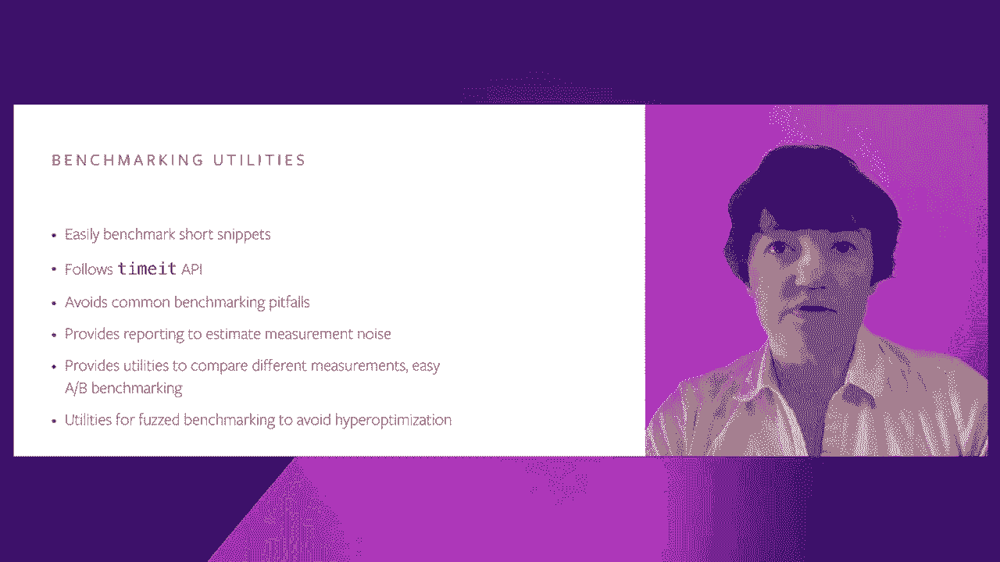

Of two similar pytharch operations take and gather on the different data types timer APIs are modeled on Python times。

 so they should feel familiar。 They also have some additional options to include metadata to make subsequent analysis a little bit easier and the left part of this slide shows the output of this script where the times are shown in tabular form。

We hope that you'll find our benchmarking utilities convenient。

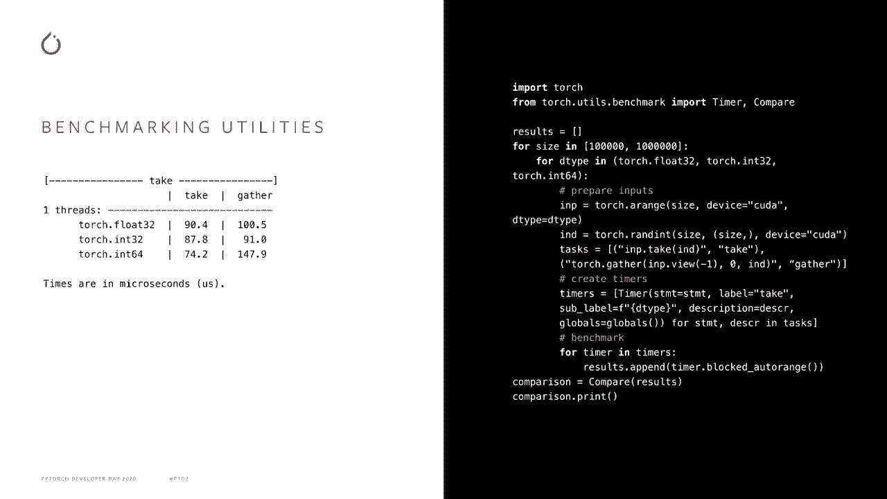

Here are resources that you can use to get more information about the topics I've talked about。

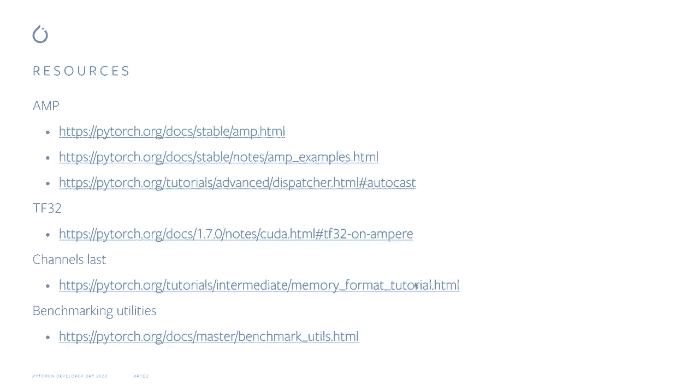

Thank you for listening and hope to see you at Pyr's performance discussion。

