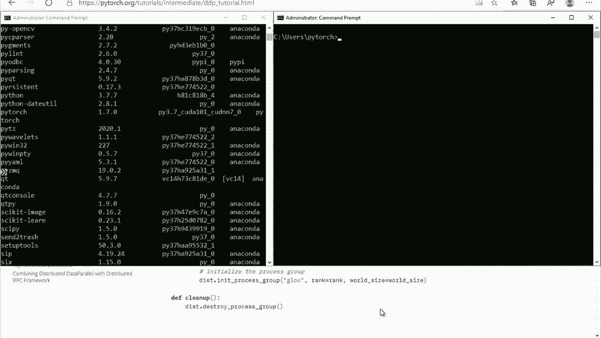
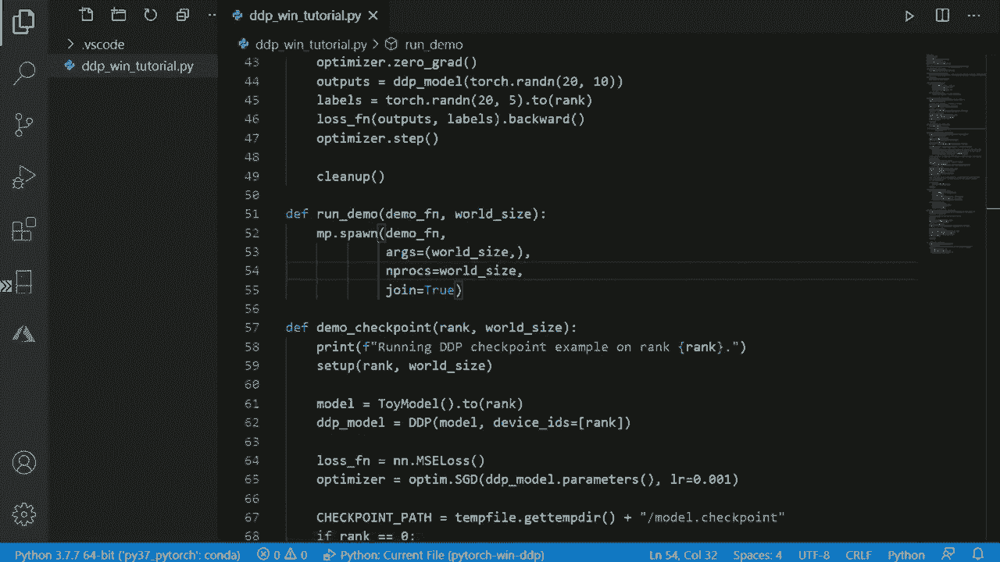

# 【双语字幕+资料下载】Pytorch 进阶学习讲座！14位Facebook工程师带你解锁 PyTorch 的生产应用与技术细节 ＜官方教程系列＞ - P12：L12- Windows 上的 PyTorch - ShowMeAI - BV1ZZ4y1U7dg

🎼。

Hello， let's talk about recent improvements we made in Windows Pla support。

I'm Max Lucano Product manager working at Microsoft， in Azure AI platform Team。

Some of you might wonder why Microsoft is talking about Pytorch and Windows， let me clear this up。

Recently， Microsoft has become a main of Pythtune Windows。

Our goal is to improve quality of the Windows platform support so Windows users have great experience building AI applications on the platform of their choice。

In this segment， we' will talk about recent progress we have made in enabling various features of Pytorch on Windows platform。

The recent one of the major features that we have enabled in the current release is distributed training。

 so we'll talk a little bit about that。And we'll also demo how distribute the training workss on Windows。

But first， let's talk about YV as a Python community should care about Windows platform。

According to latest SeflowDevelop survey， Windows remains to be most popular operating system among the broadest audience of developers。

And this might not be the case for today's Pythers community。

Because today's Pyths community is biased more towards professional researchers who are comfortable working with Linux and Maccos。

But if you look into the future， if you look into the next set of users that we would like to bring into Pytororch。

 then Windows users would be the greatest of the largest set。

And this is further confirmed by our own user research if you look at the LinkedIn profiles。

 then the number of machine learning professionals people who claim ML proficiency on the LinkedIn profiles and but who don't have PhD degrees is seven times larger than the number of PhDs and even also in the last year this number of non PhD ML professionals have grown almost doubled in the last year。

 well the number of PhDs obviously haven't grown that much。

So this means that potential future users of Pythtorch are software engineers and analysts and those users who have great care for Windows platform。

Let's talk about the state of Pytorch。First of all。

 Pytorch and Windows is a community effort and through this community effort。

 we have achieved fairly good state actually in terms of breadth of coverage of various features of Pytororch。

 we have as you can see from a table we have a good coverage as well。

There are some gaps when it comes to depth of coverage of the features。

 and so we'll need to do a bit more work there。The original acknowledgement should go to Je and Poo was the original author of who brought the Windows platform support to Pythtorch。

 he basically single handedly implemented original Windows support and he recently also added Torch audio support as well。

On our side at Microsoft， we have started actually working on Windows and now we have four contributors working in the space and two of them have become long term maintainers。

We started with improving quality of the Pythtors built。

 so we added test automation to bring it on par with Linux， the improved tutorials。

 so new users of Pyths have great experience learning Pythtorch and Windows。And this release。

 our major release， the features that we have enabled is distributed training。

 and we'll talk a little bit more about that on the next slide。

We also partnered with Vi Amazon on bringingian Windows support to Torservve and Elijah Repert's worked on bringing Windows support to job Bi as well。

 great thank you here as well。So this will be the training。First of all。

 it's available now in the latest 1。7 version of Pyth， so if you install it on Windows。

 you' will have the binaries that support distributed training already。

Both multi GPU and multinode configurations are supported one cave here though is we haven't spent much time testing multin yet。

 so please expect it to be unstable at this point， but we plan to do additional testing in the upcoming releases。

Pythtorarch has two types of distributed training distributed data parallel and a new RPC framework in this release we enable an distributed training distribute the data parallel mode and we look forward to enabling RPC in the upcoming release as well RPC is exciting new features that is going to be used in a variety of the new features of Pythtorch so it's important to bring that to Windows as well。

The situation is a little bit more complicated on the distributed drain backend front in the current release we have ambulance glue backend but the niel and MPPI backends are not currently supported the situation with NikIel is even more complicated because NikIel is supported by Nvidia and Nvidia doesn't provide support for Windows platform so we will have to work with Nvidia and figuring out what the plan here for NikIel backend。

With that， we are ready to dive in and to actually see in action how byytor Windows works。

So what I have here is an Azure virtual machine equipped with a powerful DP。

So let's see in VDdia SMMI， you can see that we have two NviDAV100 GPUs on this machine。

 so that should be plenty of horsepower to do some speed up improvement for our model training。

 so let's see what we can do here。I also have Pytorchs latest version of Pytorrch installed here。

 of course， 1。7 with Kudo support。And now we can go to Pythtorch tutorials and see what kind of。嗯。

Sample we can use here so Python tutorials， as I mentioned。

 we have improved some of them and actually all of them and enabled their smooth separation on Windows platform so let's choose this getting started with distributed data parallel so this tutorial guides users through three examples of various types of distributed data parallel training and it provides sample code to perform that on their own machine。

 you can see that we added some Windows specific instructions here to make sure that users succeed on the Windows platform。

I have copied this source code into my virtual machine。

 so now we have this tutorial represented in my visual studio code environment。

And we can spend a little bit of time exploring， but models we are actually going to try and then run this example。

So first comment that you might have you might see here or first point that you see here is initialization method PyTtorch supports three initialization methods。

 TCP IP communication environmental variables and remote file store so currently that's one of the limitations of the releases we only support remote file store。

 so this is where we specify the path to the file which is used by workers to communicate their configuration settings to each other。

In this case， we use single machine with multiple GPUs。

 so we are just using local file for communication between two。

 two workr processes running on the same machine， for the case of real distributed training across multiple machines。

 you'd want to use the remote file system， place the file on the remote file system。

Let's explore what models we are going to try here so in this tutorial there are three models that have been tried。

 the first one is a simple two layer network and what tutorial does it basically does a distributed training using standard distributed data parallel model to train this model across two GPUs and aggregate the gradients from both of them so standard mode of training the model on multiple GPUs。

The second example is illustrating how checkpoints and synchronization can be done。

 so again it trains the model but then one of the workers saves the checkpoint。

 so around zero saves the checkpoint and then another workers loads the checkpoint and between those two we use distributed training barrier synchronization to make sure that the actions happen in the correct sequence。

That's another example of distributed data parallel concept now available on Windows。

And final example here actually illustrates how distributed model par training can be done。

 it trains one layer on one GPU and then passes data to the second GPU to train the second layer。

So this model parallel training is becoming more and more important with the introduction of the large NLP models。

And one last point on this script before we run it is how it actually runs。

 So you can see that this script automatically spans number of workers that is necessary depending on the number of GPUus。

 The voltage size will in our case will be a number of GPUus So now we can all we need to do is basically run this script。

Let's see。And we can monitor its progress using an N SMI。

You can see that now both GPUs are utilized by our script。

 so now it's currently started running the second example， the two point in example。

 and you can see that the load is a little bit greater and it goes asynchronously between GPUs but then it levelss up and finally the second model parallel training is also kind of a morechronous operates in a more asynchronous manner。

You can also see here in the NDSM that it actually spans multiple Python processes to utilize various two GPU cards at the same time。

So with that， you have seen how simple it actually is of running distributed data parallel on Windows。

 it's very similar to Linux and just as easy to run Windows these days as it is on Linux。With that。

 we conclude our demo。Thank you very much for watching this segment。I'm Maxim Lucianov。

 please send me message if you have any questions or ideas about Pytorch and Windows and have a great rest of your Pythtorch developer day。

