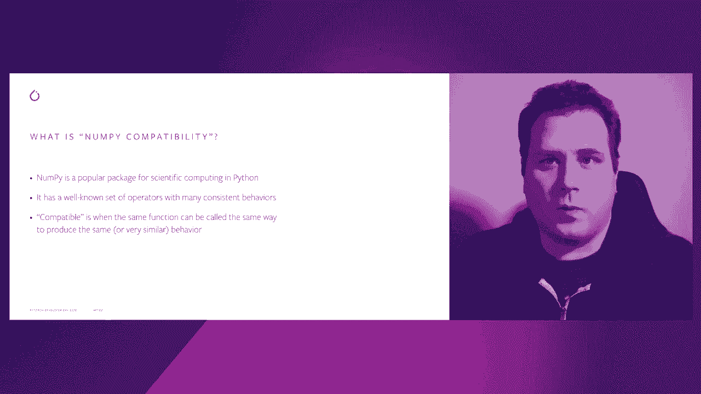
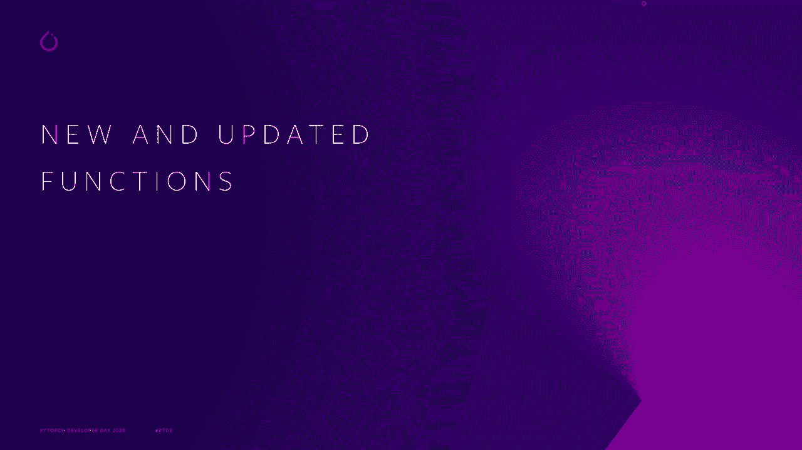
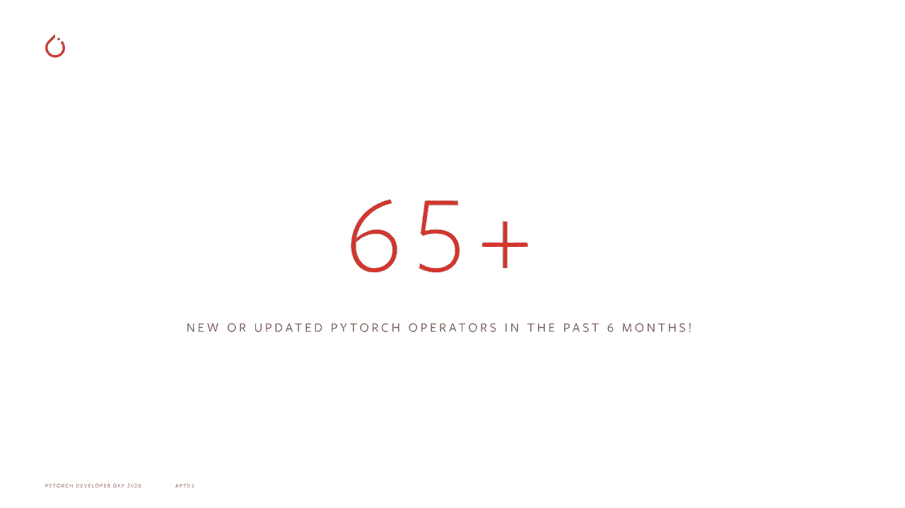
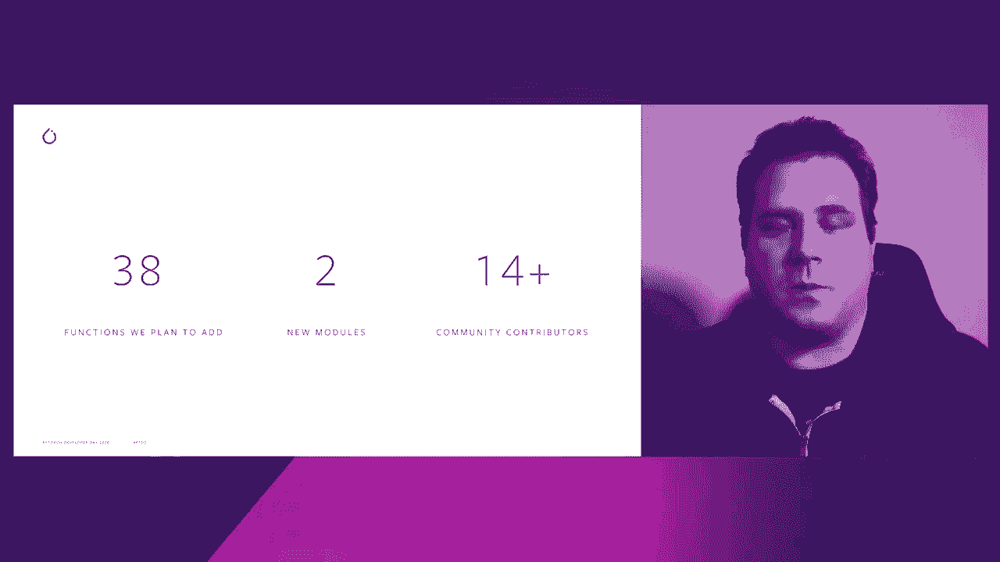

# 【双语字幕+资料下载】Pytorch 进阶学习讲座！14位Facebook工程师带你解锁 PyTorch 的生产应用与技术细节 ＜官方教程系列＞ - P2：L2- 使 PyTorch 更加“与 NumPy 兼容” - ShowMeAI - BV1ZZ4y1U7dg

🎼。

Hi everyone， I'm Mike Ruberry， an engineer at Facebook working on Pytorrch。

 and I'm going to be talking to you about how we're making Pytorrch more nupy compatible In this short talk。

 there'll be three parts。First， I'll describe what it means for Pytorrch to be nu P compatible and what our goals are。

In the second part， I'll talk about the many new and updated operators we have in Pytororch 1。

7 that make it the most nuy compatible release of Pytorch yet。And in the third part。

 I'll talk briefly about where we're going in P towards 1。8 and beyond。

So let's get started by talking about what it means for Pytorch to be numpy compatible。

 For those of you who don't know， Numpy is a popular Python package for working on arrays or what Pytorch would call tensors。

Its API is well known and that makes it familiar to many users coming to PyTtororch for the first time。

By making Pytorch compatible with Numpy， which means it implements the same functions that Numpy does。

 and that the behavior of those functions is pretty much the same in Pytorch and in Numpy。

This means that people familiar with nuy will already be familiar with Pytorch。

 making it intuitive and easy to use。This should let people spend less time looking at documentation and more time developing their programs。

The idea of nuy compatible pieytorch is not new。From the beginning。

 Pyedtort was designed to be like Numpy， and as these code snippets show。

 both packages are extremely similar today。There are small differences between Pytorch and nuumpy。

 however。For example， as previously mentioned。What Numpy calls as， Pytorch calls tensors。

In this snippet we also see that Pytorch is a little more explicit about data types。

 requiring that the Tensor B be specified as containing floating point values before the exponential function can be called on it。

Now， we might think that the goal of Numpy compatibility is to eliminate all differences between Pytorrch and Numpy。

That's actually not the case。There will always be differences between Pytorrch and nupy because they focus on different scenarios。

Pytorch， for example， is designed to run on multiple devices， not just on the CPU。It also runs。

 for example， on GPUs， TUs， mobile devices， and custom Asics。

Pyitetorch is also designed to run neural networks。

And neural networks typically run in a lower floating point precision than scientific programs do。

Finally， Pytorch is designed to support autograd， which has its own specific set of requirements。

For example， to compute a backwards pass properly， Pytorch has to save intermediate computations。

 Foing on scenarios like this means that Pytorch and numpy will never be exactly the same。

 but we can still strive to make pytorch as similar to nuy as possible。

Now let's talk about how we've done that in PyTtororch 1。

7 and why it's the most nuumpy compatible version of PyTtororch we've ever released。

It's because we've added a ton of new operators that Numpy had。

 but Pytororch was missing and even updated some older Pytorch operators whose behavior was different than their corresponding counterparts in Numpy。

 For example， we've added a slew of functionality related to fast Fourier transforms。

We have new functions for computing statistics like Torcht Quantile。

 We have helper functions for manipulating tensors like Htac， Vt and Dt。

 We even have the zeroth order modified besel function of the first kind。

 We also updated some operators， like division， for example。

 in Pytorrch is now compatible with division in numppyy and Python 3。

 always performing a true division instead of sometimes performing an integer division。😊，In total。

 we modified over 65 operators in PyTtororch 1。7。

Now， where are we going Well， in Piyr 1。8。We expect to add or modify another 38 operators。

We expect to expand on two new modules too。The Torch dot F of T module。

 which contains the fast Fourier functionality that I already mentioned and the Torchdot lineal module。

 which will contain linear algebra functionality。And we also plan to keep our community engaged。

At the time of writing， we had 14 active community contributors。

And since then， we've already added several more。This is a great opportunity for you to get involved too。

If there is a function in nuumpy or s pie that you'd like to see in Pytororch。

 let us know by filing an issue on our GitHub。And if you'd like to get involved by contributing an operator to Pytorch。

 see the link to issue to get started。

A huge thank you again to our community contributors。This slide is already out of date。

 which is unfortunate。But it's been a great experience working with our fantastic Pytorch community to make Pytorch more nuumppy compatible and ultimately to make it easier to use。

So thank you again for all our active contributors as of October of this year for their help and support。

🎼And thank you for listening to this talk about how we're making pieytorch more nup compatible。

