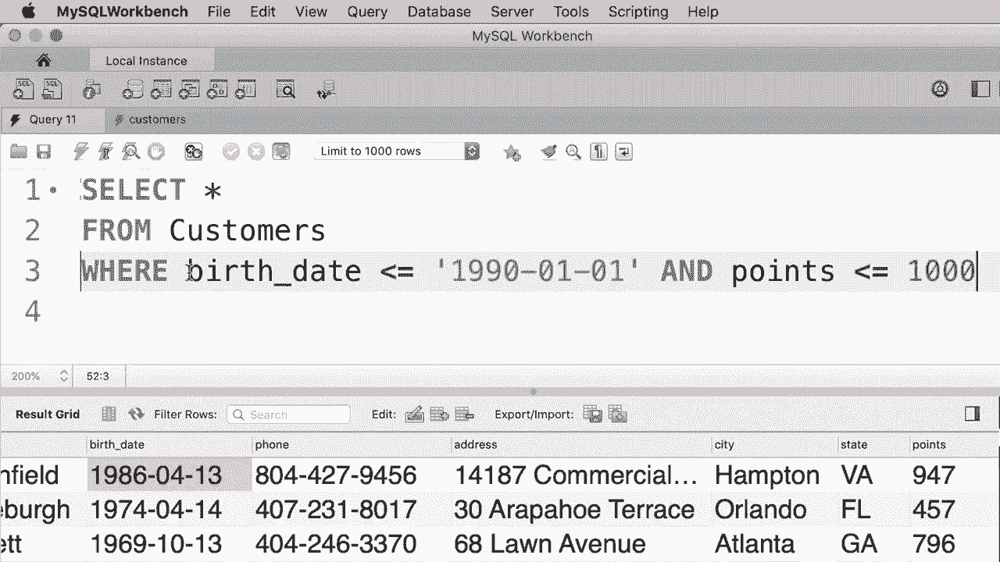
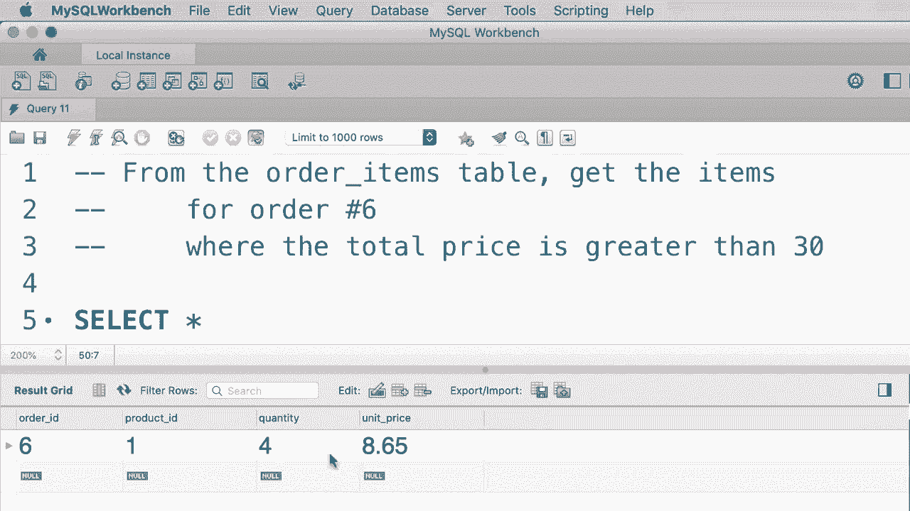

# 【双语字幕+资料下载】SQL常用知识点合辑——高效优雅的学习教程，复杂SQL剖析与最佳实践！＜快速入门系列＞ - P10：L10- AND、OR 和 NOT 运算符 - ShowMeAI - BV1Pu41117ku

In this tutorial I'm going to show you how to combine multiple search conditions when filtering data。

 so let's say we want to get all the customers that are born after January 1 1990 who also happen to have more than 1000 points so this is where we use the and operator so we type out and and after we type out another condition like points。

😊，Greater than 1000。 Now， when we execute this query。

 we only get customers who have both these conditions。 Let's take a look。 So execute。

 we only have two customers。 And if you look， both these people are born after 1990。

 And they have more than 1000 points。 So this is the and operator。 when me use this operator。

 both these conditions should be true。 In contrast to the and operator， we have the or operator。

 So with or， if at least one of these conditions is true。

 that row will be returned in the results set。 Let's take a look。 Now we execute this query again。

 instead of two records we have。😊，Quite a few records。 So for example。

 we have this person who is not born after 1990， but if you look at their points。

 they have more than 1000 points。 So any customer records that satisfies at least one of these conditions will be returned。

 Now let's take this to the next level。 Let's say we want to get customers who are either born after 1990 or they should have at least 1 thousand00 points and live in Virginia。

 So this is how we do this。We type out and， and then we add another condition， state equals Virginia。

Let's execute this query and see what we get。 We only get full records。

 So these are the customers that are born either after 1990 or they have more than 1000 points and live in Virginia。

 If you look at the first customer here， this person is not born after 1990。

 but you can see that she lives in Virginia and she has more than 1000 points。

 So the last two conditions are true for this customer。Now when combining multiple logical operators。

 you need to be aware of the order of these operators。

 so earlier I talked about the order of arithmetic operators。

 I told you that multiplication have a higher order than addition and subtraction and we can use parenthses to override the default order we have the same concept in logical operators So the and operator is always evaluated first So when this query is executed the query execution engine first evaluates this condition because here we're using an and it doesn't matter that we typed out this condition after the first condition because the and operator has a higher precedence Now you can always change the order using parenthsesis and this also makes sure code cleaner and easier to understand。

😊，So here we can put parenthesesis。Around is last two conditions。

And also we can put these on a new line。😊，For clarity， something like this。

So anyone who reads this code can easily understand what is the intent of this query？

Now we also have another logical operator called not， and we use that to negate a condition。

 let me show you， so I'm going to simplify our word clause。😊，Let's say。

Re're searchingching for customers who were born after 1990， or they have more than 100 points。

 If we execute this query， we get。These people， customers with ID1， 3，5， and so on。

Now we can use the not operator to negate this condition。

 so we apply not here and preferably we also put parenthesis around this condition。 Now。

 when we execute this query， we'll see other customers that are not in the current result set。

 Let's take a look。😊，So instead of customers with IDs， 1，3，5，6， and so on。

 we get the customers with IDs 2，4， and 10。Now technically。

 these customers were born before 1990 and they have less than 1000 points。 So if you look here。

This first customer was born before 1990， and he has less than 1000 points。 How did I know that。

 Let me show you a trick that I learned in math。Whenever you have a not operator。

 you can simplify your expression like this。We apply the knot operator to the first condition。

People who were born after 1990。How can we ne this condition， Well。

 the greater than operator becomes less than or equal to。 That is the inverse of that condition。

 right。Now we apply the no to or to negate the or。 What do we get we get and。Finally。

 apply the nut operator on the last condition， people who have more than 1000 points。

 When we negate this condition， we get customers with less than or equal to 1000 points。

 Now we can remove the not operator to simplify this。

 We don't need parenthses anymore because we only have two conditions that are combined with an and。

 Here is the result。As you can see， this is much easier to read and understand people who were born before this date and they have less than1 thousand00 points。

。

All right here's your exercise。From the Order items table。Get the items for order number 6。

 where the total price for that item is greater than 30。

Al right here's the order items table in this table we have these columns， order ID， product ID。

 quantity and unit price if I multiply the quantity by unit price we can get the total cost of that item and then we can compare it with 30 so let's go ahead and write this query。

Select。Star。From Order items。Where here we need two conditions， one is for the order。

 so order under ID should be 6。And the second condition， we want to calculate the total price。

 so we get the unit price。😊，Multiply it by quantity。And this value should be greater than 30。

 so as we can see， we can use an arithmetic expression in a word class。

 it's not limited to the select class okay。😊，Now let's execute this query and see what we get。

We should get only one item。That is for product1， here the quantity is 4 and unit price is just over $8。

 so the total price for this item is greater than 30。

