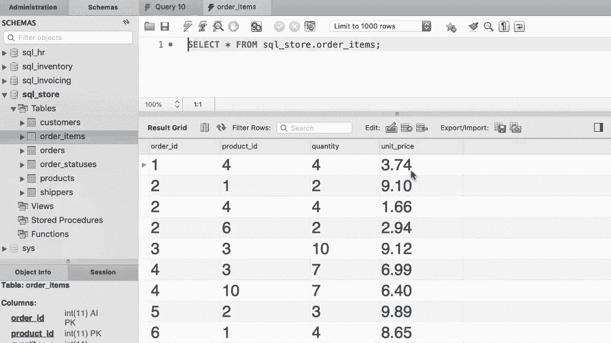

# 【双语字幕+资料下载】SQL常用知识点合辑——高效优雅的学习教程，复杂SQL剖析与最佳实践！＜快速入门系列＞ - P18：L18- 内部连接 - ShowMeAI - BV1Pu41117ku

哦。So far we have only selected columns from a single table， but in the real world。

 we quite often select columns from multiple tables。

 and that's what I'm going to show you over the next few tutorials。😊，So on the left side。

 if you look at our orders table， let's select all the data here。😊，In table。

 we're using the customer ID column to identify the customer that has placed each order。

 Now as I told you before， we don't store customers information here like their phone number。

 their email， their address， because this information can change in the future。

 and if a given customer has placed multiple orders。

 then we'll have to come back and change multiple records。 We don't want to do that。

 That's why we have separate tables for customers and orders。😊，Now in this tutorial。

 I'm going to show you how to select the orders in the orders table。

 but instead of showing the customer ID， show the full name for each customer。😊。

So let's go back to our query window。😊，All right， so we want to select everything from the orders table。

Now we should combine the columns in this table with the columns in the customers table。

 that is where we use the join keyword。Now here we can optionally type inner join because in SQL。

 we have two types of join， inner join and aler join。

 We'll look at outer joins later in this section。 So for now we are only using an inner join and this inner key is actually optional。

 so we don't have to type it。😊，So you want to join the orders table with the customers table。Now。

 on what basis do we want to join these tables？Well， here in the customer table。

 we have this customer ID column。 So if we put these two tables next to each other。

 we want to line up the records such that the customer Is are equal。

 That is where we use the on phrase。😊，So after on we type out a condition。

 here is the condition we need to type out orders do customer underline ID should be equal toCustom。

 customer ID。😊，Now， this is getting outside of the screen。 so let me break out this line。

That's better。So with this query， we are telling MyQL that， hey。

 whenever youre joining the orders table with theCustoms table。

 make sure that the customer ID column in the orders table equals the customer ID column in the customers table。

😊，Now let's execute this query。😊，Look at the result。Since we are selecting everything here。

 the first few columns are from the orders table because we have listed that first。😊，Now。

 after all the columns in the orders table， we have the columns in the customer table。

 so customer ID， first name， last name and so on。😊。

Now let's simplify the results set and select only order ID， first name and last name。

 So back to our query， we select。Order， ID， first name and last name。

Now I'm going to execute the query。😊，That is better， so next to each order ID。

 we can see the name of the customer that placed that order。😊，Now。

 what if you want to display the customer ID here as well？😊，Well。

 let's put that here and see what happens，Custom I。Execute the query。 We get an error。

 So if you look at the output window down the bottom。

 you should see an error saying column customer ID D the field list is ambiguous。 Now， unfortunately。

 I cannot show you this error because the size of my recording window is smaller than myQL workbench。

But that aside let me explain why we're getting this error because we have this customer ID column in both the orders and customers tables。

 So my skill is not sure which table do we want to select this column from。

 That is why it's saying this column is ambiguous。😊。

So we need to qualify this column by prefixing it with a table name。😊。

We can either pick it from the order table or the customer's table。

 it doesn't really matter because the values are equal， right？😊。

So in situations where you have the same column in multiple tables。

 you need to qualify them by prefixing them with the name of their table okay now lets execute the query one more time。

 so there you go we have order ID， customer ID and the full name beautiful。😊。

Now one more thing before we finish this tutorial， if you pay close attention。

 we have repeated the word orders in multiple places， we have it here。

 as well as in the joint condition， the same is true about the customers table。

 we have repeated that here。😊，We can get rid of this repetition and make our codes simpler by using an alias。

 So right after each table， we can give it an alias。😊，O， as in short for orders。 So by convention。

 we abbreviate the table's name。 Now， wherever we have orders， we should replace that with O。

 So here in the joint condition， we replace orders with O and also one more time。😊。

And a select clause。There you go， we can also apply an alias for the customer's table。😊。

We got it C and then we simplify our joint condition like this。😊。

So this is how we can join columns from multiple tables。Now， for your exercise。

 I want you to look at the order items table。So。In this table we have this columns order ID。

 product ID， quantity and unit price Now I want you to write a query and join this table with the product table。

 so for each order return bolt the product ID as well as its name followed by the quantity and the unit price from the order items table and by the way。

 make sure to use an alias to simplify your code。😊。

。

All right， first， let's select everything from the Order items table。

And then join it with the products table， how are we going to join these tables？😊。

On order underlyingline items dot Well actually let's just give this an alias right away。

 So we use Oi as an abbreviation for order items and P as in short for products。

 So Oi dot product ID。😊，Should be equal to P or product do product I。 And by the way。

 remember that when you give an alias to a table， you have to use that alias everywhere else。

 So here I cannot type out products。 My skill is going to yell at me。 So let's use the abbreviation。

 Allright， this is how we join these tables。 Let's execute this query after this point。😊，Alright。

 so we see all the items from the order items table followed by the columns from the product table。😊。

Now we want to explicitly select a few columns here， so from the order items table。

 we want to select。😊，Or their underline ID。Well， technically。

 we don't have to prefix this with the table name because this column is not repeated in multiple places。

 so it's not ambiguous。So let's make the code shorter， that's better。😊。

Now we want to select the product ID column， but because this column exists in both tables。

 we have to prefix it with a table name， either OI or P， it doesn't really matter。😊，Next。

 we want to select Qua and finally unit price。Now actually here we have this unit price column in both tables。

 so this is the unit price in order items table and this is the unit price in the product table。

 Now you might be curious why we have this column in two places。

 The reason for this is that the price of products can change。So for each order item。

 we want to have the price at the time the user or the customer place the order。

 So this is a snapshot of the price at a given point in time。

 the unit price that we have in the products table。Is the current price right now。

 This is very important for reporting。 otherwise， we cannot calculate the sales properly。

So because we have the unit price column in two places， in this case。

 we should pick it from the order items table because this is the price at the time of place and order。

Now let's execute the query， so here's the final result。😊。

