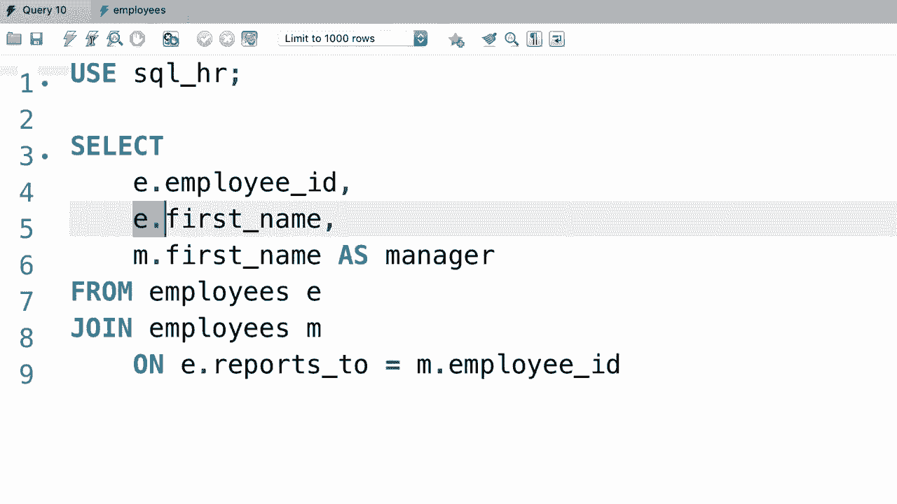

# 【双语字幕+资料下载】SQL常用知识点合辑——高效优雅的学习教程，复杂SQL剖析与最佳实践！＜快速入门系列＞ - P20：L20- 自联接 - ShowMeAI - BV1Pu41117ku

哦。In SQL， we can also join a table with itself。 Let me show you an example。

 Take a look at this database， SQL HR。😊，In this database we have these two tables。

 employees and office， let's take a look at the data in the employeess table。There you go。

So here we have these columns， employee ID， first name， last name， their job title。

 salary and reports2 this is the idea of the manager for this person or this employee Now once again we don't want to repeat the manager's information here like their phone number。

 their address because this information can change in the future so we are only using their identifier or their ID to refer to them in the table。

Now， where can we find the information about this manager？ Well。

 this manager is actually an employee of the same organization so。😊，Look at this example。

 the manager ID is 37270。Now， if you look on the left side， here's the idea of that manager。

 which is another employee。😊，Now who's the manager for this employee， let's take a look。😊。

We don't have any values here， so the value for this sale is null。

 so this employee doesn't have a manager， and that means they are the CEO。😊。

So now let's go ahead and write a query to join this table with itself so we can select the name of each employee and their manager。

😊，Back to a query window， first we need to select the SQL HR database。Next。

 we select everything from the employees table we give it an alias like E Now we need to join this table with itself。

 so once again we type out employees， but we need a different alias what should we call this alias well we want to join this table with itself so we can find the managers right so we can use M as in short for managers。

😊，Now let's type out our joint condition。So from the employees table。

 we need to join the reports underline two column to the managers table。

 which is basically theEmploy table itself and what column。That is employee Under ID。

Now let's execute this query and see what we get。😊，So。

We see all the columns from the employees table repeated the first set of columns represent information about the employees and then after that we have information about the manager in this case we have only one manager in this table but with this technique we can easily create an organization chart we can have a hierarchy of manager Now let's simplify our query and select only the name of the employee and their manager so。

Back here。Since every column in the employees table is repeated twice。

 we need to prefix each column with a table name for example。From the employees table。

 you want to get employee。Id。😊，As well as the first name。

And then from the manager's table you want to select the first name as well。

 so every column should be prefixed with the table name or more accurately the alias because all these columns exist in two tables right。

 let's go ahead and execute this query。😊，So。This is what we get employee ID first name。

 and here's the manager's first name。 we can improve this query by giving an alien to this column because it doesn't make sense to have two who first name columns so。

😊，Let's give an alias to the third column manager。Now， let's execute it one more time。

And here's the end result， so we have the employee ID， first name and Add。😊。

So joining a table with itself is pretty much the same as joining a table with another table。

 the only difference is that we have to use different aliases and we have to prefix each column with an alias。

😊，This is what we call a self join。Next I'm going to show you how to join more than two tables。😊。

Oh。