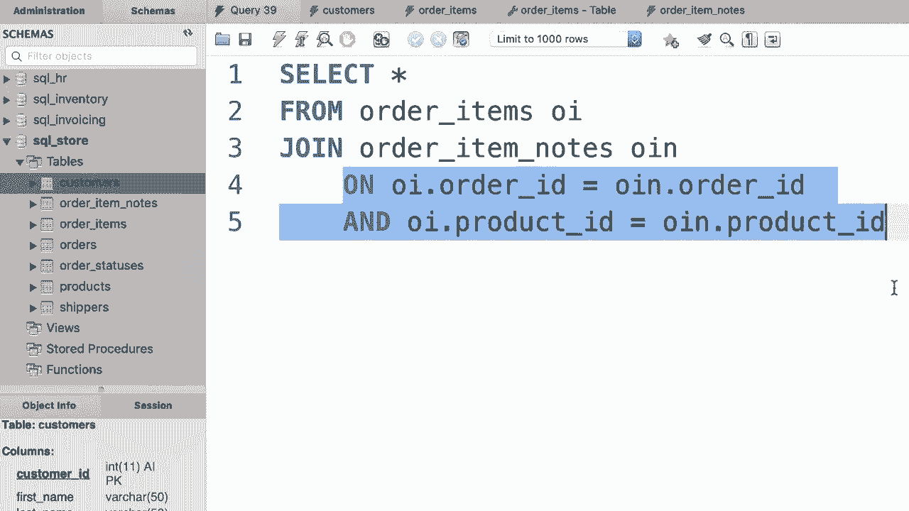

# 【双语字幕+资料下载】SQL常用知识点合辑——高效优雅的学习教程，复杂SQL剖析与最佳实践！＜快速入门系列＞ - P22：L22- 复合连接条件 - ShowMeAI - BV1Pu41117ku

哦。In all the examples you have seen so far， we use a single column to uniquely identify the rows in a given table。

 For example， in the customer's table。We have this customer ID column which uniquely identifies the rows in this table。

 but there are times that we cannot use a single column to uniquely identify records in a given table。

 for example， look at the order items table。In a table， we have columns like order ID， product ID。

 and so on。Now if you look at the data you can see that the values in the order ID column are repeated。

 they're duplicated， we have 2，2，2，66 and so on， so we cannot use this column on its own to uniquely identify each record the same is true for the product ID the values in this column are also duplicated so in this table we use the combination of the values in both these columns to uniquely identify each order item as an example in this order we have three items for products one。

4 and6 and for each product we have the quantity and unit price。😊。

So if we use the combination of the values in both these columns we can uniquely identify each order item。

 in other words we don't have two records for order ID2 and product ID1 we only have a single record for that item right now let's open this table in the design mode so over here click on this middle icon that looks like a tool。

😊，Note that this yellow key that represents the primary key exists on both these columns。

 this is what we call a composite primary key， a composite primary key contains more than one column。

😊，Now why does this matter Well when you have a table with a composite primary key you need to learn how to join that table with other tables for example。

 here we have this table order item notes that we use to keep notes for each order item let's take a look at the data here so we have this column note ID which uniquely identifies the records in this table next to that we have order ID and product ID you learn that the combination of these two columns uniquely represents an order item。

😊，So here for order number two， for product number one， we have two notes。😊。

Now let me show you how to join this table with the Order items table。😊，So back to our query。😊。

You can see that I have already selected the SQL store database。

 so I'm not going to type out a use statement。😊，All right， let's select everything from。

The Order items table。Give it an alias。😊，Now we need to join this with order item node。

 also we give it an alias。😊，How are we going to join these tables based on two columns back to the order items table？

These are the columns that we need to use in our joint condition。So in the order items table。

We have this order ID column。This would be equal to the same column in order item Note table。

 so OIN dot order ID。But this is not enough， we should also join these tables based on the product ID column。

 so we type out and and then we type out our second condition。

 so order items do product ID should be equal to order item notes do product ID。

This is what we call a compound join condition， so we have multiple conditions to join these two tables。

Oh。

