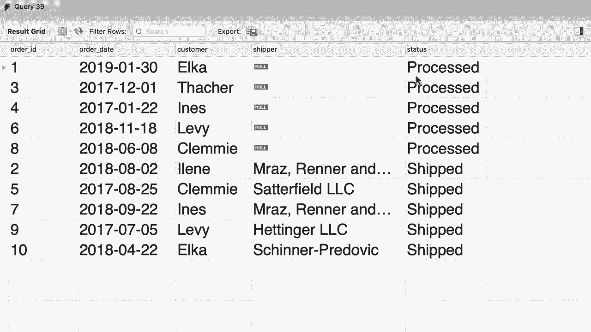

# 【双语字幕+资料下载】SQL常用知识点合辑——高效优雅的学习教程，复杂SQL剖析与最佳实践！＜快速入门系列＞ - P25：L25- 多个表之间的外连接 - ShowMeAI - BV1Pu41117ku

哦。Similar to inner joins， we can use outer joins between multiple tables。 Let me show you。

 So heres the query that we wrote in the last tutorial。

 we are doing a left join between customers and orders tables。 So when we execute this query。😊。

We get all the customers whether they have an order or not， if they have an order。

 we see the order ID。😊，Beautiful。Now， if you look at the orders table。😊。

You can see that some of our orders have a shipper ID。 These are the orders that have been shipped。

 So now let's join the orders table with the shipperss table to display the name of the shipper in the result。

 So back to a query。😊，After this left join。Let's write another join here I'm doing an inner join。

 so let's inter joinin the orders table with the shippers table， join shippers。😊。

We call it SH on what is the joint condition well， o that shipper ID should be equal to S。

 shipper ID。All right， so in this query we have a left outer join and an inner join。😊。

Let's see what we get。😊，Alright， we only see five records， but we have more orders。

 so here we have the same problem we had before， some of our orders don't have a shipper and that is why they are not returned here in other words。

😊，This joint condition is not true for some of our orders， so back to the orders table。As an example。

 this first order doesn't have a shipper， shipper ID is null。

 and that is why it's not returned in the query result。😊，So to solve this problem。

 we should use a left joint。 we want to make sure that all orders are returned。

 whether they have a shipper or not。 So back to the query。😊。

We need to replace this inner join with the left join。😊。

So let's execute the query and see what happens。Now we should have quite a few more orders。

 there you go。😊，Now to make this example more interesting， I'm going to add the shipper name here。😊。

Back to our select clause。Let's add a new column， so shipper dot name。And we can give it an alias。

 like shipper。Let's execute the query and。Here's the result。So we get all the customers。

 whether they have an order or not， and for those who do have an order， we get all the orders。

 whether they have a shipper or not， this is the power of outer joints。Now in the last tutorial。

 you learned that you can get the same result with both a left join or a right join。

 you just have to swap the order of the tables。 However， as a best practice， avoid using right joins。

 because when you are joining multiple tables and you have left and right and inner join。

 things get really complex。 someone else reading your code will have difficulty visualizing how you are joining these tables。

 As an example， if you had a right join here。And then a left join after。

 it will be harder to visualize how these tables are getting joined， so as a best practice。

 avoid right joins and use left joins instead。😊。

。

And here is your exercise for this tutorial。 I want you to write a query that produces this result。

 So here we have this columns order date， order ID， the first name of the customer， the shipper。

 and we can see that some of our orders are not shipped yet so here we have null and finally this status。

 So go ahead spend two to three minutes on this exercise when you are done come back continue watching。

😊，嗯。All right， let's select everything from the orders table。😊。

Now we should join this with customers。On all that customer ID should be equal to see that customer ID。

Here I'm using an inner join because every order does have a customer。

 so this condition is always valid， it doesn't matter if we use a left join or an inner join here okay now before going any further。

 let's pick our columns so from the order table I want to pick order ID。😊，Followed by order。

 date and then customer dot first name。Which we can optional rename to customer。Allright。

 next we'll need to select the shipper。😊，We join the result with the shippers's table。

On order that shipper ID equal to shipper that shipper ID。 However， if you use an inner join here。

 because some of our orders don't have a shipper， we're only going to see the orders that have been shipped。

 let me show you so for clarity， I'm going to add the shipper's name here。

 so shipper that name as shipper。Let's execute the query。There you go。

 We only see the orders that have been shipped， but we want to see all the orders right。

 so we need to change the second join。😊，To a left joint。So all orders are returned。

 whether they have a shipper or not。Let's execute the query one more time。There you go。

Now we see all the orders from number one to number 10， beautiful。Finally。

 we need to add the status column here。So we need to do another joint here。Join with order statuses。

 which we abbreviate as OSs on O thatt status。Equal to O do order status ID you can see that I have designed this database such that sometimes our column names are exactly identical。

 but in other cases they don't match So in the order table we call this column status as opposed to order status ID and this is deliberate because a lot of real databases are like that。

All right， now let's add。The status name here， so order status to name。As status。

Execcutute the query。And。We can see all the orders here for each order we have the date。

 the customer， the shipper， and the status。

Oh。