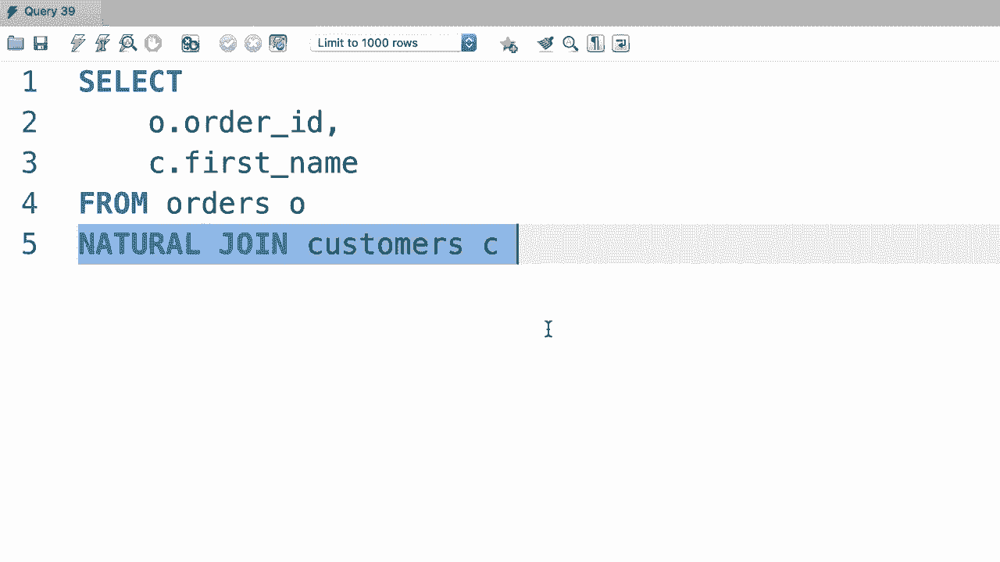

# 【双语字幕+资料下载】SQL常用知识点合辑——高效优雅的学习教程，复杂SQL剖析与最佳实践！＜快速入门系列＞ - P28：L28- 自然连接 - ShowMeAI - BV1Pu41117ku

哦。In my skill we also have another simpler way to join two tables。

 it's called a natural join and it's easier to code。

 but it's not something that I recommend because sometimes it produces unexpected results。

 but let me quickly show you how it works in case you see it somewhere so at least you're familiar with it so back to the previous example let's select everything from the orders table。

Now we should do a natural join with the customers table。 Now with these natural joins。

 we don't explicitly specify the column names So the database engine will look at these two tables and it will join them based on the common columns the columns that have the same name and that is the reason this query is short at right。

 So for clarity and let's pick a couple of columns here。

 O that order ID D and see dot let's say first name。😊，Let's execute the query， there you go。😊。

So we see all the orders and the customers will place them。So natural joins are really easy to code。

 but they can be a little bit dangerous because we're letting the database engine figure out or guess the join。

 We don't have control over it。 for this very reason。

 natural joins can produce unexpected results and that's why I discourage you to use them。

Oh。

