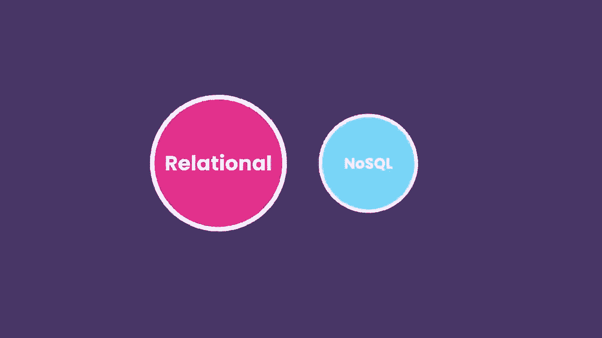
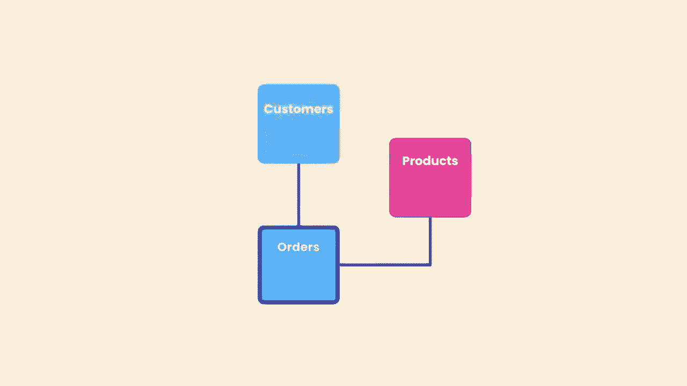
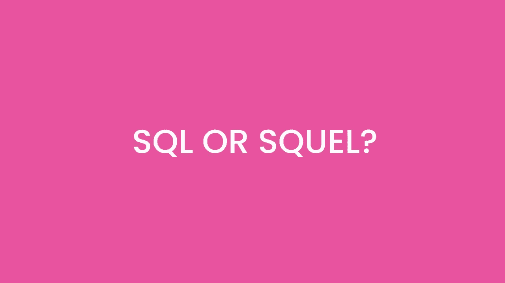
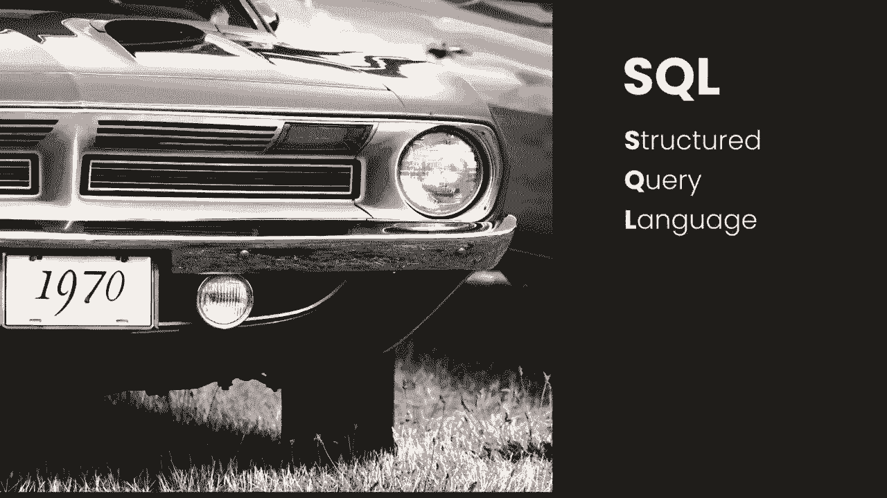
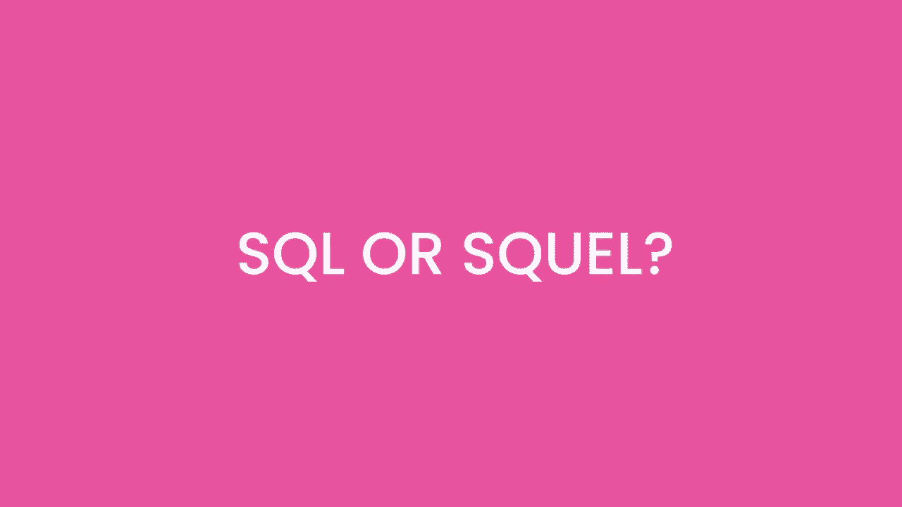
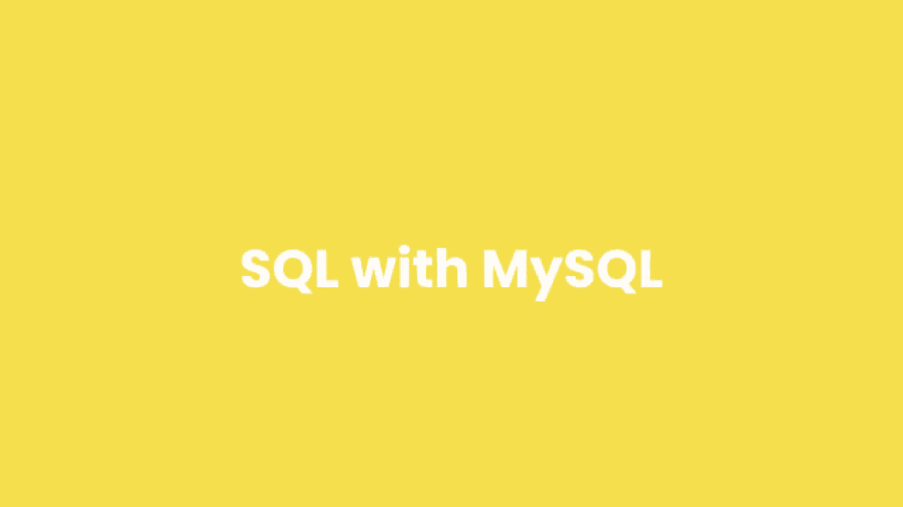

# 【双语字幕+资料下载】SQL常用知识点合辑——高效优雅的学习教程，复杂SQL剖析与最佳实践！＜快速入门系列＞ - P2：L2- 什么是 SQL？ - ShowMeAI - BV1Pu41117ku

🎼The。Let's start the course with a quick overview of databases， what they are and how we use them。

A database is a collection of data stored in a format that can easily be accessed in order to manage our databases。

 we use a software application called database management System or DBMS We connect to a DBMS and give it instructions for querying or modifying data the DBMS will execute our instructions and send results back。

🎼Now we have several database management systems out there and these are classified into two categories relational and nonrelational also called no SQL In relational databases。

 we store data in tables that are linked to each other using relationships That's why we call these databases relational databases Each table stores data about a specific type of object like customer product order and so on SQl or SQL is the language that we use to work with this relational database management systems It looks like this We use SQl to query or modify our data In this course we're going to learn everything about this powerful language Now there are many different relational database management systems out there Some of the most popular ones are MyQL SQL server by Microsoft and Oracle but of course there are plenty more Each database management system has a different flavor of SQL but all these implementations are very similar and。

🎼based on the standard SQL specification so most of the SQL code that you will learn in this course will work with any database management system in this course we'll be using Myql which is the most popular open source database in the world。

Right now back to this diagram What about nonrelational databases in non-relational databases we don't have tables or relationships These databases are very different from relational databases but that's a topic for an entirely different course What you need to know is that nonrelational database management systems don't understand SQL they have their own query language so we use SQl to work with relational database management systems Now before we jump in and install mysQl let me clarify something quickly as you talk to different people you will hear two different pronunciations of SQL SQL or SQL What is the correct way Well it depends on who you ask and of course everybody thinks their way of pronouncing this word is the right way but here's a little history about this language SQL was originally developed at IBM in the 70s and back then it was initially calledQL short for structured English query language but they changed the acronym to SQL becauseQL。

was the trademark of an airplane company So to this date there has been an argument about what is the right way to pronounce this language Journalally speaking。

 people in non-english speakingak countries call it SQL I'm used to calling it SQL because it's shorter and sweeter than SQL but if you prefer to call it SQL that's totally fine with me I'm not going to get mad at you so that's the history behind this language but what about my SQL as a software product developers of this product prefer to call it my SQL rather than myQL but they don't mind if we call it myQL In this course I'll be teaching you SQL with My SQL。

