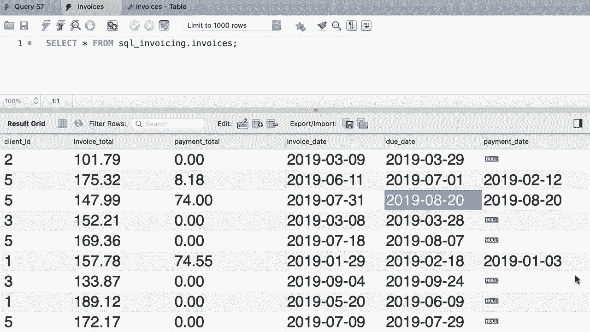

# 【双语字幕+资料下载】SQL常用知识点合辑——高效优雅的学习教程，复杂SQL剖析与最佳实践！＜快速入门系列＞ - P36：L36- 更新单行 - ShowMeAI - BV1Pu41117ku

哦。In this tutorial， I'm going to show you how to update data in SQA， so back to our invoices table。😊。

Look at the first record here。The payment total for this record is 0。 and obviously。

 there is no payment date。 Now， let's imagine that there was a problem in the system that recorded this information。

 Let's say the client paid $10 for this invoice。 So we should update this record in this table。

 That is very easy。Back to our query editor window。

We use the update statement to update one or more records in a table。 What table in this case。

 invoices。Next we add the set clause， and this is where we specify the new value for one or more columns。

In this case， we want to update payment total， let's set it to $10。

 we should also update payment date， so we use a comma to add more columns。

We set this to a date value， let's say， 2019， March 1t。And then we type out a condition。

With this condition， we identified the record or the records that need to be updated。In this case。

 we want to update the invoice number one， so back to our query。😊。

We type out invoice IDd equal to one。Let's execute this。😊，Beautiful， now back to our table。

 let's refresh the data by clicking on this icon。😊，Alright。

 you can see payment total is updated to 10 and we also have a payment date beautiful。😊，Now。

 let's say we actually updated the wrong record。 Maybe we should have updated invoice number three。

 so we should update this table one more time and restore the original values in this columns back to a query。

We can set the payment total to zero and the payment date to nu。

So we can use the null keyword to insert the null value in a column that accepts null values Now back to the navigator panel。

Let's open this table into design mode。You can see that the payment total column has a default value of 0。

😊，And the payment date column has the default value of no。 So back in our query。

We can also set payment total to default， and my S will use the default value for this column。

 which is in this case，0。 So let's execute this statement one more time。 Beaful。

 Now back to the table， let's refresh the data。😊，So payment total is set to zero and payment date is nu。

Beautiful， now let's go ahead and update the third payment。Look at the invoice total。 That is $147。

 For this example， let's imagine that the client made 50% of the total amount on the due date。

So back to our query window， instead of using a literal value here like $70。

 we can write an expression， we want to calculate 50% of invoice total， so invoice total times 0。5。

 Now let me break this code into multiple lines so we can see clearly。😊。

Now we should set the payment date， as I told you， this client made the payment on the due date so we can set this to due date。

 whatever value we have in this column will be used to set the payment date。And obviously。

 we need to update the inverseice ID number three now back in the table。😊，Let's refresh the data。

All right look， payment total is updated and it said to almost 50% of the invoice total。

 however this number is truncated so we don't have the digits after the decimal point。

 Don't worry about it for now， we'll come back to this when we talk about data types later in the course。

Also， you can see that payment date is set to the same value we have in the due date column。

Yeah。

