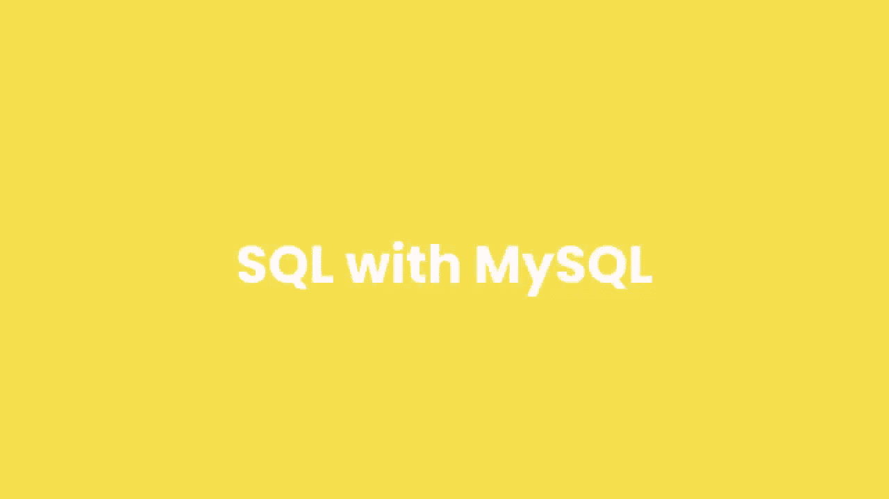

# 【双语字幕+资料下载】SQL常用知识点合辑——高效优雅的学习教程，复杂SQL剖析与最佳实践！＜快速入门系列＞ - P3：L3- 备忘单 - ShowMeAI - BV1Pu41117ku

Hey guys， Mosh here。 I just wanted to let you know that you really don't have to memorize anything in this course because I've created a complete cheat sheet with summary notes for you。

 You can find it below this video in the description box。

 So I have done my best to create the best possible most comprehensive SQL course for you。

 and I would really appreciate it if you support my hard work by liking and sharing this video。

 Thank you so much。 Now， let's continue。😊。

