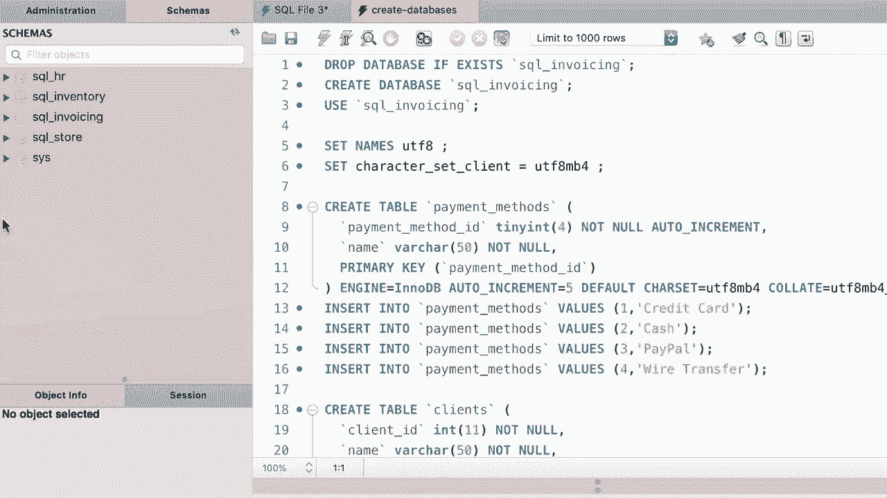

# 【双语字幕+资料下载】SQL常用知识点合辑——高效优雅的学习教程，复杂SQL剖析与最佳实践！＜快速入门系列＞ - P40：L40- 恢复课程数据库 - ShowMeAI - BV1Pu41117ku

哦。All right we're done with this section， but before going to the next section。

 I want you to restorestore all these databases to their original state because in the section we added some data。

 we updated some data， we deleted some records so if you don't restore this databases you might see different results going forward so restsoring these databases is pretty easy here in MyQL workbench on the top go to the file menu and open SQL script then navigate to the directory where you stored the SQL script for this course in case you lost that directory go back to the first section we have a lecture for downloading the supplementary materials。

So in this directory open， create databases。sQL。Now。

 execute the script to recreate all of our databases。 Allright beautiful。

 Now let's open up the navigator panel。 you can see the databases disappeared from here。

 Simply click on this refresh icon。😊，Beautiful， all right。 we're done with this section。

 I will see you in the next section。😊。

