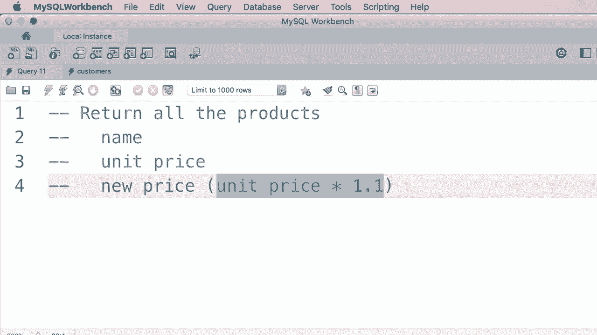
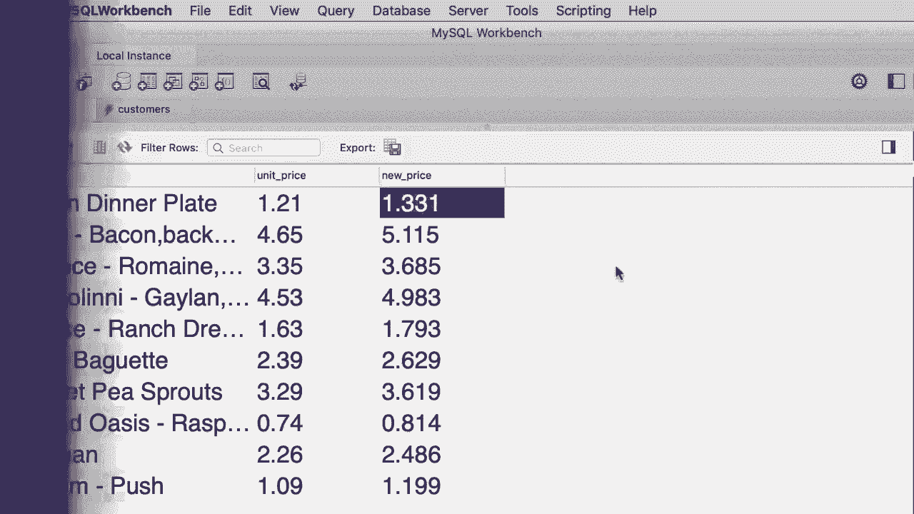

# 【双语字幕+资料下载】SQL常用知识点合辑——高效优雅的学习教程，复杂SQL剖析与最佳实践！＜快速入门系列＞ - P8：L8- SELECT 用法 - ShowMeAI - BV1Pu41117ku

In this tutorial， we're going to look at the select clause in detail。

 So since our current database is SQL store to clean things up。

 I'm going to remove the first statement you don't really need it now。😊，Also， I'm going to delete。

These two comments， we just want to focus on the select clause。Alright。

 so what can we do with this select clause Well in the last tutorial you learn that if we use an asterisk。

 this will return all the columns。 alternatively we can specify the columns that we want and this is helpful in situations where you have a big table with so many columns and perhaps millions of records if you want to bring back all that data that's going to put a lot of pressure on the database server and this case MyQl as well as the network So that's when we explicitly specify the columns that we want to get。

😊，Let's say we want to get the first name and last name columns， execute the query as we can see。😊。

We only get these two columns and they're in the same order we specified here。

 so if we change the order and put the last name first。😊。

And execute the query again now you can see the last name column comes first。Now。

 let's add a new column to the end。😮，Let's get the points for each customer as well。

 We're on the query。 So these are the points for each customer。

 which are calculated based on their shopping。 Now。

 let's say we want to get this point and put them in a mathematical formula to calculate the discount that we can give to each customer。

So here we can use an arithmetic expression， let's say points plus 10。

 this is an arithmetic expression。 So now if you execute this query for the first record。

 you can see that their points will end up being 2283。 Let's run the query one more time。😊。

There you go。 Now we can put the original points column here for clarity sub points。

 comma points plus 10。 Let's run the query one more time。

Now we can see the original points and next to that you can see the value that we're going to use to calculate the discount。

Now here we're using the plus operator， which is for addition， we also have multiplication， division。

 subtraction and modular， which is the remainder of the division so let's change this to something more complex let's say if we want to get the points multipied by 10 and then add 100 to it。

😊，Now you can immediately see that this line1 is getting too long and it doesn't fit on the screen in situations like this。

 you can break up the select clause by placing each column on a new line， so select last name。

 then first name points and finally points times 10。😊，Plus 100。

 so let's execute this query one more time。So this is our new column with a new calculated value Now one thing you need to understand in this arithmetic expression is the order of operators and this is based on the order of operators in math so in math。

😊，The multiplication and division operators have higher order or higher precedentnce than addition and subtraction。

 so in this expression， first points is multiplied by 10 and then the result is added to 100。

Like if this is not what you want， you can always change the order by using parentheses as an example。

 let's change this multiplication to addition。😊，And then put that multiplication here。😊。

In this expression， first，10 is multiplied by 100， and then the result is added to the points。 Now。

 let's say this is not what we want so we can change the order by using parenthses here。

With this parenthsesis first， we get the points， add 10 to them and then multiply the result by 100。

 so these parenthses are useful for changing the order of operations as well as adding clarity to our code so someone else reading this code can easily understand the order of this operations Now let's execute this query one more time。

😊，All right， now look at the name of this column here。😊。

It's said to the expression that we have on line 5， that doesn't quite make sense。

 we want to have a clear descriptive name。So we can give this column an alias using the as keyword So as and then we give it a name like discount。

😊，This count underlying factor。 Let's run a query again。Now the name of this column is changed。

 so this is the benefit of using an alias， we can give descriptive names to the columns and the results set。

NowIf you want to have a space and a column name， you need to surround it with quotes。

 either single or double quotes。 So you put quote here。

 and then we can add a space in between these two wordst。 Let's execute the query one more time。

Now we've got discount factor。So let's quickly recap everything you learn about the select clause。

 we can use an asterisk to return all the columns or we can explicitly specify the columns that we want to return。

😊，We can also use arithmetic expressions here， and optionally。

 we can give an alias to each column in the result set。 Now。

 there is one more thing you need to know about the select clause。 So let's delete this query。😊。

And select。The state column。From the customer's table， Take a look。

These are the states in which our customers are located Now currently in this sample data。

 we don't have any duplicates。 In other words， we don't have multiple customers in any of these states。

 but for this demo I want to change the state of the first customer to Virginia so we end up with duplicates in the results set。

So let's open up the Navigator panel。😊，Here's our customers table， Let's look at all the data。An。

Here's our first customer， as you can see。Is located in the state of Massachusetts Now I want to change this to Virginia。

 so double click V for Virginia， enter done。Now on the bottom right corner of the screen。

 you should see two buttons apply and revert。 Unfortunately。

 I cannot show you these buttons because the recording window is a bit smaller than myql workbench。

 but look down the bottom in the bottom right corner， click on apply。

You're going to see a dialog box like this asking you to review the changes。

 so go ahead and click the apply button one more time。😊，Allright， beautiful。

 Now let's go back to our first query window and execute this query one more time。😊，As you can see。

 the first two customers are located in Virginia What if you want to get the unique list of states in the results set That's when we use the distinct keyword。

 so select distinct state with this query we'll retrieve the unique list of states on the customer table so with a distinct keyword we can remove the duplicates。

 let's execute the query one more time。Now you can see Virginia is not duplicated。

right here's an exercise for you。 I want you to rate a SQL query to return all the products in our database in the results set。

 I want to see three columns name， unit price and a new column called new price which is based on this expression unit price times 1。

1 So let's say we want to increase the price of each product by 10% with this query we want to get all the products。

 the original price and their new price so pause the video and spend one or two minutes on this exercise when you're done come back see my solution。

😊。

Yeah。

All right， this is pretty easy， so we start with select。😊，Now。

 what columns do you want to select name？Unit underlyingline price。

And then here we're going to use an arithmetic expression to calculate the new price。

 so we type out unit price times 1。1 and then give it an alias。

 So as new underlyingline price or we could put this in quotes and put a space between new and price。

😊，Now， where do we want to select this columns from？From the products table， so from products。

Note that I've used uppercase characters for all the SQL keywords and lowercase characters for everything else。

😊，So let's go ahead and execute this query。😊，This is what we get。

So these are all the products you can see their original price as well as the new price。

 which is 10% more expensive。

