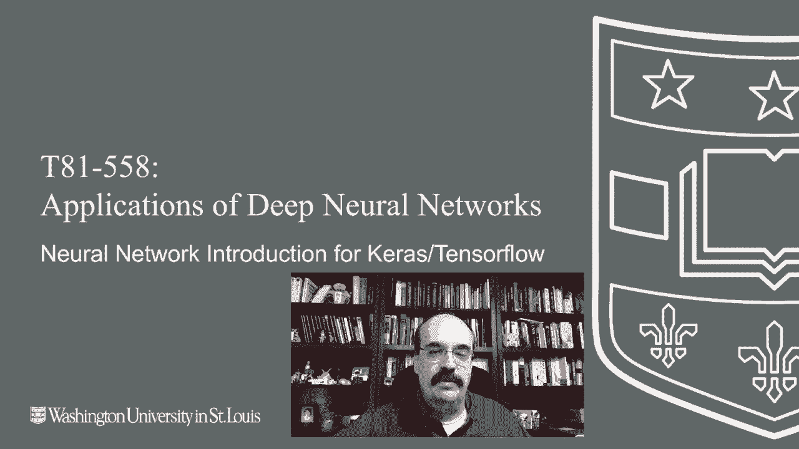

# 【双语字幕+资料下载】T81-558 ｜ 深度神经网络应用-全案例实操系列(2021最新·完整版) - P17：L3.1- Keras深度学习和神经网络编程介绍 - ShowMeAI - BV15f4y1w7b8

Hi this is Jeffy and welcome to applications of Deep neural networkss with Washington University in this video we're going to have a general introduction to deep neural networks and conceptually how they work。

This will allow us to build upon the Python that we learn in previous parts of this course and to actually construct neural networks for the latest on my AI course and projects。

 click subscribe in the bell next to it to be notified of every new video。

 neuralural networks have been around for a while。 Deep learning is just the ability to train neural networks that are very deep。

😊。

You might have seen other machine learning models and other classes like support vector machines and gradient boostting and XG Bot and light GBBM and all these various ways of training a model based on data。

Neurural networks can be drop in replacements for other models like this。

The neural network simply takes in the data that you would have normally sent to a support vector machine or other model。

And outputs either a classification result where it attempts to classify or determine the type of what the input was sent to it。

Or it can be regression and it outputs a number based on the data that you're trying to have the neural network predict from。

However， neural networks， their real power lies in their ability to take end data and produce data in ways that don't fit into your typical classification and regression。

Type models， for example， you can input an image into a neural network。

 You can even have a neural network， accept an image and produce another image。So it gets very。

Expressive what you can actually do with the neural network is the input can be just about anything and the output can be just about anything。

 and the input and output by no means have to be of the same type。In other models， you would。

Simply send in a one dimensional vector so a list of predictors。You can also， though。

 with a neural network， pass in a 2D matrix。 Now， this is where you start to pass in。

 say an image with a grid of pixels。 The power of the neural network is that it realizes the pixels that are near each other are more important to each other。

 whereas the other model types。 change in the order of the input factor really has no effect on anything。

It can also pass in a 3D matrix or 3D tensor。This is would essentially be a color image where that third dimension is specifying the color of the individual pixels that you're passing in。

And dimensions， it can be used in several different ways with neural networks when you talk about the dimensionality of the neural network。

Usually you're talking about what the input vector or input matrix looks like。

 how many input neurons do you have and how are they arranged， are they a grid or they a box？

Dimenssions can also refer to the number of weights that are in a neural network。Now。

 traditional models。You would talk about regression and classification and neural networks do this too。

 the output neurons of the neural network become either the single regression output or the classification。

So a regression neural network like you see here， now these are two example neural networks that I put together。

 I work in the life insurance industry so you'll see a number of examples from me sort of in an insure tech sort of way where you've got。

Inputs that are related to medical records and other things that you'd be interested in for life insurance。

Here you're asking the neural network to predict the maximum face amount。

 So how much should we insure somebody for， what's the maximum amount we would go on the risk for with an individual。

Classification neural networks， those produce classes。

 so we would maybe have a preferred standard substandard or a decline。

That just puts the the potential insurance app into the correct bucket。 So regression classification。

 These are your traditional types of model， and we'll see later on in this class that neural networks can have much more complicated outputs than just。

Classification or regression， a neural network can even be both classification and regression at the same time。

The output neurons， so the ones on the far right， here there's just one。

 if it's a regression neural network， it's always going to be just one output neuron。

Here we have additional output neurons， one output neuron for each class。

That's how you can tell a classification neural network if it's a binary classification neural network。

 meaning it's only classifying between two things， usually it'll just have one output neuron and that specifies the probability of it being one of those classes。

However， if you're dealing with a multi class classification with。With three or more classes。

 usually you're going to。You're going to have one output neuron per class。

 You would never have a single class classification neural network because there's just one class。

 it would always be that class， so you can have to have at least two classes so that there's at least something to differentiate between for the neural network to classify。

This is the structure of a neural network。They have multiple layers。

 Now we'll see that there are additional layer types and other things that will make this more complicated。

 but for tabular neural networks， this is where the input to it looks sort of like rows and columns from Excel。

 This is what it'll look like。You're going to have your input layer。

 These input neurons are the values that come into the neural network。

 Then you're going to have several hidden layers， finally going to the output layer。

These are bias neurons， you don't send input into those directly， they are simply there。2。

To give the neural network additional predictive power。

 we'll see exactly what bias neurons are for in a moment， they handle。

They handle a situation where the inputs are both zero。

 but you don't necessarily want the output to also be zero。

The arrows are the weights between the various entities in the。And the neural network。

In hidden layers， you can have lots of hidden layers in deep learning， hundreds of them。

It's usually four types of neurons and a neural network input neurons take in the input to the rest of the neural network。

Hidden neurons， neither they're hidden because they're between the input and output neurons。

 input neurons receive the input for the neural network。

 outputput neurons receive the output that are sent out of the neural network hidden or between that。

Context neurons will see more about those when we get into time series and recurrent neural networks。

 they maintain state between calls to the neural network。And then bias neurons。

 they are essentially like the y intercept and。Traditional mathematics， linear。Linear equations。

You also have several layer types that these neurons go into。

 there's the input layer that receives the input， the output layer that sends the output from the neural network and then the hidden layers between that。

In a later part， we're going to manually calculate the output from a neural network。But for now。

 we'll see that the calculation that a neural network actually goes through is not that complex。

It's essentially a weighted sum passed into a activation function。

So the input to calculating one hidden neuron。Or an output neuron in the neural network。

Essentially takes in the feature vector or the vector coming into it。

 So if we were calculating for this neuron down here。The input vector would be 1，2，3。 these values。

 and essentially， you would multiply input 1 times weight 1， input 2 times weight 2。

And put three times weight three。Some those altogether。

That value then gets passed into the activation function， and that becomes the output of that neuron。

And that's what this equation is basically showing you here。

 It' essentially the summation of all of thetas， thetas or weights， times， all of the x's。

 the x's are inputs， and then phi is the the activation function。

 And this is basically done over and over and over again to calculate every hidden and output neuron。

In the neural network。This gives you an example of this， the input is one and 2。

Now this third neuron here， that's actually your bias neuron。

And the way that it gets represented as the bias neuroon is we cancateate a one onto the end of this。

 So one is going into one first neuron 2 goes into the second and this one。Goes into the third。

Neuron that becomes basically the bias。 So whatever this weight is just gets added to it kind of like an intercept。

 Since this is one， we're multiplying one times the third weight。

 That's basically how bias neurons neurons work。We might have this as our weights。

 So those might be the three weight values。 The third one would be called the bias value。

 We multiply each of these inputs by each of these weight values in summit。 and this 0。

8 becomes the summation that is then passed to the activation function。

Activation functions are just functions that introduce non linearity into the neural network。

 so that everything's not linear rectified linear unit。

 we will see is the most popular of the activation functions in modern deep。

Deep learning and other family members related to rectified linear units like the leaky。Ralue。

Soft Mac is always used in classification neural networks for the final output。Of the neural network。

 this ensures that all of the output neurons sum to one。

 because you'd like those output neurons be the probability of each of the classes that the neural network is trying to classify in softftmax just ensures that all those probabilities are truly probabilities and they add up to one as probabilities usually do。

The rectified linear unit is a pretty simple activation function， but extremely effective。

You're essentially taking the max of0 and x， so x is the value that was passed in。

Softmax looks like this， again， it's essentially summing them together。

 dividing each one by the summation， that normalization is what ensures that they add up all to 1。0。

By the way， if you'd like to experiment with the softftmax and see how these individual values are created。

 I have a JavaScript example that I have a link to right here。And why is the rectified linear unit？

So popular， why is this such a popular？Actation function。Used to be before the deep learning days。

 the most common activation functions were the hyperbolic tangent and sigmoid。Sigmoid is shown here。

So as you would input values into it， it would have the squashing effect。

As you went to negative infinity or positive infinity， And that was desired behavior that worked。

 that worked quite well。Well， you're typically optimizing these neural networks through。

 through gradient descent。 So you're taking the derivative of the error function。

 So this is the error function。As we change a weight。 So as we change one weight， the error goes up。

 The error goes down。You'd like to get the error at the minimum location。

 except you can't see this entire graph at once。 You'd have to literally calculate the neural network for every number between。

A reasonable range。 You only really see the dot that you're actually odd。

 but that's what the derivative is for in calculus。 You take the derivative。

 and it gives you the slope or the instantaneous rate of change of wherever the weight is at。

 And you can tell by the slope of this value。 This has a negative slope。

 So that means we need to increase the weight to move towards the minimum。

 You're always changing the weight by the inverse of the sign of the of the slope or the gradient。

 This is typically called gradient in machine learning。So if we look at the derivative。

Of the sigmoid function， you can see it by the dashed line。

Notice how it quickly converges to zero this since that derivative is called a gradient。

The fact that it would go to0 or vanish means we would have a vanishing gradient。

 This is the vanishing gradient problem。In the deep learning solved。

 one of the many problems that it mostly solved。Because this saturates to 0。

 it's not as desirable as the。As the re that the rectified linear unit doesn't saturate to 0。

 like the sigmoid function does in both directions。 We'll look at why bias neurons are needed。

Essentially， they are the intercept。Like when you previously worked with Y equals Mx plus K linear equations。

If you look at this one， this is an example of when we change the weight。

 If you notice we change the weight， it's effectively changing the slope。And you really。

 the line always has to pass through zero。When the input is。So all of these pass through zero。

 there's no way to really shift that。When you change the bias neuron， now you're shifting。

 you're not affecting the slope。 So using those two together， you can really。

 you can affect the slope and you can shift it。 You can move it。

And then all of those neurons together can contribute in sort of the additive effect of all of the neurons。

Let's this line then break and basically approximate any function。

Thank you for watching this video。 Now that we've seen a general introduction to deep neural networks。

 We're ready to start to look at Tensorflow and Cars and see how these are actually implemented in Python so that you can make use of them。

 This content changes often。 So subscribe to the channel to stay up to date on this course and other topics in artificial intelligence。

😊。