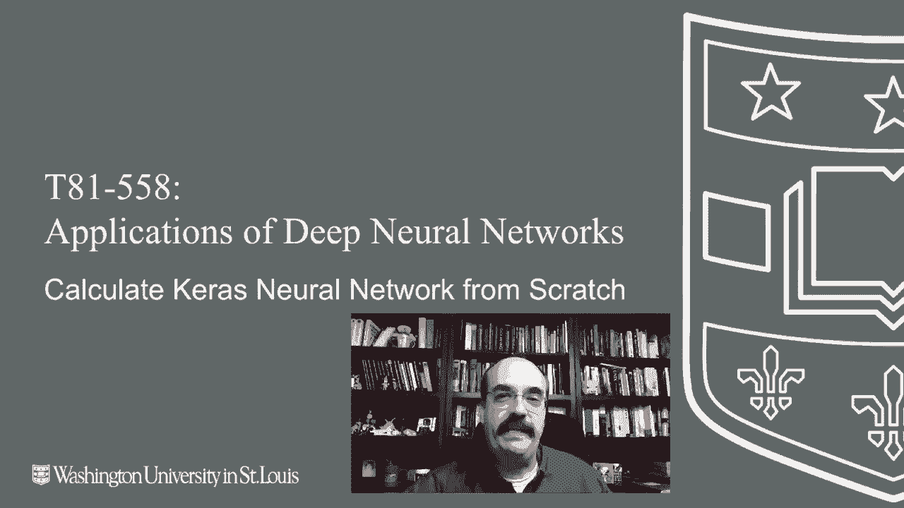

# 【双语字幕+资料下载】T81-558 ｜ 深度神经网络应用-全案例实操系列(2021最新·完整版) - P21：L3.5- 提取Keras权重并手动进行神经网络计算 - ShowMeAI - BV15f4y1w7b8

Hi， this is Jeffine。 Welcome to applications of deep neural networks with Washington University。

 In this video， we're going to see how to actually extract the weights from a neural network created by Kes and put those weights into an equation so that we can actually calculate the output from the neural network and see that this there's really no magic to this process。

😊，That it is simply weights multiplied against the inputs that produces a final output for the latest on my AI course and projects。

 click subscribe in the bell next to it to be notified of every new video。

 This is code from Ks and Tensorflowlow， But this applies to really just about anything。

 I am going to show you how to actually extract the weights from the neural network。

 so that we can then put them onto a diagram and actually actually calculate it and come up with the same number that Tensorflowlow would have。

😊。

For this， we're going to use an exclusive or neural network， that's the XOR function。

These are the inputs to it，0，0， the usual truth table for any sort of an and or an or。

 This is the expected output。 The thing to remember with X O R is if the two inputs are the same。

 it's going to be 0。If the two outputs are different， zero and 1 versus 10， it's going to be one。

Here we set up a neural network。 It has two inputs and a hidden layer of two。

 We're going for the absolute smallest neural network just to show that you don't really need that much to calculate an excluvo。

Also， since we are going to calculate this by hand or just being lazy。

 we don't I don't want to give you a truly deep， deep neural network and then calculate it by hand。

 that would not be fine。So we're going to optimize it with mean square error。

 and the final output is going to be one neural network， it's a regression neural network。

 you can do XOR as classification or regression in this case， I'm doing it as regression。

I basically train it here。 I am training it for100，000 epochs。

 It may take longer because there's so few weights in this that your initial random values or your weights are really going to have a lot of determination on the success of your training。

 We could do this in way fewer than this many epochs。

 This is basically grilling a cheese sandwich with a gen engine， but。

I am really not trying to show you how to tune these things right now。

 I just want to get the weights set up so that they're good for a exclusive or network。

 we're going to put those on a diagram and show you that basically you can then calculate the same output so you can see the weights behind what Kis gives you。

I train it， I predict it， this is good for the neural network because。

Each of these four correspond to these four up here in the input。 This is scientific notation。

 So to the negative 4， that's 0。000。 That number。 So these two are effectively0。

 and these two in the middle are effectively one。 So this may look weird if you're not used to seeing numbers like this。

 but this is a great output。 the neural network has trained quite well。

So then what we're able to do is I write， I wrote this little program here， this dumps the weights。

 so you're seeing that the layer0 counting starting at zero。

Weight from the bias to the next layer layer 1。 again， we're counting with 0。 neuron 1。

 neuron neuron 0， neuron 1。 These are the biases。And these are the actual weights。

So there's not a lot of weights and biases in this neural network， it's a fairly small one。

So I'm going to show draw a diagram here in just a minute。

 and we're going to copy all of these values up onto the diagram。

 Then we're going to calculate it by hand。 I give you the code down here to calculate it by hand as well。

 if you want to do it， you set the input to 1 and 0， So1 in 0 and an X O R。 Those are different。

 So it should be 1。 So it outputs a 0。96。 Now， since we're calculating this by hand。

 I truncated quite a few of these numbers。 So 1。29 becomes 1。3， and we'll do that when we diagram it。

 So we lose a little bit of accuracy， but。These are the two input neurons。

We are going to feed this values 0 and  one。 So that's what we're calculating for。

 You could calculate it， really， for。Just about any other value that you wanted to。

 But for the other four that you would have in the exclusive  four。

 we're also going to have the bias neuron。 So like we saw in earlier class videos。

 you're essentially calculating。A weighted sum over and over and over again for a neural network。

 So we're going to calculate the value for hidden neuron0。H0。

Each zero has inputs from those previous three。These all have weights。

 as we saw from the output from the program before， so I'm just going to copy those in。

So this is going to become essentially a weighted sum that we're going to use to calculate what hidden 0 is actually what its value actually is。

 So to do that， we're going to multiply the input 0 times its weight， which is 1。3。我是。1 times 1。3。

That one is from the first， which is actually the second input neuron。

 And then we have to add the bias。 and we basically perform that。Calculation， which ends up being 0。

 So the value for hidden in hidden neuron 0 is 0。 Next， we're going to calculate the value for。

Hid neuroron 1， which is the second one。 It has a similar sort of thing going on。

 It has three weights coming into it。Is going to copy those values from the output that we had from the Kiras program。

So that is simply。1。2， we are calculating basically the weighted sum again。

The first input I0 drops out， second one contributes that one point。1。2 to it。

 and then the intercept or the bias for。For this， for the second hidden neuron is zero。

This whole thing， together。Is basically equal to 1。2。 Then this value。

 we have to pass it through the through the activation function。

 Both of these needed to go through the activation function。 That is the rectified linear unit。

 So that is basically going to be the max。Of 0 and 1。2。Which is also 1。2。

So the output from this hidden neuron here is 1。2。Same sort of deal up here to apply its activation function。

 It's going to be maxed because it's also the value。 the max 0，0 is 0。

activation functions that you can use， I may give you a different one for for the midterm examination on this one。

The only other ones that you will ever see， at least in this class， are sigmoid。Pollic tangent。

There are others， but these are for regression。If you're doing a classification。

 you might also see the softm but。Focus primarily on these。Now the output。

 the final layer so that we actually get what this neural network is providing for us。

This is going to have similar to before。 We do have another bias connection。

 So you're going to have essentially three and bound connections again。

And we're essentially going to just copy the weights that we had from the output in Caras。There is 0。

And this results in the final equation that ties this whole thing together。

And that is going to basically be。Is the output from from hidden hidden 0。Times 1。6。Plus， 1。2。

Times 0。8。You can see the 1。2 times the 0。8 and then plus the plus the。The bias or the intercept。

 which is zero。And then this whole thing equals 0。96。

That's your final output that is approximately equal to 1。0。

 which is what you would have expected from a exclusive or。Of。Zero and what。There you have it。

 That is the calculation for this neural network done using the weights that Kiro is actually trained for us。

 So we can see that there is really no magic there。😊，This simple of a neural network。

 you could have actually just hand coded these weights that would have not been difficult。

 I'll probably do a video on that as well so that you can see how to actually hand code one of these。

 You do need about this size of neural network。 You definitely need the hidden layer。

Thank you for watching this video。 In the next video。

 we're going to see more advanced training techniques that we can use with a neural network to。😊。

To get better results and to measure or error in a variety of different ways。

 this content changes often。 so subscribe to the channel to stay up to date on this course and other topics in artificial intelligence。

