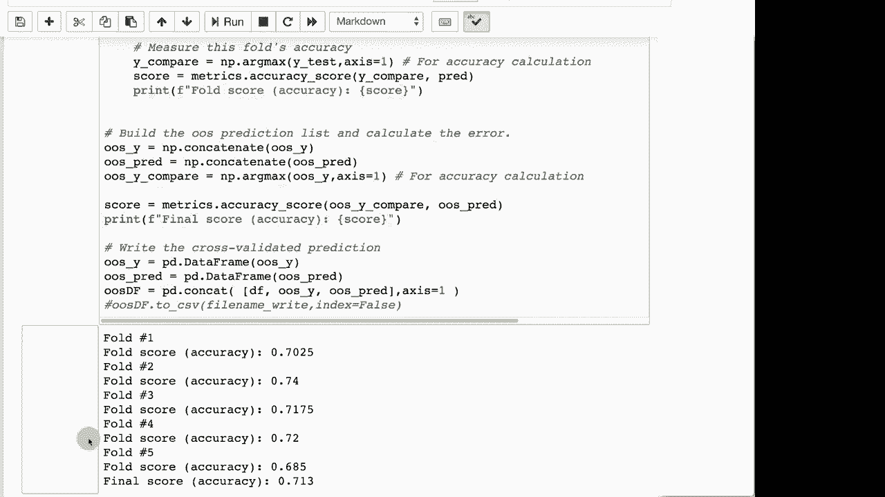

# 【双语字幕+资料下载】T81-558 ｜ 深度神经网络应用-全案例实操系列(2021最新·完整版) - P30：L5.4- Keras使用Dropout以减少过拟合 - ShowMeAI - BV15f4y1w7b8

Hi， this is Jeff Heton， welcome to applications of deep neural networks with Washington University In this video。

 I'm going to show you how to make use of dropout， which is another type of regularization technique that you can use in Carra's neural networks along with L1 and L2 for the latest on my AI course and projects click subscribe in the bell next to it to be notified of every new video let's look at what dropout is actually doing for neural network Now dropout is added layer by layer as you can see here。

 dropout， you specify a percentage of the neurons for that layer and in this case， this neuron。

 this neuron and this neuron would be dropped out Now this changes each time through the steps in the epochs that way you're constantly changing which which of these neurons is actually available and not available when they're dropped out。

 they keep their weights but they no longer contribute any values by these dashed lines to the next layer So this is a comparison that I've heard of this often。

Would be like if you went to work and every day the CEO of the company told half the people to just go home at random that'd be pretty cool actually。

 but what that would do for you is it would make sure that none of the workers become particularly specialized at their own tasks。

 They're very agile that way and。Not overfi to the particular tasks。

 So this kind of keeps the neural network on its toes。 This also attempts to。

Simulate having a bunch of neural networks， each with different configurations of neurons put into there to help mitigate the randomness that we saw in the last part where the neural network。

 you can train them multiple times。 and you get completely different results。

 So this can lower the variability of the output of the neural network to some degree。

 it's almost like built in andsembling。 you have a lot of virtual neural networks that are created for each each layer as the dropout is randomly applied。

 Now， dropout this is important when it's done all of those neurons that were missing。

 which change back and forth， all the neurons go back。 So each of those neurons。

 those subnet in their return and you have the full neural network then for for your use after you're done with fitting。

 So dropout is only really affecting the neural network during training and。

out is yet another hyperparameter that we need to optimize。

 which can influence the effectiveness of our neural network。

 This is a pretty good animation that I rather like that shows you essentially how how dropout works to some degree。

 Basically as the training iterations are going through。

 It's randomly selecting dropout neurons to to go away。

 The white neurons are the ones that are still there in the black ones are dropped out。

 You can see the input and the output neurons remain in the in the neural network。 Also biases。

 You don't you don't drop out biases。 So let's see how we would do this。

 We're going to do classification。 I'm going to go ahead and run this so that we get the classification data loaded。

 We're going to predict product from the sample。😊，The simple data set that I that I gave you earlier。

 this is essentially how you do dropout。 It's very simple。 You add almost a layer。

 a dropout sort of layer， it's affecting the layer before it。

 So this is causing this previous layer 50 to drop out 50% of the neurons。

 you can also add one to additional layer usually most literature that I've seen suggest not dropping out from your final hidden layer。

 the layer that is just before the output。 so we'll follow that。

 but if you wanted to add it to that layer too that's that's exactly how you would do it。

 go ahead and run this。It is basically setting up to do the Kfold cross validation。

And we can see now that it's completed， our final accuracy was 70%， which is actually pretty good。

If we were to rerun this， we might get a different a different accuracy。

 but this does help stabilize some of the effects of the of the random weights。 So we'll try that。

 Let's go ahead and run it a second time。And we can see the result。 It's， it's 71%。 So it actually。

 we can see that overall。On our sample size of two anyway。

 this dropout does seem to be helping compared to the previous one that we were looking at where we were using L1 and L2 in the previous the previous part in a different video。

Now it didn't remove the variance completely， we were at 70% and removed moved it up to 71 just from rerunning it。

In the next video， we're going to look at how to use。

Boottrapping so that we can get better benchmarks by running this through a number of times and averaging things together。

 Thank you for watching this video and the next video we're going to look at L1 L2 and drop out all together and get an idea of which you should be using and why this content changes often so subscribe to the channel to stay up to date on this course and other topics and artificial intelligence。

