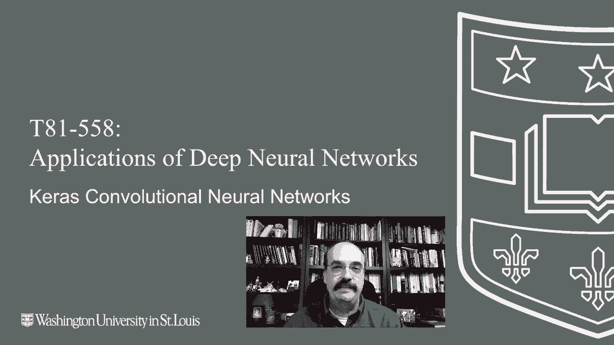
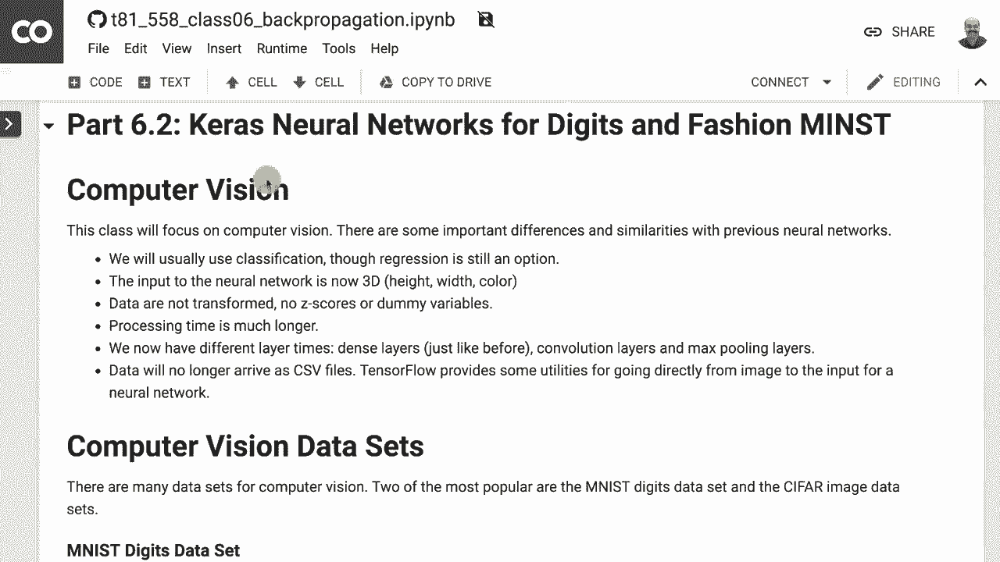
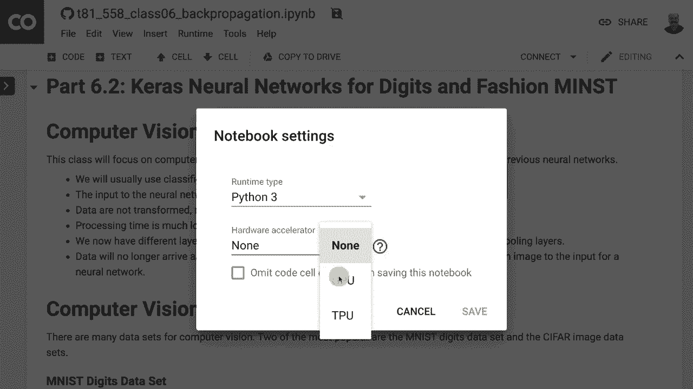
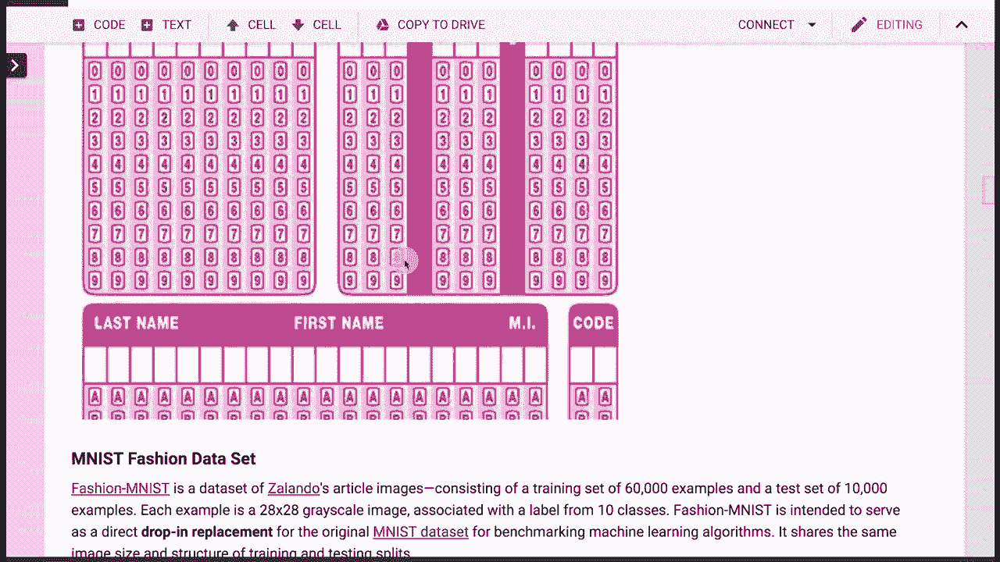
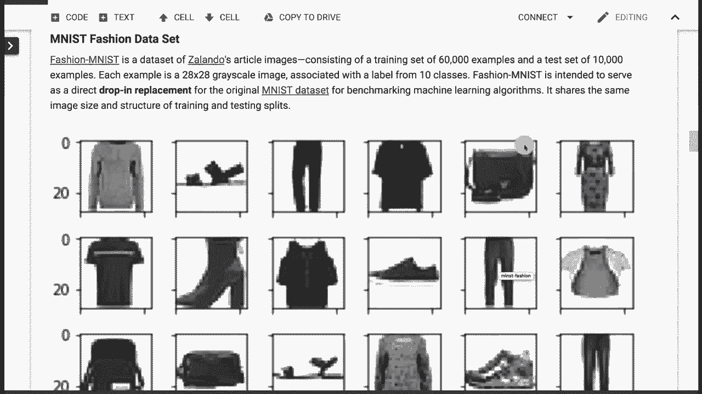
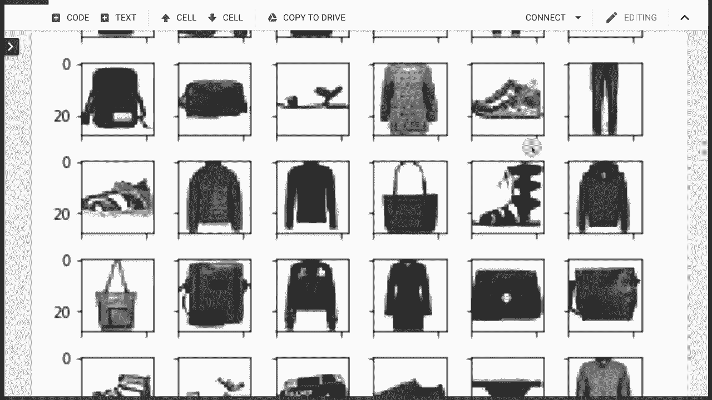
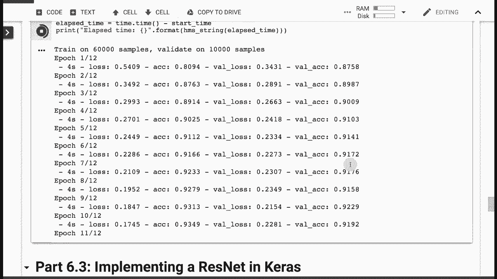

# 【双语字幕+资料下载】T81-558 ｜ 深度神经网络应用-全案例实操系列(2021最新·完整版) - P33：L6.2- 用于MNIST和fashion-MNIST的Keras卷积神经网络 - ShowMeAI - BV15f4y1w7b8

Hi， this is Jeff Heaton。 welcome to applications of Deep neural Network with Washington University In this video。

 we're going to look at how to use convolution neural networks。

 and we're going to start with one of the classic neural network data sets that has been used on many different。

😊，Models other than neural networks as well， this is the Mins digits data set。

 then we're going to look at a newer data set that is very similar。

 it's meant to be a drop in replacement for Minst。 it is the mens fashion data set。

After we get through these we'll be able to see more advanced topics for convolution neural networks for the latest on my AI course and projects。

 click subscribe and the bell next to it to be notified of every new video。

 so you'll notice that I am using Google CoLb rather than just simply my laptop like I've done in a number of these videos。

We're using Google coab because we're going to need to make use of a GPU。

 If we don't make use of the GPU， this is gonna to run very slowly。

 We'll literally have things that would take probably five minutes with the GPU that could take two hours without the GPU。

 So it's very important that you have that GPU available to you。

 I have a complete video that I'll link to this。 It's linked with the class that shows how to use Google coabab in conjunction with this with this course。

 Basically， if you want to run any of my course material It's best just to open up the Github repository with Google coab and pull the file in。

 that's exactly what I've done here。 You can see up here。

 I've connected to to Github and I've pulled in this class 6。 Now。

 let's look at how to use this with Kira's and convolution neural networks。 First of all。

 let's go ahead and change the runtime type。 We do want to use。

So it's saying in Python 3，6， Washington University。 that's something local。

 So it would complain about that as soon as I tried to run it because Google Coabb doesn't know what that is。

 That's a local Python environment that I have。 I'm going switch it to Python 3 hardware accelerator。

 We want a GPU。 We'll get into TUus later。 and let's go ahead and save。 Now。

 whenever I run things in this。 It'll run it with the GPU。

 So we're going to look at computer vision data sets。 There's a couple of them that we see in this。😊。

Course module， and then we get into some even more advanced ones later in this semester。

The classic Ho world computer vision data set is the minsed digits。

These are basically handwritten digits that are 28 by 28 pixels。

 they have been studied and used to death in research。Papers。As a result。

 there's been a very closely related data set added to this called Minced fashion。

 which looks very much like this， except its handbags and shoes and shirts。

 So you try to detect an article of clothing rather than rather than digits。

But we need to go through the the mins digits。 We want to see how this works because it's。

 it's your typical hello world for。For machine learning and for computer vision。

 now where these digits came from。Standardized tests， more and more， this is becoming online but。

You guys have probably done fill in the bubble sort of standardized tests。When I was in grade school。

 high school and getting ready for ACT exams and sat， getting ready for college。

 this is the only way you took this kind of thing literally they know that these students were creating perfect computer vision training data because the students would draw like a three end here and then fill in the blank。

 so you've got your X which is going to be the what they drew and the Y。

 the expected labels of what they filled in the little blank with。

Now there's noise in this dataset set。 Some students， me in particular。

 when I was taking these things had really bad handwriting。 Some students would lie。

 they would draw a three here and fill in a four here。 R's a legitimate mistake。

 So that is that is basically how this works。 I also remember some of these exams that I took back in the innocent days before identity theft。

 You'd literally put your social security number right on the exam paper。

 What could possibly go wrong。 So that is the mined digits。

 Minsed fashion is basically articles of clothing in exactly the same format as the mins digits。

 So it's a drop in replacement。 and we will take a look at this data， because it it's great。

 and it's more difficult than minst for the machine learning。 Mach learning has gotten smarter。

 So we need smarter， not smarter but harder data sets for the machine learning to tackle。

You can see there's shoes， there's pants， there's shirts， dresses。

Fashion items basically for the neural network to figure out。 So instead of 10 different digits。

 you have 10 different types of fashion。 It's also the CR data set。 C 10， we will use because。

We're going to look at resnets later in this course and Resnets。

This is the data set that they really distinguish themselves on for the first time。

 so we'll see how you can apply a resnet to these full color。

Data set here where you've got different types of airplanes and different types of cars， cats， birds。

All these kind of things， by the way， a common complaint of some of these machine learning databases that later ones have tried to fix is what percentage of these are animals。

Airplane is not bird， cat， deer dog， frog， horse。 Okay， so a good 60% of that。Is an animal。

 So not not completely balanced as far as the the features that it's learning。

 other resources that I do want to show you。At Stanford。

 there's an entire course just on convolution neural networks。 And just like this course。

 they make all of the material available on the Internet。

 So you'll want to check that out if you're particularly interested in convolution neural networks。

 Andre Kpathy is。I've followed his research since he was a grad student and very interesting guy who does a lot with computer vision。

 his his dissertation was on captioning。Now you could have a picture of a cat riding a skateboard and the neural network would literally write out in text。

 Cat riding skateboard。 That was the image that I think he had as one of the figures in his。

 in his dissertation。He taught the course at Stanford initially。I think he works for Tesla now。

 so he probably doesn't teach that course anymore for Stanford University and all the information is is online He also wrote Convenet JS。

There's an early convolution neural network library completely in JavaScript。

 probably these days you would use the Google Tensorflow for JavaScript。

 but it's worth taking a look at so we'll look at convolution neural networks。

 convolution neural networks， a lot of the application to deep learning and to neural networks in general。

 came from Janang Laon， who is one of the corecipients of the Tring Award for deep learning that was awarded to him。

Yshua Benjiio and Jeffrey Hinton。What this？Does that is really powerful compared to neural networks before。

And other traditional machine learning models like support vector machines is it can scan。

So we've got the digit A here and notice this little box connected to the convolution layer。

The convolution layer is one of a couple of new types of layers that we have now。

 we had dense layers。Now we get convolution layers and max pooling layers。

 We also got dropout layers previously in this course， but these are the two new ones。

 The convolution layer takes this square。That is used to scan。

 so you specify the size of that square， the size of the scanning region。And it scans across。

The entire image area， and it learns。As it goes。So if the square was right here。

 it would learn about the bump on the top of the a sort of an angle。 Now。

 other letters might have a feature such as that and these。Filters they' typically called or neurons。

 they're roughly equivalent to the neurons in a normal hidden layer。

Would learn each of these attributes。 Maybe one of them would learn a line that stops here。

 Maybe one of them learns a line going at an angle。

 One learns a somewhat perpendicular connection to the line。 The bump at the top。

 All those would be learned by the feature maps， and that's in the convolution neural network。

 The convolution layers。 feature map is another term for a convolution layer。

 Then after you've learned this， you might want to sub sampleample it and decrease it to a lower resolution。

 That is the max pooling layer。 We'll see all of these layers work in a moment， exactly。😊。

Then you have some additional convolution layers now learn to find features on this much reduced map。

 So since it's smaller resolution， what you're really looking for now is the building blocks that this first layer learned。

 So this first layer maybe learn bump Perpendicular connection line and end of a line。

 now using just those building blocks， this layer then builds higher level abstractions。

 So maybe it learns， okay， bump connected to two lines。

 and then we pass through some fully connected layers， these are dense layers。

 there's a variety of terminologies floating about on these。😊。

Dense layer is pretty much what I've seen them called at least in the last five years worth worth of literature and then Gaussian connections。

 that is pretty much being used then for classification。 So the output has 10。

 So there are 10 different types of digits。 It's interesting that he specifies 10 outputs。

 but has a letter here you'd expect maybe 26 if he was teaching it on。

 but the paper that this was used a lot in was using mined digits。

 but you could draw an a and it would probably might think it's a9 with a weird line on it。

 nonetheless this is the original diagram from La's original paper in 1998 that set the framework for a lot of what was to come。

 Convolution layers。 What you need to specify on them is the number of filters。 The filter size。

 That's the size of that square that's scanning across。

Side is how many pixels that square jumps as it is scanning across padding is essentially a border that you put around the image because when that square hits the edge。

 you don't necessarily one it just falling off the edge of the image and not having a full set of pixels so you can put a padding around it zeros basically a black background and you also need to specify some activation function。

 usually re or one of the variance like like prelu or leaky re one of that family typically convolution layers are basically add weights and add parameters just like the other layers。

 the amount of parameters that it would add would be the filter size times the filter size because the scanning square is always square so the filter size is assumed to be the same horizontal and vertically times the number of filters and that's just basically weights that are inside of that convolution layer。

Once it scans across the entire region of the image。

 they're often called shared weights because that means that something detected up here in the image can also be detected down here in the image。

Positional invariance。 Basically， you can something could move。 and it's still， it's still detected。

 This is essentially how you would think of a convolution layer as working。

 You would have this square。 Now， this is dealing with gray scale。

 So there's not three individual elements of red， green and blue on each of these pixels。

 If this were color， thered basically just be a depth component and you would have three numbers for each of these。

 But this blue region is basically the scan and it goes across as it， as it scans and。

It has to go completely through the entire image for each prediction or each step in the training。

 Now max pooling layers。 This is where you reduce the resolution。

 So say you wanted to cut the resolution in half。 You would take essentially a 6 by 6。

 and you would take it down to a 3 by 3。 So it would divide it into these regions。

 and you would take the maximum hence max pooling layer。 maximum in this cell is 8。 So you get an8。

 Max in this cell is 2。 you get a 2。 so on， and I do have a link here to give。

 if you want more information on the lower levels of convolution neural networks。

 So let's have a look at how we would handle the digits data set I'm going to go ahead and run this region here。

 and it displays the information。 So we've got 60000 in the training set and 10000 in the test set。

 Now， notice we are not。Having to split train and test on our own。

 they don't want you to for the immense data set。 This is because this was used almost in a competitive way for papers。

 So they wanted everybody using the same training and the same test set so that you could have a reasonable comparison So if you said that you got a certain result on it。

 It's not just because you picked a lucky break between train and test。 Now。

 if we want to display the digits， we can simply run this。

 This shows you what's actually in this this data set。 Now， notice， too。

 we did pull the data set directly from Kis。 Kis provides this for common dataset sets as a convenience。

 but this can be a real pain。 if you're trying to use your own images。

 And we'll talk about that in a future video how to pull in literally your own images raw Jpegs and P and Gs。

But for now， we'll use the convenience methods Here。 you can see one of the images。 It's very big。

 You can see probably some sort of a spiral there。 If you want to actually display it。

 You can run this。And it displays it some sort of a one。That's the 105th digit if you want to pick。

The next digit it would display it， which is a six。

 So this is essentially heat map that Matplot Live provides us。

 It provides a convenient way to visualize these。 If you want to see a whole bunch。

 you just do subplots。In Mapllib， you run that。 and it will show you a whole bunch of digits。

 So this is a good way to visualize some of these data sets and show that they really are just images that are being pulled in for you。

 You basically have to take the raw P and G and Jpeg files and turn them into tensors into cubes heightthe width by the color depth。

 Now， let's go ahead and build a neural network to train this on。

 This is where we'll be glad we have a GPU。😊，Doesn't take too much time to actually build this。

 It shows some of our hyperparameter We're choosing a batch size of 128。

 We are doing some basic transformation on on the data set so that everything is in the right order that Tensorflow wants it。

 Typically， we， we need a height by width by。The color depth。

And we will see how to actually do that when。How to do this on raw images When we get into dealing with loading our own images for this。

 this is important。This is doing some basic normalization on it。

 So I said that neural networks deal best with。Data that's always in the same range。 Well。

 you're always in the same range of 0 to 255 on the individual color components of RGB。But here it。

 this is getting everything between 0 and 1。 since the normal range was 0 to 2。

55 for a little better result， you could even potentially center this about 0。

 So you'd probably subtract 128 and divide by 128。 We'll see an example of that。Later on。

We print out how many train sizes we've got。Here is where we build up the neural network。

 We add in some convolution to the layers。You don't really have a convolution 3D， there might be one。

 but typically you're dealing with 2D because you're recognizing 2D images。

 it wouldn't surprise me if somebody has figured out a way to send in 3D images for recognition。

 be interesting how you would capture those you'd probably need two cameras。

But we'll deal just with 2D images， not 3D。 Then we put in the max pooling layer。 add some dropout。

 The flattening layer is always needed when you move from these 2D to the dense layers like we've had before。

 So always put that flatten in there because that basically now you can't go back once you flattened。

 you can't use the convolution layers again， or at least not without some extraordinary reshaping in there。

 never say never。 And then you use a dense layer。 and this is classification。

 So we're using the classes categorical crossenttropy and softm。

 just just like we've had many times before。 Now， when you want to train and fit it。

 and notice these times that I have here， this takes nearly two hours on the CPU and 13 minutes on the GP。

 It's not gonna to take you that much time on the GP。

 this Google GP that they give you for free is better than my GP that I that I ran this on about a year ago when I took those times。

 So it's awesome what you get。For free。Let's go ahead and run this。

 we're going to go ahead and train it， this is training code just like we've seen before。

I do time it， so we'll see exactly how much time this takes。 Now you want to run that。

 It tends to take it a little bit of time to get going， but we're already on the first epoch。

And it's， it's really pretty quick。 We're on our second epoch。 and it， it took really。

 it's taking only about 4 seconds a epoch。 So I will go ahead and fast forward this， but it's。

 it's not gonna take much time。 Just think this could be two hours on some CPUus。

 And there we are 53 seconds。 I love GPus。 Now， there's two types of GPU that you're dealing with right now。

 there's the K 80 that I think that's what it's called that Google gives you for for free。

 That's the cheaper one。 It's probably around a $500 to $700 GPU。 This is in 2019。😊，Well。

 I willm sure I will have updated the video by the time this that changes radically。

 There's also a V 100 more advanced enterprise 1。 I use that on Amazon cloud。

 And that's probably a $6 or $7000 GPU。 You would think that it would run even faster on that one。

 but it does not。 This is not a complicated enough neural network。

 It runs about the same speed on this GPU versus the other。

So when you are running on something like Amazon Cloud。

 you need to balance really and not overuse to advanced of a GPU or or you're simply wasting your money。

 You're dealing with something the more advanced GPU on Amazon Cloud， at least in today's dollars。

 it's about $4 an hour。Versus under1 dollar an hour for this GPU that Google's given you for free。

 so definitely use the Google one。For some of the assignments that I give you。

 you will need GPU level processing performance otherwise you're going to spend hours and hours and hours training and it'll take you a long time。

 so I'll discuss that when we get into some of those assignments because there's separate videos and explanations for each of the assignments Now let's evaluate the accuracy。

Let's just run this and look at the accuracy，99%。 This is why fashion minst was introduced。

 because this this is a decent hello world that what are you going to do if you're trying to do any sort of research on this。

 I mean， you're going to be at 99999。 it's pointless to say that you increase the accuracy from 99% and 99。

99999%。Now this is another thing that's useful to know too， when you're scoring。

 that is sending data to get values back predictions back， if you're using a GPU。

 you might get a resource exhaust error that is simply because you have thrown too much data at the GPU for it to score at once。

So you have a couple of options there， this usually won't come up during training because you're using mini batches。

 but if you're trying to score a big block of like a million rows， it might not fit in the GPU。

coupleuple of options there， scoring is usually pretty quick。

 you can just send that to the CPU and it doesn't matter how big it is within reason。

Or you can break it up into pieces and send each of those pieces one by one to the GPU。

 And you would use this kind of code to do it here。 if I wanted to just score the first 100。

 So I give you an example of of doing that。 Now， let's look at mensed fashion。 Again。

 we're using convenience methods to load this in so that we don't have to have the data sets of all those fashion items。

 we're going go ahead and run that。 it is downloading it。

 So when you run some of these for the first time， it will download it。

 if we want to display these just like before， this is exactly， by the way。

 the same code as the digits。 So I'm not going to explain， reexplain it all。

 just going kind of show you what it looks like。Let's go ahead and run this。

 I shouldn't really say digit9。 this is a fashion apparel number nine， which is a shoe。

 And if we want to display a whole range of them just like the digits we can。

 So there's a block of fashion items that it's trying to。Again， pretty similar。Training times。

 I'm going to go ahead and define。The neural network just like before。It's defined。

We're going to now train it。And we'll see that the training time is really pretty comparable。

To what we are dealing with before。 Notice the accuracy is not just pegging right up to 99%。

 It's around 89%。90%。 So this is definitely more difficult。 You would have to。

 you'd have to work a lot more to get this up to the higher levels of accuracy。

 And I have not looked。 This is not too much of a real data set。

 I suppose it's used some in research， but I have not looked at where。

Some of the the more advanced researchers have gotten this up to。

 but it looks like we're going to be right at around 92% of validation accuracy。

 and it looks like it's。

Kind of stopping there。 Thank you for watching this video。 In the next video。

 we're going to continue with computer vision and look at resnets。 This content changes often。

 so subscribe to the channel to stay up to date on this course and other topics in artificial intelligence。

😊。