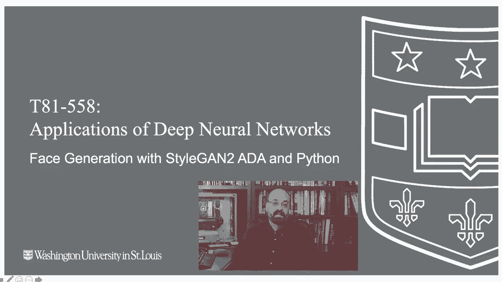
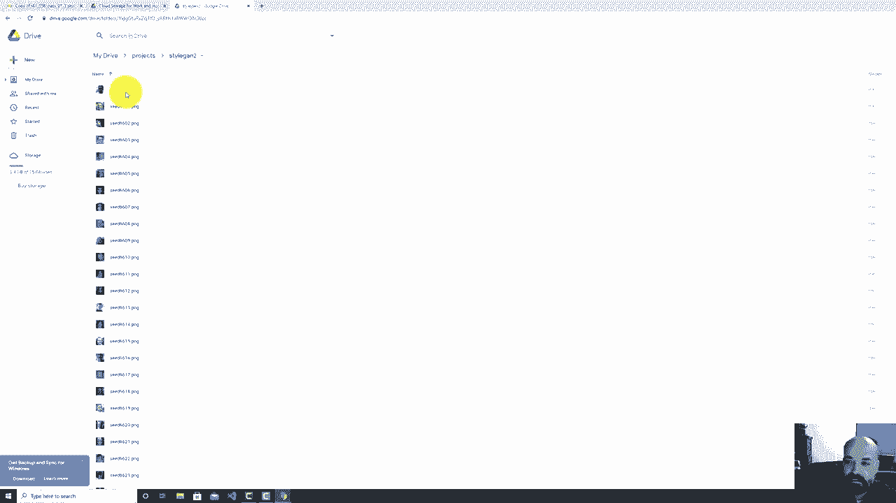
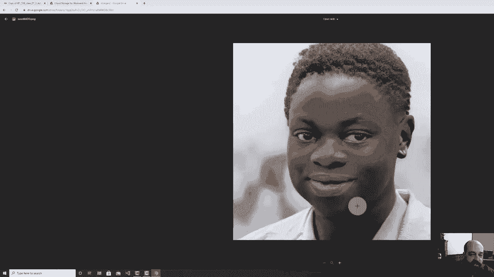
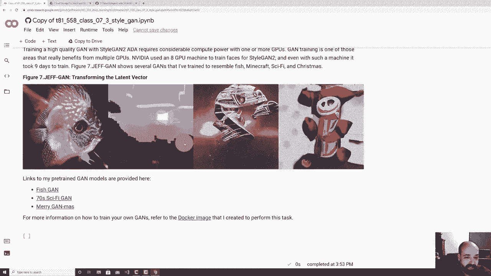

# 【双语字幕+资料下载】T81-558 ｜ 深度神经网络应用-全案例实操系列(2021最新·完整版) - P39：L7.3- 使用NVIDIAStyleGAN2- ADAPyTorch和Python3生成人脸 - ShowMeAI - BV15f4y1w7b8

Welcome to applications of deep neural networks with Washington University In this video。

 we're going to take a look at using NviDdia stylegan 2 AD for Ptorrch to get some really quality G face images。

 Now， previously we saw that we could use our own technology our own custom built neural network to generate GNs。

 but the faces didn't look particularly good。 It takes a lot of compute power and a lot of clever algorithms to really get high quality faces like you see with stylegan。

 So we're going to look at Stgan2 AD Ptorrch， which is really the latest technology in this area。

🎼。Okay， let's have a look at the code。 So this is the module that there's a link to in the description。

 And I do put the note here。 This module requires pytorch。

 So most of this course that I teach you is in Tensorflowkis。 There's two parts。

 at least as of the recording of this video that I do make use of pytorrch。

 That is for reinforcement learning and also for stylegan。 This is mainly just because。

These two very important libraries in this case， stylegan in the case of reinforcement learning。

 stable baselines have made the switch to Pytorch and really the neural network is kind of below everything that you're doing so you really almost don't notice it。

I am adding in more pytorch components as optional directions in this course so that you can see some of the same technology with Pytorch Pytorch is gaining a lot of momentum and it's a very especially in research。

 it's a very used technology are a framework for implementing deep learning all the underlying underpinnings are the same thing even the pickle files that I created with the old version of stylegan before NviIDdia made the switch to Pytorch the pickle files。

 the saved neural networks can just be loaded right into Pytorch So the underlying technologies are all the same essentially between these Now you'll see with stylegan2 AD there are all these very。

 very high quality faces that you can generate these are not real people they were generated by stylegan to ADA and by the way。

 the AD on the end that's augmented essentially you see it here with。

CaSo maybe there is just one picture of the cat in the original one， but as they train。

 they put a higher probability of augmentation happening and augmentation is one of the big breakthroughs in computer vision in terms of augmenting the images rotating them doing other distortions on them so that you have additional training data when training these Gs and I'll show you some of theganNs that I've trained from scratch in this class we're talking primarily just about generatingganNs from networks that are already trained to generate your owngans。

 you need high end GPU and I mean you can do with coab but coLab Pro really buts it takes a lot of compute most of the GNs that I generated were done on highend GPUs that I let run four days generating these but here you can see the images they look they all look quite realistic there are some some things that will tip you off that you're not looking at a real。

Image consider these at first glance， these look very， very realistic。

 But if you look at the background， that's usually a telltale sign that you're looking at a generated image。

 The background is kind of whimsical kind of mysterious。

 You're not quite sure what you're what you're looking at。 Also。

 things that are not the face will not look as as good like earrings。

 It has a hard time with earrings。 noticeice her earrings very rarely does a again create symmetric earrings。

Also the clothing， I mean， there's a button， maybe there and I'm granted。

 I'm not the best at at always having my my clothes neat prem and proper if you've watched my videos。

But the collar will usually be a little disheveel for me。 That would look entirely normal。

 I guess it does not know the difference between one face and two faces。

 So some of the training data as good as Ninvidia did in curating it and and paying people to remove certain things。

 Some of them have multiple faces。 And you can see this， this guy has a twin that is appearing here。

 and it's extremely distorted。 Similarlyly， hands。 She has moved her hand up into the frame and it's not looking so good hats it's。

 it's hard to tell on hats。 I mean， hats can be very bizarre， especially in high fashion。

 But usually hats will sort of blend into the hair， like you're seeing here， not real。

 And her her neck is。Really， really slender。 So looking at those， you can see another thing if。

I were to produce a video of just going through all kinds of random faces。

 you would notice that their eyes are always in exactly the same spot and by that。

 I mean the two eyes Now their face and head can move around a bit but the eyes are pegged to right here and the reason that is is more of a quirk in the way that NviDIdia train these is they used a feature detector to detect where the eyes were to crop so they centered each of the pictures around the eyes because you know people are in all kinds of weird positions and flickr and these pictures all came from flickr the training data so those are some of the things that you will notice as you work through these kinds of images Now I want to actually show you how to generate some of these so I'm going to go ahead and open this in collab because you've got to have a GPU to run this。

Now you could probably run this just fine without a GPU for training no way。

 but for generating them potentially is it it generates very， very quickly。

 but this is software from NVIDdia so they assume you have a GPU it's just the way it works and especially Pytorrch Pytorch。

 you kind of have to program it differently for a GPU versus a non GPU so a lot of Pytorrch that you will see code。

Does require a GPU just because the original researcher programmed it that way。

 actually need to update that I will remove that。 We're actually not using Tensorflowlow 1。 x。

 That was one of the problems with the old version before NviIDdia upgraded it they had used a very old version of Tensorflowlow。

 but now they are using the latest hightorrch， at least as of the recording of this video。

So I'm going to go ahead and run that and I do trust myself， I created this， this notebook anyway。

 and I'm going to do this so that I do have access to my G drive。You may want to do this as well。

 because if you generate some of these images， you you'll probably want to save them。

 So I'm putting that into there and it's no security breach。 that I'm letting you see that code。

 This is all you have to do to really install it。 You have to clone it。

 Piytorrch is installed by default in collab。 You do also need ninja。

 Ninja that add in for Pytorrch that。This that NviDIdia made use of for this。 Now。

 if you look at that， if you look at stug into8A Ptorch， you'll see the latest version here。

 we just cloned it right into our content on coabab is where you store all of your content that's temporary。

 This gets blown away as soon as you exit coab。 So be aware of that that's why we have to get it back each time。

 Now I'm going to generate some images。 And what we're going to do here is we're going to use pretrained faces code from NviDdia and we're going to generate seeds 6600 to 25。

 I'll explain that in a moment。 So let's go ahead and run this。

 So these seeds these are just random number seeds that will cause the random number to generate consistently random numbers across。

 So the way again really works is you're generating the image from a 512 number vector and that 512 number vector。

Is giving you is each each of those numbers generates part of of the image。

 So if you change one of them just slightly， it's going to change the image ever so slightly。

 That is how you do these kind of transitional images and videos videos actually that you are watching here as as I go through this this part I'm going to show you how to create that a video just like that of your of your own Now this takes a moment for this to install everything that's needed。

 there's two now it's there's two kernels that Nvi uses to make this go faster。 Actually。

 since they have custom kernels， this would not work on a CPU So I take I take that back what I said previously you would have to recode those kernels and that would not be fun So here we have the images they were generated they are now sitting in my content results and I could basically copy them to my G drive if I wanted to。

I'll show you another way to， to get to those。 So if you look at that， you can see them there。

 And now if we run this section。 if you get this error here， you'll see basically that stylegan 2。

 not a directory， that just means that you didn't create the the folder on your G drive。

 I just corrected that。 So if I run this。 Now they copy there。 So if I go to my G drive。

 you'll see that I have a project stylegan 2， let me refresh it。 and you should see the。

The images that it generated there they all are。 So you can click on these download them individually。

 These are the images that styleylegan generates。 Now。

 I'm going to run this code which basically just sets up some code so that we can change those seeds into the actual vectors because we want to modify those 512 number vectors to。

 to do some of the things that we're going to do here。

 This is just quick function to display an image， and this is a function that I wrote that uses the NviDdia code to actually generate an image。

 Now， some of the things that you'll that you'll。😊。

That you'll see in here too is we're dealing also with labels。

 I'm not going to really get into into labels in this video。

 I could certainly do a video on that usually you have the GN that you're using and we're using all pre-trainedganNs here has to have been trained for labels。

So for example， say you trained yourgan on pictures of puppies and pictures of kitties， cats。

 if you don't put labels in there， it'll do quite good， it'll give you cats。

 I'll give you dogs and it'll give you cats that look kind of like dogs and vice versa you can label them so that you're telling it what class it is and then you can request when it's being generated to generate something more like a cat or like a dog。

 they have one actually in in the NviDdia stylegan page that is trained for this and it's generating very low resolution images from the from the C images set if I remember right。

 Yeah， the CR 10 one if you've worked with this， these are 10 these are。

Fairly low resolution in 32 by 32 images that was used earlier in machine learning of 10 different types of image for。

The data set so if you look at CR， I forget what the 10 classes are for CR。Airplanes， automobiles。

 birds， cats， deer dogs， so this data set has these 10 classes all mixed in and to get the best results。

 you created a labeled G and you can pick which of these that you want to generate otherwise。

Gans are not too good without without that labeling of distinguishing between between different things。

 I'll show you an example of a very broadly trained GN when we get to that in。This lecture。

 you can pass in a truncation Pi vary that will change the quality that you're getting。

 you can also introduce noise。 I keep it constant。 If you introduce noise。

 you'll see the hair and other small things change small thing so it won't change into an entirely different person but it will look almost like the hair is blowing in the wind if you generate a bunch of if you set this to random instead constant and then the class index。

 I'm not really using that for this class so I won't have that there and you run that and then here you're going to pick which pre-trained one。

 I'm going to use the fishgan。 this is one of my own。

 I trained this I trained the scan I use flickicker and got a whole bunch of fish images and this is basically just showing you how you will load a pretrainedgan。

It's just a pickle file。I actually trained this one on the old Tensorflow version。

 so it shows you how compatible these are， and I'm going to generate random fish from these seeds from 1000 to 1003。

 And there's three random fish。 And you can see they look really， pretty， pretty good。

 If you go through a bunch of different ones。 Some of them are definitely not as good as others。

 I mean， this one has an eye here and a very long mouth。 This does not have an eye。

 and this one has an eye here， but an unusual sort of nose， but they look， they look really， very。😊。

Very fishlike you can generate quite a bit more if you put additional seeds in there。

 And you can see some of these look really， they really very nice fish。

 You can see these fish really look pretty good。 This one looks quite good， quite good here。

 And that's a bit abstract as is that one。 Now you can vary the latent vector。

 The latent vectors that 512 number vector that we're generating that actually creates these。 So I。😊。

And basically going to， I'm going to use the F F HQ。 So I'm going to use actual faces。

 and I'm going to run this code here that I wrote。 What this is doing is loading the。

Faces so that I I can use now I'm going to transition between seeds 1000， 1003 and 1001。

 Let me go ahead and run this just so that it's going。

And what this does is I'm using 100 steps to get between 1000， 1003， 1001， so these individual seeds。

 if you go from seed 1000 to 1001， it's going to be a completely different looking person。

 but if you take that big vector of 512 numbers that that seed generated。

Then you're going to get the more gradual results and right now I'm generating for each of these people。

 I'm transitionisting from 1000 to person 1003 back to person 1001。

And you can see it takes it a little while to generate this。

 This is generating just a whole bunch of frames as I go through and gradually just sort of skew from one vector to another。

 you can see I basically get my vector1 and2。 I take the difference of the two vectors linear algebra style I divide that difference by the number of steps。

 and that's the value that I keep using each time to be my steps。 So I'm adding that step vector。

 which is added to the original vector slowly takes it to to the second vector and this is almost done。

 let's go ahead and fast forward。 Allright， it's done with that。

 and then I use something called FF Mpeg to convert all those frames back into a video and now we can download the video。

 It prepares it and I'm going to go ahead and open the video and there you can see the transition。

 I'm basically transitioning。en those those key images that I picked and you're able to see those those people trans in in real time。

 Now you can train your owngans。 These are somegans that I trained。 There's the fishgan。

 I trained one on Minecraft as well science fiction pictures。

 and then I wanted to try something really crazy。 I took just a bunch of random Christmas holiday videos。

 I mean， there were lights， there were Christmas trees。 There were。

Santa Claus is all kinds of stuff GNs don't do as well on that because there's nothing really to specialize on so it creates some really wild sort of Christmas E kind of nightmare before Christmas E images and I give you links to all my pretraingans there if you want to generate any of your own Minecraft images or other things。

