# 【双语字幕+资料下载】T81-558 ｜ 深度神经网络应用-全案例实操系列(2021最新·完整版) - P46：L8.5- 2020年春季Kaggle深度学习应用竞赛 - ShowMeAI - BV15f4y1w7b8

Hi， this is Jeff Heaton。 Welcome to applications of deep neural networks of Washington University。

 Well， is that time of the semester Again， It is time for the 2020 spring kle competition for my class。

 Now， this semester， it's going to be on computer vision。

 This is the first time we've done computer vision。 So I'm excited about this。

 we did natural language processing。 Last time， I think this is a great deep learning applicable technology in this one。

 we're gonna look at faces， and we're going to see if we can detect if they're wearing glasses or not。

 Now， these are faces that I generated with Gs。 So we're going to use the latent vectors of the Gs to try to detect eyewear。

 as well as the images themselves to see all my videos about kggle neural networks and other AI topics。

 click the subscribe button and the bell next to it and select al to be notified of every new video。

 if you go to my github repository。 T 81，5，58。 Jeff Heaton user URL is provided。

 You can scroll down and go to。😊。

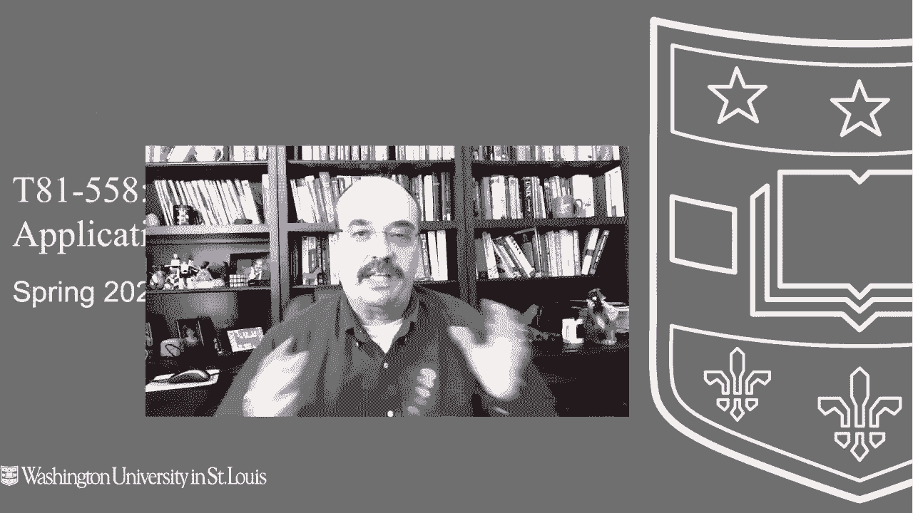

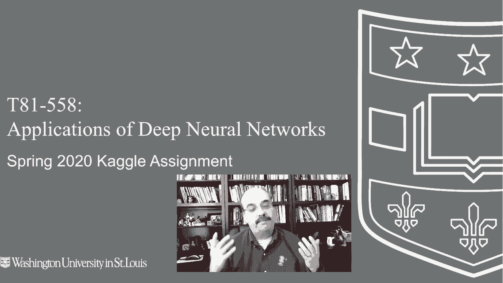

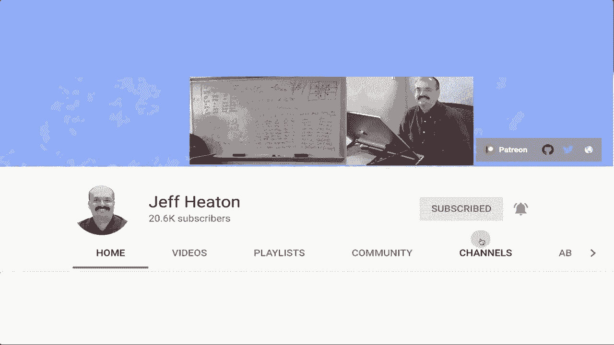

Where I have the kle。 I swear copy on page searching has made me lazy。 So I usually do that8，5。

 And there's always a link here to the current semesters kle competition。

 spring 2020 kle assignment I just put this up you click on that and go into here Now mine says this competition hasn't been launched only host and kgel andmins can see it。

 you won't have this here because I will have open this by the time that I release this video but this is the competition。

 What we are doing this semester is a computer vision competition。 And it's also related to Gs。

 So I am giving you a bunch of pictures and in those pictures you will see faces like this what I am having you do is predict if that face has glasses on it。

 Now you need to be careful with that because glasses can look a variety of different ways you can have sunglasses you can have sunglasses where you。

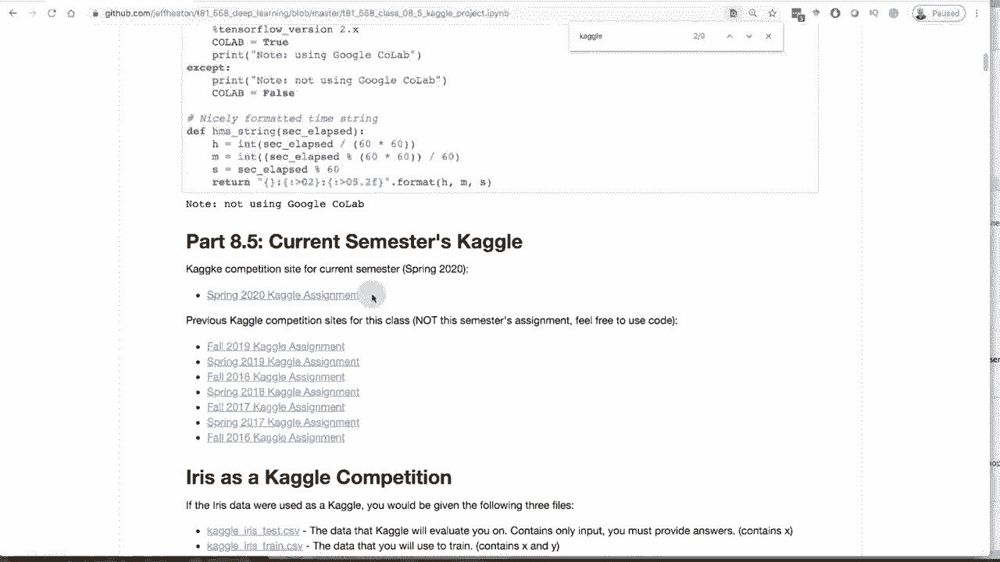

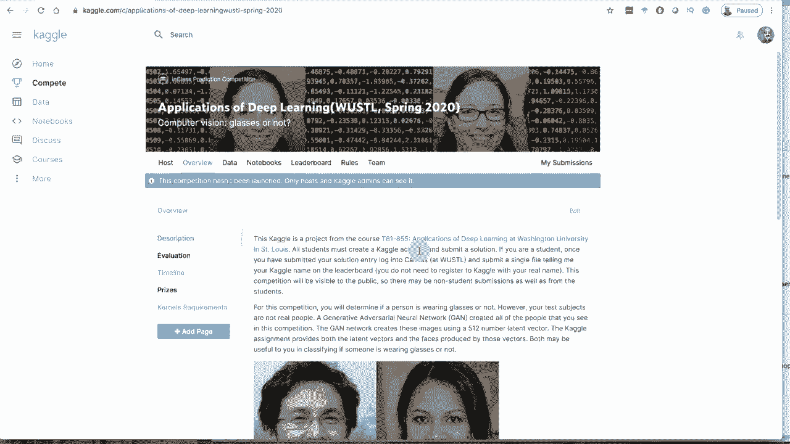

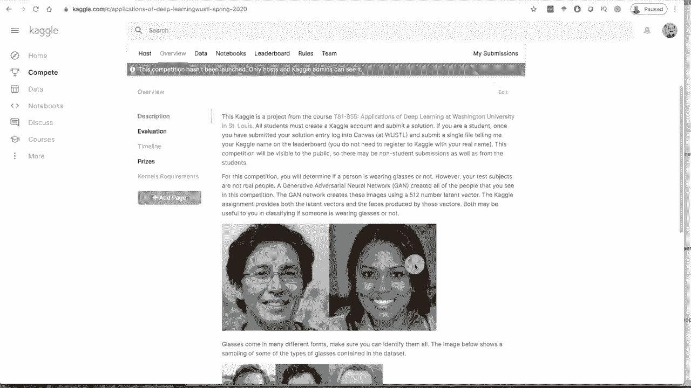

Even see his eyes。 you can have sunglasses where you can kind of see his eyes。

 You can have thicker frames， thinner frames， and you can have really thin frames。

 I wear this kind of glasses myself。 And at first glance。

 you might not think that she even has glasses on。 but if you zoom in on her。 you'll see that yes。

 there are glasses， they're just very， very faint。 I hope the video Koc for this video doesn't prevent you from seeing those。

 but that is essentially what we're doing。 Now one thing that I want to mention for this competition。

 you will be submitting your code to me， or at least if you're a student at Washington University。

 you'll submit your code to me。 And one thing that I am taking off the table。

 And I asked if you're joining from the Internet， you don't do this either。 There's only。😊。

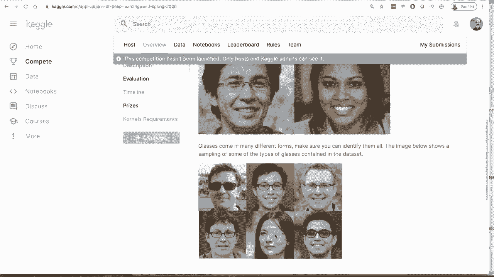

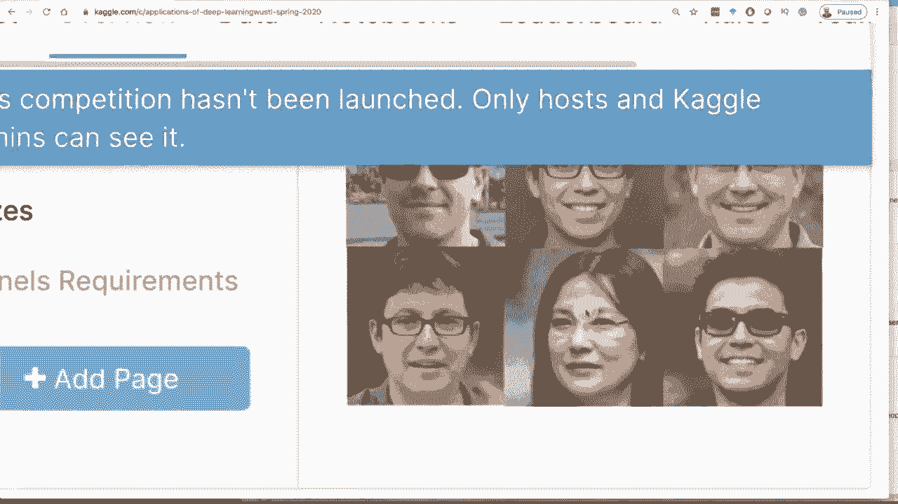

A couple thousand or so pictures in the test set that you're submitting。

 it would not be hard to just sit there and flip through all the pictures and label them glasses。

 No glasses。 use your human brain， your biological neural network。

 everybody knows you can do that that won't be that that valuable really。 So don't do that。

 you probably would not get a perfect score due to noise in the data。

 which will be talking about in a moment。 So let's look at the evaluation for this。

 you'll be evaluated using a log loss function。 So the data set basically as a one。

 if they have glasses a 0 if they do not have glasses。

 You're going to send a probability of whether you think they have glasses or not。

 you'll be graded on log loss。 So if you're very confident like it says here if you are very confident that it's not somebody with glasses in your term just a 0。

12。 and the label was actually one that'll be a fairly high loss for that individual person submission format。

😊。

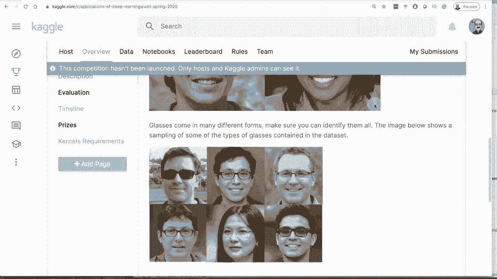

be like this you'll see in these files that we're going to download in a moment that there are ID numbers。

 All of the training set goes up to 4500。 The test set goes from 4501 onward rules you can create teams up to five members you may not human label the data you've got to use a model So don't just sit there and go through all of my images and label them glasses。

 no glasses， glasses， glasses everybody knows you can do that that doesn't really accomplish that much if this was a real kggle with a lot of money on it the way I would solve that as I would give you a punishingly large number of images with noise images in there in large degrees as well so don't don't do that and if you're in if you're in the top position in a kle competition you've got to submit your model anyway and if your model is a hardcoded list of zeros and ones you're probably not going to win anything which。

me2 prizes。 This competition in kle。 I mean， it's a kle in class。

 so it doesn't count towards ti or rankings or anything like that。

 There are no tangible prizes other than bragging rights。 However， and this is more for my students。

 although somebody from the outside gets in this position。

 I'll probably I would do this as well for the teams in position one through three。

 I will write you a really good LinkedIn recommendation saying how you were one of the top contestants out of'll probably be 80 or so people competing in this。

 at least for Warho this semester。 Now， the challenge for me in creating these kind of data sets is I never create a data set on Kagel with data that is just publicly available on the Internet that's no fun because there's all kinds of code and everything published for this。

 There's a number of kggles that might help you with this one。

 The cat or dog might be kind of useful。 Several techniques you can use for these。

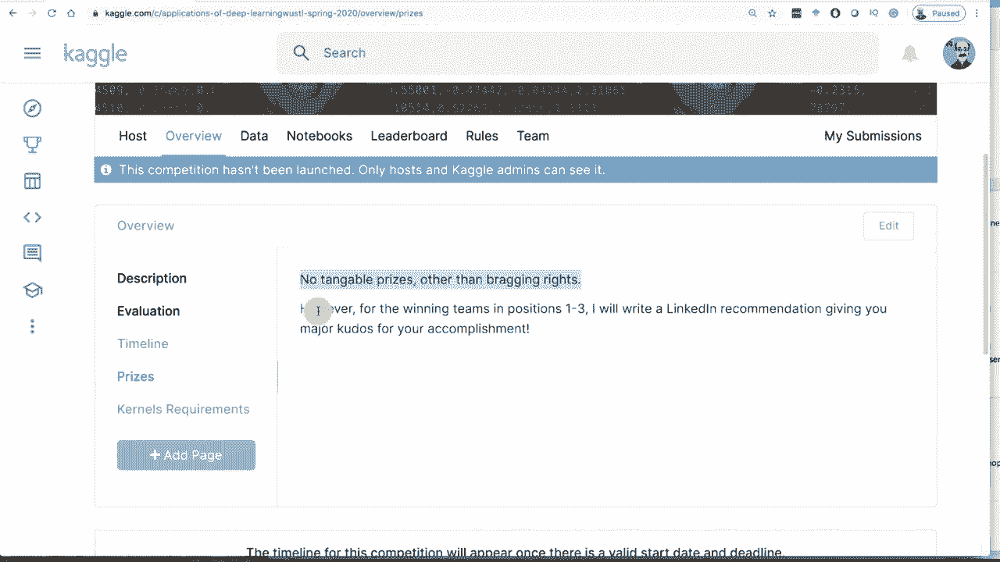

That I'll get into and I'll probably release some code as the semester goes on just to give you a few hints。

 I won't release anything over the top。 powerful for for getting really high on the leader board。

 And of course the rule to is like I said， no no sitting there and human tagging them。

 Now if you can teach your cat to tag them。 Okay no no cats either。

 So we'll go from there data So the data for this competition。

 there's a big file here basically its round 6 gig。 So it's not punishingly large。

 That' has all of the images in it。 If you were to download it。

 let me show you what that file looks like。 This is the image file。

 So it's a big zip file that has all of these PGs。 there are quite a few of them。

 if you go through all of them， you will see that there's around 5000 So around 500。

 I guess it looks like is what the test set is made of。 If you go through these individuals。

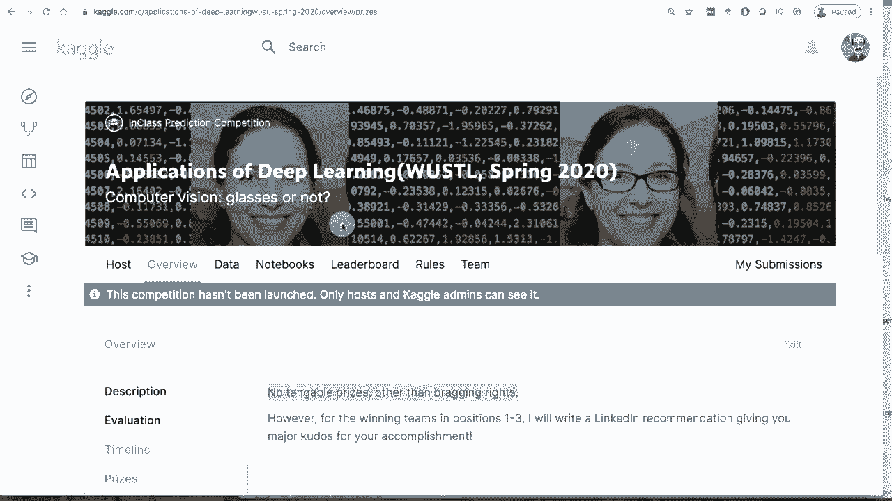

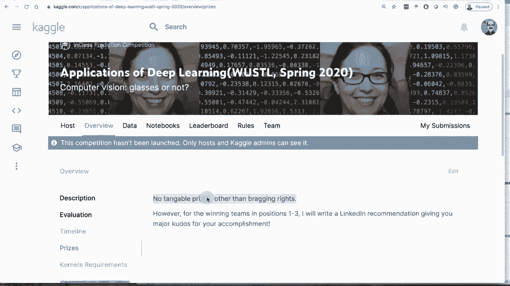

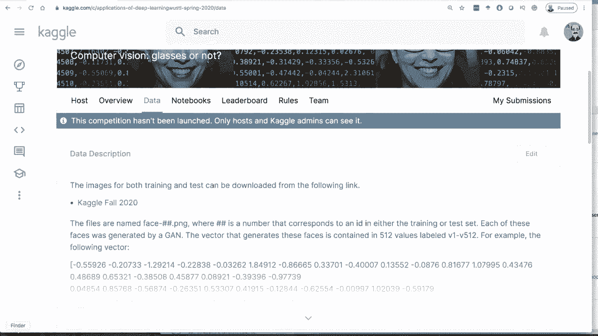

You'll see that some have glasses， some do not。 Some have sunglasses。

 and you have a variety of genders， ethnic backgrounds and facial hair。's hats。

 There's a lot lot of variety in these images Now as far as how to actually classify these。

 You really have two ways to go about this。 You can use the images。 or you can use thegan vectors。

 I'll show you thegan vectors in just a moment。 but let's talk about a few ways that you might deal with these images。

 You could write just a simple classifier that is going to tell you if the person has glasses or does not You're going to go to classifier route。

 I highly suggest that you use transfer learning and use a data that already has a lot of features already learned and then try to train it on top of it。

 I think that's going to work the best。 you can also use Yolo Yolo looking at this。

 it would be interesting。Honestly haven't tried it， but run Yolo over it。

 see if it identifies these pieces of the glasses or the glasses themselves as anything。

 I probably should have tried that first。 I don't think Yolo is gonna necessarily just lock in 100% on this。

 but who knows if if Yolo is is the key to the kingdom on this one that might be the case。

 but there's several several levels of this。 Now let me show you what the training and sample and those files look like if you download them。

 if you go over here to data each of these images does have a vector that goes with it 512 numbers if the that is what you feed to thevidia style again to actually generate that face。

 So these numbers generated this face and the background for that matter Now you might be able to use these 512 numbers。

 and honestly that would be really if you can create a。

preredctor that uses just these numbers and no image to really accurately predict glasses or not that that would be really pretty cool。

 I would be very interested in in how you did that and we could possibly even do some sort。

 maybe a medium publication or or something like that。

 I would definitely work with you on that if you wanted to let's see what these file and you can do both。

 you can use the the vector and the images as well Now when you go to the data page down here。

 it shows you the files。 So let's look at sample real quick。 This is a sample submission。

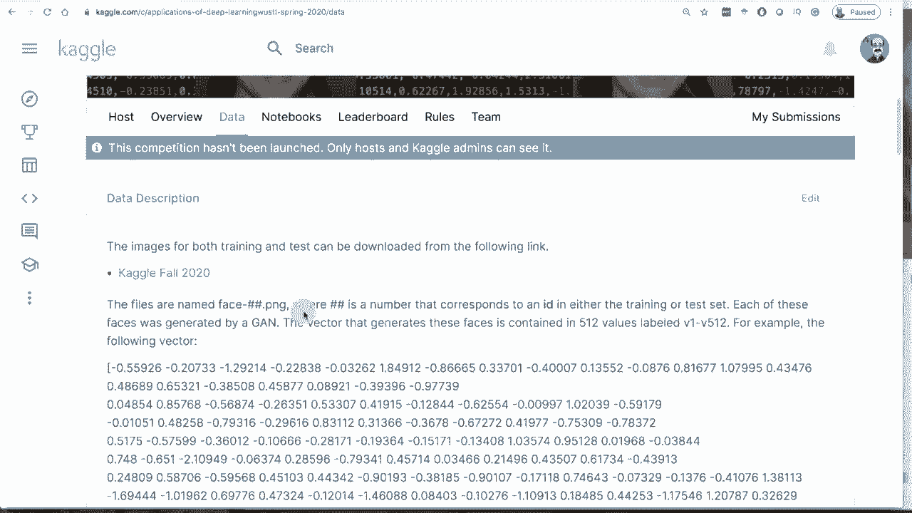

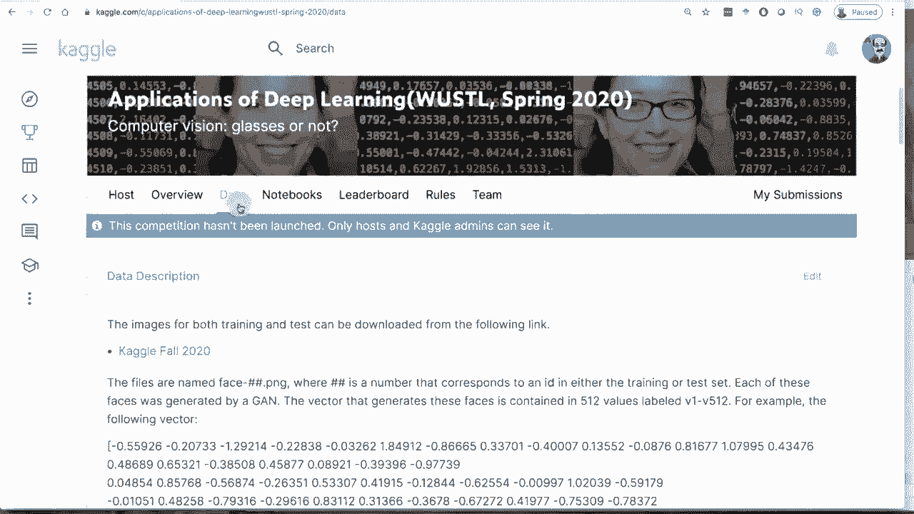

So this is a sample。 you can see the 4500， and then for this sample， I just predicted 0。64。

 which is the percentage of these people overall that have glasses， which matches a general。

 the general population sample， at least in the United States。

 and you can see there's about 500 of these。 so definitely don't go through and simply label these。

 Now let's look at the training data。 This is the training data。So in the training data。

 this portion here， that's quite long。 This is the vector。 So this is your latent vector。

 so there's 512 of those。 and then there's the label glasses 0110 Now I generated all of this this data I did not sit here and generate hand create 5000 of these individuals and then labeled them manually。

 and that's part of the challenge of potentially using this vector to actually figure out who has glasses and who does not because these numbers for the data that was generated by an algorithm of mine。

 And I have another video on how that algorithm works。

 So if you want to do something serious with these vectors here you probably want to watch that other video but you'll see literally how I created this training set and how I was able to generategan vector。

That had a very high likelihood of being people with glasses or people without。 Now， notice。

 I say very high likelihood。 The data is not perfect。 So I'm telling you this ahead of time。

 I was thinking about just letting you discover it。 But I would get a bunch of email。

 saying your data is incorrect， because I'm seeing people in here that you say have glasses that do not and vice versa。

 So let's just take a look at this。 I took it down to just the Id in the glasses。

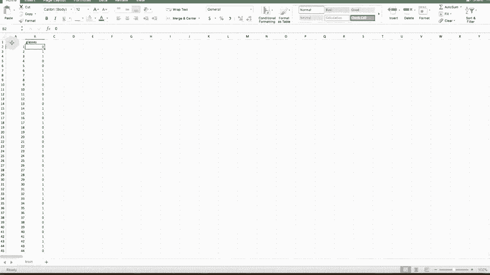

And now we've got both up at once。 So let's just kind of validate the data。 Okay， person 1。

 no glasses， glasses， glasses。 So see those two ones over there。 No glasses。 no glasses。

 So two nose in a row，1，2，3 glasses， no glasses。 Okay， and then yeah， that's person 10。

 person 10 has glasses， none，1， Okay， there's probably an error 15， No 15 is 15 is fine。 Okay， so 19。

Okay， I had to flip through quite a few of these to actually find one。 but this one is wrong。 So 30。

 it says this person should have glasses。 They do not。

 So this is my I'm essentially doing the opposite of what I asked you to do。

 I asked you to look at vectors or look at images and tell me if they have glasses or not。

 My challenge to myself when I was researchinggans and working on this was I tried to write an algorithm that generated a bunch of vectors that were either glasses or no。

 I just pure math。 No， even looking at the images。 And my algorithm is pretty accurate。

 I went through about 30 of these before I found one that was that was not correct。

 So I had asked my algorithm to generate this person with glasses， but it did not。

 So even if you build a perfect classifier。 So you sit there with your teammates and label all of these which you're not supposed to do。

 but sit there and put in。😊，A a1 or a zero completely on your own with no neural network whatsoever。

 you still wouldn't get a perfect score because you would using your human brain would have said this person does not have glasses My algorithm。

 assume assume that you would So if you want to get the absolute highest scores。

 there's almost two levels to this challenge First level is just figuring out from the vectors or from the images who has glasses who do not have glasses and then the second if you truly want to even conquer the noise。

 then you could potentially try to figure out which of these individuals were misclassified maybe their vectors are close to each other in high dimension space。

 maybe clustering would figure out I'm honestly not sure I have not tried to analyze it。

If you watch my other video on looking into the latent vector。

 and I'll put a link to it in in this competition description link。

 you might get some clues into how you would do this。 So in theory。

 you could potentially get a perfect zero log loss without hand labeling。

 And even if you hand labeled again， you're not supposed to。 But if you did。

 you would still not get a perfect score because you would get these wrong。 I think there might。

 I think there are clues in the vectors。 I would think that there in some sort of high dimensional space close to each other。

 but I'm not not entirely sure。 watch the other video， you， you'll see more about that。 All right。

 So that is this semester's competition， you have any questions， leave them in the feedback。

 if you have any questions， leave them in the comments and good luck on this semester's competition。

 Hopefully， I made it neither too easy。😊，Or punishingly hard。 So always my goal。

 Thank you for watching this video。 This competition is open to members from the Internet。

 as well as Washington University students currently taking my class。

 If you find this kind of thing interesting， please subscribe to my YouTube channel。

 Thank you very much。